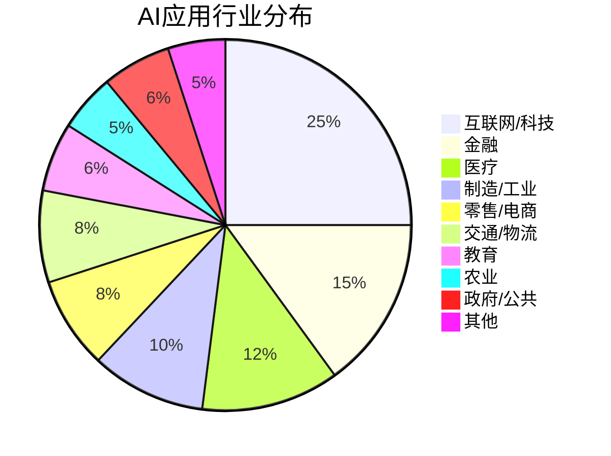
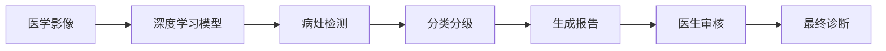
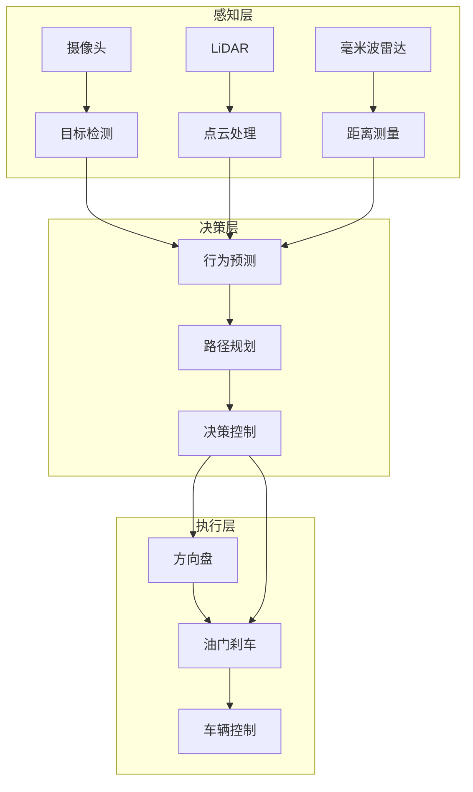
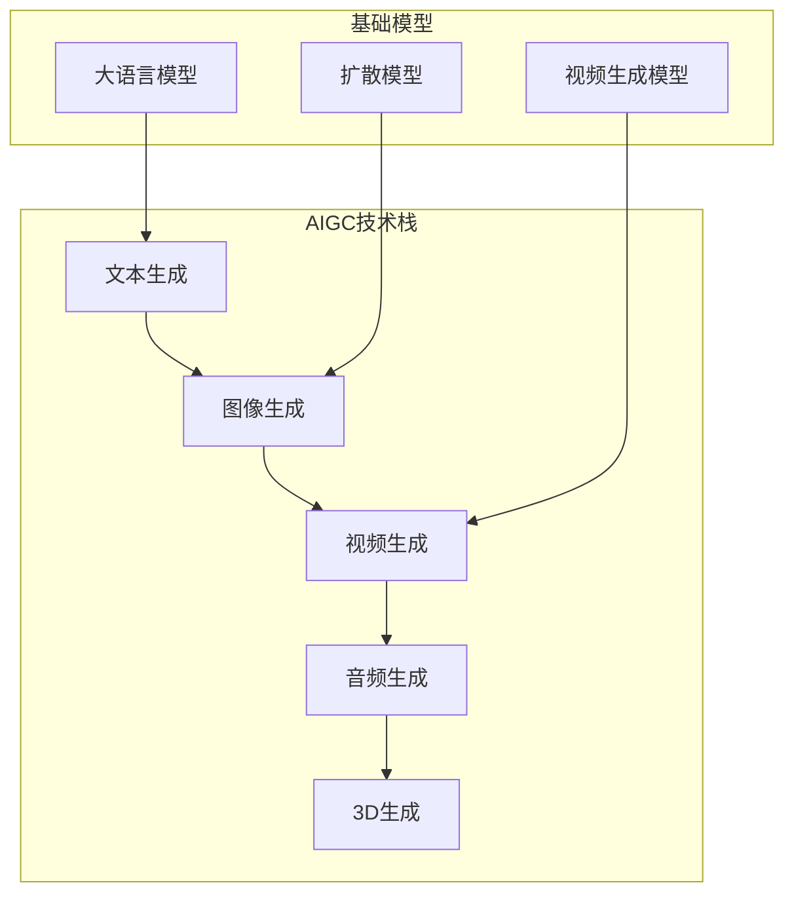

# 1.3 人工智能典型落地场景

## 一、AI应用全景

### 1. 行业分布

### 2. 按技术类型分类

| 技术类型 | 典型应用 | 成熟度 |
|---------|---------|--------|
| 计算机视觉 | 安防监控、医疗影像、工业质检 | 高 |
| 自然语言处理 | 机器翻译、智能客服、文本生成 | 高 |
| 语音处理 | 语音助手、语音转写、声纹识别 | 中高 |
| 推荐系统 | 电商推荐、内容推荐、广告投放 | 高 |
| 预测分析 | 风险评估、需求预测、故障预测 | 中高 |
| 生成式AI | 内容创作、代码生成、设计辅助 | 快速发展 |

## 二、重点行业应用

### 1. 医疗健康

| 应用场景 | 技术 | 代表案例 |
|---------|------|---------|
| 医学影像分析 | CNN | 肺结节检测、眼底病变识别 |
| 辅助诊断 | NLP+知识图谱 | IBM Watson、协和AI医生 |
| 药物研发 | 图神经网络 | AlphaFold、分子生成 |
| 病理分析 | 深度学习 | 癌症组织识别 |
| 基因分析 | 机器学习 | 遗传病风险预测 |
| 健康管理 | 可穿戴+AI | 心率异常检测、睡眠分析 |

**示例：AI辅助诊断流程**

### 2. 金融科技

| 应用场景 | 技术 | 说明 |
|---------|------|------|
| 反欺诈 | 异常检测 | 识别异常交易模式 |
| 信用评估 | 机器学习 | 评估贷款人风险 |
| 量化交易 | 强化学习 | 优化交易策略 |
| 风控合规 | NLP | 监控合规风险 |
| 智能客服 | NLP+对话系统 | 7×24小时服务 |
| 客户画像 | 聚类分析 | 精准营销 |

### 3. 智能交通

| 应用场景 | 技术 | 说明 |
|---------|------|------|
| 自动驾驶 | CV+强化学习 | L2/L3级辅助 |
| 交通预测 | 时序预测 | 拥堵预测 |
| 路径优化 | 组合优化 | 物流路径规划 |
| 车型识别 | CV | 智能收费 |
| 行人检测 | 目标检测 | 安全预警 |

**自动驾驶技术栈**

### 4. 智能制造

| 应用场景 | 技术 | 说明 |
|---------|------|------|
| 缺陷检测 | CV | 产品表面缺陷 |
| 工艺优化 | 强化学习 | 参数优化 |
| 预测维护 | 时序预测 | 设备故障预警 |
| 柔性装配 | 视觉+机器人 | 精准装配 |
| 质量追溯 | NLP+知识图谱 | 质量问题追踪 |

### 5. 教育科技

| 应用场景 | 技术 | 说明 |
|---------|------|------|
| 个性化学习 | 推荐系统 | 自适应学习路径 |
| 智能批改 | NLP | 作文、代码批改 |
| 学习分析 | 数据挖掘 | 学习行为分析 |
| AI助教 | 对话系统 | 答疑辅导 |
| 内容生成 | 生成式AI | 教学材料生成 |

### 6. 内容创作

| 应用场景 | 技术 | 代表产品 |
|---------|------|---------|
| 文本生成 | LLM | GPT-4、Claude |
| 图像生成 | Diffusion | DALL-E、Midjourney |
| 视频生成 | 生成模型 | Sora、Runway |
| 音乐生成 | 生成模型 | MusicGen、Suno |
| 代码生成 | LLM | Copilot、Cursor |
| 3D生成 | 生成模型 | Point-E、Meshy |

## 三、新兴应用方向

### 1. 大模型应用

| 应用 | 说明 | 成熟度 |
|-----|------|--------|
| 对话助手 | 通用AI助理 | 高 |
| 代码助手 | 编程辅助 | 高 |
| 文档分析 | 合同、报告分析 | 中高 |
| 知识问答 | 企业知识库 | 中高 |
| 内容创作 | 文案、创意生成 | 中高 |

### 2. AIGC（AI生成内容）

### 3. 具身智能

| 应用 | 说明 | 进展 |
|-----|------|------|
| 人形机器人 | 家务、服务 | 快速发展 |
| 工业机器人 | 柔性制造 | 中高 |
| 无人机 | 自主飞行 | 高 |
| 服务机器人 | 餐饮、医疗 | 中 |

## 四、应用趋势总结

### 1. 技术发展趋势

| 趋势 | 说明 |
|-----|------|
| 大模型小型化 | 边缘设备部署 |
| 多模态融合 | 文本+图像+视频 |
| Agent化 | 自主规划执行 |
| 垂直行业深耕 | 行业专用模型 |
| 端云协同 | 云端训练+端侧推理 |

### 2. 挑战与机遇

| 维度 | 挑战 | 机遇 |
|-----|------|------|
| 技术 | 通用智能实现 | 大模型持续进步 |
| 数据 | 数据隐私保护 | 联邦学习技术 |
| 伦理 | AI偏见与公平 | AI治理框架 |
| 安全 | 对抗性攻击 | 鲁棒性研究 |
| 成本 | 算力成本高 | 模型压缩优化 |

---

**导航**：上一节 [[1.2-弱AI与强AI与超AI区分]] · [[MOC - 第1章\|返回章节导航]]