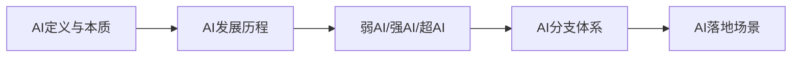

# 第1章 人工智能基础概论

> [!abstract] 本章定位
> 本章从哲学和技术两个维度介绍人工智能的定义、发展历程和核心分支，建立对AI的整体认知。

## 学习主线

## 章节内容

- [[1.1-人工智能定义、分支与发展历程]]：AI的定义、核心分支、发展时间线
- [[1.2-弱AI与强AI与超AI区分]]：三种AI形态的区别与联系
- [[1.3-人工智能典型落地场景]]：AI在各行业的应用案例

## 核心考点

> [!important] 必掌握
> 1. 人工智能的经典定义（图灵测试、达特茅斯会议）
> 2. AI发展的三个高潮与两次低谷
> 3. 弱AI、强AI、超AI的区别
> 4. AI主要分支领域及其关系
> 5. AI在医疗、金融、交通等领域的典型应用

## 复习自测

> [!question] 自测题
> 1. 什么是人工智能？图灵测试的标准是什么？
> 2. AI发展史上的"寒冬"期发生在何时？原因是什么？
> 3. 弱AI、强AI、超AI的核心区别是什么？
> 4. 列举人工智能的至少5个主要分支领域。
> 5. 人工智能在医疗领域有哪些典型应用？