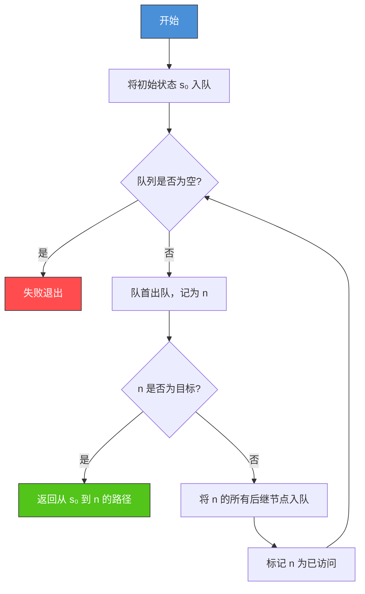
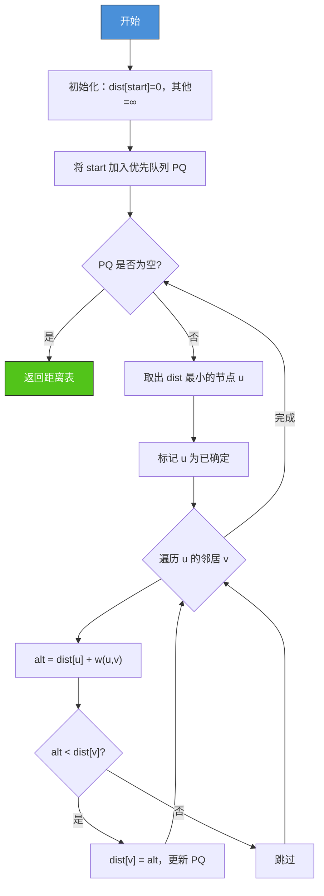
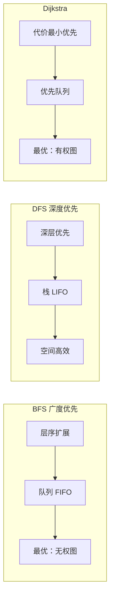

# 2.1 盲目搜索算法

## 📌 基本概念

### 状态空间法

状态空间法是人工智能中描述问题求解的核心形式化方法，由以下三要素构成：

| 要素 | 说明 | 数学表示 |
|------|------|---------|
| **初始状态** | 问题的起始条件 | $S_0 \in S$ |
| **操作/动作** | 将一个状态转换为另一个状态的规则集合 | $A = \{a_1, a_2, ..., a_n\}$ |
| **目标状态** | 问题的解（可能是一个集合） | $G \subseteq S$ |

**定义**：状态空间搜索问题可表示为三元组 $(S, A, G)$，其中 $S$ 是状态集合，$A$ 是动作集合，$G$ 是目标状态集合。

### 搜索的通用框架

所有盲目搜索算法都遵循统一的搜索框架：

```
1. 将初始状态加入待扩展列表（open list）
2. 循环执行：
   a. 从 open list 中取出一个节点 n
   b. 若 n 为目标状态，返回路径
   c. 将 n 的所有后继节点加入 open list
   d. 若 open list 为空，失败
```

## 🔍 广度优先搜索（BFS）

### 原理

广度优先搜索（Breadth-First Search, BFS）按**层**扩展节点，先扩展距离初始状态近的节点。使用**队列**（FIFO）作为 open list。

### 算法流程图



### Python 实现

```python
from collections import deque
from typing import List, Tuple, Dict, Optional

class Graph:
    def __init__(self):
        self.adjacency_list: Dict[str, List[Tuple[str, int]]] = {}

    def add_edge(self, src: str, dest: str, cost: int = 1):
        if src not in self.adjacency_list:
            self.adjacency_list[src] = []
        if dest not in self.adjacency_list:
            self.adjacency_list[dest] = []
        self.adjacency_list[src].append((dest, cost))
        self.adjacency_list[dest].append((src, cost))

    def bfs(self, start: str, goal: str) -> Optional[List[str]]:
        if start == goal:
            return [start]

        visited = {start}
        queue = deque([(start, [start])])

        while queue:
            node, path = queue.popleft()

            for neighbor, _ in self.adjacency_list.get(node, []):
                if neighbor == goal:
                    return path + [neighbor]
                if neighbor not in visited:
                    visited.add(neighbor)
                    queue.append((neighbor, path + [neighbor]))

        return None
```

### 复杂度分析

| 指标 | BFS | DFS |
|------|-----|-----|
| 时间复杂度 | $O(b^d)$ | $O(b^m)$ |
| 空间复杂度 | $O(b^d)$ | $O(b \cdot m)$ |
| 最优性 | ✅ 最优（无权图） | ❌ 不保证最优 |
| 完备性 | ✅ 完备 | ❌ 不完备（可能陷入环路） |

其中 $b$ 为分支因子，$d$ 为目标节点的深度，$m$ 为最大深度。

## 🔍 深度优先搜索（DFS）

### 原理

深度优先搜索（Depth-First Search, DFS）尽可能向深层扩展，使用**栈**（LIFO）作为 open list。

### Python 实现

```python
class Graph:
    def dfs(self, start: str, goal: str) -> Optional[List[str]]:
        visited = set()
        stack = [(start, [start])]

        while stack:
            node, path = stack.pop()

            if node == goal:
                return path

            if node in visited:
                continue
            visited.add(node)

            for neighbor, _ in reversed(self.adjacency_list.get(node, [])):
                if neighbor not in visited:
                    stack.append((neighbor, path + [neighbor]))

        return None

    def dfs_recursive(self, start: str, goal: str) -> Optional[List[str]]:
        visited = set()

        def dfs_helper(node: str, path: List[str]) -> Optional[List[str]]:
            if node == goal:
                return path
            if node in visited:
                return None
            visited.add(node)
            for neighbor, _ in self.adjacency_list.get(node, []):
                result = dfs_helper(neighbor, path + [neighbor])
                if result:
                    return result
            return None

        return dfs_helper(start, [start])
```

### DFS 的改进：深度受限搜索

为避免 DFS 陷入无限环路，引入**深度限制** $l$：

```python
def depth_limited_search(graph, start, goal, limit):
    stack = [(start, [start], 0)]
    while stack:
        node, path, depth = stack.pop()
        if node == goal:
            return path
        if depth >= limit:
            continue
        for neighbor, _ in graph.adjacency_list.get(node, []):
            if neighbor not in path:
                stack.append((neighbor, path + [neighbor], depth + 1))
    return None
```

## 🔍 Dijkstra 算法（一致代价搜索）

### 原理

当路径代价不为常数时，BFS 不能保证最优性。**Dijkstra 算法**（又称一致代价搜索 Uniform-Cost Search, UCS）使用**优先队列**，按路径实际代价 $g(n)$ 排序扩展节点。

### 核心公式

$$g(n) = g(n') + c(n', a, n)$$

其中 $g(n)$ 是从起点到节点 $n$ 的最小代价，$c(n', a, n)$ 是动作 $a$ 的执行代价。

### 算法流程



### Python 实现

```python
import heapq

def dijkstra(graph: Dict[str, List[Tuple[str, int]]], start: str, goal: str) -> Tuple[int, Optional[List[str]]]:
    dist = {start: 0}
    prev = {}
    pq = [(0, start, [start])]

    while pq:
        d, node, path = heapq.heappop(pq)

        if node == goal:
            return d, path

        if d > dist.get(node, float('inf')):
            continue

        for neighbor, weight in graph.get(node, []):
            new_dist = d + weight
            if new_dist < dist.get(neighbor, float('inf')):
                dist[neighbor] = new_dist
                prev[neighbor] = node
                heapq.heappush(pq, (new_dist, neighbor, path + [neighbor]))

    return float('inf'), None
```

### 复杂度

| 数据结构 | 时间复杂度 | 空间复杂度 |
|---------|-----------|-----------|
| 数组实现 | $O(V^2)$ | $O(V)$ |
| 二叉堆实现 | $O(E \log V)$ | $O(V)$ |
| 斐波那契堆 | $O(E + V \log V)$ | $O(V)$ |

## 📊 三种算法对比



| 特性 | BFS | DFS | Dijkstra |
|------|-----|-----|----------|
| 数据结构 | 队列 | 栈 | 优先队列 |
| 扩展策略 | 层序 | 深度优先 | 代价最小 |
| 完备性 | ✅ | ❌（无界时） | ✅ |
| 最优性 | ✅（无权） | ❌ | ✅（有权） |
| 空间 | 大 | 小 | 中等 |
| 适用场景 | 最短路径（无权） | 拓扑排序、连通性 | 最短路径（有权） |

## 🌍 实际应用

### GPS 导航
Dijkstra 算法是 GPS 导航系统的核心算法之一，用于在路网中规划最短路径。实际应用中结合启发式优化（如 A*）。

### 社交网络好友推荐
BFS 用于在社交图中查找二度、三度好友，即从当前用户出发按层扩展。

### 编译器数据流分析
DFS 用于控制流图的遍历，检测可达性和活跃性分析。

### 网络路由协议
OSPF（开放最短路径优先）协议使用 Dijkstra 算法计算路由表。

## 💡 考点总结

1. **BFS 最优性**：在所有步骤代价相同时，BFS 保证找到最优解
2. **DFS 不完备性**：在存在无穷深度的搜索空间中，DFS 可能无法找到目标
3. **Dijkstra 适用条件**：要求所有边的代价非负
4. **开放表 vs 关闭表**：关闭表（closed list）用于记录已扩展节点，避免重复扩展