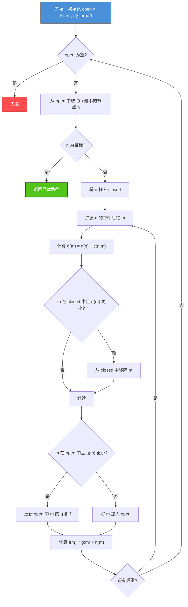
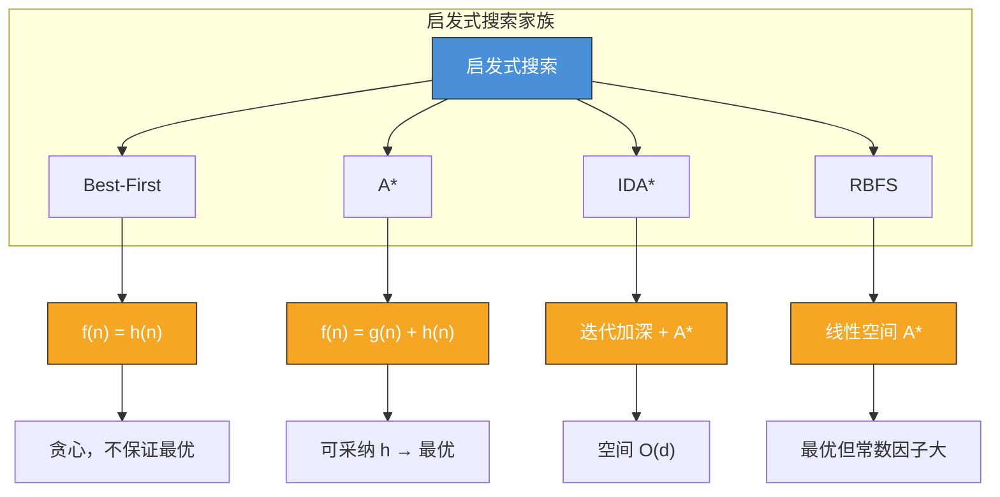

# 2.2 启发式搜索算法

## 📌 基本概念

### 启发式搜索的动机

盲目搜索（BFS/DFS/Dijkstra）的主要问题是**搜索效率低**——在大状态空间中，需要扩展大量无关节点。启发式搜索利用**问题领域知识**指导搜索方向，显著提高搜索效率。

### 核心思想

> 启发式搜索在每一步根据**启发式函数** $h(n)$ 估计节点 $n$ 到目标的代价，优先扩展"看起来更接近目标"的节点。

## 🎯 启发式函数

### 定义

**启发式函数** $h(n)$ 是从节点 $n$ 到目标节点的**估计代价**，满足：

$$h(n) \geq 0, \quad h(\text{goal}) = 0$$

### 可采纳性（Admissible）

**定义**：如果对于所有节点 $n$，启发式函数 $h(n)$ 不大于真实代价 $h^*(n)$，即：

$$h(n) \leq h^*(n)$$

则称 $h(n)$ 是**可采纳的**。可采纳性是保证 A* 算法最优性的关键条件。

### 一致性（Consistency）

**定义**：如果对于任意节点 $n$ 和其后继节点 $n'$，满足：

$$h(n) \leq c(n, n') + h(n')$$

则称 $h(n)$ 是**一致的**。一致性是启发式函数的更强条件，可保证在 A* 搜索中节点首次被扩展时就已到达最优路径。

### 常见启发式函数设计

| 问题 | 启发式函数 | 说明 |
|------|-----------|------|
| 八数码 | 错位棋子数 | 简单但不够精确 |
| 八数码 | 曼哈顿距离之和 | 更精确，可采纳 |
| 路径规划 | 欧几里得距离 | 直线距离，可采纳 |
| 旅行商 TSP | 最小生成树权重 | 可采纳且计算高效 |

**示例：八数码的曼哈顿距离启发式**

$$h(n) = \sum_{i=1}^{9} |x_i - x_i^*| + |y_i - y_i^*|$$

其中 $(x_i, y_i)$ 是棋子 $i$ 当前位置，$(x_i^*, y_i^*)$ 是目标位置。

## 🔍 最佳优先搜索（Best-First Search）

### 原理

最佳优先搜索使用**评估函数** $f(n)$ 对 open list 中的节点排序，优先扩展 $f(n)$ 值最小的节点：

$$f(n) = h(n)$$

即仅依赖启发式估计，不考虑已付出的代价。

### 特点

- 速度快，能快速找到一个解
- **不保证最优性**：可能找到代价很大的解
- 贪心性质：一旦远离最优路径可能无法纠正

### Python 实现

```python
import heapq
from typing import List, Tuple, Dict, Optional

class BestFirstSearch:
    def __init__(self, heuristic_fn):
        self.heuristic_fn = heuristic_fn

    def search(self, graph: Dict[str, List[Tuple[str, int]]],
               start: str, goal: str) -> Optional[List[str]]:
        pq = [(self.heuristic_fn(start), start, [start])]
        visited = {start}

        while pq:
            _, node, path = heapq.heappop(pq)

            if node == goal:
                return path

            for neighbor, _ in graph.get(node, []):
                if neighbor not in visited:
                    visited.add(neighbor)
                    h = self.heuristic_fn(neighbor)
                    heapq.heappush(pq, (h, neighbor, path + [neighbor]))

        return None
```

## ⭐ A* 算法

### 原理

A* 算法结合了**已付出代价** $g(n)$ 和**估计代价** $h(n)$：

$$f(n) = g(n) + h(n)$$

- $g(n)$：从起点到节点 $n$ 的实际最小代价
- $h(n)$：从节点 $n$ 到目标的估计代价
- $f(n)$：从起点经过 $n$ 到目标的估计总代价

### 算法步骤



### Python 实现

```python
import heapq
from typing import List, Tuple, Dict, Optional, Callable

def a_star_search(
    graph: Dict[str, List[Tuple[str, int]]],
    start: str,
    goal: str,
    heuristic: Callable[[str], int]
) -> Tuple[int, Optional[List[str]]]:
    g_score = {start: 0}
    f_score = {start: heuristic(start)}
    open_set = [(f_score[start], start, [start])]
    closed_set = set()

    while open_set:
        f, current, path = heapq.heappop(open_set)

        if current == goal:
            return g_score[current], path

        if current in closed_set:
            continue
        closed_set.add(current)

        for neighbor, weight in graph.get(current, []):
            tentative_g = g_score[current] + weight

            if tentative_g < g_score.get(neighbor, float('inf')):
                g_score[neighbor] = tentative_g
                f_score[neighbor] = tentative_g + heuristic(neighbor)
                heapq.heappush(open_set, (f_score[neighbor], neighbor, path + [neighbor]))

    return float('inf'), None
```

### A* 最优性证明

**定理**：如果启发式函数 $h(n)$ 是可采纳的（$h(n) \leq h^*(n)$），则 A* 算法一定能找到最优解。

**证明思路**：

1. 假设 A* 找到了路径 $P$，但存在更优的路径 $P^*$
2. 设 $n$ 是 $P^*$ 上 A* 尚未扩展的第一个节点
3. 由于 A* 选择 $n$ 之前已扩展了 $P$ 的终点：
   $$f(P_{\text{end}}) = g(P_{\text{end}}) + h(P_{\text{end}}) \geq g(P^*) + h^*(P^*) = C^*$$
4. 而对于 $n$：
   $$f(n) = g(n) + h(n) \leq g^*(n) + h^*(n) = C^*$$
5. 因此 $f(n) \leq f(P_{\text{end}})$，A* 应该先扩展 $n$，矛盾

### 示例：网格路径规划

```python
def create_grid_graph(rows: int, cols: int, obstacles: set) -> Dict[str, List[Tuple[str, int]]]:
    graph = {}
    directions = [(0, 1), (0, -1), (1, 0), (-1, 0)]

    for r in range(rows):
        for c in range(cols):
            node = f"({r},{c})"
            if node in obstacles:
                continue
            graph[node] = []
            for dr, dc in directions:
                nr, nc = r + dr, c + dc
                neighbor = f"({nr},{nc})"
                if 0 <= nr < rows and 0 <= nc < cols and neighbor not in obstacles:
                    graph[node].append((neighbor, 1))

    return graph

def manhattan_distance(node: str, goal: str) -> int:
    r1, c1 = map(int, node.strip('()').split(','))
    r2, c2 = map(int, goal.strip('()').split(','))
    return abs(r1 - r2) + abs(c1 - c2)

graph = create_grid_graph(5, 5, {"(1,2)", "(2,2)", "(3,0)", "(3,1)"})
cost, path = a_star_search(
    graph, "(0,0)", "(4,4)",
    lambda n: manhattan_distance(n, "(4,4)")
)
print(f"最优路径代价: {cost}")
print(f"路径: {' → '.join(path)}")
```

## 🔍 IDA* 算法

### 原理

IDA*（Iterative Deepening A*）结合了**迭代加深**和 **A*** 的思想：

1. 先用较低的 $f$-值阈值进行深度优先搜索
2. 若未找到目标，增大阈值重试
3. 阈值初始值为 $f(\text{start})$，每次增大到上一轮搜索中超过阈值的最小 $f$ 值

### 伪代码

```python
def ida_star(graph, start, goal, heuristic):
    threshold = heuristic(start)
    path = [start]

    while True:
        result, new_threshold = search(graph, start, goal, heuristic,
                                       0, threshold, path)
        if result == "FOUND":
            return path
        if new_threshold == float('inf'):
            return None
        threshold = new_threshold

def search(graph, node, goal, heuristic, g, threshold, path):
    f = g + heuristic(node)
    if f > threshold:
        return f, f
    if node == goal:
        return "FOUND", f
    min_over_threshold = float('inf')

    for neighbor, weight in graph.get(node, []):
        if neighbor not in path:
            path.append(neighbor)
            result, t = search(graph, neighbor, goal, heuristic,
                               g + weight, threshold, path)
            if result == "FOUND":
                return "FOUND", f
            if t < min_over_threshold:
                min_over_threshold = t
            path.pop()

    return None, min_over_threshold
```

### 特点

| 特性 | A* | IDA* |
|------|-----|------|
| 空间 | $O(b^d)$ | $O(d)$ |
| 时间 | 高效 | 略慢（重复扩展） |
| 最优性 | ✅ | ✅ |
| 适用 | 一般场景 | 内存受限场景 |

## 🔍 其他启发式变体

### RBFS（递归最佳优先搜索）

RBFS 使用线性空间实现 A* 的最优性，结合 DFS 的空间效率和 A* 的最优性保证。

### SMA*（简化内存限制 A*）

SMA* 在内存限制下运行 A*，当内存满时丢弃最差节点，适用于非常大的搜索空间。

## 📊 算法对比总览



| 算法 | 评估函数 | 空间 | 最优性 | 典型场景 |
|------|---------|------|--------|---------|
| Best-First | $h(n)$ | $O(b^d)$ | ❌ | 快速找解 |
| A* | $g(n)+h(n)$ | $O(b^d)$ | ✅（可采纳 h） | 通用最优搜索 |
| IDA* | $g(n)+h(n)$ | $O(d)$ | ✅ | 内存受限 |
| RBFS | $g(n)+h(n)$ | $O(d)$ | ✅ | 线性空间最优 |

## 🌍 实际应用

### GPS 与地图导航
A* 是主流导航系统（Google Maps、高德地图）的核心算法，启发式函数使用直线距离或路网估计距离。

### 游戏 AI 路径规划
RTS 游戏中单位寻路使用 A*，3D 游戏使用 NavMesh + A* 的组合。

### 机器人运动规划
机械臂和移动机器人的运动规划中，A* 用于在构型空间中搜索无碰撞路径。

### 自然语言处理
语法分析器使用 A* 在所有可能的语法树中搜索最优分析结果。

## 💡 考点总结

1. **A* 最优性条件**：$h(n)$ 可采纳（$h(n) \leq h^*(n)$）
2. **一致性**：$h(n) \leq c(n, n') + h(n')$，保证首次扩展即最优
3. **启发式的设计**：设计越好，搜索效率越高，但计算开销越大
4. **IDA* 的空间优势**：线性空间复杂度，适用于大状态空间
5. **A* 与 Dijkstra 的关系**：当 $h(n) = 0$ 时，A* 退化为 Dijkstra