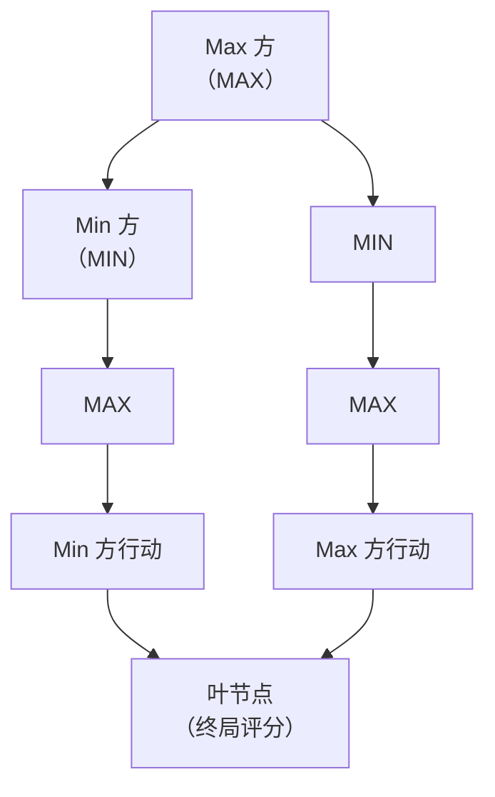
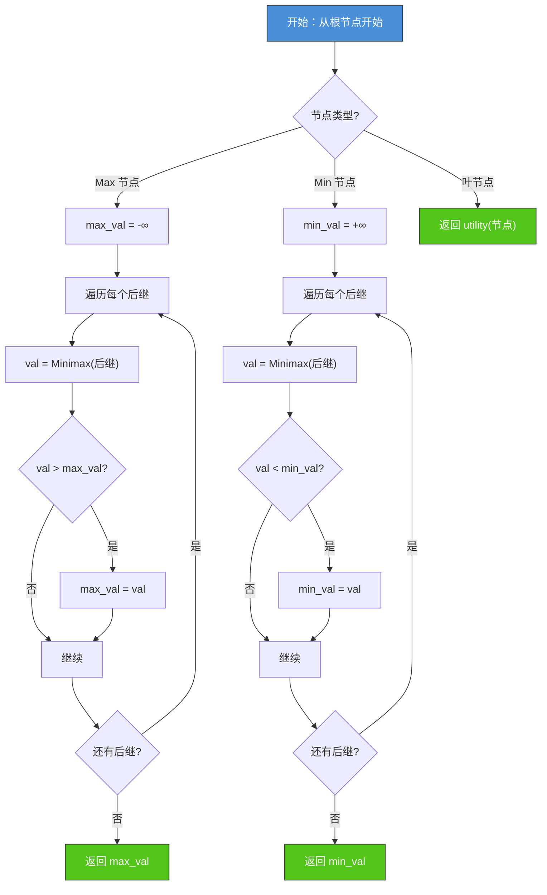
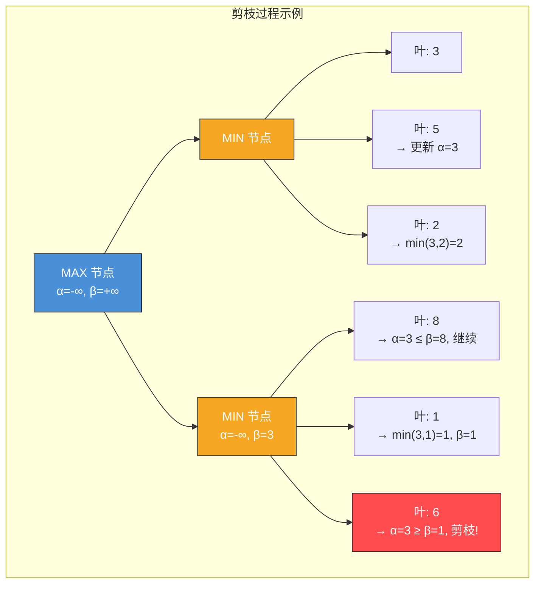
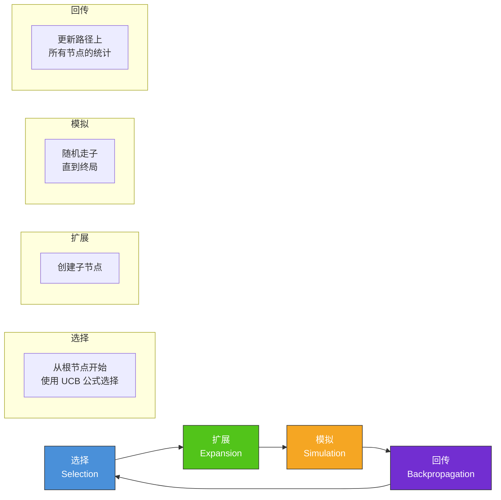
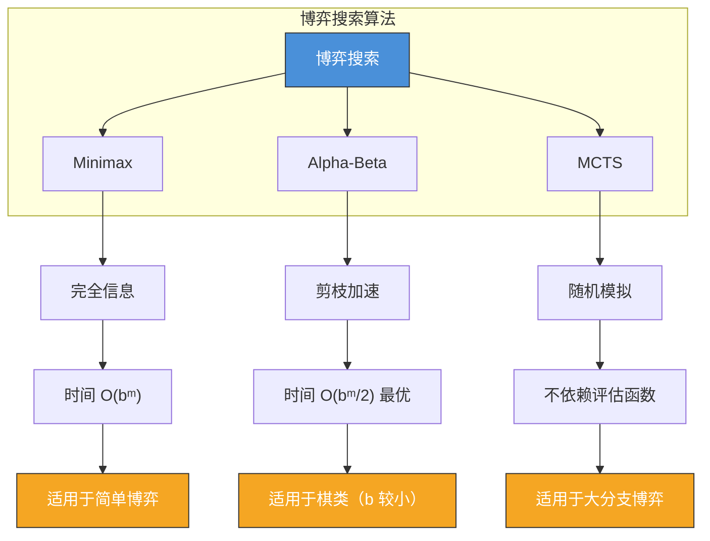

# 2.3 对抗搜索与博弈

## 📌 基本概念

### 对抗搜索的特点

现实中的许多问题涉及**两个或多个智能体**的对抗，如下棋、商业竞争、军事对抗等。这类问题具有以下特征：

- **双人博弈**：存在两个决策者，目标对立
- **完全信息**：双方都知道所有可能的状态和动作
- **零和博弈**：一方所得为另一方所失

### 博弈树

博弈树是描述对抗搜索问题的核心数据结构：



**节点类型**：
- **Max 节点**：轮到 Max 方行动，选择使评估值最大的后继
- **Min 节点**：轮到 Min 方行动，选择使评估值最小的后继
- **叶节点**：博弈结束，返回效用值（score）

## 🎯 极大极小搜索（Minimax）

### 核心思想

> Max 方要最大化最终得分，Min 方要最小化最终得分。假设双方都 optimal play。

### 递归公式

$$
\text{Minimax}(n) = \begin{cases}
\text{utility}(n) & \text{若 } n \text{ 为叶节点} \\
\max_{n' \in \text{successors}(n)} \text{Minimax}(n') & \text{若 } n \text{ 为 Max 节点} \\
\min_{n' \in \text{successors}(n)} \text{Minimax}(n') & \text{若 } n \text{ 为 Min 节点}
\end{cases}
$$

### 算法流程图



### Python 实现

```python
from typing import List, Optional

class GameState:
    def is_terminal(self) -> bool:
        raise NotImplementedError

    def get_legal_moves(self) -> List:
        raise NotImplementedError

    def make_move(self, move) -> 'GameState':
        raise NotImplementedError

    def utility(self) -> int:
        raise NotImplementedError

    def is_max_turn(self) -> bool:
        raise NotImplementedError


def minimax(state: GameState, depth: int = None) -> Tuple[int, Optional[object]]:
    if state.is_terminal() or depth == 0:
        return state.utility(), None

    best_move = None

    if state.is_max_turn():
        max_eval = float('-inf')
        for move in state.get_legal_moves():
            new_state = state.make_move(move)
            eval_score, _ = minimax(new_state, depth - 1 if depth else None)
            if eval_score > max_eval:
                max_eval = eval_score
                best_move = move
        return max_eval, best_move
    else:
        min_eval = float('inf')
        for move in state.get_legal_moves():
            new_state = state.make_move(move)
            eval_score, _ = minimax(new_state, depth - 1 if depth else None)
            if eval_score < min_eval:
                min_eval = eval_score
                best_move = move
        return min_eval, best_move
```

### 计算示例

对以下博弈树执行 Minimax，标注每个节点的倒推值：

```
        MAX
       / | \
      3  MIN  9
         / \
        2   5
```

**解答**：
- 底层 MIN 节点取 min(2, 5) = 2
- 顶层 MAX 节点取 max(3, 2, 9) = 9
- 最优路径：根 → 右分支 → 叶节点 9

## ✂️ Alpha-Beta 剪枝

### 动机

Minimax 需扩展整个博弈树，时间复杂度为 $O(b^m)$。Alpha-Beta 剪枝在不改变结果的前提下**大幅减少搜索分支**。

### 核心思想

维护两个边界值：
- **α**：Max 方目前能保证的最优下界
- **β**：Min 方目前能保证的最优上界

**剪枝规则**：
- 在 Min 节点，若发现 $\alpha \geq \beta$，则 Min 节点无需继续扩展（Max 方不会选这条路径）
- 在 Max 节点，若发现 $\alpha \geq \beta$，则 Max 节点无需继续扩展（Min 方不会选这条路径）

### 流程图示



### Python 实现

```python
def alpha_beta_search(state: GameState, depth: int = None,
                      alpha: float = float('-inf'),
                      beta: float = float('inf')) -> Tuple[int, Optional[object]]:
    if state.is_terminal() or depth == 0:
        return state.utility(), None

    best_move = None

    if state.is_max_turn():
        max_eval = float('-inf')
        for move in state.get_legal_moves():
            new_state = state.make_move(move)
            eval_score, _ = alpha_beta_search(
                new_state, depth - 1 if depth else None, alpha, beta
            )
            if eval_score > max_eval:
                max_eval = eval_score
                best_move = move
            alpha = max(alpha, eval_score)
            if beta <= alpha:
                break
        return max_eval, best_move
    else:
        min_eval = float('inf')
        for move in state.get_legal_moves():
            new_state = state.make_move(move)
            eval_score, _ = alpha_beta_search(
                new_state, depth - 1 if depth else None, alpha, beta
            )
            if eval_score < min_eval:
                min_eval = eval_score
                best_move = move
            beta = min(beta, eval_score)
            if beta <= alpha:
                break
        return min_eval, best_move
```

### 剪枝效果分析

| 指标 | Minimax | Alpha-Beta |
|------|---------|------------|
| 完美排序 | $O(b^{m/2})$ | $O(b^{m/2})$ |
| 随机排序 | $O(b^m)$ | $O(b^{3m/4})$ |
| 最差情况 | $O(b^m)$ | $O(b^m)$ |

**关键**：Alpha-Beta 的效率高度依赖**节点扩展顺序**。如果能先扩展到"最佳"后继，剪枝效果最优。

### 改进技巧

1. **节点排序**：按评估函数排序后继节点，先扩展最可能好的
2. **迭代加深**：先做浅层搜索获取启发式排序信息
3. **置换表（Zobrist Hashing）**：缓存已评估过的状态

## 🎲 蒙特卡洛树搜索（MCTS）

### 动机

对于分支因子极大的博弈（如围棋 $b \approx 250$），Alpha-Beta 也无法胜任。MCTS 通过**随机模拟**评估节点价值。

### 四步流程



### UCB 选择公式

$$\text{UCB}(i) = \bar{v}_i + C \cdot \sqrt{\frac{\ln N}{n_i}}$$

其中：
- $\bar{v}_i$：节点 $i$ 的平均价值
- $n_i$：节点 $i$ 被访问次数
- $N$：父节点被访问次数
- $C$：探索常数（通常 $\sqrt{2}$）

### Python 实现

```python
import math
import random

class MCTSNode:
    def __init__(self, state: GameState, parent=None, move=None):
        self.state = state
        self.parent = parent
        self.move = move
        self.children = []
        self.visits = 0
        self.wins = 0
        self.untried_moves = state.get_legal_moves()

    def ucb(self, exploration=math.sqrt(2)):
        if self.visits == 0:
            return float('inf')
        return (self.wins / self.visits) + exploration * math.sqrt(
            math.log(self.parent.visits) / self.visits
        )

    def best_child(self, exploration=math.sqrt(2)):
        return max(self.children, key=lambda c: c.ucb(exploration))


def mcts_search(state: GameState, iterations: int = 1000) -> object:
    root = MCTSNode(state)

    for _ in range(iterations):
        node = root
        current_state = state

        while not current_state.is_terminal() and not node.untried_moves:
            node = node.best_child()
            current_state = current_state.make_move(node.move)

        if node.untried_moves:
            move = node.untried_moves.pop()
            current_state = current_state.make_move(move)
            child = MCTSNode(current_state, node, move)
            node.children.append(child)
            node = child

        while not current_state.is_terminal():
            move = random.choice(current_state.get_legal_moves())
            current_state = current_state.make_move(move)

        reward = current_state.utility()
        while node is not None:
            node.visits += 1
            node.wins += reward
            node = node.parent

    return max(root.children, key=lambda c: c.visits).move
```

## 📊 三种博弈搜索对比



| 算法 | 核心思想 | 时间复杂度 | 适用场景 |
|------|---------|-----------|---------|
| Minimax | 极大极小 | $O(b^m)$ | 理论分析、简单博弈 |
| Alpha-Beta | 剪枝 | $O(b^{m/2})$ 最优 | 国际象棋、五子棋 |
| MCTS | 蒙特卡洛模拟 | 取决于迭代次数 | 围棋、大分支博弈 |

## 🌍 实际应用

### AlphaGo / AlphaZero
DeepMind 的 AlphaGo 使用 MCTS + 深度神经网络的组合，击败了世界顶尖围棋选手。AlphaZero 进一步使用自对弈强化学习，无需人类知识。

### 国际象棋 AI
Stockfish 等国际象棋引擎使用 Alpha-Beta 剪枝 + 精巧的评估函数 + 大规模置换表，搜索深度可达 30+ 层。

### 电子游戏 AI
实时策略游戏（如 StarCraft）中的 AI 对手使用简化的 Minimax 或启发式博弈搜索，在有限时间内做出决策。

### 自动驾驶决策
在多智能体交通场景中，使用博弈论方法建模车辆间的交互决策。

## 💡 考点总结

1. **Minimax 原理**：Max 方最大化，Min 方最小化，假设双方最优
2. **Alpha-Beta 剪枝条件**：$\alpha \geq \beta$ 时剪枝，不影响最终结果
3. **剪枝效率**：依赖节点排序，最佳情况下时间复杂度为 $O(b^{m/2})$
4. **MCTS 四步**：选择、扩展、模拟、回传
5. **UCB 公式**：平衡探索与利用，是 MCTS 的核心
6. **博弈分类**：双人零和 vs 多人非零和，完全信息 vs 不完全信息