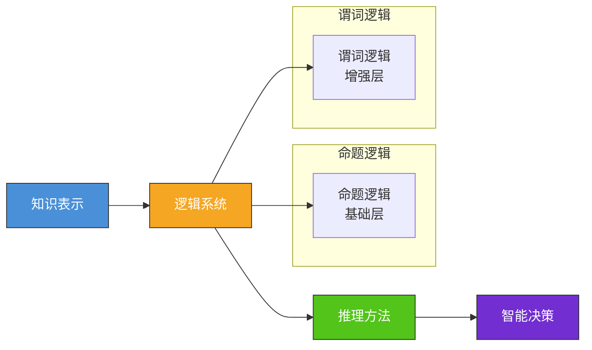
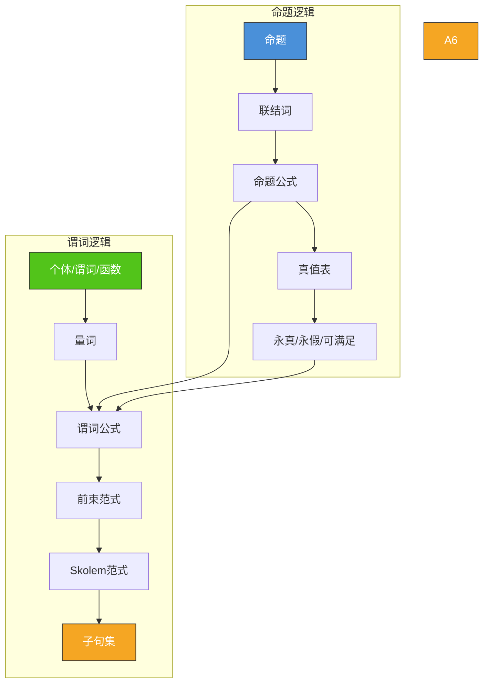

# 3.1 命题逻辑与谓词逻辑

## 📌 基本概念

### 什么是逻辑

逻辑是研究**有效推理**的学科。在人工智能中，逻辑是实现知识表示和推理的数学基础。



## 🔤 命题逻辑

### 命题

**定义**：命题是一个具有**确定真假值**的陈述句。

| 语句 | 是否命题 | 说明 |
|------|---------|------|
| 北京是中国的首都 | ✅ 真命题 | 真假确定 |
| 1 + 1 = 3 | ✅ 假命题 | 真假确定 |
| 今天天气真好 | ❌ | 主观评价，无确定真假 |
| x + 1 = 5 | ❌ | 取决于 x 的值 |
| 请关门 | ❌ | 祈使句，无真假 |

### 命题联结词

| 联结词 | 符号 | 自然语言 | 真值表 |
|--------|------|---------|--------|
| 否定 | $\neg$ | "非"、"不" | $\neg P$ 为真当且仅当 $P$ 为假 |
| 合取 | $\land$ | "且"、"与" | $P \land Q$ 为真当且仅当 $P$ 和 $Q$ 都为真 |
| 析取 | $\lor$ | "或" | $P \lor Q$ 为真当且仅当 $P$ 或 $Q$ 为真 |
| 蕴含 | $\rightarrow$ | "如果...那么..." | $P \rightarrow Q$ 为假当且仅当 $P$ 真 $Q$ 假 |
| 双蕴含 | $\leftrightarrow$ | "当且仅当" | $P \leftrightarrow Q$ 为真当且仅当 $P$ 和 $Q$ 同真假 |

### 命题公式

**定义**：由命题变元和联结词按规则构成的合法字符串称为**命题公式**（合式公式）。

**递归定义**：
1. 单个命题变元是命题公式
2. 若 $A$ 是命题公式，则 $\neg A$ 是命题公式
3. 若 $A, B$ 是命题公式，则 $A \land B, A \lor B, A \rightarrow B, A \leftrightarrow B$ 是命题公式

### 真值表与永真性

#### 真值表

| $P$ | $Q$ | $\neg P$ | $P \land Q$ | $P \lor Q$ | $P \rightarrow Q$ | $P \leftrightarrow Q$ |
|-----|-----|---------|-------------|-----------|-------------------|---------------------|
| T | T | F | T | T | T | T |
| T | F | F | F | T | F | F |
| F | T | T | F | T | T | F |
| F | F | T | F | F | T | T |

#### 公式分类

| 类型 | 定义 | 示例 |
|------|------|------|
| **永真式（重言式）** | 所有赋值均为真 | $P \lor \neg P$ |
| **永假式（矛盾式）** | 所有赋值均为假 | $P \land \neg P$ |
| **可满足式** | 至少一个赋值为真 | $P \lor Q$ |
| **不可满足式** | 不存在任何赋值为真 | $\neg(P \rightarrow P)$ |

### 基本等价定律

| 定律名称 | 等价式 |
|---------|--------|
| 交换律 | $P \land Q \equiv Q \land P$，$P \lor Q \equiv Q \lor P$ |
| 结合律 | $(P \land Q) \land R \equiv P \land (Q \land R)$ |
| 分配律 | $P \land (Q \lor R) \equiv (P \land Q) \lor (P \land R)$ |
| 德摩根律 | $\neg(P \land Q) \equiv \neg P \lor \neg Q$，$\neg(P \lor Q) \equiv \neg P \land \neg Q$ |
| 吸收律 | $P \lor (P \land Q) \equiv P$，$P \land (P \lor Q) \equiv P$ |
| 同一律 | $P \land T \equiv P$，$P \lor F \equiv P$ |
| 矛盾律 | $P \land \neg P \equiv F$ |
| 排中律 | $P \lor \neg P \equiv T$ |
| 蕴含等价 | $P \rightarrow Q \equiv \neg P \lor Q$ |
| 双蕴含等价 | $P \leftrightarrow Q \equiv (P \rightarrow Q) \land (Q \rightarrow P)$ |

### Python 实现：命题逻辑求值

```python
from itertools import product

def evaluate_formula(formula: str, assignment: dict) -> bool:
    """
    简单递归下降解析器，支持 ¬, ∧, ∨, →, ↔ 联结词
    """
    formula = formula.replace(' ', '')

    def parse_or(s):
        left, s = parse_and(s)
        while s.startswith('∨'):
            s = s[1:]
            right, s = parse_and(s)
            left = left or right
        return left, s

    def parse_and(s):
        left, s = parse_not(s)
        while s.startswith('∧'):
            s = s[1:]
            right, s = parse_not(s)
            left = left and right
        return left, s

    def parse_not(s):
        if s.startswith('¬'):
            s = s[1:]
            val, s = parse_not(s)
            return not val, s
        return parse_atom(s)

    def parse_atom(s):
        if s.startswith('('):
            val, s = parse_or(s[1:])
            s = s[1:]
            return val, s
        var = s[0]
        return assignment[var], s[1:]

    result, _ = parse_or(formula)
    return result


def is_tautology(formula: str, variables: list) -> bool:
    for values in product([True, False], repeat=len(variables)):
        assignment = dict(zip(variables, values))
        if not evaluate_formula(formula, assignment):
            return False
    return True


formula = "(P→Q)∧(Q→R)→(P→R)"
variables = ['P', 'Q', 'R']
print(f"公式是否为永真式: {is_tautology(formula, variables)}")
```

## 🔤 谓词逻辑

### 从命题到谓词

命题逻辑的局限性：**无法表达事物的内部结构和数量关系**。

**示例**：
- 命题逻辑：用 $P$ 代表"苏格拉底是哲学家"，$Q$ 代表"柏拉图是哲学家"
- 无法表达"所有哲学家都有智慧"这一普遍性规律

**谓词逻辑的改进**：
- 将命题分解为**谓词**和**个体**
- 引入**量词**表示数量关系

### 谓词与个体

| 概念 | 说明 | 示例 |
|------|------|------|
| **个体** | 独立存在的事物 | 苏格拉底、柏拉图、3、苹果 |
| **谓词** | 描述个体的性质或关系 | $Philosopher(x)$、$Teacher(x, y)$ |
| **函数** | 个体之间的映射 | $Father(x)$、$Plus(x, y)$ |

**表示方法**：
- 常量：$a, b, c$ 或具体名称
- 变量：$x, y, z$
- 函数：$f(x), g(x, y)$
- 谓词：$P(x), Q(x, y)$

### 量词

| 量词 | 符号 | 含义 | 示例 |
|------|------|------|------|
| **全称量词** | $\forall$ | "对于所有" | $\forall x Human(x) \rightarrow Mortal(x)$ |
| **存在量词** | $\exists$ | "存在至少一个" | $\exists x King(x) \land Rich(x)$ |

**量词的语义**：
- $\forall x P(x)$：对论域中所有 $x$，$P(x)$ 为真
- $\exists x P(x)$：论域中至少存在一个 $x$ 使 $P(x)$ 为真

### 量词与否定的关系

$$\neg \forall x P(x) \equiv \exists x \neg P(x)$$
$$\neg \exists x P(x) \equiv \forall x \neg P(x)$$

### 谓词公式的永真性

**定义**：谓词公式的永真性需要考虑**所有可能的解释**（论域、个体常元映射、函数映射、谓词映射）。

| 概念 | 定义 |
|------|------|
| **解释** | 对公式中的符号赋予具体含义 |
| **模型** | 使公式为真的解释 |
| **永真式** | 所有解释下均为真 |
| **可满足式** | 至少存在一个模型 |
| **不可满足式** | 不存在任何模型 |

## 🔄 前束范式与 Skolem 范式

### 前束范式

**定义**：量词全部位于公式最前端的谓词公式称为**前束范式**。

$$\underbrace{Q_1 x_1 Q_2 x_2 \cdots Q_n x_n}_{\text{量词前缀}} \underbrace{M}_{\text{母式（不含量词）}}$$

其中 $Q_i \in \{\forall, \exists\}$，$M$ 是不含量词的谓词公式。

### 化前束范式的步骤

1. **消去蕴含和双蕴含**：$A \rightarrow B \equiv \neg A \lor B$
2. **将否定深入**：使用德摩根律将 $\neg$ 推到原子谓词前
3. **变量标准化**：不同量词使用不同变量名
4. **提取量词**：将所有量词移到公式最前端

**示例**：

将 $\forall x(P(x) \rightarrow \exists y Q(x,y))$ 化为前束范式。

**解**：
1. $\forall x(P(x) \rightarrow \exists y Q(x,y))$
2. $\equiv \forall x(\neg P(x) \lor \exists y Q(x,y))$（消去 $\rightarrow$）
3. $\equiv \forall x \exists y(\neg P(x) \lor Q(x,y))$（量词前移，$y$ 与 $x$ 不同名）

### Skolem 范式

**定义**：Skolem 范式是前束范式中**消去存在量词**后的形式。

**消去规则**：
- 若 $\exists y$ 不在任何 $\forall x$ 的辖域内 → 用 Skolem 常量 $a$ 代替 $y$
- 若 $\exists y$ 在 $\forall x_1, \ldots, \forall x_n$ 的辖域内 → 用 Skolem 函数 $f(x_1, \ldots, x_n)$ 代替 $y$

**示例**：
- $\forall x \exists y P(x, y) \rightarrow \forall x P(x, f(x))$
- $\exists x \forall y P(x, y) \rightarrow \forall y P(a, y)$

### 化为子句集

为使用归结法，需将公式化为**子句集**：

1. 化为前束范式
2. 化为 Skolem 范式
3. 化为合取范式（CNF）
4. 消去全称量词
5. 将合取拆分为子句

**示例**：

将 $\forall x(P(x) \rightarrow Q(x)) \land \neg Q(a)$ 化为子句集。

**解**：
1. $\forall x(\neg P(x) \lor Q(x)) \land \neg Q(a)$
2. 已是前束范式
3. 已是 CNF
4. 子句集：$\{\neg P(x) \lor Q(x), \neg Q(a)\}$

## 📊 知识结构图



## 🌍 实际应用

### 知识表示
谓词逻辑用于表示领域知识，如"所有人都会死"表示为 $\forall x Human(x) \rightarrow Mortal(x)$。

### 数据库查询
SQL 查询本质上是谓词逻辑的应用，`SELECT * FROM users WHERE age > 18` 对应 $\forall x (User(x) \land Age(x) > 18)$。

### 程序验证
使用霍尔逻辑（Hoare Logic）验证程序的正确性，其基础是谓词逻辑。

### 自然语言理解
将自然语言句子转化为谓词逻辑表示，实现机器翻译和问答系统。

## 💡 考点总结

1. **命题 vs 谓词逻辑**：命题逻辑无法表达结构，谓词逻辑引入谓词和量词
2. **前束范式**：量词提前，是归结法的前提
3. **Skolem 化**：存在量词消去规则，常量 vs 函数
4. **子句集**：归结推理的输入形式
5. **量词否定**：$\neg \forall x P(x) \equiv \exists x \neg P(x)$
6. **永真性判定**：命题逻辑可通过真值表枚举，谓词逻辑不可枚举（不可判定性）