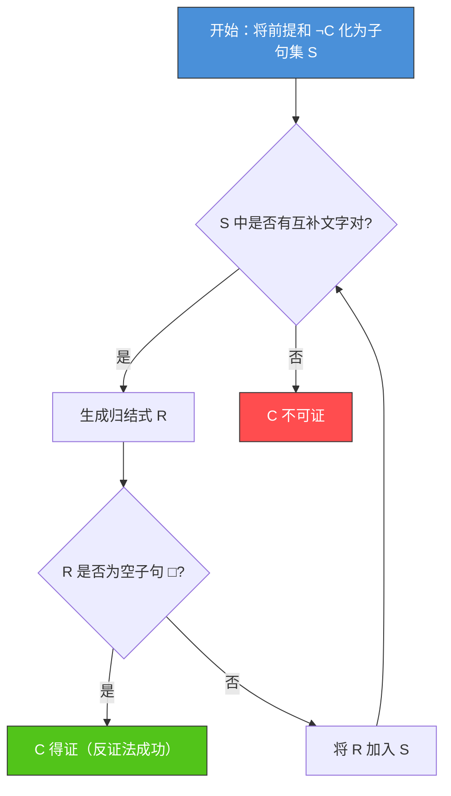
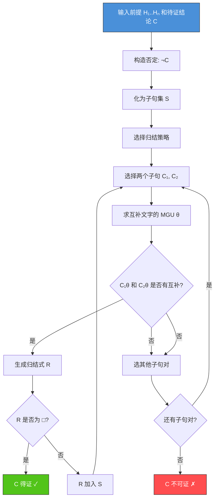

# 3.2 归结推理与消解

## 📌 基本概念

### 归结法的核心思想

> **归结法（Resolution）** 是一种基于**反证法**的推理方法：为证明结论 $C$ 从前提 $H_1, H_2, \ldots, H_n$ 推出，只需证明 $H_1 \land H_2 \land \cdots \land H_n \land \neg C$ 是**不可满足的**（永假）。

归结法是谓词逻辑中**自动化推理**的基础，由 Robinson 于 1965 年提出。


## 🔍 命题逻辑的归结

### 子句与文字

| 概念 | 定义 | 示例 |
|------|------|------|
| **文字** | 原子命题或其否定 | $P$、$\neg Q$ |
| **正文字** | 不含否定的文字 | $P$ |
| **负文字** | 含否定的文字 | $\neg Q$ |
| **子句** | 文字的析取 | $P \lor \neg Q \lor R$ |
| **空子句** | 不含任何文字的子句 | $\square$ |

### 归结规则

**定义**：设 $C_1$ 和 $C_2$ 是两个子句，若 $C_1$ 含文字 $L$，$C_2$ 含文字 $\neg L$，则可推导出：

$$R = (C_1 - \{L\}) \lor (C_2 - \{\neg L\})$$

称为 $C_1$ 和 $C_2$ 的**归结式**。

### 基本示例

$$C_1 = P \lor Q, \quad C_2 = \neg P \lor R$$

归结式：$R = Q \lor R$（消去 $P$ 和 $\neg P$）

### 命题归结算法



### Python 实现：命题归结

```python
def resolve_clauses(clause1: set, clause2: set) -> set:
    """
    对两个子句进行归结
    子句用 frozenset 表示文字集合
    """
    for lit in clause1:
        neg_lit = ('¬', lit[1]) if lit[0] != '¬' else lit[1]
        # 简化处理：用字符串表示文字
        pass
    return None

def simple_resolve(clause1, clause2):
    """
    简化版命题归结
    clause1, clause2: set of strings like {'P', '¬Q', 'R'}
    """
    for lit1 in clause1:
        for lit2 in clause2:
            if lit1 == '¬' + lit2 or lit2 == '¬' + lit1:
                # 找到互补文字对
                new_c1 = clause1 - {lit1}
                new_c2 = clause2 - {lit2}
                resolved = new_c1 | new_c2
                return resolved
    return None

def resolution_proof(premises, neg_conclusion):
    """
    基于命题逻辑的归结证明
    premises: 前提子句集列表
    neg_conclusion: 结论的否定子句集
    """
    clauses = set()
    for premise in premises:
        for clause in premise:
            clauses.add(frozenset(clause))
    for clause in neg_conclusion:
        clauses.add(frozenset(clause))

    new_clauses = set()
    while True:
        for c1 in clauses:
            for c2 in clauses:
                if c1 >= c2:
                    continue
                resolvent = simple_resolve(set(c1), set(c2))
                if resolvent is not None:
                    if not resolvent:
                        return True  # 空子句，得证
                    new_clauses.add(frozenset(resolvent))

        if new_clauses.issubset(clauses):
            return False  # 没有新子句，不可证

        clauses |= new_clauses
        new_clauses.clear()

premises = [
    [{'¬P', 'Q'}],       # P → Q
    [{'¬Q', 'R'}],       # Q → R
]
neg_conclusion = [{'P'}, {'¬R'}]  # ¬(P → R) = P ∧ ¬R

result = resolution_proof(premises, neg_conclusion)
print(f"P → Q, Q → R 蕴含 P → R: {result}")
```

## 🔍 谓词逻辑的归结

### 合一（Unification）

谓词逻辑中，子句可能包含变量。在进行归结之前，需要通过**置换**使两个文字**合一**（变为相同）。

### 置换

**定义**：一个**置换** $\theta$ 是形如 $\{x_1/t_1, x_2/t_2, \ldots, x_n/t_n\}$ 的集合，其中 $x_i$ 是互不相同的变量，$t_i$ 是项。

**应用**：将置换 $\theta$ 应用于公式 $F$，记作 $F\theta$，即将 $F$ 中每个 $x_i$ 替换为 $t_i$。

### 合一与最一般合一

**定义**：若存在置换 $\theta$ 使 $L_1\theta = L_2\theta$，则称 $L_1$ 和 $L_2$ **可合一**，$\theta$ 为它们的**合一子**。

**最一般合一（MGU）**：若 $L_1$ 和 $L_2$ 的任何合一子 $\sigma$ 都可以表示为 $\theta\lambda$（$\lambda$ 为某个置换），则 $\theta$ 为**最一般合一子**。

### 合一算法

```python
def unify(term1, term2, subst=None):
    """
    合一算法（简化版）
    term1, term2: 用字符串表示的项
    subst: 置换字典
    """
    if subst is None:
        subst = {}

    term1 = apply_subst(term1, subst)
    term2 = apply_subst(term2, subst)

    if term1 == term2:
        return subst

    if is_variable(term1):
        return unify_variable(term1, term2, subst)
    if is_variable(term2):
        return unify_variable(term2, term1, subst)

    if is_compound(term1) and is_compound(term2):
        functor1, args1 = parse_term(term1)
        functor2, args2 = parse_term(term2)
        if functor1 != functor2:
            return None
        if len(args1) != len(args2):
            return None
        for a1, a2 in zip(args1, args2):
            subst = unify(a1, a2, subst)
            if subst is None:
                return None
        return subst

    return None

def apply_subst(term, subst):
    if term in subst:
        return apply_subst(subst[term], subst)
    return term

def is_variable(term):
    return len(term) == 1 and term.islower()

def is_compound(term):
    return '(' in term

def parse_term(term):
    functor = term[:term.index('(')]
    args_str = term[term.index('(')+1:term.rindex(')')]
    args = args_str.split(',')
    return functor, [a.strip() for a in args]

def unify_variable(var, term, subst):
    if var == term:
        return subst
    if occurs_in(var, term):
        return None
    return {**subst, var: term}

def occurs_in(var, term):
    if var == term:
        return True
    if is_compound(term):
        _, args = parse_term(term)
        return any(occurs_in(var, arg) for arg in args)
    return False

mgu = unify("P(x, f(y))", "P(a, f(z))")
print(f"最一般合一: {mgu}")
```

### 谓词归结规则

设 $C_1$ 和 $C_2$ 是两个无公共变量的子句，$L_1 \in C_1$，$L_2 \in C_2$，若 $\theta$ 是 $L_1$ 和 $\neg L_2$ 的 MGU，则：

$$R = (C_1\theta - \{L_1\theta\}) \lor (C_2\theta - \{L_2\theta\})$$

是 $C_1$ 和 $C_2$ 的**归结式**。

### 谓词归结示例

**前提**：
1. $\forall x (Man(x) \rightarrow Mortal(x))$
2. $Man(Socrates)$

**结论**：$Mortal(Socrates)$

**证明**：
1. 前提子句化：
   - $\neg Man(x) \lor Mortal(x)$
   - $Man(Socrates)$
2. 否定结论：$\neg Mortal(Socrates)$
3. 归结：
   - $C_1 = \neg Man(x) \lor Mortal(x)$
   - $C_2 = Man(Socrates)$
   - MGU：$\theta = \{x/Socrates\}$
   - 归结式：$Mortal(Socrates)$
   - $C_3 = Mortal(Socrates)$
   - $C_4 = \neg Mortal(Socrates)$
   - 归结式：$\square$
4. 空子句！$Mortal(Socrates)$ 得证。

### 归结策略

| 策略 | 说明 | 优点 |
|------|------|------|
| **删除策略** | 删除永真子句和重复子句 | 减少搜索空间 |
| **支持集策略** | 归结一方必须来自目标否定 | 减少冗余归结 |
| **线性归结** | 每一步归结都以中心子句为一方 | 完备且高效 |
| **单文字子句优先** | 优先使用单位子句归结 | 产生更短的归结式 |
| **祖先过滤** | 只有祖先链上的子句参与归结 | 限制搜索范围 |

## 📊 归结推理流程



## 🌍 实际应用

### 自动化定理证明（ATP）
Otter、Prover9 等定理证明器基于归结法，已成功证明了许多数学定理，包括 Robbins 代数猜想等长期悬而未决的问题。

### Prolog 语言
Prolog 的核心推理引擎就是基于**线性归结**（SLD 归结），用于逻辑编程和专家系统开发。

### 形式化验证
使用归结法验证硬件电路、软件协议的正确性，已用于 Intel、AMD 等公司的芯片设计验证。

### 自然语言问答
基于归结法的问答系统可以回答关于知识库的复杂查询。

## 💡 考点总结

1. **归结法原理**：反证法，否定结论加入前提，推出空子句则结论成立
2. **合一算法**：最一般合一（MGU）是谓词归结的关键
3. **子句集转换**：前束范式 → Skolem 范式 → 子句集
4. **归结策略**：支持集、线性、单文字等策略提升效率
5. **归结的完备性**：一阶逻辑中归结法是完备的（反证法完备）
6. **Horn 子句**：最多一个正文字的子句，Prolog 的基础