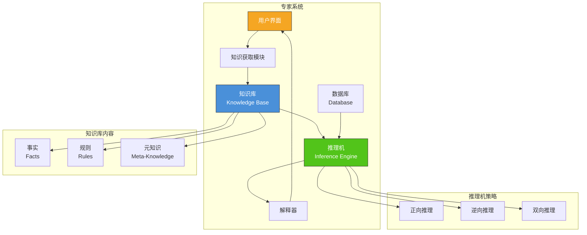
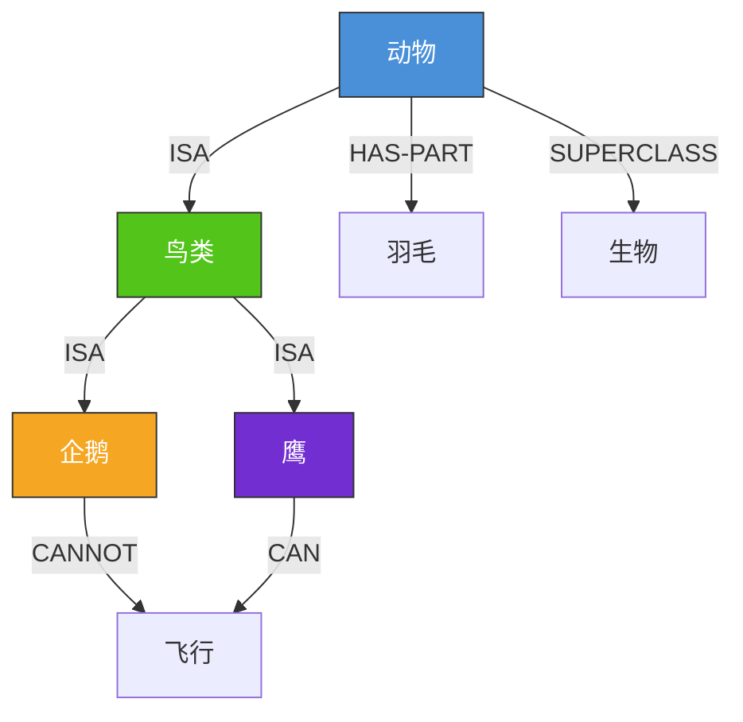
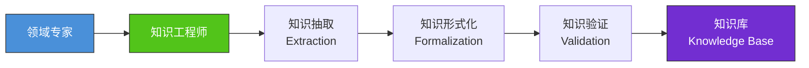
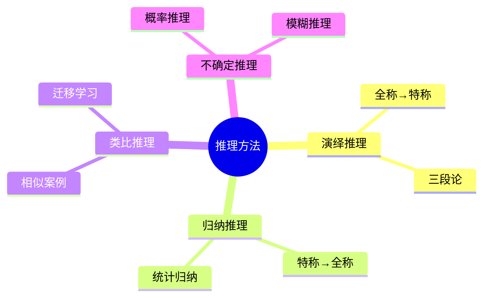
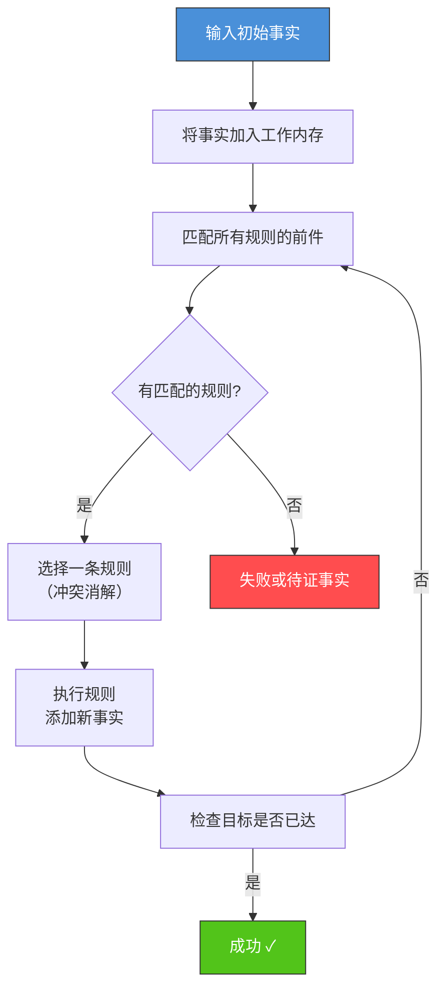
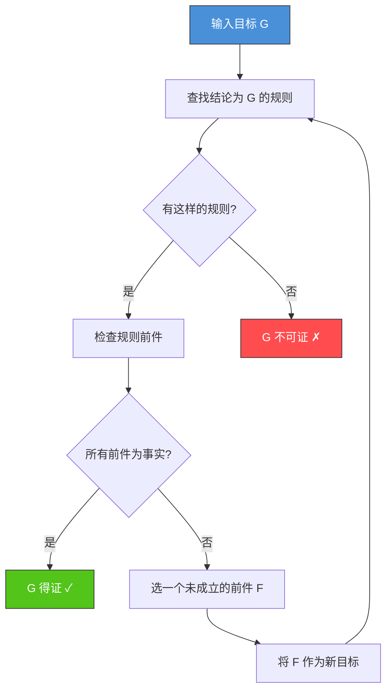
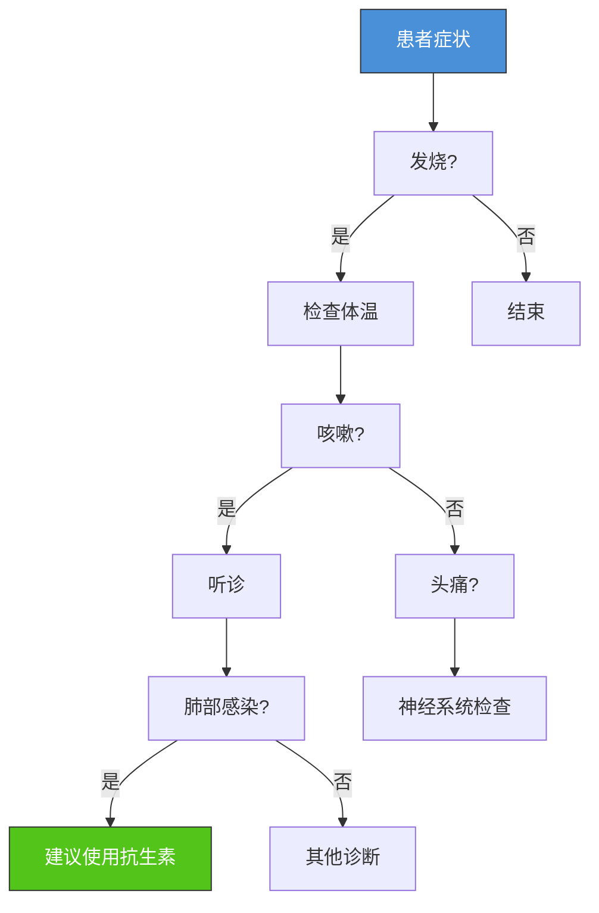
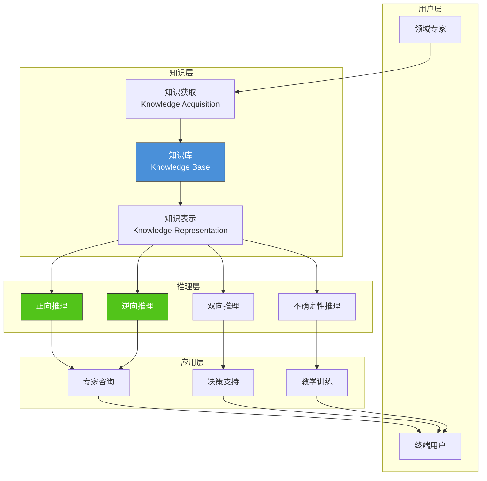

# 3.3 知识库构建与推理机

## 📌 基本概念

### 专家系统的架构

知识库与推理机是专家系统的两个核心组件：



## 📚 知识库构建

### 知识的类型

| 类型 | 说明 | 表示形式 | 示例 |
|------|------|---------|------|
| **事实** | 断言性知识 | 谓词、关系 | 地球是圆的 |
| **规则** | 条件性知识 | IF-THEN 结构 | 如果发烧且咳嗽，则可能感冒 |
| **过程** | 操作性知识 | 步骤序列 | 泡茶的步骤 |
| **元知识** | 关于知识的知识 | 描述规则的优先级 | 规则 A 优先于规则 B |

### 知识的表示方法

#### 产生式表示法

**格式**：
```
IF <条件> THEN <结论> [置信度]
```

**示例**：
```
IF 动物有羽毛 AND 动物会下蛋 THEN 动物是鸟类 (0.9)
IF 动物是鸟类 AND 动物不会飞 THEN 动物是企鹅 (0.7)
```

#### 语义网络表示法



#### 框架表示法

```python
class Frame:
    def __init__(self, name, slots):
        self.name = name
        self.slots = slots

bird_frame = Frame("鸟", {
    "类别": "脊椎动物",
    "特征": ["羽毛", "喙", "卵生"],
    "运动方式": "飞行",
    "栖息地": None,
    "UNDERSCORE": "动物"
})

penguin_frame = Frame("企鹅", {
    "类别": "鸟类",
    "特征": ["羽毛", "喙", "卵生"],
    "运动方式": "游泳",
    "栖息地": "南极",
    "UNDERSCORE": "鸟"
})
```

### 知识库设计原则

1. **一致性**：知识之间不应存在矛盾
2. **完备性**：覆盖领域内的主要知识
3. **可扩展性**：便于添加新知识
4. **可维护性**：便于更新和修正
5. **高效性**：推理时能高效检索相关知识

### 知识获取流程



## ⚙️ 推理机

### 推理方法分类



### 正向推理（数据驱动）

#### 原理

> 从已知事实出发，应用规则逐步推导出新事实，直到得到目标结论。

#### 工作流程



#### Python 实现

```python
class ForwardChainingEngine:
    def __init__(self):
        self.rules = []
        self.facts = set()
        self.work_memory = set()

    def add_rule(self, conditions, conclusion, confidence=1.0):
        self.rules.append({
            'conditions': set(conditions),
            'conclusion': conclusion,
            'confidence': confidence
        })

    def add_fact(self, fact):
        self.facts.add(fact)
        self.work_memory.add(fact)

    def forward_chain(self, goal=None, max_iterations=100):
        for _ in range(max_iterations):
            new_facts = set()

            for rule in self.rules:
                if rule['conditions'].issubset(self.work_memory):
                    if rule['conclusion'] not in self.work_memory:
                        new_facts.add(rule['conclusion'])
                        print(f"应用规则: {rule['conditions']} → {rule['conclusion']}")

            if goal and goal in self.work_memory:
                return True

            if not new_facts:
                break

            self.work_memory |= new_facts

        if goal:
            return goal in self.work_memory
        return self.work_memory

engine = ForwardChainingEngine()

engine.add_rule(['发烧', '咳嗽', '流鼻涕'], '感冒', 0.8)
engine.add_rule(['发烧', '咳嗽', '呼吸困难'], '肺炎', 0.9)
engine.add_rule(['感冒'], '需要休息', 1.0)
engine.add_rule(['肺炎'], '需要就医', 1.0)

engine.add_fact('发烧')
engine.add_fact('咳嗽')
engine.add_fact('流鼻涕')

result = engine.forward_chain(goal='感冒')
print(f"诊断结果: {'感冒' if result else '未确诊'}")
print(f"工作内存: {engine.work_memory}")
```

### 逆向推理（目标驱动）

#### 原理

> 从待证目标出发，反向查找能导出该目标的规则，验证规则前件是否成立。

#### 工作流程



#### Python 实现

```python
class BackwardChainingEngine:
    def __init__(self):
        self.rules = {}
        self.facts = set()
        self.goals_stack = []

    def add_rule(self, conditions, conclusion):
        if conclusion not in self.rules:
            self.rules[conclusion] = []
        self.rules[conclusion].append(set(conditions))

    def add_fact(self, fact):
        self.facts.add(fact)

    def backward_chain(self, goal, visited=None):
        if visited is None:
            visited = set()

        if goal in self.facts:
            return True

        if goal in visited:
            return False
        visited.add(goal)

        if goal not in self.rules:
            return False

        for conditions in self.rules[goal]:
            all_proven = True
            for cond in conditions:
                if not self.backward_chain(cond, visited):
                    all_proven = False
                    break
            if all_proven:
                self.facts.add(goal)
                return True

        return False

engine = BackwardChainingEngine()

engine.add_rule(['发烧', '咳嗽', '流鼻涕'], '感冒')
engine.add_rule(['发烧', '咳嗽', '呼吸困难'], '肺炎')
engine.add_rule(['感冒'], '需要休息')
engine.add_rule(['肺炎'], '需要就医')

engine.add_fact('发烧')
engine.add_fact('咳嗽')
engine.add_fact('流鼻涕')

result = engine.backward_chain('感冒')
print(f"诊断: {'感冒' if result else '未确诊'}")

result2 = engine.backward_chain('需要休息')
print(f"建议: {'需要休息' if result2 else '无建议'}")
```

### 正向 vs 逆向推理

| 对比维度 | 正向推理 | 逆向推理 |
|---------|---------|---------|
| 驱动方式 | 数据驱动 | 目标驱动 |
| 起始点 | 初始事实 | 待证目标 |
| 方向 | 从事实到结论 | 从结论到事实 |
| 适用场景 | 事实已知，需发现所有结论 | 目标明确，需验证 |
| 效率 | 可能产生大量无关结论 | 仅搜索与目标相关的规则 |
| 典型系统 | CLIPS | MYCIN |

### 冲突消解策略

当多条规则同时匹配时，需要选择一条执行：

| 策略 | 说明 |
|------|------|
| **优先级** | 按规则的优先级编号选择 |
| **特异性** | 选择条件更具体的规则 |
| **新鲜度** | 选择最近被激活的规则 |
| **循环优先** | 选择最久未被激活的规则 |
| **置信度** | 选择置信度最高的规则 |

## 🏥 专家系统案例

### MYCIN 专家系统

MYCIN 是 20 世纪 70 年代斯坦福大学开发的细菌感染诊断专家系统：

| 特性 | 说明 |
|------|------|
| 领域 | 细菌感染诊断与治疗建议 |
| 知识表示 | 产生式规则 + 置信度 |
| 推理方式 | 逆向推理 + 不确定性推理 |
| 规则数量 | 约 600 条 |
| 性能 | 达到感染科专家水平 |

### 诊断流程示例



### 其他著名专家系统

| 系统 | 领域 | 年份 | 特点 |
|------|------|------|------|
| DENDRAL | 化学分子结构 | 1965 | 第一个专家系统 |
| MYCIN | 细菌感染诊断 | 1976 | 最经典的专家系统 |
| XCON | 计算机配置 | 1980 | 商业成功案例 |
| PROSPECTOR | 矿产勘探 | 1978 | 地质勘探 |
| CADUCEUS | 内科诊断 | 1982 | 覆盖内科 80% 疾病 |

## 📊 知识系统架构图



## 🌍 实际应用

### 医疗诊断系统
现代医疗决策支持系统（CDSS）结合知识库和推理机，辅助医生诊断和治疗方案选择。

### 金融风控
银行和金融机构使用基于规则的专家系统进行信贷审批、反欺诈检测等。

### 智能客服
智能客服系统使用知识库和推理机自动回答客户常见问题，转接人工处理复杂问题。

### 智能制造
工业专家系统用于设备故障诊断、工艺参数优化和质量控制。

## 💡 考点总结

1. **知识库 vs 推理机**：知识库存储知识，推理机执行推理
2. **正向 vs 逆向**：数据驱动 vs 目标驱动，适用场景不同
3. **知识表示方法**：产生式、语义网络、框架，各有适用场景
4. **冲突消解**：多条规则同时匹配时的选择策略
5. **专家系统结构**：知识库 + 推理机 + 解释器 + 知识获取
6. **MYCIN 案例**：经典的逆向推理 + 不确定性推理专家系统