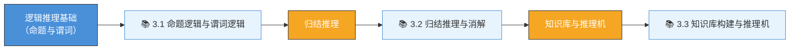

# 第3章 逻辑推理与谓词逻辑 — 目录总览 (MOC)

> [!info] 章节概览
> 逻辑推理是人工智能实现"智能"的核心手段之一。本章从命题逻辑和谓词逻辑的基础出发，深入讲解归结推理方法，并介绍知识库与推理机的构建。

## 🗺️ 学习路线图

## 📖 章节内容

### 3.1 命题逻辑与谓词逻辑
- [[3.1-命题逻辑与谓词逻辑]]
- 命题逻辑的基本概念
- 谓词逻辑与量词
- 谓词公式的永真性与可满足性
- 前束范式与 Skolem 范式

### 3.2 归结推理与消解
- [[3.2-归结推理与消解]]
- 归结法（消解）原理
- 命题逻辑的归结
- 谓词逻辑的归结（含合一/置换）
- 归结策略

### 3.3 知识库构建与推理机
- [[3.3-知识库构建与推理机]]
- 知识库的设计原则
- 推理机的工作原理
- 正向推理与逆向推理
- 专家系统案例

## 🎯 核心考点

| 考点 | 重要程度 | 常考形式 |
|------|---------|---------|
| 命题逻辑基本等价式 | ⭐⭐⭐⭐ | 选择题、计算题 |
| 谓词公式的前束范式 | ⭐⭐⭐⭐ | 计算题、简答题 |
| 合一与置换 | ⭐⭐⭐⭐⭐ | 计算题 |
| 归结法证明 | ⭐⭐⭐⭐⭐ | 证明题、计算题 |
| 正向/逆向推理对比 | ⭐⭐⭐ | 简答题、分析题 |
| 知识库设计 | ⭐⭐⭐ | 设计题 |

## 📝 自测题

1. **基础题**：将下列自然语言命题符号化为命题逻辑公式：
   - "如果今天下雨，那么地会湿；今天没湿，所以今天没下雨。"
2. **计算题**：求谓词公式 $\forall x(P(x) \rightarrow \exists y Q(x,y))$ 的前束范式和 Skolem 范式。
3. **证明题**：使用归结法证明以下推理的正确性：
   - 前提：$\forall x(Man(x) \rightarrow Mortal(x))$，$Man(Socrates)$
   - 结论：$Mortal(Socrates)$
4. **计算题**：求两个谓词公式 $P(f(x), g(y))$ 和 $P(f(a), g(z))$ 的最一般合一（MGU）。
5. **设计题**：为一个医疗诊断专家系统设计知识库结构，说明正向推理过程。

## 🔗 关联知识点

- [[第2章-搜索与问题求解]] → 逻辑推理可视为搜索过程
- [[第4章-机器学习]] → 机器学习中的归纳推理
- [[第5章-知识图谱]] → 知识图谱中的逻辑推理
- [[第6章-强化学习]] → 马尔可夫决策过程中的推理