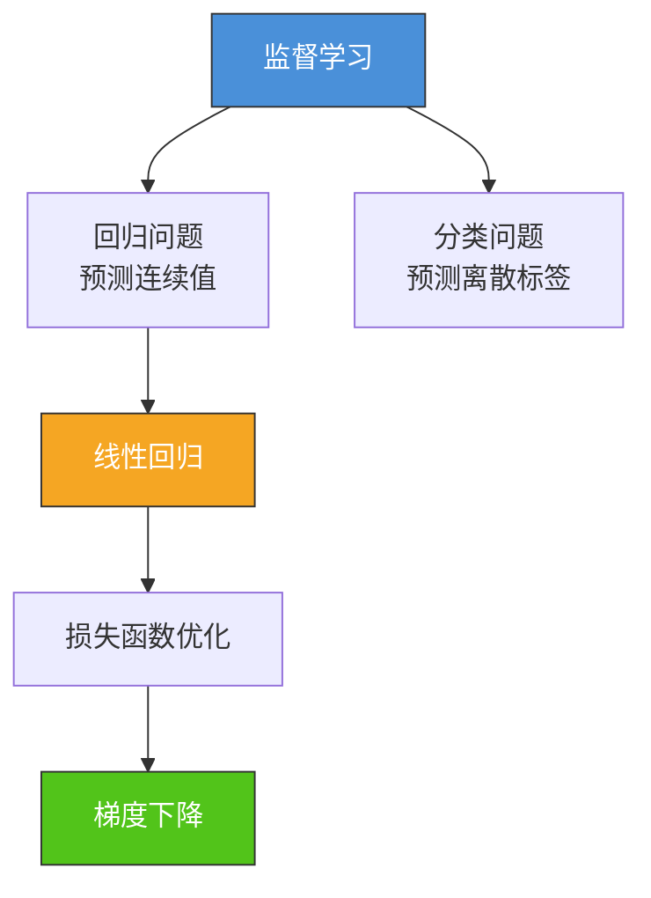
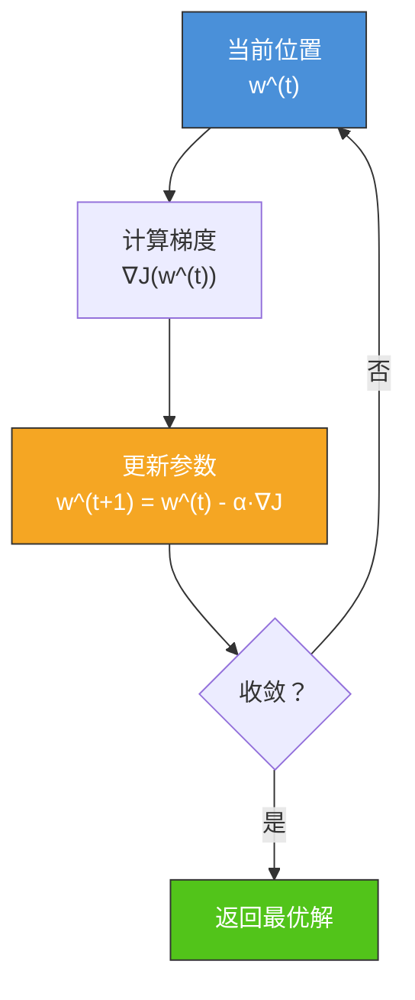
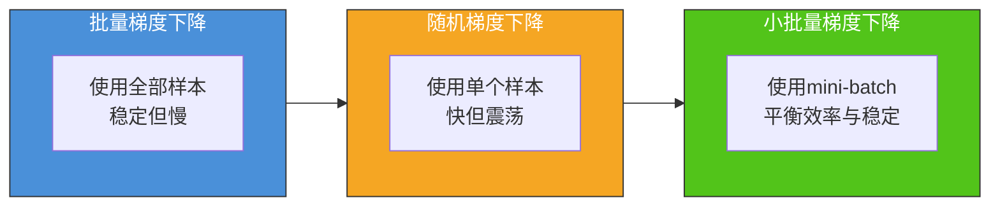
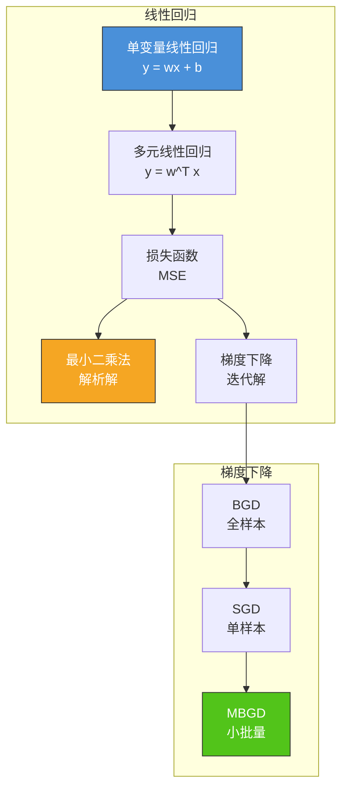

# 4.1 线性回归与梯度下降

## 📌 基本概念

### 什么是线性回归

线性回归（Linear Regression）是机器学习中最基础的**监督学习算法**之一，用于解决**回归问题**（Regression）——即预测连续数值型目标。它假设输入特征与输出之间存在线性关系，通过拟合一个线性模型来进行预测。

**核心思想**：找到一条直线（或超平面），使所有数据点到该直线的**距离平方和最小**。



## 🔢 单变量线性回归

### 模型定义

单变量线性回归假设模型为：

$$\hat{y} = wx + b$$

其中：
- $x$：输入特征（自变量）
- $\hat{y}$：预测值（因变量）
- $w$：权重/斜率（weight）
- $b$：偏置/截距（bias）

### 损失函数：均方误差（MSE）

给定训练集 $\{(x_i, y_i)\}_{i=1}^m$，我们希望预测值 $\hat{y}_i = wx_i + b$ 尽可能接近真实值 $y_i$。定义**均方误差**（Mean Squared Error, MSE）：

$$J(w, b) = \frac{1}{2m}\sum_{i=1}^{m}(\hat{y}_i - y_i)^2 = \frac{1}{2m}\sum_{i=1}^{m}(wx_i + b - y_i)^2$$

> [!note] 为什么除以 $2m$？
> 系数 $\frac{1}{2}$ 是为了求导时消去指数；$m$ 是为了让损失与训练样本数量无关，便于不同规模数据集的比较。

### 最小二乘法求解

对 $w$ 和 $b$ 分别求偏导并令其为零，可得解析解：

$$\frac{\partial J}{\partial w} = \frac{1}{m}\sum_{i=1}^{m}(wx_i + b - y_i)x_i = 0$$

$$\frac{\partial J}{\partial b} = \frac{1}{m}\sum_{i=1}^{m}(wx_i + b - y_i) = 0$$

解得：

$$b = \bar{y} - w\bar{x}$$

$$w = \frac{\sum_{i=1}^{m}(x_i - \bar{x})(y_i - \bar{y})}{\sum_{i=1}^{m}(x_i - \bar{x})^2}$$

其中 $\bar{x} = \frac{1}{m}\sum x_i$，$\bar{y} = \frac{1}{m}\sum y_i$。

### Python 实现：最小二乘法

```python
import numpy as np
import matplotlib.pyplot as plt

def least_squares(X, y):
    """
    单变量线性回归 - 最小二乘法
    X: (m,) 一维特征
    y: (m,) 标签
    """
    x_mean = np.mean(X)
    y_mean = np.mean(y)
    w = np.sum((X - x_mean) * (y - y_mean)) / np.sum((X - x_mean) ** 2)
    b = y_mean - w * x_mean
    return w, b

np.random.seed(42)
X = np.linspace(0, 10, 50)
y = 2 * X + 1 + np.random.randn(50) * 2

w, b = least_squares(X, y)
print(f"拟合结果: w = {w:.4f}, b = {b:.4f}")
print(f"模型: y = {w:.2f}x + {b:.2f}")

y_pred = w * X + b
mse = np.mean((y_pred - y) ** 2)
print(f"均方误差 MSE = {mse:.4f}")
```

## 🔢 多元线性回归

### 模型定义

当有 $n$ 个特征时，模型扩展为：

$$\hat{y} = w_1 x_1 + w_2 x_2 + \cdots + w_n x_n + b = \mathbf{w}^T \mathbf{x} + b$$

用向量表示：$\mathbf{w} = [w_1, w_2, \ldots, w_n]^T$，$\mathbf{x} = [x_1, x_2, \ldots, x_n]^T$。

为简化表达，将偏置 $b$ 吸收到权重向量中，令 $x_0 = 1$：

$$\hat{y} = \mathbf{w}^T \mathbf{x}$$

其中 $\mathbf{w} = [w_0, w_1, \ldots, w_n]^T$，$\mathbf{x} = [1, x_1, \ldots, x_n]^T$。

### 矩阵形式

将所有训练样本堆叠成矩阵形式：

$$X = \begin{bmatrix} \mathbf{x}_1^T \\ \mathbf{x}_2^T \\ \vdots \\ \mathbf{x}_m^T \end{bmatrix} \in \mathbb{R}^{m \times (n+1)}$$

$$\mathbf{y} = \begin{bmatrix} y_1 \\ y_2 \\ \vdots \\ y_m \end{bmatrix} \in \mathbb{R}^{m}$$

损失函数可写为：

$$J(\mathbf{w}) = \frac{1}{2m}(X\mathbf{w} - \mathbf{y})^T(X\mathbf{w} - \mathbf{y})$$

### 正规方程（Normal Equation）

对 $\mathbf{w}$ 求梯度并令其为零：

$$\frac{\partial J}{\partial \mathbf{w}} = \frac{1}{m}X^T(X\mathbf{w} - \mathbf{y}) = 0$$

解得：

$$\mathbf{w}^* = (X^T X)^{-1} X^T \mathbf{y}$$

> [!tip] 正规方程 vs 梯度下降
> - 正规方程：直接求解，无需迭代，但需计算 $(X^T X)^{-1}$，时间复杂度 $O(n^3)$
> - 当特征数 $n$ 很大时，$X^T X$ 不可逆，需使用梯度下降或正则化

### Python 实现：正规方程

```python
def normal_equation(X, y):
    """
    多元线性回归 - 正规方程
    X: (m, n) 特征矩阵
    y: (m,) 标签
    """
    m = X.shape[0]
    X_b = np.column_stack([np.ones(m), X])
    w = np.linalg.inv(X_b.T @ X_b) @ X_b.T @ y
    return w

np.random.seed(42)
X = np.random.randn(100, 3)
true_w = np.array([1.5, -2.0, 3.0])
y = X @ true_w + 1 + np.random.randn(100) * 0.5

w = normal_equation(X, y)
print(f"正规方程求解结果: {w}")
```

## 📉 梯度下降

### 梯度下降原理

梯度下降（Gradient Descent）是一种通用的**迭代优化算法**，用于求解损失函数的最小值。

**核心思想**：沿着损失函数梯度的**反方向**更新参数，使损失逐步减小。

$$\mathbf{w}^{(t+1)} = \mathbf{w}^{(t)} - \alpha \nabla J(\mathbf{w}^{(t)})$$

其中：
- $\alpha$：学习率（learning rate），控制步长
- $\nabla J(\mathbf{w})$：损失函数关于参数的梯度



### 损失函数梯度推导

对 $J(\mathbf{w}) = \frac{1}{2m}(X\mathbf{w} - \mathbf{y})^T(X\mathbf{w} - \mathbf{y})$ 求梯度：

$$\nabla_{\mathbf{w}} J = \frac{1}{m} X^T(X\mathbf{w} - \mathbf{y})$$

**推导过程**：

$$\frac{\partial J}{\partial \mathbf{w}} = \frac{\partial}{\partial \mathbf{w}} \left[ \frac{1}{2m}(X\mathbf{w} - \mathbf{y})^T(X\mathbf{w} - \mathbf{y}) \right]$$

令 $\mathbf{e} = X\mathbf{w} - \mathbf{y}$，则 $J = \frac{1}{2m}\mathbf{e}^T\mathbf{e}$

$$\frac{\partial J}{\partial \mathbf{e}} = \frac{1}{m}\mathbf{e}$$

$$\frac{\partial J}{\partial \mathbf{w}} = \frac{\partial J}{\partial \mathbf{e}} \cdot \frac{\partial \mathbf{e}}{\partial \mathbf{w}} = \frac{1}{m}\mathbf{e} \cdot X^T = \frac{1}{m}X^T(X\mathbf{w} - \mathbf{y})$$

### 梯度下降的三种变体

#### 批量梯度下降（BGD）

每次迭代使用**全部训练样本**计算梯度：

$$\nabla_{\mathbf{w}} J = \frac{1}{m} X^T(X\mathbf{w} - \mathbf{y})$$

- **优点**：稳定收敛，可并行
- **缺点**：数据量大时计算开销大

#### 随机梯度下降（SGD）

每次迭代使用**一个随机样本**计算梯度：

$$\nabla_{\mathbf{w}} J \approx \frac{1}{m} (\mathbf{x}_i^T \mathbf{w} - y_i) \mathbf{x}_i$$

- **优点**：收敛速度快，适合大数据集
- **缺点**：震荡剧烈，可能不收敛

#### 小批量梯度下降（MBGD）

每次迭代使用**一个小批量（mini-batch）**样本：

$$\nabla_{\mathbf{w}} J \approx \frac{1}{|\mathcal{B}|} \sum_{i \in \mathcal{B}} (\mathbf{x}_i^T \mathbf{w} - y_i) \mathbf{x}_i$$

- **优点**：兼顾效率与稳定性，GPU 友好
- **缺点**：需调参 batch_size



### Python 实现：梯度下降

```python
def compute_cost(X, y, w):
    """计算均方误差损失"""
    m = len(y)
    predictions = X @ w
    cost = np.sum((predictions - y) ** 2) / (2 * m)
    return cost

def compute_gradient(X, y, w):
    """计算损失函数关于 w 的梯度"""
    m = len(y)
    predictions = X @ w
    grad = X.T @ (predictions - y) / m
    return grad

def batch_gradient_descent(X, y, alpha=0.01, num_iters=1000):
    """
    批量梯度下降
    """
    m, n = X.shape
    w = np.zeros(n)
    costs = []
    for i in range(num_iters):
        grad = compute_gradient(X, y, w)
        w = w - alpha * grad
        cost = compute_cost(X, y, w)
        costs.append(cost)
        if i % 100 == 0:
            print(f"迭代 {i}: 损失 = {cost:.6f}")
    return w, costs

def stochastic_gradient_descent(X, y, alpha=0.01, num_iters=100):
    """
    随机梯度下降
    """
    m, n = X.shape
    w = np.zeros(n)
    costs = []
    for epoch in range(num_iters):
        indices = np.random.permutation(m)
        for i in indices:
            xi = X[i:i+1]
            yi = y[i:i+1]
            pred = xi @ w
            grad = xi.T @ (pred - yi)
            w = w - alpha * grad
        cost = compute_cost(X, y, w)
        costs.append(cost)
        if epoch % 20 == 0:
            print(f"Epoch {epoch}: 损失 = {cost:.6f}")
    return w, costs

def mini_batch_gradient_descent(X, y, alpha=0.01, num_iters=200, batch_size=16):
    """
    小批量梯度下降
    """
    m, n = X.shape
    w = np.zeros(n)
    costs = []
    for epoch in range(num_iters):
        indices = np.random.permutation(m)
        X_shuffled = X[indices]
        y_shuffled = y[indices]
        for start in range(0, m, batch_size):
            end = min(start + batch_size, m)
            X_batch = X_shuffled[start:end]
            y_batch = y_shuffled[start:end]
            grad = compute_gradient(X_batch, y_batch, w)
            w = w - alpha * grad
        cost = compute_cost(X, y, w)
        costs.append(cost)
        if epoch % 40 == 0:
            print(f"Epoch {epoch}: 损失 = {cost:.6f}")
    return w, costs

np.random.seed(42)
X = np.random.randn(100, 3)
X_b = np.column_stack([np.ones(100), X])
true_w = np.array([1.0, 1.5, -2.0, 3.0])
y = X_b @ true_w + np.random.randn(100) * 0.5

print("=== BGD ===")
w_bgd, costs_bgd = batch_gradient_descent(X_b, y, alpha=0.01, num_iters=1000)
print(f"BGD 结果: {w_bgd}")

print("\n=== SGD ===")
w_sgd, costs_sgd = stochastic_gradient_descent(X_b, y, alpha=0.01, num_iters=100)
print(f"SGD 结果: {w_sgd}")

print("\n=== MBGD ===")
w_mbgd, costs_mbgd = mini_batch_gradient_descent(X_b, y, alpha=0.01, num_iters=200, batch_size=16)
print(f"MBGD 结果: {w_mbgd}")
```

## 📈 学习率与收敛性

### 学习率的影响

| 学习率 $\alpha$ | 行为 |
|----------------|------|
| 太小 | 收敛极慢 |
| 太大 | 震荡甚至发散 |
| 合适 | 快速稳定收敛 |

### 学习率调度策略

$$\alpha_t = \frac{\alpha_0}{1 + k \cdot t}$$

其中 $\alpha_0$ 为初始学习率，$k$ 为衰减系数，$t$ 为迭代次数。

### 特征缩放

在梯度下降中，特征尺度差异过大会导致等高线呈狭长椭圆形，收敛缓慢。常用缩放方法：

- **归一化（Min-Max Scaling）**：$x' = \frac{x - x_{\min}}{x_{\max} - x_{\min}}$
- **标准化（Z-Score Normalization）**：$x' = \frac{x - \mu}{\sigma}$

## 📊 知识结构图



## 🌍 实际应用

### 房价预测
根据房屋面积、房间数、地段等特征预测房价。这是线性回归最经典的应用场景。

### 股票收益率预测
基于历史价格、成交量等特征预测股票未来收益率（实际效果有限，常需更复杂模型）。

### 温度预测
根据海拔、纬度、季节等因素预测气温。

### 营销ROI分析
根据广告投入、渠道等特征预测销售额。

## ⚠️ 注意事项

1. **线性假设**：线性回归假设特征与目标之间是线性关系，非线性关系需要特征变换或使用其他模型
2. **多重共线性**：特征之间高度相关时，正规方程中的 $X^T X$ 可能不可逆
3. **过拟合与欠拟合**：需通过正则化（Ridge/Lasso）或特征工程平衡
4. **异常值敏感**：MSE 对异常值敏感，可考虑使用 MAE 或 Huber 损失

## 💡 考点总结

1. **损失函数推导**：MSE 的公式及其梯度推导是核心考点
2. **正规方程**：$\mathbf{w}^* = (X^T X)^{-1} X^T \mathbf{y}$，注意适用条件
3. **梯度下降三种变体**：BGD、SGD、MBGD 的对比和适用场景
4. **学习率选择**：太大 vs 太小的影响，学习率衰减策略
5. **特征缩放**：归一化与标准化的区别与选择
6. **矩阵求导**：掌握标量对向量、向量对向量的求导法则