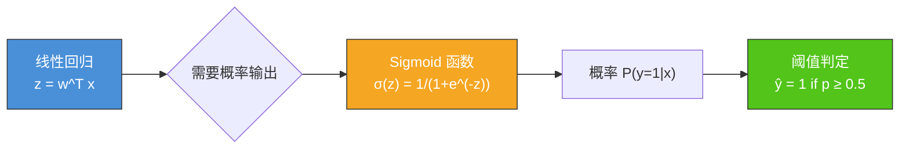
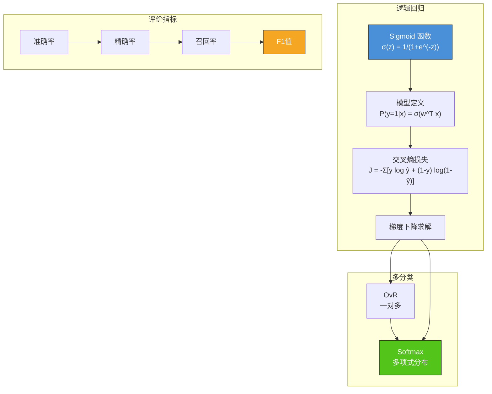

# 4.2 逻辑回归与分类

## 📌 基本概念

### 什么是分类问题

分类问题（Classification）的目标是预测**离散的类别标签**。与回归问题（预测连续值）不同，分类问题的输出是有限个类别之一。

**分类类型**：
- **二元分类（Binary Classification）**：$y \in \{0, 1\}$，如垃圾邮件检测、肿瘤诊断
- **多元分类（Multi-class Classification）**：$y \in \{0, 1, \ldots, K-1\}$，如手写数字识别（10类）

### 从线性回归到逻辑回归

线性回归的输出范围是 $(-\infty, +\infty)$，不适合直接做分类。我们需要一个**将实数映射到 $[0, 1]$ 区间**的函数来表示概率。



## 📐 Sigmoid 函数

### 定义

Sigmoid 函数（也叫 Logistic 函数）将任意实数映射到 $(0, 1)$ 区间：

$$\sigma(z) = \frac{1}{1 + e^{-z}}$$

### 性质

- **单调递增**：$\sigma'(z) > 0$
- **输出范围**：$(0, 1)$
- **特殊点**：$\sigma(0) = 0.5$
- **导数**：$\sigma'(z) = \sigma(z)(1 - \sigma(z))$

**导数推导**：

$$\sigma'(z) = \frac{d}{dz}\left(\frac{1}{1 + e^{-z}}\right) = \frac{e^{-z}}{(1 + e^{-z})^2}$$

$$= \frac{1}{1 + e^{-z}} \cdot \frac{e^{-z}}{1 + e^{-z}} = \sigma(z) \cdot (1 - \sigma(z))$$

### Python 实现：Sigmoid

```python
import numpy as np
import matplotlib.pyplot as plt

def sigmoid(z):
    """Sigmoid 激活函数"""
    return 1 / (1 + np.exp(-np.clip(z, -500, 500)))

z = np.linspace(-10, 10, 200)
plt.figure(figsize=(10, 6))
plt.plot(z, sigmoid(z), 'b-', linewidth=2, label='Sigmoid')
plt.axhline(y=0.5, color='r', linestyle='--', alpha=0.7)
plt.axvline(x=0, color='r', linestyle='--', alpha=0.7)
plt.xlabel('z')
plt.ylabel('σ(z)')
plt.title('Sigmoid Function')
plt.legend()
plt.grid(True, alpha=0.3)
plt.show()
```

## 📊 逻辑回归模型

### 模型定义

逻辑回归假设输出服从伯努利分布，模型形式为：

$$P(y=1|\mathbf{x}; \mathbf{w}) = \sigma(\mathbf{w}^T \mathbf{x}) = \frac{1}{1 + e^{-\mathbf{w}^T \mathbf{x}}}$$

$$P(y=0|\mathbf{x}; \mathbf{w}) = 1 - P(y=1|\mathbf{x}; \mathbf{w})$$

组合成更紧凑的形式：

$$P(y|\mathbf{x}; \mathbf{w}) = \sigma(\mathbf{w}^T \mathbf{x})^y \cdot (1 - \sigma(\mathbf{w}^T \mathbf{x}))^{1-y}$$

### 决策边界

当 $\sigma(\mathbf{w}^T \mathbf{x}) \geq 0.5$ 时预测为正类（$y=1$），否则预测为负类（$y=0$）。

决策边界为：$\sigma(\mathbf{w}^T \mathbf{x}) = 0.5 \Rightarrow \mathbf{w}^T \mathbf{x} = 0$

这是一个**线性决策边界**，因此逻辑回归本质上是一个**线性分类器**。

## 🔄 交叉熵损失函数

### 为什么不用 MSE

线性回归使用 MSE 作为损失函数，但逻辑回归中如果继续使用 MSE，损失函数将变为**非凸函数**，梯度下降容易陷入局部最优。

### 似然估计推导

假设训练样本独立同分布，似然函数为：

$$L(\mathbf{w}) = \prod_{i=1}^{m} P(y_i|\mathbf{x}_i; \mathbf{w}) = \prod_{i=1}^{m} \sigma(\mathbf{w}^T \mathbf{x}_i)^{y_i} \cdot (1 - \sigma(\mathbf{w}^T \mathbf{x}_i))^{1-y_i}$$

对数似然：

$$\ell(\mathbf{w}) = \sum_{i=1}^{m} \left[ y_i \log \sigma(\mathbf{w}^T \mathbf{x}_i) + (1 - y_i) \log(1 - \sigma(\mathbf{w}^T \mathbf{x}_i)) \right]$$

最大化对数似然等价于最小化**交叉熵损失**：

$$J(\mathbf{w}) = -\frac{1}{m} \sum_{i=1}^{m} \left[ y_i \log \hat{y}_i + (1 - y_i) \log(1 - \hat{y}_i) \right]$$

其中 $\hat{y}_i = \sigma(\mathbf{w}^T \mathbf{x}_i)$。

### 交叉熵的直觉理解

| 真实标签 $y$ | 预测 $\hat{y}$ 接近 1 | 预测 $\hat{y}$ 接近 0 |
|-------------|---------------------|---------------------|
| $y=1$ | 损失 $\approx 0$（正确） | 损失 $\approx -\log 0 = \infty$（惩罚大） |
| $y=0$ | 损失 $\approx -\log 0 = \infty$（惩罚大） | 损失 $\approx 0$（正确） |

> [!tip] 交叉熵损失的特性
> 当模型预测正确且置信度高时，损失趋近于 0；当模型预测错误时，损失趋近于无穷大。这使得优化目标明确。

### 梯度推导

对交叉熵损失求梯度：

$$\frac{\partial J}{\partial \mathbf{w}} = -\frac{1}{m} \sum_{i=1}^{m} \left[ \frac{y_i}{\hat{y}_i} - \frac{1-y_i}{1-\hat{y}_i} \right] \frac{\partial \hat{y}_i}{\partial \mathbf{w}}$$

由于 $\frac{\partial \hat{y}_i}{\partial \mathbf{w}} = \hat{y}_i(1-\hat{y}_i) \mathbf{x}_i$，代入化简得：

$$\frac{\partial J}{\partial \mathbf{w}} = \frac{1}{m} \sum_{i=1}^{m} (\hat{y}_i - y_i) \mathbf{x}_i = \frac{1}{m} X^T (\hat{\mathbf{y}} - \mathbf{y})$$

> [!note] 梯度形式与线性回归惊人相似！
> 逻辑回归的梯度公式 $\frac{1}{m}X^T(\hat{\mathbf{y}} - \mathbf{y})$ 与线性回归完全一致。区别仅在于预测值 $\hat{\mathbf{y}}$ 的计算方式不同（一个是直接线性映射，一个是经 Sigmoid 映射后的概率）。

### 梯度下降更新

$$\mathbf{w}^{(t+1)} = \mathbf{w}^{(t)} - \alpha \cdot \frac{1}{m} X^T (\hat{\mathbf{y}} - \mathbf{y})$$

## 💻 Python 实现：逻辑回归

```python
import numpy as np
import matplotlib.pyplot as plt

def sigmoid(z):
    return 1 / (1 + np.exp(-np.clip(z, -500, 500)))

def compute_cost(X, y, w):
    m = len(y)
    y_pred = sigmoid(X @ w)
    cost = -np.mean(y * np.log(y_pred + 1e-15) + (1 - y) * np.log(1 - y_pred + 1e-15))
    return cost

def compute_gradient(X, y, w):
    m = len(y)
    y_pred = sigmoid(X @ w)
    grad = X.T @ (y_pred - y) / m
    return grad

def logistic_regression(X, y, alpha=0.01, num_iters=1000):
    m, n = X.shape
    w = np.zeros(n)
    costs = []
    for i in range(num_iters):
        grad = compute_gradient(X, y, w)
        w = w - alpha * grad
        cost = compute_cost(X, y, w)
        costs.append(cost)
        if i % 200 == 0:
            print(f"迭代 {i}: 损失 = {cost:.6f}")
    return w, costs

def predict(X, w, threshold=0.5):
    y_pred = sigmoid(X @ w)
    return (y_pred >= threshold).astype(int)

np.random.seed(42)
X_pos = np.random.randn(50, 2) + np.array([2, 2])
X_neg = np.random.randn(50, 2) + np.array([-2, -2])
X = np.vstack([X_pos, X_neg])
y = np.array([1] * 50 + [0] * 50)
X_b = np.column_stack([np.ones(100), X])

print("=== 逻辑回归训练 ===")
w, costs = logistic_regression(X_b, y, alpha=0.1, num_iters=1000)

y_pred = predict(X_b, w)
accuracy = np.mean(y_pred == y)
print(f"\n训练准确率: {accuracy:.4f}")

x1_min, x1_max = X[:, 0].min() - 1, X[:, 0].max() + 1
x2_min, x2_max = X[:, 1].min() - 1, X[:, 1].max() + 1
xx1, xx2 = np.meshgrid(np.linspace(x1_min, x1_max, 100),
                        np.linspace(x2_min, x2_max, 100))
grid = np.column_stack([np.ones(xx1.ravel()), xx1.ravel(), xx2.ravel()])
probs = sigmoid(grid @ w).reshape(xx1.shape)

plt.figure(figsize=(10, 8))
plt.contourf(xx1, xx2, probs, alpha=0.3, cmap='RdBu')
plt.scatter(X[y == 1][:, 0], X[y == 1][:, 1], c='red', label='正类', edgecolors='k')
plt.scatter(X[y == 0][:, 0], X[y == 0][:, 1], c='blue', label='负类', edgecolors='k')
plt.xlabel('特征 1')
plt.ylabel('特征 2')
plt.title('逻辑回归决策边界')
plt.legend()
plt.colorbar(label='P(y=1)')
plt.show()
```

## 🎯 多分类策略

### 一对多（One-vs-Rest, OvR）

将 $K$ 类分类问题分解为 $K$ 个二元分类问题。对每个类别 $k$：

$$P(y=k|\mathbf{x}) = \sigma(\mathbf{w}_k^T \mathbf{x})$$

预测时选择概率最大的类别：$\hat{y} = \arg\max_k P(y=k|\mathbf{x})$

### Softmax 回归

Softmax 是 Sigmoid 在多分类下的推广。直接输出 $K$ 个类别的概率分布：

$$P(y=k|\mathbf{x}) = \frac{e^{\mathbf{w}_k^T \mathbf{x}}}{\sum_{j=1}^{K} e^{\mathbf{w}_j^T \mathbf{x}}}$$

**Softmax 函数**：

$$\text{softmax}(\mathbf{z})_k = \frac{e^{z_k}}{\sum_{j=1}^{K} e^{z_j}}$$

### 多分类交叉熵损失

$$J(\mathbf{W}) = -\frac{1}{m} \sum_{i=1}^{m} \sum_{k=1}^{K} y_{ik} \log \hat{y}_{ik}$$

其中 $y_{ik} = 1$ 表示样本 $i$ 属于类别 $k$（one-hot 编码），$\hat{y}_{ik} = P(y=k|\mathbf{x}_i)$。

### Python 实现：Softmax 回归

```python
def softmax(z):
    z_shifted = z - np.max(z, axis=1, keepdims=True)
    exp_z = np.exp(z_shifted)
    return exp_z / np.sum(exp_z, axis=1, keepdims=True)

def multi_class_logistic_regression(X, y, num_classes, alpha=0.01, num_iters=500):
    m, n = X.shape
    W = np.zeros((n, num_classes))
    y_one_hot = np.zeros((m, num_classes))
    y_one_hot[np.arange(m), y] = 1
    for i in range(num_iters):
        logits = X @ W
        y_pred = softmax(logits)
        loss = -np.mean(np.sum(y_one_hot * np.log(y_pred + 1e-15), axis=1))
        grad = X.T @ (y_pred - y_one_hot) / m
        W = W - alpha * grad
        if i % 100 == 0:
            print(f"迭代 {i}: 损失 = {loss:.6f}")
    return W

np.random.seed(42)
X = np.random.randn(150, 3)
true_classes = np.random.randint(0, 3, 150)
class_means = np.array([[2, 2, 0], [-2, 2, 0], [0, -2, 2]])
for i in range(3):
    X[true_classes == i] += class_means[i]
X_b = np.column_stack([np.ones(150), X[:, 0], X[:, 1], X[:, 2]])

print("=== Softmax 回归训练 ===")
W = multi_class_logistic_regression(X_b, true_classes, num_classes=3, alpha=0.1, num_iters=500)

y_pred = np.argmax(X_b @ W, axis=1)
accuracy = np.mean(y_pred == true_classes)
print(f"训练准确率: {accuracy:.4f}")
```

## 📊 分类评价指标

### 混淆矩阵

以二元分类为例：

|  | 预测为正 | 预测为负 |
|--|---------|---------|
| **实际为正** | TP（真正例） | FN（假负例） |
| **实际为负** | FP（假正例） | TN（真负例） |

### 常用指标

| 指标 | 公式 | 含义 |
|------|------|------|
| **准确率（Accuracy）** | $\frac{TP + TN}{TP + TN + FP + FN}$ | 整体预测正确的比例 |
| **精确率（Precision）** | $\frac{TP}{TP + FP}$ | 预测为正的样本中真正为正的比例 |
| **召回率（Recall）** | $\frac{TP}{TP + FN}$ | 实际为正的样本中被正确预测的比例 |
| **F1 值** | $2 \cdot \frac{\text{Precision} \cdot \text{Recall}}{\text{Precision} + \text{Recall}}$ | 精确率和召回率的调和平均 |

### Python 实现：评价指标

```python
def classification_metrics(y_true, y_pred):
    TP = np.sum((y_true == 1) & (y_pred == 1))
    TN = np.sum((y_true == 0) & (y_pred == 0))
    FP = np.sum((y_true == 0) & (y_pred == 1))
    FN = np.sum((y_true == 1) & (y_pred == 0))

    accuracy = (TP + TN) / (TP + TN + FP + FN)
    precision = TP / (TP + FP) if (TP + FP) > 0 else 0
    recall = TP / (TP + FN) if (TP + FN) > 0 else 0
    f1 = 2 * precision * recall / (precision + recall) if (precision + recall) > 0 else 0

    print(f"混淆矩阵: TP={TP}, TN={TN}, FP={FP}, FN={FN}")
    print(f"准确率: {accuracy:.4f}")
    print(f"精确率: {precision:.4f}")
    print(f"召回率: {recall:.4f}")
    print(f"F1值:   {f1:.4f}")

classification_metrics(y, y_pred)
```

## 📊 知识结构图



## 🌍 实际应用

### 垃圾邮件检测
经典的二元分类场景：根据邮件内容特征（词频、发件人等）判断是否为垃圾邮件。

### 医学诊断
根据患者症状和检查结果判断是否患有某种疾病（良性/恶性肿瘤分类等）。

### 信用风险评估
根据客户财务数据预测是否会违约（二元分类）或信用等级（多元分类）。

### 图像识别
作为更复杂模型（如神经网络）的基础组件，Softmax 层是现代 CNN 分类器的标准输出层。

## ⚠️ 注意事项

1. **线性边界**：逻辑回归本质上是线性分类器，对于非线性数据需要特征变换或更复杂的模型
2. **类别不平衡**：当正负样本比例悬殊时，准确率可能产生误导，应关注精确率和召回率
3. **阈值选择**：0.5 并非总是最优阈值，应根据业务需求调整（如医学诊断中宁可误报不可漏报）
4. **多分类策略**：OvR 简单高效但可能产生不确定区域，Softmax 更规范但计算量大

## 💡 考点总结

1. **Sigmoid 函数**：定义、性质、导数 $\sigma'(z) = \sigma(z)(1-\sigma(z))$
2. **交叉熵损失推导**：从似然估计出发，理解为什么不用 MSE
3. **梯度公式**：$\frac{\partial J}{\partial \mathbf{w}} = \frac{1}{m}X^T(\hat{\mathbf{y}} - \mathbf{y})$，与线性回归对比
4. **Sigmoid vs Softmax**：二元与多元分类的关系
5. **评价指标**：混淆矩阵、Precision/Recall/F1 的计算与适用场景
6. **梯度下降实现**：完整的逻辑回归训练流程代码