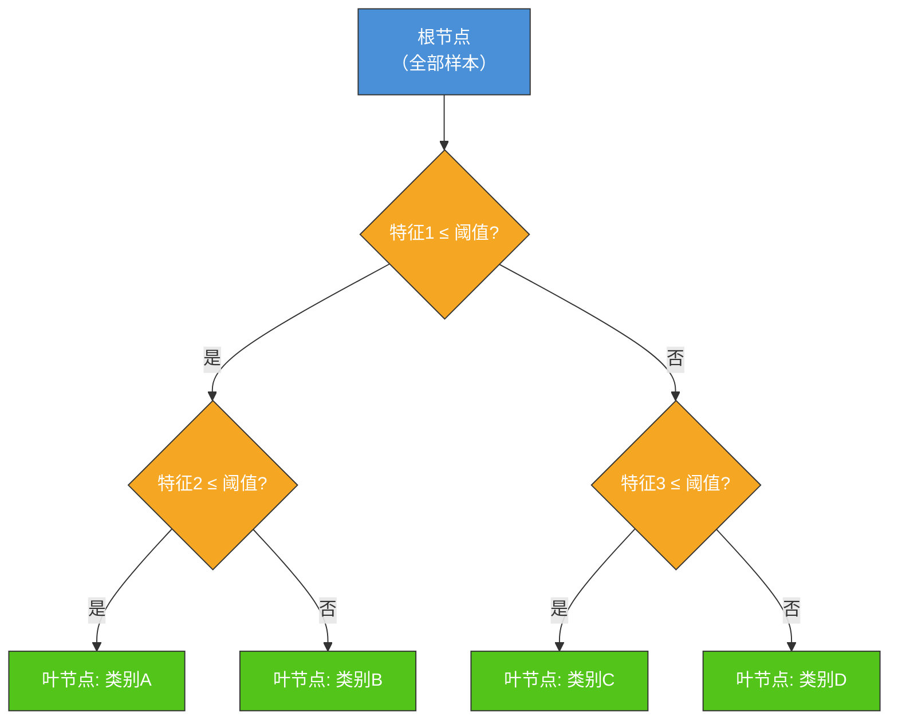
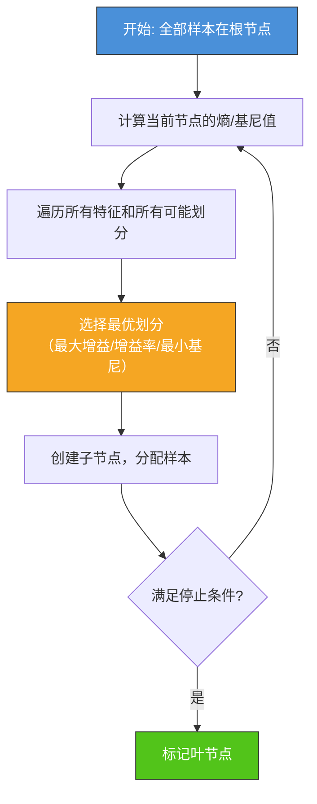
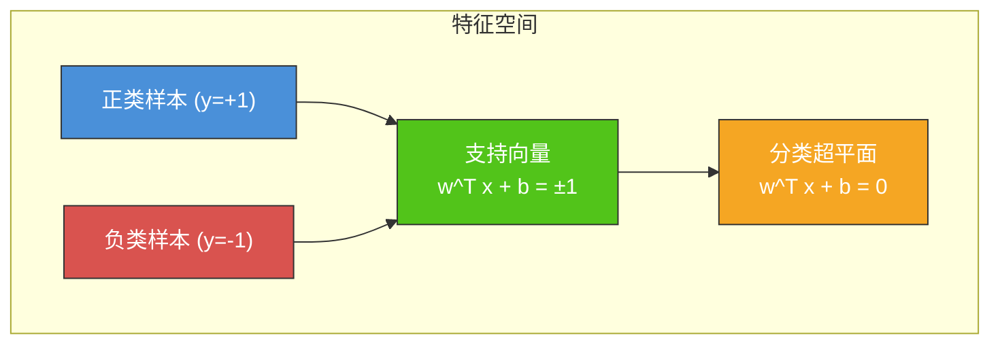
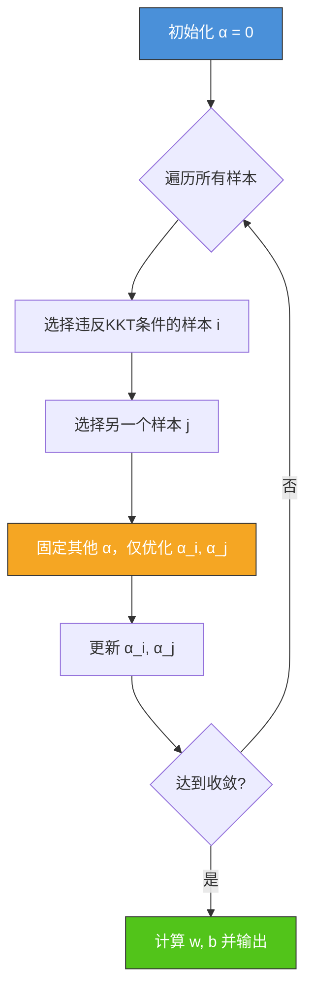
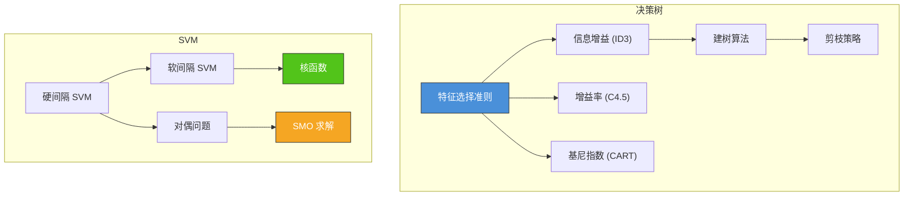

# 4.3 决策树与SVM

## 📌 基本概念

### 什么是决策树

决策树（Decision Tree）是一种基于**树形结构**的分类与回归算法。它通过在每个节点上对特征进行判断，将样本逐步划分到不同的叶节点，每个叶节点对应一个预测结果。



### 决策树学习的核心问题

1. **特征选择**：每个节点应该选择哪个特征进行划分？
2. **树的深度**：什么时候停止分裂？
3. **剪枝**：如何避免过拟合？

## 🌲 决策树特征选择准则

### 信息熵（Entropy）

信息熵衡量数据的**纯度**。设数据集 $S$ 中共有 $C$ 类，第 $k$ 类样本数为 $|S_k|$：

$$\text{Entropy}(S) = -\sum_{k=1}^{C} \frac{|S_k|}{|S|} \log_2 \frac{|S_k|}{|S|}$$

- 熵越大 → 数据越混乱
- 熵为 0 → 数据完全纯净（所有样本同一类）

### 信息增益（Information Gain）— ID3

**信息增益**表示通过划分带来的熵减少量：

$$\text{Gain}(S, A) = \text{Entropy}(S) - \sum_{v \in \text{Values}(A)} \frac{|S_v|}{|S|} \text{Entropy}(S_v)$$

其中 $A$ 为选定特征，$\text{Values}(A)$ 是特征 $A$ 的所有可能取值，$S_v$ 是特征 $A$ 取值为 $v$ 的子集。

**选择标准**：选择使 $\text{Gain}(S, A)$ 最大的特征。

> [!example] 信息增益计算示例
> 
> 数据集 $S$：14 个样本，9 个正类，5 个负类
> $\text{Entropy}(S) = -\frac{9}{14}\log_2\frac{9}{14} - \frac{5}{14}\log_2\frac{5}{14} \approx 0.940$
> 
> 特征"天气"有 3 个取值：晴、阴、雨
> - 晴：5 个样本（2 正 3 负），熵 $\approx 0.971$
> - 阴：4 个样本（4 正 0 负），熵 $= 0$
> - 雨：5 个样本（3 正 2 负），熵 $\approx 0.971$
> 
> $\text{Gain}(S, \text{天气}) = 0.940 - \left(\frac{5}{14} \times 0.971 + \frac{4}{14} \times 0 + \frac{5}{14} \times 0.971\right) \approx 0.247$

### 增益率（Gain Ratio）— C4.5

信息增益偏向于选择**取值多的特征**。C4.5 算法引入**增益率**来修正这种偏差：

$$\text{GainRatio}(S, A) = \frac{\text{Gain}(S, A)}{\text{SplitInfo}(S, A)}$$

$$\text{SplitInfo}(S, A) = -\sum_{v \in \text{Values}(A)} \frac{|S_v|}{|S|} \log_2 \frac{|S_v|}{|S|}$$

**选择标准**：选择使 $\text{GainRatio}(S, A)$ 最大的特征。

### 基尼指数（Gini Index）— CART

基尼指数衡量数据的**不纯度**：

$$\text{Gini}(S) = 1 - \sum_{k=1}^{C} \left(\frac{|S_k|}{|S|}\right)^2$$

特征 $A$ 的基尼指数：

$$\text{Gini}(S, A) = \sum_{v \in \text{Values}(A)} \frac{|S_v|}{|S|} \text{Gini}(S_v)$$

**选择标准**：选择使 $\text{Gini}(S, A)$ 最小的特征。

> [!note] 熵 vs 基尼指数
> - 熵：基于信息论，衡量不确定性
> - 基尼：基于概率，衡量不纯度
> - 两者趋势一致，基尼计算更简单（无需对数）

### 三种算法对比

| 算法 | 准则 | 公式 | 偏向性 |
|------|------|------|--------|
| **ID3** | 信息增益 | $\text{Gain} = H(S) - \sum\frac{|S_v|}{|S|}H(S_v)$ | 偏向取值多的特征 |
| **C4.5** | 增益率 | $\text{GainRatio} = \frac{\text{Gain}}{\text{SplitInfo}}$ | 修正了偏向性 |
| **CART** | 基尼指数 | $\text{Gini} = 1 - \sum p_k^2$ | 无偏向，计算简单 |

## 🌳 决策树生成与剪枝

### 建树算法



### 停止条件

1. 当前节点所有样本属于同一类（纯度为 1）
2. 没有可用于划分的特征（特征用尽）
3. 节点样本数少于最小划分样本数
4. 树的深度达到最大值

### 剪枝策略

#### 预剪枝（Pre-pruning）
在树的生成过程中提前停止，防止过拟合。

- 限制树的最大深度
- 限制每个节点的最少样本数
- 信息增益必须大于阈值

#### 后剪枝（Post-pruning）
先生成完整的树，然后自底向上合并子树。

- **错误率降低剪枝（REP）**：用验证集评估，若剪枝后错误率不升则剪枝
- **代价复杂度剪枝（CCP）**：在树的复杂度和准确率之间权衡，引入惩罚项 $\alpha \cdot |T|$

## 💻 Python 实现：决策树

```python
import numpy as np
from collections import Counter

class TreeNode:
    def __init__(self, feature=None, threshold=None, left=None, right=None, value=None):
        self.feature = feature
        self.threshold = threshold
        self.left = left
        self.right = right
        self.value = value

def gini_index(y):
    m = len(y)
    if m == 0:
        return 0
    counter = Counter(y)
    gini = 1.0
    for count in counter.values():
        prob = count / m
        gini -= prob ** 2
    return gini

def entropy(y):
    m = len(y)
    if m == 0:
        return 0
    counter = Counter(y)
    ent = 0.0
    for count in counter.values():
        prob = count / m
        ent -= prob * np.log2(prob) if prob > 0 else 0
    return ent

def best_split(X, y, criterion='gini'):
    m, n = X.shape
    best_score = float('inf')
    best_feature = None
    best_threshold = None

    for feature in range(n):
        thresholds = np.unique(X[:, feature])
        for threshold in thresholds:
            left_mask = X[:, feature] <= threshold
            right_mask = ~left_mask
            left_y = y[left_mask]
            right_y = y[right_mask]

            if len(left_y) == 0 or len(right_y) == 0:
                continue

            if criterion == 'gini':
                score = (len(left_y) * gini_index(left_y) +
                         len(right_y) * gini_index(right_y)) / m
            elif criterion == 'entropy':
                score = (len(left_y) * entropy(left_y) +
                         len(right_y) * entropy(right_y)) / m

            if score < best_score:
                best_score = score
                best_feature = feature
                best_threshold = threshold

    return best_feature, best_threshold

def build_tree(X, y, depth=0, max_depth=5, criterion='gini'):
    if len(np.unique(y)) == 1 or depth >= max_depth:
        leaf_value = Counter(y).most_common(1)[0][0]
        return TreeNode(value=leaf_value)

    feature, threshold = best_split(X, y, criterion)
    if feature is None:
        leaf_value = Counter(y).most_common(1)[0][0]
        return TreeNode(value=leaf_value)

    left_mask = X[:, feature] <= threshold
    right_mask = ~left_mask

    left = build_tree(X[left_mask], y[left_mask], depth + 1, max_depth, criterion)
    right = build_tree(X[right_mask], y[right_mask], depth + 1, max_depth, criterion)

    return TreeNode(feature=feature, threshold=threshold, left=left, right=right)

def predict_one(tree, x):
    if tree.value is not None:
        return tree.value
    if x[tree.feature] <= tree.threshold:
        return predict_one(tree.left, x)
    else:
        return predict_one(tree.right, x)

def predict(tree, X):
    return np.array([predict_one(tree, x) for x in X])

np.random.seed(42)
X = np.random.randn(200, 3)
true_w = np.array([1.0, -1.5, 0.5])
y = (X @ true_w + 0.5 > 0).astype(int)

X_train, X_test = X[:150], X[150:]
y_train, y_test = y[:150], y[150:]

print("=== 基尼指数决策树 ===")
tree_gini = build_tree(X_train, y_train, max_depth=5, criterion='gini')
y_pred_gini = predict(tree_gini, X_test)
acc_gini = np.mean(y_pred_gini == y_test)
print(f"测试准确率: {acc_gini:.4f}")

print("\n=== 信息熵决策树 ===")
tree_ent = build_tree(X_train, y_train, max_depth=5, criterion='entropy')
y_pred_ent = predict(tree_ent, X_test)
acc_ent = np.mean(y_pred_ent == y_test)
print(f"测试准确率: {acc_ent:.4f}")
```

## 🛡️ 支持向量机（SVM）

### SVM 基本思想

支持向量机（Support Vector Machine, SVM）的核心思想是：找到一个**最大间隔超平面**，使不同类别样本到该超平面的**间隔最大**。



### 硬间隔 SVM

#### 原始问题

给定训练集 $\{(\mathbf{x}_i, y_i)\}_{i=1}^m$，$y_i \in \{-1, +1\}$，分类超平面为 $\mathbf{w}^T \mathbf{x} + b = 0$。

**间隔最大化**等价于最小化 $\frac{1}{2}\|\mathbf{w}\|^2$：

$$\min_{\mathbf{w}, b} \frac{1}{2}\|\mathbf{w}\|^2$$

$$s.t. \quad y_i(\mathbf{w}^T \mathbf{x}_i + b) \geq 1, \quad i = 1, 2, \ldots, m$$

> [!tip] 间隔最大化的推导
> 
> 超平面 $\mathbf{w}^T \mathbf{x} + b = 0$ 两侧的支持向量平面为 $\mathbf{w}^T \mathbf{x} + b = \pm 1$。
> 
> 两平面间的距离（间隔）为 $\frac{2}{\|\mathbf{w}\|}$。
> 
> 最大化间隔 $\Leftrightarrow$ 最小化 $\|\mathbf{w}\|$ $\Leftrightarrow$ 最小化 $\frac{1}{2}\|\mathbf{w}\|^2$（便于求导）。

#### 对偶问题

使用拉格朗日对偶性，原始问题的对偶形式为：

$$\max_{\alpha} \quad W(\alpha) = \sum_{i=1}^{m} \alpha_i - \frac{1}{2}\sum_{i=1}^{m}\sum_{j=1}^{m} \alpha_i \alpha_j y_i y_j \mathbf{x}_i^T \mathbf{x}_j$$

$$s.t. \quad \sum_{i=1}^{m} \alpha_i y_i = 0, \quad \alpha_i \geq 0, \quad i = 1, 2, \ldots, m$$

**求解后**：
- $\mathbf{w}^* = \sum_{i=1}^{m} \alpha_i^* y_i \mathbf{x}_i$（仅支持向量 $\alpha_i > 0$ 贡献）
- $b^*$ 可由任一支持向量求得

**分类决策函数**：

$$f(\mathbf{x}) = \text{sign}\left(\sum_{i=1}^{m} \alpha_i^* y_i \mathbf{x}_i^T \mathbf{x} + b^*\right)$$

### 软间隔 SVM

实际数据中可能存在噪声和异常点，硬间隔要求所有样本严格满足约束。软间隔引入**松弛变量** $\xi_i \geq 0$：

$$\min_{\mathbf{w}, b, \xi} \frac{1}{2}\|\mathbf{w}\|^2 + C \sum_{i=1}^{m} \xi_i$$

$$s.t. \quad y_i(\mathbf{w}^T \mathbf{x}_i + b) \geq 1 - \xi_i, \quad \xi_i \geq 0$$

其中 $C > 0$ 为**惩罚参数**，平衡间隔最大化和训练误差最小化：
- $C$ 大：更重视训练误差，可能过拟合
- $C$ 小：更重视间隔，允许更大误差，可能欠拟合

**对偶问题形式**（与硬间隔相同，约束变化）：

$$\max_{\alpha} \quad W(\alpha) = \sum_{i=1}^{m} \alpha_i - \frac{1}{2}\sum_{i=1}^{m}\sum_{j=1}^{m} \alpha_i \alpha_j y_i y_j \mathbf{x}_i^T \mathbf{x}_j$$

$$s.t. \quad \sum_{i=1}^{m} \alpha_i y_i = 0, \quad 0 \leq \alpha_i \leq C, \quad i = 1, 2, \ldots, m$$

### 核函数

#### 核技巧

当数据**线性不可分时**，SVM 通过核函数将输入映射到**高维特征空间**，使数据在高维空间中线性可分。

**核函数定义**：

$$K(\mathbf{x}_i, \mathbf{x}_j) = \phi(\mathbf{x}_i)^T \phi(\mathbf{x}_j)$$

其中 $\phi(\mathbf{x})$ 是从输入空间到特征空间的映射。

> [!note] 核技巧的优势
> 不需要显式计算 $\phi(\mathbf{x})$，直接用核函数 $K$ 替代内积 $\mathbf{x}_i^T \mathbf{x}_j$，避免了高维空间的维度灾难。

#### 常用核函数

| 核函数 | 公式 | 适用场景 |
|--------|------|---------|
| **线性核** | $K(\mathbf{x}_i, \mathbf{x}_j) = \mathbf{x}_i^T \mathbf{x}_j$ | 线性可分，特征已足够好 |
| **多项式核** | $K(\mathbf{x}_i, \mathbf{x}_j) = (\mathbf{x}_i^T \mathbf{x}_j + c)^d$ | 特定结构数据 |
| **高斯核/RBF核** | $K(\mathbf{x}_i, \mathbf{x}_j) = \exp(-\gamma\|\mathbf{x}_i - \mathbf{x}_j\|^2)$ | 通用，非线性，γ 控制宽度 |
| **Sigmoid核** | $K(\mathbf{x}_i, \mathbf{x}_j) = \tanh(\mathbf{x}_i^T \mathbf{x}_j + c)$ | 类似神经网络 |

### SVM 对偶问题求解：SMO 算法

序列最小优化（Sequential Minimal Optimization, SMO）是求解 SVM 对偶问题的高效算法。

**核心思想**：每次仅优化两个变量 $\alpha_i, \alpha_j$，固定其他变量，将复杂优化问题转化为简单的二次规划问题。



### Python 实现：简化 SVM（使用 sklearn 风格接口）

```python
import numpy as np

class SimpleSVM:
    def __init__(self, C=1.0, kernel='linear', gamma='scale', max_iter=1000):
        self.C = C
        self.kernel = kernel
        self.gamma = gamma
        self.max_iter = max_iter
        self.alphas = None
        self.b = None
        self.X = None
        self.y = None

    def _compute_kernel(self, X1, X2):
        if self.kernel == 'linear':
            return X1 @ X2.T
        elif self.kernel == 'rbf':
            if self.gamma == 'scale':
                gamma_val = 1.0 / (X1.shape[1] * X1.var())
            else:
                gamma_val = self.gamma
            X1_sq = np.sum(X1 ** 2, axis=1).reshape(-1, 1)
            X2_sq = np.sum(X2 ** 2, axis=1).reshape(1, -1)
            dist = X1_sq + X2_sq - 2 * X1 @ X2.T
            return np.exp(-gamma_val * np.maximum(dist, 0))

    def fit(self, X, y):
        m = len(y)
        self.X = X
        self.y = y.astype(float)
        self.alphas = np.zeros(m)
        self.b = 0.0
        K = self._compute_kernel(X, X)

        for _ in range(self.max_iter):
            num_changed = 0
            for i in range(m):
                Ei = self._decision_one(X[i], K) - y[i]
                if (y[i] * Ei < -0.01 and self.alphas[i] < self.C) or \
                   (y[i] * Ei > 0.01 and self.alphas[i] > 0):
                    j = np.random.choice([k for k in range(m) if k != i])
                    Ej = self._decision_one(X[j], K) - y[j]

                    ai_old, aj_old = self.alphas[i], self.alphas[j]

                    if y[i] != y[j]:
                        L = max(0, aj_old - ai_old)
                        H = min(self.C, self.C + aj_old - ai_old)
                    else:
                        L = max(0, ai_old + aj_old - self.C)
                        H = min(self.C, ai_old + aj_old)

                    if L == H:
                        continue

                    eta = 2 * K[i, j] - K[i, i] - K[j, j]
                    if eta >= 0:
                        continue

                    aj_new = aj_old - y[j] * (Ei - Ej) / eta
                    aj_new = np.clip(aj_new, L, H)

                    if abs(aj_new - aj_old) < 1e-5:
                        continue

                    ai_new = ai_old + y[i] * y[j] * (aj_old - aj_new)

                    b1 = self.b - Ei - y[i] * (ai_new - ai_old) * K[i, i] \
                         - y[j] * (aj_new - aj_old) * K[i, j]
                    b2 = self.b - Ej - y[i] * (ai_new - ai_old) * K[i, j] \
                         - y[j] * (aj_new - aj_old) * K[j, j]

                    if 0 < ai_new < self.C:
                        self.b = b1
                    elif 0 < aj_new < self.C:
                        self.b = b2
                    else:
                        self.b = (b1 + b2) / 2

                    self.alphas[i] = ai_new
                    self.alphas[j] = aj_new
                    num_changed += 1

            if num_changed == 0:
                break

    def _decision_one(self, x, K=None):
        if K is None:
            K = self._compute_kernel(self.X, self.X)
        return np.sum(self.alphas * self.y * K[:, np.where(self.X == x)[0][0]]) + self.b

    def predict(self, X):
        K = self._compute_kernel(X, self.X)
        scores = K @ (self.alphas * self.y) + self.b
        return np.sign(scores).astype(int)

np.random.seed(42)
X = np.random.randn(100, 2)
y = (X[:, 0] + X[:, 1] > 0).astype(int)
y[y == 0] = -1

X_train, X_test = X[:70], X[70:]
y_train, y_test = y[:70], y[70:]

print("=== 线性核 SVM ===")
svm_linear = SimpleSVM(C=1.0, kernel='linear', max_iter=500)
svm_linear.fit(X_train, y_train)
y_pred = svm_linear.predict(X_test)
acc = np.mean(y_pred == y_test)
print(f"测试准确率: {acc:.4f}")

print("\n=== RBF核 SVM ===")
svm_rbf = SimpleSVM(C=1.0, kernel='rbf', max_iter=500)
svm_rbf.fit(X_train, y_train)
y_pred_rbf = svm_rbf.predict(X_test)
acc_rbf = np.mean(y_pred_rbf == y_test)
print(f"测试准确率: {acc_rbf:.4f}")
```

## 📊 知识结构图



## 🌍 实际应用

### 决策树应用
- **医疗诊断**：根据症状、检查结果构建诊断决策树
- **信贷审批**：根据申请人信息（收入、信用分等）决定是否批准
- **客户流失预测**：识别可能流失的客户群体

### SVM 应用
- **图像分类**：在特征提取后使用 SVM 进行分类（传统 CV 方法）
- **文本分类**：使用 TF-IDF 特征 + 线性 SVM 进行垃圾邮件检测
- **生物信息学**：基因表达数据分类（高维小样本场景 SVM 表现优异）
- **人脸识别**：基于核方法的人脸相似度度量

## ⚠️ 注意事项

### 决策树
1. **过拟合风险**：树太深容易过拟合，需剪枝或限制深度
2. **特征尺度**：树模型对特征尺度不敏感，但对特征取值分布敏感
3. **不稳定性**：数据微小变化可能产生完全不同的树结构
4. **回归扩展**：CART 可用于回归（叶节点输出平均值，准则用 MSE）

### SVM
1. **数据预处理**：SVM 对特征尺度敏感，必须进行标准化/归一化
2. **核函数选择**：RBF 核通常是不错的起点，线性核适用于高维稀疏数据
3. **参数调优**：$C$ 和 $\gamma$ 需要通过交叉验证调优
4. **大规模数据**：SVM 的对偶问题复杂度为 $O(m^2)$，大数据集需要采样或使用线性 SVM

## 💡 考点总结

### 决策树
1. **信息熵/基尼指数**：定义、公式、计算过程
2. **信息增益 vs 增益率**：理解增益率如何修正信息增益的偏向性
3. **三种算法对比**：ID3、C4.5、CART 的特征选择准则差异
4. **剪枝策略**：预剪枝和后剪枝的对比

### SVM
1. **最大间隔思想**：$\frac{2}{\|\mathbf{w}\|}$ 间隔的几何推导
2. **原始问题到对偶问题**：拉格朗日函数的构造与推导
3. **硬间隔 vs 软间隔**：松弛变量和惩罚参数 $C$ 的作用
4. **核技巧**：核函数的定义、常见核函数及其适用场景
5. **SMO 算法**：基本思想（两变量优化）和收敛条件
6. **支持向量**：只有 $\alpha_i > 0$ 的样本影响决策，体现稀疏性