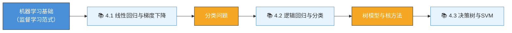

# 第4章 机器学习基础 — 目录总览 (MOC)

> [!info] 章节概览
> 机器学习是人工智能的核心实现手段。本章从最基础的线性回归和梯度下降出发，逐步讲解逻辑回归、决策树和支持向量机等经典监督学习算法，为后续深度学习和无监督学习奠定数学与直觉基础。

## 🗺️ 学习路线图

## 📖 章节内容

### 4.1 线性回归与梯度下降
- [[4.1-线性回归与梯度下降]]
- 单变量线性回归与多元线性回归
- 损失函数：均方误差（MSE）与最小二乘法
- 梯度下降原理：BGD、SGD、MBGD
- 学习率选择与收敛性分析
- 正规方程（Normal Equation）

### 4.2 逻辑回归与分类
- [[4.2-逻辑回归与分类]]
- Sigmoid 函数与逻辑回归模型
- 交叉熵损失函数推导
- 二元分类与多分类策略（OvR、Softmax）
- 梯度下降求解逻辑回归参数
- 分类评价指标（准确率、精确率、召回率、F1）

### 4.3 决策树与SVM
- [[4.3-决策树与SVM]]
- 决策树特征选择：信息增益（ID3）、增益率（C4.5）、基尼指数（CART）
- 决策树生成与剪枝
- 支持向量机：硬间隔与软间隔
- 核函数与核技巧
- SMO 算法思想

## 🎯 核心考点

| 考点 | 重要程度 | 常考形式 |
|------|---------|---------|
| 梯度下降推导与实现 | ⭐⭐⭐⭐⭐ | 计算题、代码题 |
| 线性回归损失函数推导 | ⭐⭐⭐⭐ | 计算题、简答题 |
| 逻辑回归 sigmoid 与交叉熵 | ⭐⭐⭐⭐⭐ | 计算题、证明题 |
| 决策树特征选择准则对比 | ⭐⭐⭐⭐⭐ | 简答题、计算题 |
| SVM 对偶问题推导 | ⭐⭐⭐⭐ | 证明题、计算题 |
| 核函数的理解与选择 | ⭐⭐⭐ | 简答题 |
| 分类评价指标计算 | ⭐⭐⭐⭐ | 计算题 |

## 📝 自测题

1. **计算题**：给定数据集 $\{(1,2), (2,4), (3,6), (4,8)\}$，使用最小二乘法拟合线性回归模型 $y = wx + b$，求解 $w$ 和 $b$。
2. **证明题**：推导逻辑回归中使用交叉熵损失函数时，梯度下降的参数更新公式。
3. **计算题**：给定特征 $A$ 的取值将数据集分为三组，各组信息熵分别为 $H(0.3, 0.7)$、$H(0.6, 0.4)$、$H(0.8, 0.2)$，计算条件熵 $H(Y|A)$ 和信息增益。
4. **证明题**：推导硬间隔 SVM 的原始问题形式：$\min_{\mathbf{w}} \frac{1}{2}\|\mathbf{w}\|^2 \quad s.t. \quad y_i(\mathbf{w}^T\mathbf{x}_i + b) \geq 1$
5. **应用题**：某电商平台需要对用户评论进行情感分类（正面/负面），请选择合适的机器学习算法并说明理由。若数据量为 10 万条带标注数据，如何设计训练流程？

## 🔗 关联知识点

- [[第3章-逻辑推理与谓词逻辑]] → 逻辑推理与机器学习中的归纳逻辑
- [[第5章-无监督与半监督学习]] → 聚类、PCA、EM 算法
- [[第6章-深度学习]] → 神经网络与反向传播
- [[第7章-强化学习]] → 动态规划与 MDP 中的梯度方法