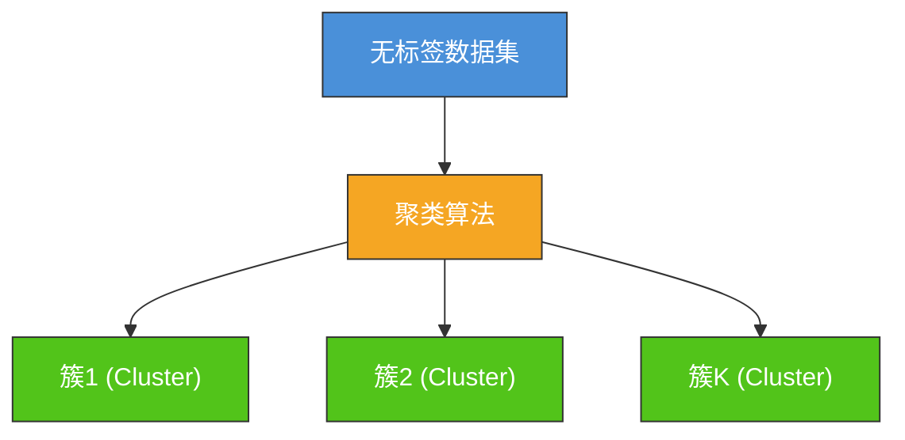
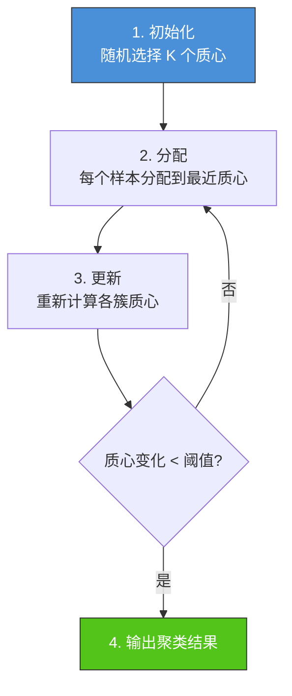
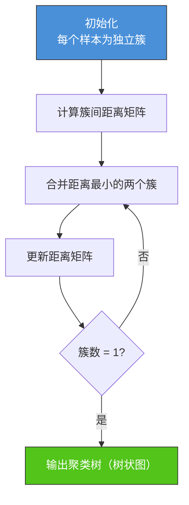
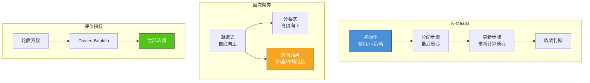

# 5.1 K-Means与层次聚类

## 📌 基本概念

### 什么是聚类

聚类（Clustering）是**无监督学习**的核心任务之一，其目标是将数据集中的样本按相似性分组，使得**同组内样本尽可能相似，不同组间样本尽可能不同**。

与分类不同，聚类**不依赖标签数据**，而是直接发现数据的内在结构。



### 距离度量

聚类算法的核心是**相似性度量**。常用距离度量：

| 度量 | 公式 | 适用场景 |
|------|------|---------|
| **欧氏距离** | $d(\mathbf{x}, \mathbf{y}) = \sqrt{\sum (x_i - y_i)^2}$ | 数值型特征，各维度量纲一致 |
| **曼哈顿距离** | $d(\mathbf{x}, \mathbf{y}) = \sum |x_i - y_i|$ | 网格路径，对异常值不敏感 |
| **余弦相似度** | $\cos(\mathbf{x}, \mathbf{y}) = \frac{\mathbf{x} \cdot \mathbf{y}}{\|\mathbf{x}\|\|\mathbf{y}\|}$ | 文本/稀疏特征，关注方向 |
| **马氏距离** | $d(\mathbf{x}, \mathbf{y}) = \sqrt{(\mathbf{x}-\mathbf{y})^T \Sigma^{-1}(\mathbf{x}-\mathbf{y})}$ | 特征相关，考虑协方差 |

## 🎯 K-Means 算法

### 算法原理

K-Means 是最经典的**划分式聚类**算法，目标是将 $m$ 个数据点划分为 $K$ 个簇，使每个数据点到其所属簇质心的距离平方和最小。

### 目标函数

$$J = \sum_{k=1}^{K} \sum_{\mathbf{x} \in C_k} \|\mathbf{x} - \boldsymbol{\mu}_k\|^2$$

其中 $C_k$ 是第 $k$ 个簇，$\boldsymbol{\mu}_k$ 是该簇的质心。

### 算法步骤



**详细步骤**：

1. **初始化**：随机选择 $K$ 个数据点作为初始质心 $\boldsymbol{\mu}_1, \boldsymbol{\mu}_2, \ldots, \boldsymbol{\mu}_K$
2. **分配**：对每个样本 $\mathbf{x}_i$，将其分配到距离最近的质心：
   $$c_i = \arg\min_k \|\mathbf{x}_i - \boldsymbol{\mu}_k\|^2$$
3. **更新质心**：重新计算每个簇的质心为簇内样本均值：
   $$\boldsymbol{\mu}_k = \frac{1}{|C_k|} \sum_{\mathbf{x} \in C_k} \mathbf{x}$$
4. **判断收敛**：若质心变化小于阈值或达到最大迭代次数，返回结果；否则回到步骤 2。

### 收敛性分析

K-Means 的每一步都使目标函数 $J$ 单调递减：
- **分配步骤**：固定质心，将样本分配到最近质心 → $J$ 减小
- **更新步骤**：固定分配，用均值替代质心 → $J$ 减小

由于 $J \geq 0$（有下界），算法**必定收敛**。但可能收敛到**局部最优**而非全局最优。

### Python 实现：K-Means

```python
import numpy as np
import matplotlib.pyplot as plt

class KMeans:
    def __init__(self, n_clusters=3, max_iter=300, tol=1e-4, random_state=42):
        self.n_clusters = n_clusters
        self.max_iter = max_iter
        self.tol = tol
        self.random_state = random_state

    def fit(self, X):
        np.random.seed(self.random_state)
        m = X.shape[0]
        self.centroids = X[np.random.choice(m, self.n_clusters, replace=False)]

        for i in range(self.max_iter):
            distances = np.linalg.norm(X[:, np.newaxis] - self.centroids, axis=2)
            self.labels = np.argmin(distances, axis=1)

            new_centroids = np.zeros_like(self.centroids)
            for k in range(self.n_clusters):
                cluster_points = X[self.labels == k]
                if len(cluster_points) > 0:
                    new_centroids[k] = cluster_points.mean(axis=0)

            shift = np.linalg.norm(self.centroids - new_centroids)
            if shift < self.tol:
                print(f"在第 {i+1} 轮收敛")
                break
            self.centroids = new_centroids

        return self

    def predict(self, X):
        distances = np.linalg.norm(X[:, np.newaxis] - self.centroids, axis=2)
        return np.argmin(distances, axis=1)

    def inertia(self, X):
        distances = np.linalg.norm(X - self.centroids[self.labels], axis=1)
        return np.sum(distances ** 2)

np.random.seed(42)
X = np.vstack([
    np.random.randn(100, 2) + np.array([2, 2]),
    np.random.randn(100, 2) + np.array([-2, 2]),
    np.random.randn(100, 2) + np.array([0, -3])
])

kmeans = KMeans(n_clusters=3)
kmeans.fit(X)

colors = ['#4a90d9', '#f5a623', '#52c41a']
plt.figure(figsize=(10, 8))
for k in range(3):
    mask = kmeans.labels == k
    plt.scatter(X[mask, 0], X[mask, 1], c=colors[k], label=f'簇 {k+1}', alpha=0.6)
plt.scatter(kmeans.centroids[:, 0], kmeans.centroids[:, 1],
            c='red', marker='X', s=200, label='质心', edgecolors='k')
plt.legend()
plt.title('K-Means 聚类结果')
plt.show()
```

### K-Means++ 初始化

K-Means 的聚类结果**强烈依赖初始质心**。K-Means++ 算法通过改进初始化策略来缓解这一问题。

**初始化步骤**：
1. 从数据集中**随机选择**第一个质心
2. 对每个样本 $\mathbf{x}_i$，计算其到**已有质心的最短距离**的平方 $D(\mathbf{x}_i)^2$
3. 按概率 $\frac{D(\mathbf{x}_i)^2}{\sum D(\mathbf{x}_j)^2}$ 选择下一个质心
4. 重复步骤 2-3 直到选出 $K$ 个质心

```python
def kmeans_plus_plus_init(X, n_clusters):
    m = X.shape[0]
    centroids = [X[np.random.randint(m)]]
    for _ in range(1, n_clusters):
        distances = np.min(
            np.linalg.norm(X[:, np.newaxis] - np.array(centroids), axis=2),
            axis=1
        ) ** 2
        probs = distances / distances.sum()
        next_centroid = X[np.random.choice(m, p=probs)]
        centroids.append(next_centroid)
    return np.array(centroids)
```

## 🌲 层次聚类

### 基本思想

层次聚类（Hierarchical Clustering）构建样本的**层次聚类树**，不需要预先指定簇数。

### 两种策略

#### 凝聚式（自底向上，Agglomerative）
- 初始：每个样本自成一个簇
- 步骤：每次**合并**最相似的两个簇
- 终止：所有样本合并为一个簇

#### 分裂式（自顶向下，Divisive）
- 初始：所有样本在一个簇
- 步骤：每次**分裂**最不相似的簇
- 终止：每个样本自成一个簇

### 簇间距离度量

| 方法 | 公式 | 特点 |
|------|------|------|
| **单链接（Single Linkage）** | $d(C_i, C_j) = \min_{\mathbf{a} \in C_i, \mathbf{b} \in C_j} \|\mathbf{a} - \mathbf{b}\|$ | 链式效应，可能产生"长链" |
| **全链接（Complete Linkage）** | $d(C_i, C_j) = \max_{\mathbf{a} \in C_i, \mathbf{b} \in C_j} \|\mathbf{a} - \mathbf{b}\|$ | 避免链式，簇更紧凑 |
| **平均链接（Average Linkage）** | $d(C_i, C_j) = \frac{1}{|C_i||C_j|}\sum_{\mathbf{a} \in C_i, \mathbf{b} \in C_j} \|\mathbf{a} - \mathbf{b}\|$ | 折中方案 |
| **质心距离（Centroid Linkage）** | $d(C_i, C_j) = \|\boldsymbol{\mu}_i - \boldsymbol{\mu}_j\|$ | 质心间距离 |

### 凝聚式层次聚类算法



### Python 实现：层次聚类

```python
def hierarchical_clustering(X, n_clusters=3, linkage='single'):
    m = X.shape[0]
    clusters = [[i] for i in range(m)]
    cluster_data = {i: X[i:i+1] for i in range(m)}

    while len(clusters) > n_clusters:
        min_dist = float('inf')
        merge_i, merge_j = -1, -1

        for i in range(len(clusters)):
            for j in range(i + 1, len(clusters)):
                Ci, Cj = cluster_data[clusters[i][0]], cluster_data[clusters[j][0]]

                if linkage == 'single':
                    dist = np.min(np.linalg.norm(Ci[:, np.newaxis] - Cj, axis=2))
                elif linkage == 'complete':
                    dist = np.max(np.linalg.norm(Ci[:, np.newaxis] - Cj, axis=2))
                elif linkage == 'average':
                    dist = np.mean(np.linalg.norm(Ci[:, np.newaxis] - Cj, axis=2))

                if dist < min_dist:
                    min_dist = dist
                    merge_i, merge_j = i, j

        new_cluster = clusters[merge_i] + clusters[merge_j]
        new_data = np.vstack([
            cluster_data[clusters[merge_i][0]],
            cluster_data[clusters[merge_j][0]]
        ])

        new_label = max(cluster_data.keys()) + 1
        cluster_data[new_label] = new_data
        clusters = [c for idx, c in enumerate(clusters) if idx not in (merge_i, merge_j)]
        clusters.append([new_label])

    labels = np.zeros(m, dtype=int)
    for cluster_id, cluster in enumerate(clusters):
        for idx in cluster_data[cluster[0]]:
            if idx < m:
                labels[idx] = cluster_id

    return labels

np.random.seed(42)
X = np.vstack([
    np.random.randn(50, 2) + np.array([3, 3]),
    np.random.randn(50, 2) + np.array([-3, 3]),
    np.random.randn(50, 2) + np.array([0, -3])
])

print("=== 凝聚式层次聚类（单链接）===")
labels_single = hierarchical_clustering(X, n_clusters=3, linkage='single')
print(f"聚类结果: {labels_single}")
```

## 📊 聚类评价指标

### 轮廓系数（Silhouette Score）

轮廓系数衡量样本的**聚类紧密性和分离性**：

$$s(i) = \frac{b(i) - a(i)}{\max\{a(i), b(i)\}}$$

其中：
- $a(i)$：样本 $i$ 与**同簇其他样本**的平均距离
- $b(i)$：样本 $i$ 与**最近邻簇样本**的平均距离

- $s(i) > 0$：聚类合理（$b > a$，簇间分离好）
- $s(i) \approx 0$：样本在簇边界
- $s(i) < 0$：聚类不合理（可能分配到错误的簇）

### Davies-Bouldin 指数

$$DB = \frac{1}{K} \sum_{i=1}^{K} \max_{j \neq i} \frac{\text{avg}(C_i) + \text{avg}(C_j)}{d(\boldsymbol{\mu}_i, \boldsymbol{\mu}_j)}$$

其中 $\text{avg}(C_i)$ 是簇 $C_i$ 内样本到质心的平均距离。**DB 越小越好**。

### 肘部法则（Elbow Method）

通过绘制 $J$（簇内距离和）随 $K$ 的变化曲线，寻找**拐点**作为最佳 $K$ 值。

```python
def find_elbow(X, max_k=10):
    inertias = []
    K_range = range(1, max_k + 1)
    for k in K_range:
        km = KMeans(n_clusters=k)
        km.fit(X)
        inertias.append(km.inertia(X))

    plt.figure(figsize=(8, 5))
    plt.plot(K_range, inertias, 'bo-')
    plt.xlabel('K (簇数)')
    plt.ylabel('惯性 (Inertia)')
    plt.title('肘部法则确定最佳 K')
    plt.show()

find_elbow(X)
```

## 📊 知识结构图



## 🌍 实际应用

### 客户分群
根据消费行为数据将客户分为不同群体，用于精准营销和个性化推荐。

### 图像分割
在计算机视觉中，基于像素特征（颜色、纹理）将图像分割为不同区域。

### 异常检测
通过聚类识别远离任何簇的异常数据点（如信用卡欺诈检测）。

### 文档聚类
将海量文档按主题自动分组，用于信息检索和内容组织。

### 基因表达分析
在生物信息学中，聚类基因表达数据以发现共表达基因簇。

## ⚠️ 注意事项

### K-Means
1. **需指定 K**：必须预先设定簇数，实际中常通过肘部法则或轮廓系数确定
2. **对初始值敏感**：不同初始化可能得到不同结果，K-Means++ 可缓解
3. **对异常值敏感**：少量异常值可能显著影响质心位置
4. **仅适用于数值型数据**：无法直接处理非数值特征
5. **假设簇为凸形**：对于非凸形状的簇（如环形），K-Means 表现差

### 层次聚类
1. **计算复杂度高**：凝聚式 $O(m^3)$，分裂式 $O(m^2 \log m)$
2. **不可撤销**：合并操作不可逆，后续无法调整
3. **对噪声敏感**：噪声点可能导致不正确的合并

## 💡 考点总结

1. **K-Means 算法步骤**：初始化 → 分配 → 更新 → 收敛，完整描述
2. **收敛性证明**：目标函数单调递减且有下界 → 必收敛
3. **K-Means++ 初始化**：距离平方成比例的概率选择策略
4. **凝聚式层次聚类**：单/全/平均链接的区别和适用场景
5. **簇间距离度量**：四种链接方式的公式和特点
6. **聚类评价指标**：轮廓系数和 Davies-Bouldin 指数的计算
7. **K 的选择**：肘部法则的原理和实施方法