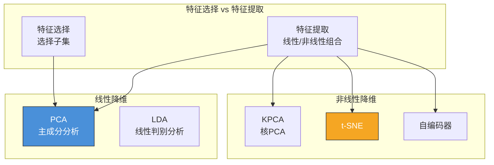
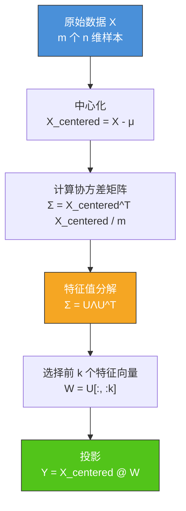
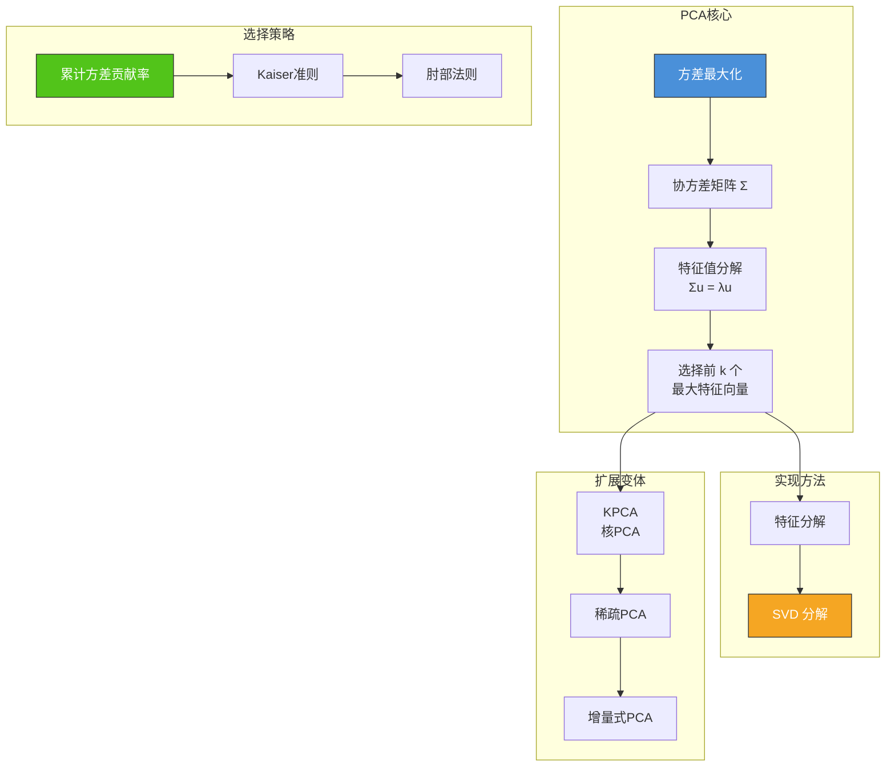

# 5.2 主成分分析PCA与降维

## 📌 基本概念

### 什么是降维

降维（Dimensionality Reduction）是将高维数据映射到低维空间的过程，旨在**保留数据的主要信息**的同时减少特征维度。

**降维的动机**：
- 解决**维度灾难**（Curse of Dimensionality）：高维空间中数据稀疏，算法性能下降
- **特征提取**：从原始特征中提取更有意义的表示
- **可视化**：将高维数据降到 2D/3D 便于观察
- **降噪**：去除数据中的噪声维度
- **加速训练**：减少特征数，提升模型效率

### 降维方法分类



## 📐 PCA 数学推导

### 核心思想

主成分分析（Principal Component Analysis, PCA）寻找数据中**方差最大的方向**，将原始数据投影到这些方向上，实现降维。

从两个角度理解：
1. **方差最大化**：投影后数据方差最大 → 保留最多信息
2. **最小平方误差**：投影到 $k$ 维子空间后重构误差最小

### 角度一：方差最大化

#### 问题定义

给定 $m$ 个 $n$ 维样本 $\{\mathbf{x}_i\}_{i=1}^m$，目标是找到一个**投影方向** $\mathbf{u}$（$\|\mathbf{u}\| = 1$），使投影后数据的方差最大。

#### 投影后的方差

设数据已中心化（$\sum \mathbf{x}_i = 0$），投影为 $y_i = \mathbf{u}^T \mathbf{x}_i$，则：

$$\text{Var}(y) = \frac{1}{m} \sum_{i=1}^{m} (y_i - \bar{y})^2 = \frac{1}{m} \sum_{i=1}^{m} (\mathbf{u}^T \mathbf{x}_i)^2$$

$$= \frac{1}{m} \sum_{i=1}^{m} \mathbf{u}^T \mathbf{x}_i \mathbf{x}_i^T \mathbf{u} = \mathbf{u}^T \left(\frac{1}{m} X^T X\right) \mathbf{u}$$

其中 $X = [\mathbf{x}_1, \mathbf{x}_2, \ldots, \mathbf{x}_m]^T \in \mathbb{R}^{m \times n}$。

#### 协方差矩阵

定义**协方差矩阵**（散布矩阵）：

$$\Sigma = \frac{1}{m} X^T X \in \mathbb{R}^{n \times n}$$

$\Sigma$ 是对称半正定矩阵，其元素 $\Sigma_{ij}$ 表示特征 $i$ 和特征 $j$ 的协方差。

#### 优化问题

$$\max_{\mathbf{u}} \quad \mathbf{u}^T \Sigma \mathbf{u} \quad s.t. \quad \|\mathbf{u}\| = 1$$

使用拉格朗日乘子法：

$$\mathcal{L} = \mathbf{u}^T \Sigma \mathbf{u} - \lambda(\mathbf{u}^T \mathbf{u} - 1)$$

对 $\mathbf{u}$ 求导并令其为零：

$$\frac{\partial \mathcal{L}}{\partial \mathbf{u}} = 2\Sigma \mathbf{u} - 2\lambda \mathbf{u} = 0$$

$$\Sigma \mathbf{u} = \lambda \mathbf{u}$$

> [!tip] 特征值分解
> 这说明 $\mathbf{u}$ 是 $\Sigma$ 的**特征向量**，$\lambda$ 是对应的**特征值**。要使 $\mathbf{u}^T \Sigma \mathbf{u} = \lambda$ 最大，应选择**最大特征值对应的特征向量**。

#### 推广到 $k$ 维

要投影到 $k$ 维子空间，需选择 $\Sigma$ 的 $k$ 个**最大特征值** $\lambda_1 \geq \lambda_2 \geq \ldots \geq \lambda_k$ 对应的特征向量 $\mathbf{u}_1, \mathbf{u}_2, \ldots, \mathbf{u}_k$。

投影矩阵为 $W = [\mathbf{u}_1, \mathbf{u}_2, \ldots, \mathbf{u}_k] \in \mathbb{R}^{n \times k}$，投影结果为：

$$Y = X W \in \mathbb{R}^{m \times k}$$

### 角度二：最小平方误差

将数据 $\mathbf{x}_i$ 投影到 $k$ 维子空间后，重构为 $\hat{\mathbf{x}}_i = W W^T \mathbf{x}_i$。重构误差为：

$$\min_{W} \quad \sum_{i=1}^{m} \|\mathbf{x}_i - \hat{\mathbf{x}}_i\|^2 = \sum_{i=1}^{m} \|\mathbf{x}_i - W W^T \mathbf{x}_i\|^2$$

$$= \sum_{i=1}^{m} \|\mathbf{x}_i\|^2 - \text{tr}(W^T X^T X W)$$

等价于最大化 $\text{tr}(W^T X^T X W) = \sum_{j=1}^{k} \lambda_j$，即选择最大的 $k$ 个特征值。

### 完整推导步骤



### SVD 实现

当数据维度 $n$ 很大时，直接对 $\Sigma \in \mathbb{R}^{n \times n}$ 做特征分解效率低。可以使用**奇异值分解（SVD）**替代：

$$X = U S V^T$$

其中 $U \in \mathbb{R}^{m \times m}$，$S \in \mathbb{R}^{m \times n}$（对角线上为奇异值），$V \in \mathbb{R}^{n \times n}$。

由于 $\Sigma = X^T X / m = V S^2 V^T / m$，$\Sigma$ 的特征向量就是 $V$ 的列向量，特征值为 $s_i^2 / m$。

投影矩阵 $W = V[:, :k]$，投影结果 $Y = X @ V[:, :k] = U[:, :k] @ S[:k, :k]$。

> [!tip] SVD vs 特征分解
> - SVD 更数值稳定，不需要计算协方差矩阵
> - 实际实现中通常使用 SVD（如 numpy.linalg.svd）

## 💻 Python 实现：PCA

```python
import numpy as np
import matplotlib.pyplot as plt

def pca_fit(X, k):
    """
    PCA 降维
    X: (m, n) 数据矩阵
    k: 目标维度
    """
    mean = np.mean(X, axis=0)
    X_centered = X - mean

    covariance_matrix = np.cov(X_centered, rowvar=False)

    eigenvalues, eigenvectors = np.linalg.eigh(covariance_matrix)

    idx = np.argsort(eigenvalues)[::-1]
    eigenvalues = eigenvalues[idx]
    eigenvectors = eigenvectors[:, idx]

    W = eigenvectors[:, :k]

    X_reduced = X_centered @ W

    total_var = np.sum(eigenvalues)
    explained_var = np.sum(eigenvalues[:k]) / total_var

    return X_reduced, W, eigenvalues, explained_var, mean

def pca_transform(X, W, mean):
    X_centered = X - mean
    return X_centered @ W

def pca_inverse_transform(X_reduced, W, mean):
    return X_reduced @ W.T + mean

np.random.seed(42)
n_samples = 200
n_features = 5
X = np.random.randn(n_samples, n_features)
true_components = np.array([3.0, 1.5, 0.5, 0.3, 0.1])
X = X * np.sqrt(true_components)

print("=== PCA 降维到 2 维 ===")
X_2d, W, eigenvalues, explained_var, mean = pca_fit(X, k=2)
print(f"数据维度: {X.shape} -> {X_2d.shape}")
print(f"累计方差贡献率: {explained_var:.4f} ({explained_var*100:.2f}%)")

print("\n=== 特征值分析 ===")
total = np.sum(eigenvalues)
for i, (eig, ratio) in enumerate(zip(eigenvalues, eigenvalues / total)):
    print(f"主成分 {i+1}: 特征值 = {eig:.4f}, 方差占比 = {ratio:.4f} ({ratio*100:.2f}%)")

X_reconstructed = pca_inverse_transform(X_2d, W, mean)
reconstruction_error = np.mean(np.linalg.norm(X - X_reconstructed, axis=1))
print(f"\n重构误差: {reconstruction_error:.4f}")

plt.figure(figsize=(10, 8))
plt.scatter(X_2d[:, 0], X_2d[:, 1], alpha=0.6, c='#4a90d9', edgecolors='k')
plt.xlabel('PC1')
plt.ylabel('PC2')
plt.title('PCA 降维结果 (2D)')
plt.grid(True, alpha=0.3)
plt.show()

cumulative_var_ratio = np.cumsum(eigenvalues) / np.sum(eigenvalues)
plt.figure(figsize=(8, 5))
plt.plot(range(1, len(eigenvalues) + 1), cumulative_var_ratio, 'bo-')
plt.axhline(y=0.95, color='r', linestyle='--', alpha=0.7, label='95% 阈值')
plt.xlabel('主成分数量')
plt.ylabel('累计方差贡献率')
plt.title('PCA 累计方差贡献率')
plt.legend()
plt.grid(True, alpha=0.3)
plt.show()
```

## 📊 主成分数量选择

### 累计方差贡献率

选择 $k$ 使得累计方差贡献率达到预设阈值（通常为 95% 或 99%）：

$$\text{累计贡献率} = \frac{\sum_{i=1}^{k} \lambda_i}{\sum_{i=1}^{n} \lambda_i}$$

### 特征值阈值

选择特征值大于某个阈值（如 1）的主成分。Kaiser 准则：保留特征值 $\lambda > 1$ 的主成分。

### 肘部法则

绘制特征值递减曲线（Scree Plot），在拐点处选择 $k$。

## 🔄 PCA 的变体

### 核 PCA（KPCA）

对于非线性数据，可使用核技巧将数据映射到高维空间后再做 PCA：

$$K_{ij} = K(\mathbf{x}_i, \mathbf{x}_j) = \phi(\mathbf{x}_i)^T \phi(\mathbf{x}_j)$$

在核空间中求解：$K \mathbf{\alpha} = \lambda \mathbf{\alpha}$

投影：$y = \sum_{i=1}^{m} \alpha_i K(\mathbf{x}_i, \mathbf{x})$

### 增量式 PCA

适用于流式数据，逐个处理样本而非批量计算协方差矩阵。

### 稀疏 PCA

在 PCA 基础上添加稀疏性约束，使载荷向量中大部分元素为零，增强可解释性。

## 📊 知识结构图



## 🌍 实际应用

### 数据可视化
将 MNIST 手写数字数据集（28×28=784 维）降到 2 维，可视化样本分布。

### 图像压缩
对图像像素矩阵做 PCA，保留主要成分实现压缩。例如，将 100×100 图像用前 50 个主成分表示，压缩比 2:1。

### 特征工程
在人脸识别中，对人脸图像特征做 PCA（Eigenfaces），提取最能表征人脸差异的主成分。

### 去噪
如果数据中的噪声方差较小，通过丢弃小特征值对应的主成分可以实现去噪。

### 金融分析
对股票收益率矩阵做 PCA，提取主要的市场风险因子。

## ⚠️ 注意事项

1. **特征缩放**：PCA 对特征尺度敏感，必须先进行标准化（Z-Score），否则大方差的特征会主导主成分
2. **线性假设**：PCA 只能捕捉线性结构，非线性数据需使用核 PCA 或其他非线性降维方法
3. **可解释性**：主成分是原始特征的线性组合，难以直接赋予物理含义
4. **均值中心化**：必须在投影前减去均值，在重构时加回均值
5. **主成分正交性**：不同主成分之间不相关（协方差为 0），这是 PCA 的重要特性

## 💡 考点总结

1. **PCA 核心思想**：方差最大化 → 特征值分解 → 选择最大特征向量
2. **协方差矩阵**：$\Sigma = X^T X / m$ 的定义和含义
3. **推导过程**：从 $\max_{\mathbf{u}} \mathbf{u}^T \Sigma \mathbf{u}$ 到 $\Sigma \mathbf{u} = \lambda \mathbf{u}$ 的完整推导
4. **累计方差贡献率**：$\sum_{i=1}^k \lambda_i / \sum_{i=1}^n \lambda_i$ 的计算与选择
5. **SVD 实现**：$X = U S V^T$，投影矩阵 $W = V[:, :k]$，$Y = XW$
6. **最小平方误差视角**：重构误差 $\|\mathbf{x} - WW^T\mathbf{x}\|^2$ 的推导
7. **PCA 步骤**：中心化 → 计算协方差 → 特征分解 → 选择 $k$ 个特征向量 → 投影