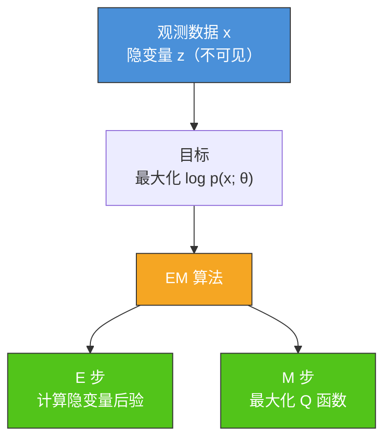
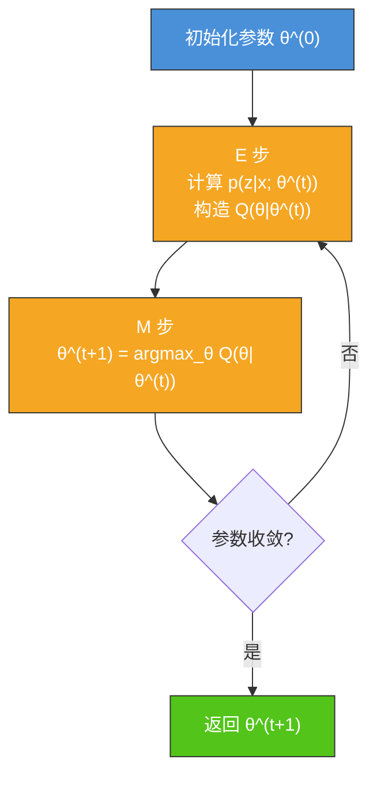
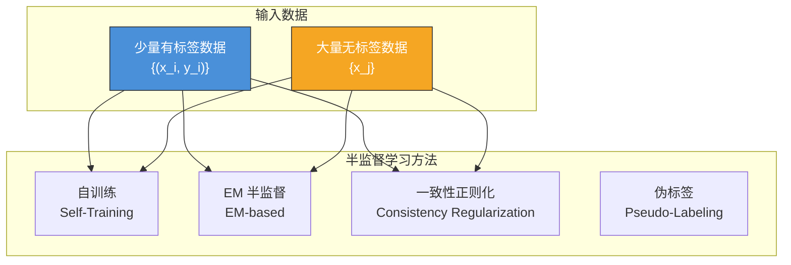
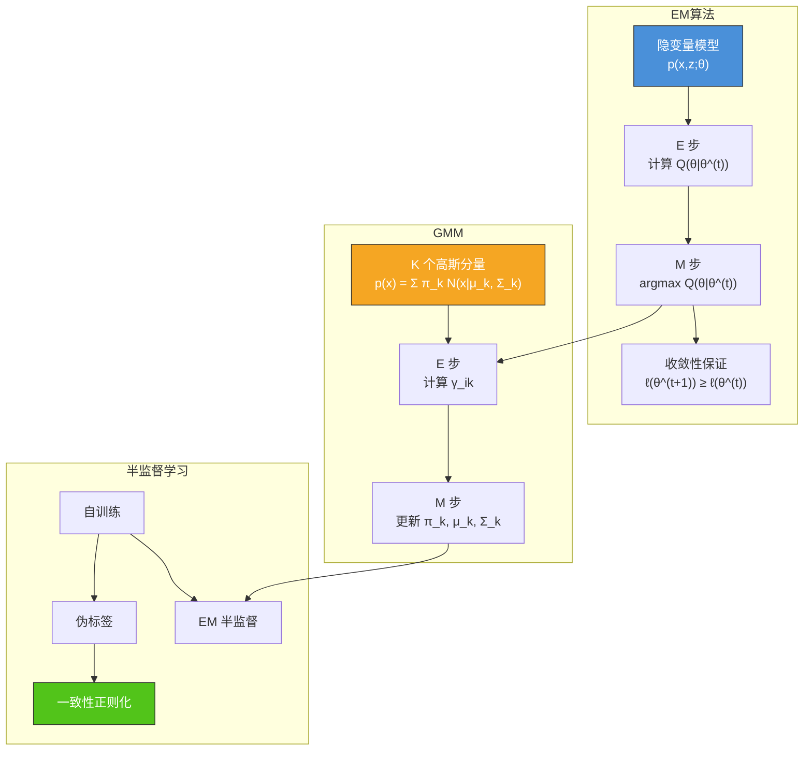

# 5.3 EM算法与半监督学习

## 📌 基本概念

### 隐变量与生成模型

在许多实际问题中，观测数据只是冰山一角，背后隐藏着**不可观测的隐变量**（Latent Variable）。例如：

- 混合高斯模型中，每个样本所属的高斯分量是隐变量
- 文本主题模型中，文档的主题分布是隐变量
- 半监督学习中，无标签数据的真实标签是隐变量

**生成模型**假设数据由某种概率分布生成，形式为：

$$p(\mathbf{x}, \mathbf{z}; \theta) = p(\mathbf{x}|\mathbf{z}; \theta) p(\mathbf{z}; \theta)$$

其中 $\mathbf{x}$ 是观测数据，$\mathbf{z}$ 是隐变量，$\theta$ 是模型参数。

### EM 算法的作用

EM（Expectation-Maximization）算法是一种**迭代优化算法**，用于在存在隐变量时求解参数的**最大似然估计**。



## 🔬 EM 算法推导

### 问题定义

观测数据 $X = \{\mathbf{x}_1, \mathbf{x}_2, \ldots, \mathbf{x}_m\}$，隐变量 $Z = \{\mathbf{z}_1, \mathbf{z}_2, \ldots, \mathbf{z}_m\}$，目标是最大化边际似然：

$$\ell(\theta) = \sum_{i=1}^{m} \log p(\mathbf{x}_i; \theta) = \sum_{i=1}^{m} \log \sum_{\mathbf{z}} p(\mathbf{x}_i, \mathbf{z}; \theta)$$

由于对数内部有求和，直接优化非常困难。EM 算法通过**引入隐变量的后验分布**来构造下界。

### E 步：构造 Q 函数

设当前参数为 $\theta^{(t)}$，隐变量的后验分布为：

$$p(\mathbf{z}|\mathbf{x}_i; \theta^{(t)}) = \frac{p(\mathbf{x}_i, \mathbf{z}; \theta^{(t)})}{\sum_{\mathbf{z}} p(\mathbf{x}_i, \mathbf{z}; \theta^{(t)})}$$

**Q 函数**（完整数据对数似然的期望）：

$$Q(\theta|\theta^{(t)}) = \mathbb{E}_{Z|X;\theta^{(t)}} \left[ \log p(X, Z; \theta) \right]$$

$$= \sum_{i=1}^{m} \sum_{\mathbf{z}} p(\mathbf{z}|\mathbf{x}_i; \theta^{(t)}) \log p(\mathbf{x}_i, \mathbf{z}; \theta)$$

> [!tip] Q 函数的直觉
> Q 函数是在当前参数 $\theta^{(t)}$ 下，对完整数据对数似然 $\log p(X, Z; \theta)$ 的期望。E 步固定参数，计算隐变量的后验分布，相当于"猜测"每个样本的隐变量取值。

### M 步：最大化 Q 函数

$$\theta^{(t+1)} = \arg\max_{\theta} Q(\theta|\theta^{(t)})$$

M 步固定隐变量的后验分布（即固定 Q 函数），找到使 Q 函数最大的参数。

### EM 算法流程



### EM 收敛性

EM 算法每一步都保证**对数似然单调不减**：

$$\ell(\theta^{(t+1)}) \geq \ell(\theta^{(t)})$$

**证明思路**：

$$\ell(\theta) = \sum_{i=1}^{m} \log \sum_{\mathbf{z}} p(\mathbf{x}_i, \mathbf{z}; \theta)$$

$$\geq \sum_{i=1}^{m} \sum_{\mathbf{z}} p(\mathbf{z}|\mathbf{x}_i; \theta^{(t)}) \log \frac{p(\mathbf{x}_i, \mathbf{z}; \theta)}{p(\mathbf{z}|\mathbf{x}_i; \theta^{(t)})}$$

上式由 Jensen 不等式得到（$\log$ 是凹函数）。右边即为 $Q(\theta|\theta^{(t)}) + H(Z|X;\theta^{(t)})$。

由于 $H(Z|X;\theta^{(t)})$ 与 $\theta$ 无关，M 步最大化 $Q$ 函数保证 $\ell(\theta^{(t+1)}) \geq \ell(\theta^{(t)})$。

> [!note] EM vs 梯度下降
> EM 每步都保证似然不减，但可能收敛到**局部最优**（因似然函数非凸）。EM 步 M 步通常有解析解，无需设置学习率。

## 🎯 高斯混合模型（GMM）

### GMM 定义

高斯混合模型是 $K$ 个高斯分布的加权和：

$$p(\mathbf{x}) = \sum_{k=1}^{K} \pi_k \mathcal{N}(\mathbf{x}|\boldsymbol{\mu}_k, \Sigma_k)$$

其中：
- $\pi_k$：第 $k$ 个分量的权重，$\sum_{k=1}^{K} \pi_k = 1$
- $\boldsymbol{\mu}_k$：第 $k$ 个高斯分量的均值
- $\Sigma_k$：第 $k$ 个高斯分量的协方差矩阵

隐变量 $\mathbf{z}$ 表示样本所属的高斯分量：$z_i \in \{1, 2, \ldots, K\}$。

### GMM 的 EM 求解

#### E 步：计算责任度（后验概率）

$$\gamma_{ik} = p(z_i = k | \mathbf{x}_i; \theta^{(t)}) = \frac{\pi_k^{(t)} \mathcal{N}(\mathbf{x}_i|\boldsymbol{\mu}_k^{(t)}, \Sigma_k^{(t)})}{\sum_{j=1}^{K} \pi_j^{(t)} \mathcal{N}(\mathbf{x}_i|\boldsymbol{\mu}_j^{(t)}, \Sigma_j^{(t)})}$$

$\gamma_{ik}$ 表示样本 $\mathbf{x}_i$ 属于第 $k$ 个分量的概率（软分配）。

#### M 步：更新参数

**更新权重**：

$$N_k = \sum_{i=1}^{m} \gamma_{ik}$$

$$\pi_k^{(t+1)} = \frac{N_k}{m}$$

**更新均值**：

$$\boldsymbol{\mu}_k^{(t+1)} = \frac{1}{N_k} \sum_{i=1}^{m} \gamma_{ik} \mathbf{x}_i$$

**更新协方差矩阵**：

$$\Sigma_k^{(t+1)} = \frac{1}{N_k} \sum_{i=1}^{m} \gamma_{ik} (\mathbf{x}_i - \boldsymbol{\mu}_k^{(t+1)})(\mathbf{x}_i - \boldsymbol{\mu}_k^{(t+1)})^T$$

### Python 实现：GMM

```python
import numpy as np
from scipy.stats import multivariate_normal

class GaussianMixtureModel:
    def __init__(self, n_components=3, max_iter=100, tol=1e-4, random_state=42):
        self.n_components = n_components
        self.max_iter = max_iter
        self.tol = tol
        self.random_state = random_state

    def initialize(self, X):
        np.random.seed(self.random_state)
        m, n = X.shape
        self.weights = np.ones(self.n_components) / self.n_components
        indices = np.random.choice(m, self.n_components, replace=False)
        self.means = X[indices].copy()
        self.covs = np.array([np.eye(n) for _ in range(self.n_components)])

    def e_step(self, X):
        m = X.shape[0]
        responsibilities = np.zeros((m, self.n_components))
        for k in range(self.n_components):
            responsibilities[:, k] = self.weights[k] * multivariate_normal.pdf(
                X, mean=self.means[k], cov=self.covs[k], allow_singular=True
            )
        row_sums = responsibilities.sum(axis=1, keepdims=True)
        responsibilities /= row_sums
        log_likelihood = np.sum(np.log(row_sums))
        return responsibilities, log_likelihood

    def m_step(self, X, responsibilities):
        m, n = X.shape
        Nk = responsibilities.sum(axis=0)

        self.weights = Nk / m
        self.means = responsibilities.T @ X / Nk[:, np.newaxis]

        for k in range(self.n_components):
            diff = X - self.means[k]
            weighted_diff = responsibilities[:, k][:, np.newaxis] * diff
            self.covs[k] = (weighted_diff.T @ diff) / Nk[k]
            self.covs[k] += np.eye(n) * 1e-6

    def fit(self, X):
        self.initialize(X)
        prev_ll = -np.inf
        for i in range(self.max_iter):
            responsibilities, log_likelihood = self.e_step(X)
            self.m_step(X, responsibilities)
            if abs(log_likelihood - prev_ll) < self.tol:
                print(f"在第 {i+1} 轮收敛")
                break
            prev_ll = log_likelihood
        self.responsibilities_ = responsibilities
        self.labels_ = np.argmax(responsibilities, axis=1)
        return self

    def predict(self, X):
        responsibilities, _ = self.e_step(X)
        return np.argmax(responsibilities, axis=1)

    def score(self, X):
        _, log_likelihood = self.e_step(X)
        return log_likelihood

np.random.seed(42)
X = np.vstack([
    np.random.randn(150, 2) * 0.5 + np.array([2, 2]),
    np.random.randn(150, 2) * 0.5 + np.array([-2, 2]),
    np.random.randn(150, 2) * 0.5 + np.array([0, -3])
])

gmm = GaussianMixtureModel(n_components=3)
gmm.fit(X)

print("=== GMM 聚类结果 ===")
print(f"权重: {gmm.weights}")
print(f"均值:\n{gmm.means}")
print(f"聚类标签（前10）: {gmm.labels_[:10]}")

plt.figure(figsize=(10, 8))
colors = ['#4a90d9', '#f5a623', '#52c41a']
for k in range(3):
    mask = gmm.labels_ == k
    plt.scatter(X[mask, 0], X[mask, 1], c=colors[k], alpha=0.6, edgecolors='k')
    from matplotlib.patches import Ellipse
    cov = gmm.covs[k]
    eigvals, eigvecs = np.linalg.eigh(cov)
    angle = np.degrees(np.arctan2(*eigvecs[:, 0][::-1]))
    width, height = 2 * np.sqrt(eigvals)
    ellipse = Ellipse(xy=gmm.means[k], width=width, height=height, angle=angle,
                       fill=False, edgecolor=colors[k], linewidth=2)
    plt.gca().add_patch(ellipse)
plt.scatter(gmm.means[:, 0], gmm.means[:, 1], c='red', marker='X', s=200, label='均值')
plt.legend()
plt.title('高斯混合模型聚类结果')
plt.show()
```

## 🤝 半监督学习

### 半监督学习的动机

在实际应用中，**标注数据稀缺而无标注数据丰富**。半监督学习（Semi-supervised Learning）利用大量无标签数据和少量有标签数据共同训练模型。



### 自训练（Self-Training）

1. 用**少量有标签数据**训练一个初始分类器
2. 对**无标签数据**进行预测，选择**高置信度**的样本加入训练集
3. 用扩充后的训练集重新训练分类器
4. 重复步骤 2-3 直至所有无标签数据被标注

```python
def self_training(X_labeled, y_labeled, X_unlabeled, model, threshold=0.8):
    model.fit(X_labeled, y_labeled)
    X_train = X_labeled.copy()
    y_train = y_labeled.copy()
    remaining = list(range(len(X_unlabeled)))

    while remaining:
        probs = model.predict_proba(X_unlabeled[remaining])
        max_probs = np.max(probs, axis=1)
        confident_mask = max_probs >= threshold

        if not confident_mask.any():
            break

        confident_indices = np.where(confident_mask)[0]
        preds = np.argmax(probs[confident_mask], axis=1)

        X_train = np.vstack([X_train, X_unlabeled[remaining][confident_mask]])
        y_train = np.concatenate([y_train, preds])

        remaining = [remaining[i] for i in range(len(remaining)) if i not in set(confident_indices)]

        model.fit(X_train, y_train)

    return model
```

### 基于 EM 的半监督学习

将无标签数据的**标签作为隐变量**，使用 EM 算法同时估计模型参数和无标签数据的标签。

**E 步**：
- 对有标签数据：直接使用已知标签
- 对无标签数据：计算标签的后验概率 $p(y|\mathbf{x}; \theta^{(t)})$

**M 步**：
- 用有标签数据和无标签数据的软标签（后验概率）更新模型参数

### 伪标签（Pseudo-Labeling）

伪标签是深度学习中常用的半监督方法：
1. 用有标签数据训练模型
2. 对无标签数据预测伪标签（选择最大概率的类别）
3. 对无标签数据施加**一致性损失**：同一数据经不同增强后预测结果应一致

### 一致性正则化

核心思想：对无标签数据应用**不同的增强变换**（如随机裁剪、颜色抖动），模型对变换后数据的预测应保持一致。

$$L = L_{\text{sup}} + \lambda \cdot L_{\text{consistency}}$$

$$L_{\text{consistency}} = \sum_{\mathbf{x} \in X_{\text{unlabeled}}} \|f(\mathbf{x}; \theta) - f(\text{aug}(\mathbf{x}); \theta)\|^2$$

### Python 实现：简单半监督分类

```python
from sklearn.linear_model import LogisticRegression

np.random.seed(42)
X_pos = np.random.randn(100, 2) + np.array([3, 3])
X_neg = np.random.randn(100, 2) + np.array([-3, -3])
X = np.vstack([X_pos, X_neg])
y = np.array([1] * 100 + [0] * 100)

labeled_idx = np.random.choice(200, 20, replace=False)
unlabeled_idx = np.array([i for i in range(200) if i not in set(labeled_idx)])

X_labeled, y_labeled = X[labeled_idx], y[labeled_idx]
X_unlabeled = X[unlabeled_idx]

model = LogisticRegression()
model = self_training(X_labeled, y_labeled, X_unlabeled, model, threshold=0.8)

y_pred = model.predict(X)
accuracy = np.mean(y_pred == y)
print(f"自训练半监督准确率: {accuracy:.4f}")

model_supervised = LogisticRegression()
model_supervised.fit(X_labeled, y_labeled)
y_pred_sup = model_supervised.predict(X)
acc_sup = np.mean(y_pred_sup == y)
print(f"纯监督准确率（仅 20 标注）: {acc_sup:.4f}")
```

## 📊 知识结构图



## 🌍 实际应用

### EM 算法应用
- **语音识别**：使用 GMM-HMM（高斯混合模型 + 隐马尔可夫模型）进行声学建模
- **图像分割**：使用 GMM 对像素进行软分类
- **文本主题建模**：PLSA（概率潜在语义分析）和 LDA（隐含狄利克雷分配）

### 半监督学习应用
- **医学影像分析**：标注医学影像稀缺，利用大量未标注影像辅助训练
- **自然语言处理**：预训练语言模型（BERT、GPT）本身就是半监督/自监督学习
- **图像分类**：利用无标注图像提升分类性能（FixMatch、伪标签等）
- **异常检测**：结合少量正常/异常样本和大量无标签数据

## ⚠️ 注意事项

### EM 算法
1. **初始化敏感**：EM 对初始参数敏感，可能收敛到局部最优，常用多随机初始化
2. **收敛速度**：EM 通常收敛较慢，但每步有解析解
3. **隐变量离散 vs 连续**：离散隐变量的 Q 函数更易计算，连续隐变量需要积分
4. **GMM 奇异性**：协方差矩阵可能奇异，需添加正则化项 $\epsilon I$

### 半监督学习
1. **伪标签噪声**：模型早期预测的伪标签可能不准确，会引入噪声
2. **阈值选择**：伪标签的置信度阈值需要仔细选择
3. **增强策略**：一致性正则化的效果依赖于数据增强方法的质量
4. **分布假设**：半监督方法通常假设聚类假设或流形假设

## 💡 考点总结

### EM 算法
1. **核心思想**：E 步构造 Q 函数，M 步最大化 Q 函数，交替迭代
2. **Q 函数推导**：$Q(\theta|\theta^{(t)}) = \sum_{i} \sum_{\mathbf{z}} p(\mathbf{z}|\mathbf{x}_i; \theta^{(t)}) \log p(\mathbf{x}_i, \mathbf{z}; \theta)$
3. **收敛性证明**：利用 Jensen 不等式证明 $\ell(\theta^{(t+1)}) \geq \ell(\theta^{(t)})$
4. **GMM 参数更新**：$\gamma_{ik}$ 的计算、$\pi_k, \boldsymbol{\mu}_k, \Sigma_k$ 的更新公式

### 半监督学习
1. **自训练流程**：训练 → 预测 → 选择高置信 → 扩充 → 重训
2. **伪标签与一致性**：同一数据不同变换的预测应一致
3. **EM 半监督**：将无标签数据标签作为隐变量
4. **实际案例**：BERT/GPT 的预训练本质上使用了自监督（半监督的特例）