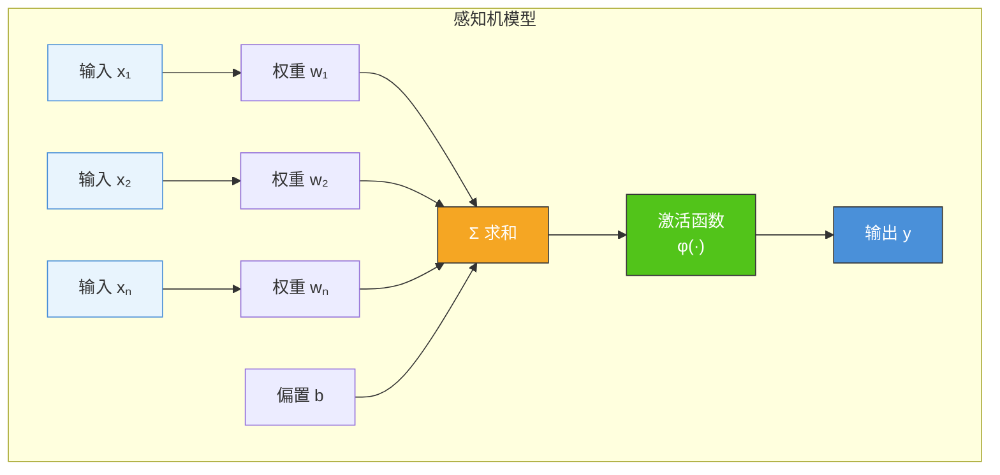
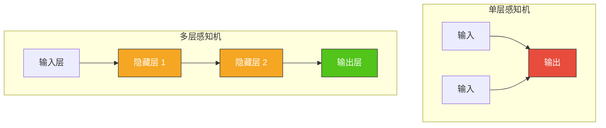
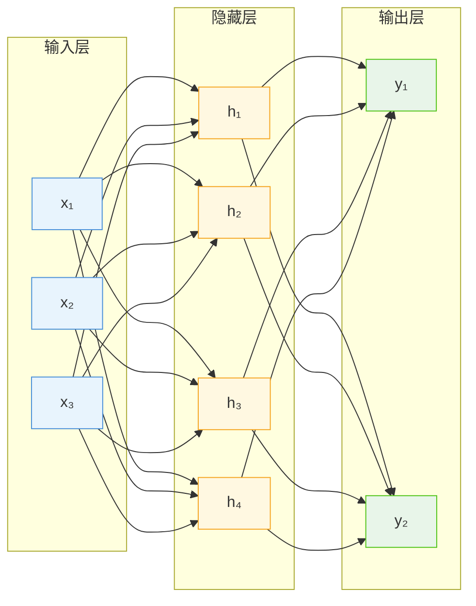
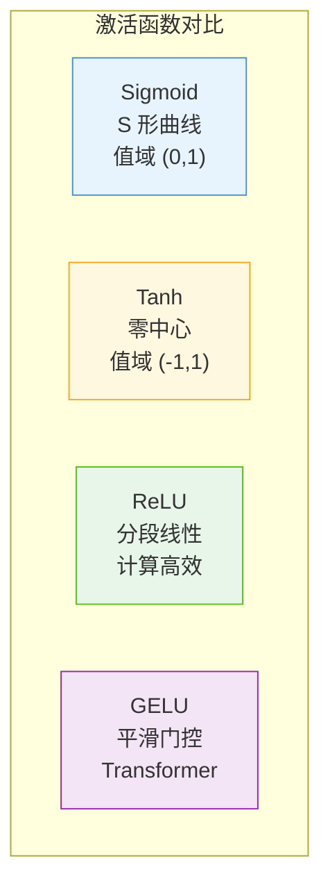
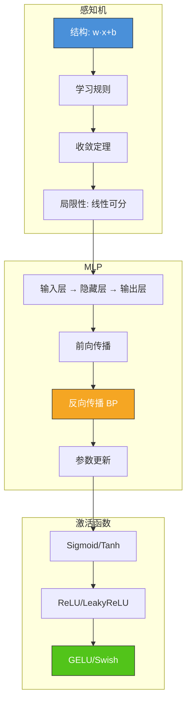

# 6.1 感知机与多层感知机

## 📌 基本概念

### 神经网络的发展脉络

人工神经网络（Artificial Neural Network, ANN）受生物神经元启发，通过模拟大脑的信息处理机制构建计算模型。其发展经历了从**感知机 → 多层感知机 → 深度学习**的演进过程。


## 🧩 感知机模型

### 感知机的结构

感知机（Perceptron）是最基本的神经网络单元，由输入、权重、偏置和激活函数组成。



### 数学表达

感知机的计算过程：

$$z = \sum_{i=1}^{n} w_i x_i + b = \mathbf{w}^T \mathbf{x} + b$$

$$y = \varphi(z)$$

其中：
- $\mathbf{x} = [x_1, x_2, \ldots, x_n]^T$：输入向量
- $\mathbf{w} = [w_1, w_2, \ldots, w_n]^T$：权重向量
- $b$：偏置项
- $\varphi(\cdot)$：激活函数

### 感知机学习规则

感知机的学习目标是找到一组权重使得所有样本分类正确。学习规则为：

$$\mathbf{w}^{(t+1)} = \mathbf{w}^{(t)} + \eta \left( y_{\text{true}} - y_{\text{pred}} \right) \mathbf{x}$$

$$b^{(t+1)} = b^{(t)} + \eta \left( y_{\text{true}} - y_{\text{pred}} \right)$$

其中 $\eta$ 为学习率，$y_{\text{true}}$ 为真实标签，$y_{\text{pred}}$ 为预测值。

### 收敛条件

**Novikoff 收敛定理**：若训练样本线性可分，且学习率选择得当，则感知机学习算法**必定在有限步内收敛**。

线性可分条件：存在权重 $\mathbf{w}^*$ 使得所有样本满足：
$$y_i (\mathbf{w}^*)^T \mathbf{x}_i > 0, \quad \forall i$$

### Python 实现：感知机

```python
import numpy as np

class Perceptron:
    def __init__(self, learning_rate=0.01, n_iterations=1000):
        self.learning_rate = learning_rate
        self.n_iterations = n_iterations
        self.weights = None
        self.bias = None

    def fit(self, X, y):
        n_samples, n_features = X.shape
        self.weights = np.zeros(n_features)
        self.bias = 0.0

        for _ in range(self.n_iterations):
            for idx, x_i in enumerate(X):
                linear_output = np.dot(x_i, self.weights) + self.bias
                y_pred = self._activation(linear_output)

                update = self.learning_rate * (y[idx] - y_pred)
                self.weights += update * x_i
                self.bias += update

    def predict(self, X):
        linear_output = np.dot(X, self.weights) + self.bias
        return self._activation(linear_output)

    def _activation(self, z):
        return np.where(z >= 0, 1, 0)

X = np.array([[0, 0], [0, 1], [1, 0], [1, 1]])
y = np.array([0, 0, 0, 1])

perceptron = Perceptron(learning_rate=0.1, n_iterations=100)
perceptron.fit(X, y)

print(f"权重: {perceptron.weights}")
print(f"偏置: {perceptron.bias}")
print(f"预测结果: {perceptron.predict(X)}")
```

## 🔥 多层感知机（MLP）

### 单层 vs 多层感知机

单层感知机只能处理**线性可分**问题（如 AND、OR），无法解决非线性问题（如 XOR）。多层感知机通过引入**隐藏层**解决了这一局限。



### MLP 的结构

MLP 由**输入层、一个或多个隐藏层、输出层**组成，每层包含多个神经元。



### 前向传播

前向传播（Forward Propagation）是数据从输入层流向输出层的过程。以 2 层 MLP 为例：

**第 1 层（隐藏层）**：
$$\mathbf{z}^{(1)} = \mathbf{W}^{(1)} \mathbf{x} + \mathbf{b}^{(1)}$$
$$\mathbf{a}^{(1)} = \varphi\left(\mathbf{z}^{(1)}\right)$$

**第 2 层（输出层）**：
$$\mathbf{z}^{(2)} = \mathbf{W}^{(2)} \mathbf{a}^{(1)} + \mathbf{b}^{(2)}$$
$$\hat{\mathbf{y}} = \text{Softmax}\left(\mathbf{z}^{(2)}\right)$$

其中：
- $\mathbf{W}^{(l)}$：第 $l$ 层的权重矩阵
- $\mathbf{b}^{(l)}$：第 $l$ 层的偏置向量
- $\varphi(\cdot)$：隐藏层激活函数
- $\text{Softmax}(\cdot)$：输出层激活函数（多分类）

### 反向传播算法推导

反向传播（Backpropagation, BP）是训练神经网络的核心算法，通过链式法则计算损失函数对各参数的梯度。

#### 损失函数

使用交叉熵损失（Cross-Entropy Loss）：
$$L = -\frac{1}{m} \sum_{i=1}^{m} \sum_{c=1}^{C} y_{ic} \log \hat{y}_{ic}$$

#### 输出层误差项 $\delta^{(L)}$

$$\delta^{(L)} = \frac{\partial L}{\partial \mathbf{z}^{(L)}} = \hat{\mathbf{y}} - \mathbf{y}$$

> **推导**：设 $\hat{y}_c = \text{Softmax}(z)_c = \frac{e^{z_c}}{\sum_j e^{z_j}}$，交叉熵损失对 $z_c$ 的偏导数为 $\hat{y}_c - y_c$。

#### 隐藏层误差项 $\delta^{(l)}$

$$\delta^{(l)} = \frac{\partial L}{\partial \mathbf{z}^{(l)}} = \left( {\mathbf{W}^{(l+1)}}^T \delta^{(l+1)} \right) \odot \varphi'\left(\mathbf{z}^{(l)}\right)$$

> **推导**：利用链式法则，$\delta^{(l)} = \frac{\partial L}{\partial \mathbf{z}^{(l+1)}} \cdot \frac{\partial \mathbf{z}^{(l+1)}}{\partial \mathbf{a}^{(l)}} \cdot \frac{\partial \mathbf{a}^{(l)}}{\partial \mathbf{z}^{(l)}}$，即 $\delta^{(l)} = \delta^{(l+1)} \cdot {\mathbf{W}^{(l+1)}}^T \odot \varphi'(\mathbf{z}^{(l)})$。

#### 参数梯度

$$\frac{\partial L}{\partial \mathbf{W}^{(l)}} = \delta^{(l)} \cdot {\mathbf{a}^{(l-1)}}^T$$

$$\frac{\partial L}{\partial \mathbf{b}^{(l)}} = \sum_{batch} \delta^{(l)}$$

#### 参数更新

$$\mathbf{W}^{(l)} \leftarrow \mathbf{W}^{(l)} - \eta \frac{\partial L}{\partial \mathbf{W}^{(l)}}$$
$$\mathbf{b}^{(l)} \leftarrow \mathbf{b}^{(l)} - \eta \frac{\partial L}{\partial \mathbf{b}^{(l)}}$$

### PyTorch 实现：MLP

```python
import torch
import torch.nn as nn
import torch.optim as optim
from torch.utils.data import DataLoader, TensorDataset

class MLP(nn.Module):
    def __init__(self, input_dim, hidden_dim, output_dim, dropout=0.2):
        super(MLP, self).__init__()
        self.fc1 = nn.Linear(input_dim, hidden_dim)
        self.bn1 = nn.BatchNorm1d(hidden_dim)
        self.relu = nn.ReLU()
        self.dropout = nn.Dropout(dropout)
        self.fc2 = nn.Linear(hidden_dim, hidden_dim // 2)
        self.bn2 = nn.BatchNorm1d(hidden_dim // 2)
        self.fc3 = nn.Linear(hidden_dim // 2, output_dim)

    def forward(self, x):
        x = self.fc1(x)
        x = self.bn1(x)
        x = self.relu(x)
        x = self.dropout(x)
        x = self.fc2(x)
        x = self.bn2(x)
        x = self.relu(x)
        x = self.dropout(x)
        x = self.fc3(x)
        return x

torch.manual_seed(42)
X = torch.randn(200, 10)
y = torch.randint(0, 3, (200,))

dataset = TensorDataset(X, y)
loader = DataLoader(dataset, batch_size=32, shuffle=True)

model = MLP(input_dim=10, hidden_dim=64, output_dim=3)
criterion = nn.CrossEntropyLoss()
optimizer = optim.Adam(model.parameters(), lr=0.01)

for epoch in range(100):
    total_loss = 0
    for batch_X, batch_y in loader:
        optimizer.zero_grad()
        outputs = model(batch_X)
        loss = criterion(outputs, batch_y)
        loss.backward()
        optimizer.step()
        total_loss += loss.item()

    if (epoch + 1) % 20 == 0:
        print(f"Epoch [{epoch+1}/100], Loss: {total_loss/len(loader):.4f}")

with torch.no_grad():
    test_outputs = model(X)
    _, predicted = torch.max(test_outputs, 1)
    accuracy = (predicted == y).float().mean()
    print(f"训练准确率: {accuracy:.4f}")
```

## 🎨 激活函数详解

### 常见激活函数对比

| 激活函数 | 公式 | 值域 | 优点 | 缺点 |
|---------|------|------|------|------|
| **Sigmoid** | $\sigma(z) = \frac{1}{1+e^{-z}}$ | $(0, 1)$ | 输出可解释为概率 | 梯度消失；非零中心 |
| **Tanh** | $\tanh(z) = \frac{e^z - e^{-z}}{e^z + e^{-z}}$ | $(-1, 1)$ | 零中心；比 Sigmoid 梯度更强 | 仍有梯度消失问题 |
| **ReLU** | $\max(0, z)$ | $[0, +\infty)$ | 计算高效；缓解梯度消失 | 神经元"死亡"；非零中心 |
| **LeakyReLU** | $\begin{cases} \alpha z & z < 0 \\ z & z \geq 0 \end{cases}$ | $(-\infty, +\infty)$ | 解决神经元死亡 | $\alpha$ 需要调参 |
| **GELU** | $z \cdot \Phi(z)$ | $(-\infty, +\infty)$ | 平滑；Transformer 中表现好 | 计算略复杂 |
| **Swish** | $z \cdot \sigma(\beta z)$ | $(-\infty, +\infty)$ | 自门控；深层网络表现好 | 计算开销较大 |

### 激活函数图像对比



### PyTorch 可视化激活函数

```python
import torch
import torch.nn as nn
import matplotlib.pyplot as plt

x = torch.linspace(-5, 5, 200)

activations = {
    'Sigmoid': nn.Sigmoid()(x).numpy(),
    'Tanh': nn.Tanh()(x).numpy(),
    'ReLU': nn.ReLU()(x).numpy(),
    'LeakyReLU': nn.LeakyReLU(0.1)(x).numpy(),
    'GELU': nn.GELU()(x).numpy(),
}

fig, axes = plt.subplots(2, 3, figsize=(15, 8))
for ax, (name, y) in zip(axes.flat, activations.items()):
    ax.plot(x.numpy(), y, 'b-', linewidth=2)
    ax.set_title(name)
    ax.axhline(y=0, color='k', linestyle='--', alpha=0.5)
    ax.axvline(x=0, color='k', linestyle='--', alpha=0.5)
    ax.grid(True, alpha=0.3)

plt.tight_layout()
plt.show()
```

## 📊 知识结构图



## 🌍 实际应用

### 图像识别
MLP 可作为图像分类的基础模型，虽然在空间数据上已被 CNN 取代，但 MLP 仍是理解深度学习的基石。

### 文本分类
将文本表示为 TF-IDF 或词向量后，MLP 可用于垃圾邮件检测、情感分析等任务。

### 回归预测
在金融领域，MLP 可用于股票价格预测、信用风险评估等回归任务。

### 特征嵌入
在推荐系统中，MLP 可将用户和物品特征映射到低维嵌入空间。

## ⚠️ 注意事项

### 反向传播常见问题
1. **梯度消失**：深层网络中，梯度逐层衰减，导致底层参数难以更新 → 使用 ReLU、残差连接缓解
2. **梯度爆炸**：梯度逐层放大 → 使用梯度裁剪、权重衰减
3. **局部最优**：损失函数非凸，可能陷入局部最优 → 使用 Momentum、Adam 等优化器

### 激活函数选择
1. **隐藏层**：首选 ReLU（计算高效、缓解梯度消失）；Transformer 中使用 GELU
2. **二分类输出层**：Sigmoid
3. **多分类输出层**：Softmax
4. **回归输出层**：恒等函数（无激活）

## 💡 考点总结

1. **感知机学习规则**：$\mathbf{w} \leftarrow \mathbf{w} + \eta(y_{\text{true}} - y_{\text{pred}})\mathbf{x}$，线性可分条件下收敛
2. **MLP 前向传播**：逐层线性变换 + 激活函数，矩阵运算表达
3. **BP 算法推导**：输出层 $\delta^{(L)} = \hat{\mathbf{y}} - \mathbf{y}$；隐藏层 $\delta^{(l)} = (\mathbf{W}^{(l+1)})^T\delta^{(l+1)} \odot \varphi'(\mathbf{z}^{(l)})$
4. **激活函数对比**：Sigmoid/Tanh 梯度消失；ReLU 高效但神经元死亡；GELU 平滑
5. **Softmax + 交叉熵**：联合使用时梯度简化为 $\hat{y} - y$
6. **PyTorch 实现**：掌握 `nn.Module`、`nn.Linear`、`nn.BatchNorm1d` 的使用