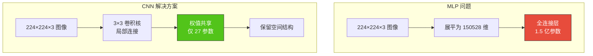
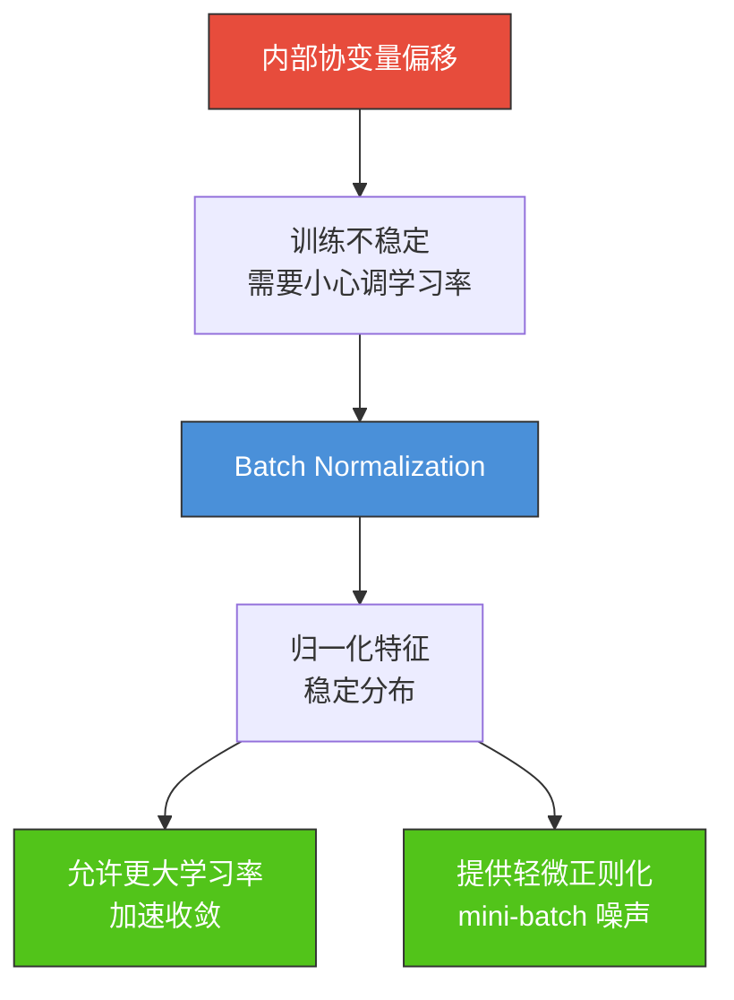
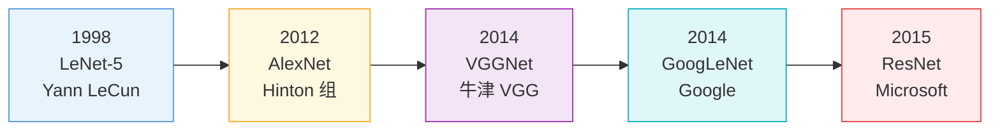
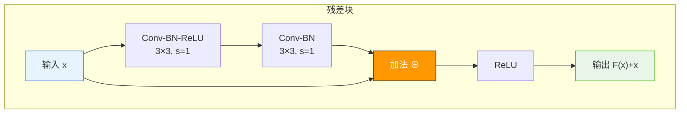
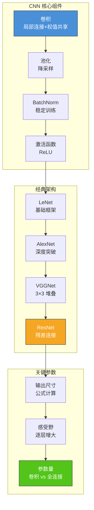

# 6.2 卷积神经网络CNN

## 📌 基本概念

### 为什么需要 CNN

全连接网络（MLP）处理图像时面临两个核心问题：
1. **参数爆炸**：一张 $224 \times 224 \times 3$ 的图像，第一个全连接层若有 1000 个神经元，参数量为 $224 \times 224 \times 3 \times 1000 = 150,528,000$
2. **丢失空间信息**：将图像展平为一维向量后，像素的二维空间关系完全丢失

**卷积神经网络（Convolutional Neural Network, CNN）** 通过**局部连接**和**权值共享**解决了这些问题。



## 🔍 卷积运算

### 二维卷积

卷积层的核心操作是**卷积（Convolution）**，通过滑动卷积核在输入特征图上提取局部特征。

$$y_{i,j} = \sum_{m=0}^{k-1} \sum_{n=0}^{k-1} w_{m,n} \cdot x_{i+m, j+n} + b$$

其中：
- $x$：输入特征图
- $w$：卷积核权重
- $k$：卷积核大小
- $b$：偏置

### 卷积操作示意

```mermaid
flowchart TD
    subgraph 输入 5×5 特征图
        direction TB
        X11["(1,1)"] & X12["(1,2)"] & X13["(1,3)"] & X14["(1,4)"] & X15["(1,5)"]
        X21["(2,1)"] & X22["(2,2)"] & X23["(2,3)"] & X24["(2,4)"] & X25["(2,5)"]
        X31["(3,1)"] & X32["(3,2)"] & X33["(3,3)"] & X34["(3,4)"] & X35["(3,5)"]
        X41["(4,1)"] & X42["(4,2)"] & X43["(4,3)"] & X44["(4,4)"] & X45["(4,5)"]
        X51["(5,1)"] & X52["(5,2)"] & X53["(5,3)"] & X54["(5,4)"] & X55["(5,5)"]
    end

    subgraph 3×3 卷积核
        direction TB
        W11["w₁₁"] & W12["w₁₂"] & W13["w₁₃"]
        W21["w₂₁"] & W22["w₂₂"] & W23["w₂₃"]
        W31["w₃₁"] & W32["w₃₂"] & W33["w₃₃"]
    end

    subgraph 输出 3×3 特征图
        direction TB
        Y11["y₁₁"] & Y12["y₁₂"] & Y13["y₁₃"]
        Y21["y₂₁"] & Y22["y₂₂"] & Y23["y₂₃"]
        Y31["y₃₁"] & Y32["y₃₂"] & Y33["y₃₃"]
    end

    X11 & X12 & X13 & X21 & X22 & X23 & X31 & X32 & X33 --> Y11
    X12 & X13 & X14 & X22 & X23 & X24 & X32 & X33 & X34 --> Y12

    style X11 fill:#ffeb3b,stroke:#333
    style X12 fill:#ffeb3b,stroke:#333
    style X13 fill:#ffeb3b,stroke:#333
    style X21 fill:#ffeb3b,stroke:#333
    style X22 fill:#ffeb3b,stroke:#333
    style X23 fill:#ffeb3b,stroke:#333
    style X31 fill:#ffeb3b,stroke:#333
    style X32 fill:#ffeb3b,stroke:#333
    style X33 fill:#ffeb3b,stroke:#333
    style Y11 fill:#4caf50,stroke:#333,color:#fff
    style Y12 fill:#4caf50,stroke:#333,color:#fff
```

### 卷积参数

| 参数 | 符号 | 含义 |
|------|------|------|
| 输入尺寸 | $H \times W \times C$ | 高度 × 宽度 × 通道数 |
| 卷积核大小 | $K$ | 通常为 3×3 或 5×5 |
| 步长 | $S$ | 卷积核每次移动的像素数 |
| 填充 | $P$ | 零填充的圈数 |
| 输出通道数 | $C'$ | 卷积核的数量 |

### 输出尺寸计算公式

$$H_{\text{out}} = \left\lfloor \frac{H + 2P - K}{S} \right\rfloor + 1$$

$$W_{\text{out}} = \left\lfloor \frac{W + 2P - K}{S} \right\rfloor + 1$$

**参数数量**：$K \times K \times C \times C' + C'$（权重 + 偏置）

### Python 实现：卷积运算

```python
import numpy as np
import torch
import torch.nn as nn

def conv2d_manual(input_tensor, weight, bias, stride=1, padding=0):
    batch, in_channels, H, W = input_tensor.shape
    out_channels, _, K, _ = weight.shape

    if padding > 0:
        input_tensor = np.pad(input_tensor, ((0,0),(0,0),(padding,padding),(padding,padding)), mode='constant')

    H_padded = H + 2 * padding
    W_padded = W + 2 * padding
    H_out = (H_padded - K) // stride + 1
    W_out = (W_padded - K) // stride + 1

    output = np.zeros((batch, out_channels, H_out, W_out))

    for b in range(batch):
        for oc in range(out_channels):
            for h in range(H_out):
                for w in range(W_out):
                    h_start = h * stride
                    w_start = w * stride
                    receptive_field = input_tensor[b, :, h_start:h_start+K, w_start:w_start+K]
                    output[b, oc, h, w] = np.sum(receptive_field * weight[oc]) + bias[oc]

    return output

np.random.seed(42)
input_tensor = np.random.randn(1, 1, 5, 5)
weight = np.random.randn(1, 1, 3, 3)
bias = np.zeros(1)

output = conv2d_manual(input_tensor, weight, bias, stride=1, padding=0)
print(f"输入尺寸: {input_tensor.shape}")
print(f"输出尺寸: {output.shape}")
```

### PyTorch 卷积层

```python
import torch
import torch.nn as nn

conv = nn.Conv2d(
    in_channels=3,
    out_channels=64,
    kernel_size=3,
    stride=1,
    padding=1
)

x = torch.randn(1, 3, 32, 32)
y = conv(x)
print(f"输入: {x.shape}")
print(f"输出: {y.shape}")
print(f"参数量: {sum(p.numel() for p in conv.parameters())}")
```

## 📉 池化操作

### 池化的作用

池化（Pooling）用于**降低特征图分辨率**，减少计算量，增强平移不变性。

### 两种池化方式

| 池化类型 | 公式 | 特点 |
|---------|------|------|
| **最大池化** | $\text{MaxPool}(x) = \max_{i,j} x_{i,j}$ | 保留最强特征；提供平移不变性 |
| **平均池化** | $\text{AvgPool}(x) = \frac{1}{K^2}\sum_{i,j} x_{i,j}$ | 保留整体信息；输出更平滑 |

### 池化示意

```mermaid
flowchart TD
    subgraph 输入 4×4
        direction TB
        I11["1"] & I12["3"] & I13["2"] & I14["4"]
        I21["5"] & I22["6"] & I23["1"] & I24["8"]
        I31["7"] & I32["2"] & I33["9"] & I34["3"]
        I41["0"] & I42["1"] & I43["4"] & I44["5"]
    end

    subgraph 最大池化 2×2
        direction TB
        M11["6"] & M12["8"]
        M21["7"] & M22["9"]
    end

    subgraph 平均池化 2×2
        direction TB
        A11["3.75"] & A12["3.75"]
        A21["2.5"] & A22["5.25"]
    end

    I11 & I12 & I21 & I22 --> M11
    I13 & I14 & I23 & I24 --> M12
    I11 & I12 & I21 & I22 --> A11

    style I11 fill:#e8f4fd,stroke:#4a90d9
    style I12 fill:#e8f4fd,stroke:#4a90d9
    style I21 fill:#e8f4fd,stroke:#4a90d9
    style I22 fill:#e8f4fd,stroke:#4a90d9
    style M11 fill:#ff9800,stroke:#333,color:#fff
    style A11 fill:#4caf50,stroke:#333,color:#fff
```

### PyTorch 池化实现

```python
import torch
import torch.nn as nn

x = torch.tensor([[[[1, 3, 2, 4],
                     [5, 6, 1, 8],
                     [7, 2, 9, 3],
                     [0, 1, 4, 5]]]], dtype=torch.float32)

max_pool = nn.MaxPool2d(kernel_size=2, stride=2)
avg_pool = nn.AvgPool2d(kernel_size=2, stride=2)

print(f"最大池化结果:\n{max_pool(x)}")
print(f"平均池化结果:\n{avg_pool(x)}")
```

## 📦 批量归一化（Batch Normalization）

### BN 的动机

深层网络训练中存在**内部协变量偏移（Internal Covariate Shift）**问题：各层输入分布随训练不断变化，导致学习率难以设置、训练收敛慢。

### BN 算法

对每个 mini-batch 的特征进行归一化：

$$\hat{x}_i = \frac{x_i - \mu_B}{\sqrt{\sigma_B^2 + \epsilon}}$$

$$y_i = \gamma \hat{x}_i + \beta$$

其中：
- $\mu_B$：mini-batch 均值
- $\sigma_B^2$：mini-batch 方差
- $\gamma, \beta$：可学习的缩放和偏移参数

### BN 的作用



### PyTorch 中的 BN

```python
import torch
import torch.nn as nn

bn = nn.BatchNorm2d(num_features=64)

x = torch.randn(16, 64, 32, 32)
y = bn(x)

print(f"训练模式 (batch 统计):")
print(f"  输入均值: {x.mean(dim=[0,2,3]).mean():.4f}")
print(f"  输出均值: {y.mean(dim=[0,2,3]).mean():.4f}")

bn.eval()
y_eval = bn(x)
print(f"\n评估模式 (running 统计):")
print(f"  running_mean 均值: {bn.running_mean.mean():.4f}")
```

## 🏛️ 经典 CNN 架构

### 架构演进时间线



### LeNet-5（1998）

LeNet 是第一个成功的 CNN 架构，用于手写数字识别。

| 层 | 操作 | 输出尺寸 | 参数量 |
|----|------|---------|--------|
| 输入 | - | $32 \times 32 \times 1$ | - |
| Conv1 | 5×5, stride=1 | $28 \times 28 \times 6$ | 156 |
| Pool1 | 2×2, stride=2 | $14 \times 14 \times 6$ | - |
| Conv2 | 5×5, stride=1 | $10 \times 10 \times 16$ | 2416 |
| Pool2 | 2×2, stride=2 | $5 \times 5 \times 16$ | - |
| FC1 | 全连接 | $120 \times 1$ | 48120 |
| FC2 | 全连接 | $84 \times 1$ | 10164 |
| 输出 | 全连接 | $10 \times 1$ | 850 |

**总参数量**：约 61K

### AlexNet（2012）

AlexNet 在 ImageNet 挑战赛上大幅领先，开启了深度学习时代。

**关键创新**：
1. 使用 ReLU 激活函数
2. Dropout 正则化
3. 数据增强
4. 多 GPU 训练

```mermaid
flowchart TD
    subgraph AlexNet 结构
        A["224×224×3"] --> B["Conv1<br/>11×11, s=4, 96"]
        B --> C["MaxPool<br/>3×3, s=2"]
        C --> D["Conv2<br/>5×5, s=1, 256"]
        D --> E["MaxPool<br/>3×3, s=2"]
        E --> F["Conv3<br/>3×3, s=1, 384"]
        F --> G["Conv4<br/>3×3, s=1, 384"]
        G --> H["Conv5<br/>3×3, s=1, 256"]
        H --> I["MaxPool<br/>3×3, s=2"]
        I --> J["FC1<br/>4096 + Dropout"]
        J --> K["FC2<br/>4096 + Dropout"]
        K --> L["FC3<br/>1000 (Softmax)"]
    end

    style A fill:#e8f4fd,stroke:#4a90d9
    style B fill:#fff8e1,stroke:#f5a623
    style L fill:#e8f5e9,stroke:#52c41a
```



**总参数量**：约 60M

### VGGNet（2014）

VGGNet 使用**统一的 3×3 卷积核**堆叠构建深层网络。

**核心思想**：多个 3×3 卷积层的堆叠可以模拟更大感受野：
- 两层 3×3 → 等效 5×5 感受野
- 三层 3×3 → 等效 7×7 感受野
- 参数更少、引入更多非线性

| 配置 | 层数 | 特征层数 |
|------|------|---------|
| VGG-11 | 11 | 1×64, 1×128, 2×256, 2×512, 2×512 |
| VGG-13 | 13 | 2×64, 2×128, 2×256, 2×512, 2×512 |
| VGG-16 | 16 | 2×64, 2×128, 3×256, 3×512, 3×512 |
| VGG-19 | 19 | 2×64, 2×128, 4×256, 4×512, 4×512 |

**总参数量**：约 138M（VGG-16）

### ResNet（2015）

残差网络（ResNet）通过**跳跃连接**解决了深层网络的退化问题。

#### 残差学习

$$\mathbf{y} = \mathcal{F}(\mathbf{x}, \{W_i\}) + \mathbf{x}$$

网络学习的是残差映射 $\mathcal{F}(\mathbf{x}) = \mathbf{H}(\mathbf{x}) - \mathbf{x}$，而不是直接学习 $\mathbf{H}(\mathbf{x})$。

#### 残差块结构



#### ResNet 各版本

| 模型 | 层数 | 结构 | 参数量 | Top-5 错误率 |
|------|------|------|--------|-------------|
| ResNet-18 | 18 | 2×2×2×2 | 11.7M | 10.7% |
| ResNet-34 | 34 | 3×4×6×3 | 21.8M | 7.1% |
| ResNet-50 | 50 | 3×4×6×3 (bottleneck) | 25.6M | 3.6% |
| ResNet-101 | 101 | 3×4×23×3 | 44.5M | 3.5% |
| ResNet-152 | 152 | 3×8×36×3 | 60.2M | 3.3% |

#### PyTorch 实现：ResNet-18

```python
import torch
import torch.nn as nn
import torch.optim as optim

class BasicBlock(nn.Module):
    expansion = 1

    def __init__(self, in_channels, out_channels, stride=1):
        super(BasicBlock, self).__init__()
        self.conv1 = nn.Conv2d(in_channels, out_channels, 3, stride=stride, padding=1, bias=False)
        self.bn1 = nn.BatchNorm2d(out_channels)
        self.conv2 = nn.Conv2d(out_channels, out_channels, 3, stride=1, padding=1, bias=False)
        self.bn2 = nn.BatchNorm2d(out_channels)

        self.shortcut = nn.Sequential()
        if stride != 1 or in_channels != out_channels:
            self.shortcut = nn.Sequential(
                nn.Conv2d(in_channels, out_channels, 1, stride=stride, bias=False),
                nn.BatchNorm2d(out_channels)
            )

    def forward(self, x):
        identity = self.shortcut(x)
        out = torch.relu(self.bn1(self.conv1(x)))
        out = self.bn2(self.conv2(out))
        out += identity
        out = torch.relu(out)
        return out

class ResNet18(nn.Module):
    def __init__(self, num_classes=1000):
        super(ResNet18, self).__init__()
        self.in_channels = 64

        self.conv1 = nn.Conv2d(3, 64, 7, stride=2, padding=3, bias=False)
        self.bn1 = nn.BatchNorm2d(64)
        self.maxpool = nn.MaxPool2d(3, stride=2, padding=1)

        self.layer1 = self._make_layer(64, 2, stride=1)
        self.layer2 = self._make_layer(128, 2, stride=2)
        self.layer3 = self._make_layer(256, 2, stride=2)
        self.layer4 = self._make_layer(512, 2, stride=2)

        self.avgpool = nn.AdaptiveAvgPool2d((1, 1))
        self.fc = nn.Linear(512, num_classes)

    def _make_layer(self, out_channels, num_blocks, stride):
        strides = [stride] + [1] * (num_blocks - 1)
        layers = []
        for s in strides:
            layers.append(BasicBlock(self.in_channels, out_channels, s))
            self.in_channels = out_channels
        return nn.Sequential(*layers)

    def forward(self, x):
        x = torch.relu(self.bn1(self.conv1(x)))
        x = self.maxpool(x)
        x = self.layer1(x)
        x = self.layer2(x)
        x = self.layer3(x)
        x = self.layer4(x)
        x = self.avgpool(x)
        x = torch.flatten(x, 1)
        x = self.fc(x)
        return x

model = ResNet18(num_classes=10)
x = torch.randn(2, 3, 224, 224)
y = model(x)
print(f"输出形状: {y.shape}")
total_params = sum(p.numel() for p in model.parameters())
print(f"总参数量: {total_params:,}")
```

### 架构对比表

| 架构 | 年份 | 核心创新 | 层数 | 参数量 | 应用场景 |
|------|------|---------|------|--------|---------|
| LeNet | 1998 | 卷积+池化 | 5 | 60K | 手写数字识别 |
| AlexNet | 2012 | ReLU+Dropout+数据增强 | 8 | 60M | 图像分类 |
| VGGNet | 2014 | 统一 3×3 堆叠 | 16/19 | 138M | 图像分类、特征提取 |
| GoogLeNet | 2014 | Inception 模块 | 22 | 5M | 图像分类 |
| ResNet | 2015 | 残差连接 | 50/101/152 | 25-60M | 通用视觉任务 |
| DenseNet | 2017 | 密集连接 | 121/169 | 7-14M | 医学图像 |
| EfficientNet | 2019 | 复合缩放 | - | 5-50M | 移动端 |
| ViT | 2020 | Transformer | - | - | 图像分类 |

## 📊 知识结构图



## 🌍 实际应用

### 图像分类
CNN 最经典的应用场景，包括 ImageNet 竞赛、医疗图像分类等。

### 目标检测
基于 CNN 的特征提取，结合 R-CNN/YOLO 等检测框架（详见第 7 章）。

### 图像分割
FCN、U-Net 等架构基于 CNN 实现像素级分割。

### 视频分析
CNN 结合时序模型（RNN/Transformer）用于动作识别、视频分类。

### 医学影像
CNN 在 X 光、CT、MRI 等医学图像的疾病检测中取得了显著成果。

## ⚠️ 注意事项

### 卷积尺寸计算
1. 注意**向下取整**：$\lfloor \cdot \rfloor$
2. SAME 填充（保持尺寸）：$P = \frac{K-1}{2}$（当 $S=1$ 时）
3. 步长 > 1 时输出尺寸缩小

### CNN 调优要点
1. **网络深度**：越深不一定越好，注意退化问题
2. **通道数**：通常逐层递增（64→128→256→512）
3. **正则化**：BatchNorm + Dropout + 数据增强
4. **预训练**：使用 ImageNet 预训练权重进行迁移学习

## 💡 考点总结

1. **卷积参数计算**：输出尺寸公式 $H_{\text{out}} = \lfloor \frac{H + 2P - K}{S} \rfloor + 1$；参数量 $K^2 \times C \times C' + C'$
2. **局部连接与权值共享**：理解 CNN 参数高效的原因
3. **Batch Normalization**：内部协变量偏移、$\gamma/\beta$ 参数、训练/推理模式差异
4. **ResNet 残差连接**：$\mathbf{y} = \mathcal{F}(\mathbf{x}) + \mathbf{x}$，解决退化问题
5. **经典架构对比**：LeNet→AlexNet→VGGNet→ResNet 的核心创新
6. **感受野计算**：每经过一层卷积，感受野的计算公式
7. **PyTorch 实现**：`nn.Conv2d`、`nn.MaxPool2d`、`nn.BatchNorm2d`、自定义 ResNet 模块