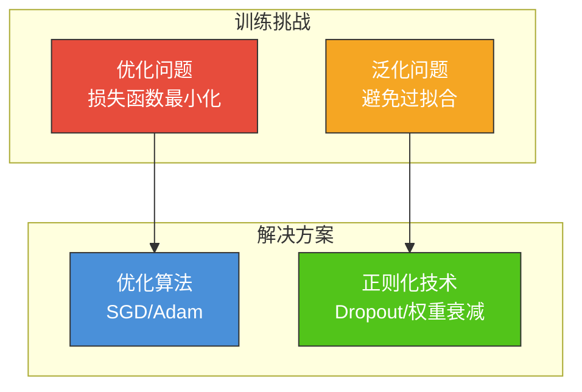
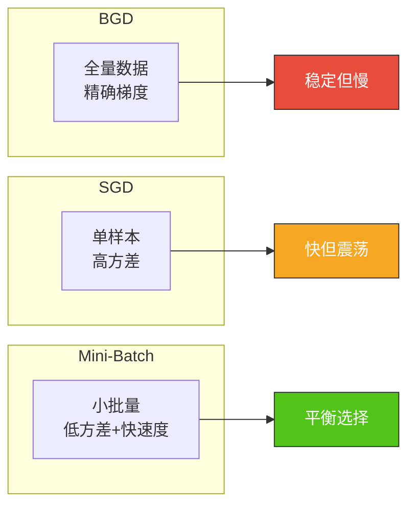
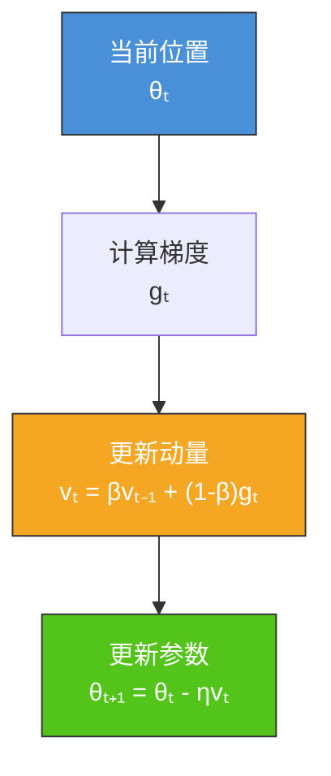
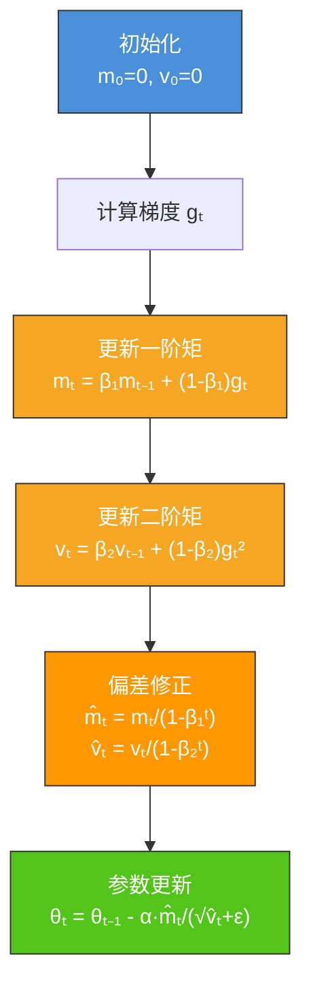
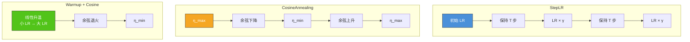
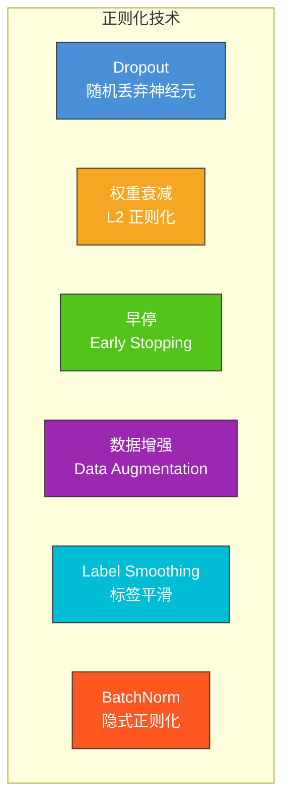
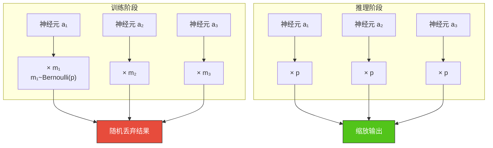
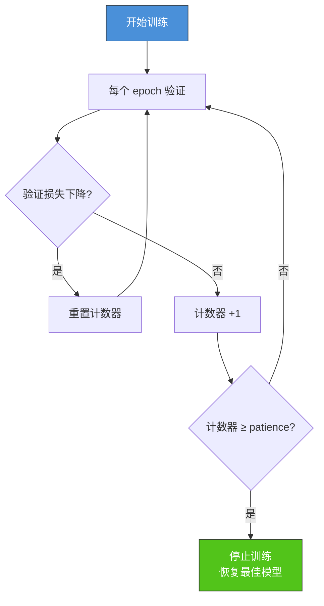
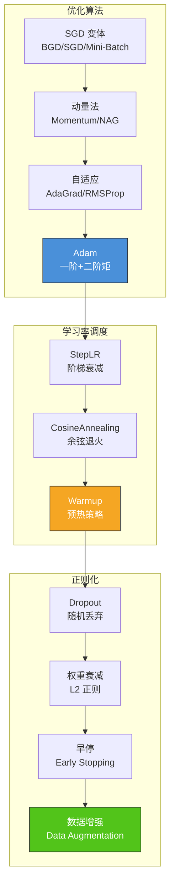

# 6.3 优化算法与正则化

## 📌 基本概念

### 优化与正则化的关系

训练深度网络的两大核心挑战：
1. **优化问题**：如何高效找到最优参数（损失函数最小化）
2. **泛化问题**：如何使模型在未见数据上表现良好



## ⚙️ 梯度下降基础

### 三种梯度下降变体

| 变体 | 更新公式 | 特点 |
|------|---------|------|
| **批量梯度下降 (BGD)** | $\theta \leftarrow \theta - \eta \nabla_\theta L(\theta)$ | 稳定；但每步需全量数据，速度慢 |
| **随机梯度下降 (SGD)** | $\theta \leftarrow \theta - \eta \nabla_\theta L_i(\theta)$ | 极快；但波动大，震荡严重 |
| **小批量梯度下降 (Mini-Batch)** | $\theta \leftarrow \theta - \eta \nabla_\theta L_{mini}(\theta)$ | 折中方案；最常用 |

### 三种方法对比



### Python 实现：三种 SGD 变体

```python
import numpy as np

def batch_gradient_descent(X, y, theta, lr, n_iter):
    m = len(y)
    for _ in range(n_iter):
        gradient = (2/m) * X.T @ (X @ theta - y)
        theta -= lr * gradient
    return theta

def stochastic_gradient_descent(X, y, theta, lr, n_iter):
    m = len(y)
    for _ in range(n_iter):
        for i in range(m):
            xi = X[i:i+1]
            yi = y[i:i+1]
            gradient = 2 * xi.T @ (xi @ theta - yi)
            theta -= lr * gradient
    return theta

def mini_batch_gradient_descent(X, y, theta, lr, n_iter, batch_size=32):
    m = len(y)
    for _ in range(n_iter):
        indices = np.random.permutation(m)
        X_shuffled = X[indices]
        y_shuffled = y[indices]
        for start in range(0, m, batch_size):
            end = min(start + batch_size, m)
            X_batch = X_shuffled[start:end]
            y_batch = y_shuffled[start:end]
            gradient = (2/len(y_batch)) * X_batch.T @ (X_batch @ theta - y_batch)
            theta -= lr * gradient
    return theta

np.random.seed(42)
X = np.random.randn(100, 3)
y = X @ np.array([1.5, -2.0, 3.0]) + np.random.randn(100) * 0.1
theta_init = np.zeros(3)

theta_bgd = batch_gradient_descent(X, y, theta_init.copy(), lr=0.01, n_iter=1000)
theta_sgd = stochastic_gradient_descent(X, y, theta_init.copy(), lr=0.01, n_iter=10)
theta_mbgd = mini_batch_gradient_descent(X, y, theta_init.copy(), lr=0.01, n_iter=100, batch_size=32)

print(f"BGD 结果: {theta_bgd}")
print(f"SGD 结果: {theta_sgd}")
print(f"MBGD 结果: {theta_mbgd}")
print(f"真实值: [1.5, -2.0, 3.0]")
```

## 🚀 动量加速方法

### 动量法（Momentum）

动量法模拟物理中的动量概念，利用历史梯度信息加速收敛。

$$v_t = \beta v_{t-1} + (1 - \beta) g_t$$
$$\theta_t = \theta_{t-1} - \eta v_t$$

其中：
- $v_t$：第 $t$ 步的速度
- $g_t = \nabla_\theta L(\theta_{t-1})$：当前梯度
- $\beta$：动量系数（通常取 0.9）



**动量法的效果**：
- **加速收敛**：在一致方向上累积动量，加速沿梯度方向移动
- **抑制震荡**：在不同方向上的梯度相互抵消，减少震荡
- **跨越峡谷**：帮助跳出局部最优和穿越平坦区域

### Nesterov 加速梯度（NAG）

NAG 在动量法基础上进一步改进，计算"前瞻"梯度：

$$v_t = \beta v_{t-1} + (1 - \beta) g(\theta_{t-1} - \eta \beta v_{t-1})$$
$$\theta_t = \theta_{t-1} - \eta v_t$$

NAG 的梯度计算在"未来位置" $\theta_{t-1} - \eta \beta v_{t-1}$ 处进行，具有更强的前瞻能力。

### PyTorch 实现：SGD + Momentum

```python
import torch
import torch.nn as nn
import torch.optim as optim
import torchvision
import torchvision.transforms as transforms

transform = transforms.Compose([
    transforms.ToTensor(),
    transforms.Normalize((0.5,), (0.5,))
])

trainset = torchvision.datasets.FashionMNIST(
    root='./data', train=True, download=True, transform=transform
)
trainloader = torch.utils.data.DataLoader(trainset, batch_size=64, shuffle=True)

class SimpleCNN(nn.Module):
    def __init__(self):
        super(SimpleCNN, self).__init__()
        self.conv1 = nn.Conv2d(1, 32, 3, padding=1)
        self.conv2 = nn.Conv2d(32, 64, 3, padding=1)
        self.pool = nn.MaxPool2d(2, 2)
        self.fc1 = nn.Linear(64 * 7 * 7, 128)
        self.fc2 = nn.Linear(128, 10)

    def forward(self, x):
        x = self.pool(torch.relu(self.conv1(x)))
        x = self.pool(torch.relu(self.conv2(x)))
        x = x.view(-1, 64 * 7 * 7)
        x = torch.relu(self.fc1(x))
        x = self.fc2(x)
        return x

model = SimpleCNN()
criterion = nn.CrossEntropyLoss()

optimizer_sgd = optim.SGD(model.parameters(), lr=0.01, momentum=0.9)

for epoch in range(5):
    running_loss = 0.0
    for i, (inputs, labels) in enumerate(trainloader):
        optimizer_sgd.zero_grad()
        outputs = model(inputs)
        loss = criterion(outputs, labels)
        loss.backward()
        optimizer_sgd.step()
        running_loss += loss.item()
    print(f"Epoch [{epoch+1}/5], Loss: {running_loss/len(trainloader):.4f}")
```

## 🎯 自适应优化算法

### AdaGrad

AdaGrad 为每个参数自适应调整学习率：

$$v_t = v_{t-1} + g_t^2$$
$$\theta_t = \theta_{t-1} - \frac{\eta}{\sqrt{v_t + \epsilon}} \odot g_t$$

**特点**：对低频参数使用更大学习率，对高频参数使用更小学习率。但学习率单调递减，训练后期过早停止。

### RMSProp

RMSProp 使用指数移动平均（EMA）替代累积和：

$$v_t = \beta v_{t-1} + (1 - \beta) g_t^2$$
$$\theta_t = \theta_{t-1} - \frac{\eta}{\sqrt{v_t + \epsilon}} \odot g_t$$

**特点**：解决了 AdaGrad 学习率过早衰减的问题，适合非平稳目标。

### Adam 优化算法

Adam（Adaptive Moment Estimation）结合了 Momentum 和 RMSProp 的优点，是目前最常用的优化器之一。

#### Adam 算法步骤



#### Adam 数学推导

**一阶矩估计（均值）**：
$$m_t = \beta_1 m_{t-1} + (1 - \beta_1) g_t$$

**二阶矩估计（方差）**：
$$v_t = \beta_2 v_{t-1} + (1 - \beta_2) g_t^2$$

**偏差修正**（解决初始时刻 $m_0 = v_0 = 0$ 的低估问题）：
$$\hat{m}_t = \frac{m_t}{1 - \beta_1^t}$$
$$\hat{v}_t = \frac{v_t}{1 - \beta_2^t}$$

**参数更新**：
$$\theta_t = \theta_{t-1} - \alpha \frac{\hat{m}_t}{\sqrt{\hat{v}_t} + \epsilon}$$

#### 超参数设置

| 参数 | 默认值 | 含义 |
|------|--------|------|
| $\alpha$ (lr) | 0.001 | 学习率 |
| $\beta_1$ | 0.9 | 一阶矩衰减率 |
| $\beta_2$ | 0.999 | 二阶矩衰减率 |
| $\epsilon$ | 1e-8 | 防止除零的平滑项 |

### 优化算法对比

| 算法 | 自适应学习率 | 动量 | 优点 | 缺点 |
|------|------------|------|------|------|
| SGD | ❌ | 可选 | 简单；泛化好 | 收敛慢；需调参 |
| Momentum | ❌ | ✅ | 加速收敛 | 需调学习率 |
| AdaGrad | ✅ | ❌ | 稀疏特征好 | 学习率过早衰减 |
| RMSProp | ✅ | ❌ | 适合非平稳 | 无方向动量 |
| Adam | ✅ | ✅ | 收敛快；鲁棒 | 泛化略差于 SGD |
| AdamW | ✅ | ✅ | 解耦权重衰减 | 实现稍复杂 |

### PyTorch 实现：Adam 实战

```python
import torch
import torch.nn as nn
import torch.optim as optim
from torch.optim.lr_scheduler import CosineAnnealingLR, StepLR

model = SimpleCNN()
criterion = nn.CrossEntropyLoss()

optimizer_adam = optim.Adam(model.parameters(), lr=0.001, betas=(0.9, 0.999), weight_decay=1e-4)

scheduler = CosineAnnealingLR(optimizer_adam, T_max=10, eta_min=1e-6)

for epoch in range(10):
    running_loss = 0.0
    for inputs, labels in trainloader:
        optimizer_adam.zero_grad()
        outputs = model(inputs)
        loss = criterion(outputs, labels)
        loss.backward()
        torch.nn.utils.clip_grad_norm_(model.parameters(), max_norm=1.0)
        optimizer_adam.step()
    scheduler.step()
    print(f"Epoch [{epoch+1}/10], Loss: {running_loss/len(trainloader):.4f}, LR: {scheduler.get_last_lr()[0]:.6f}")
```

## 📈 学习率调度

### 为什么需要学习率调度

训练初期使用较大学习率快速收敛，后期使用较小学习率精细调整。

### 常用调度策略

| 策略 | 公式/描述 | 适用场景 |
|------|---------|---------|
| **StepLR** | 每 $T$ 步乘以衰减因子 $\gamma$ | 简单任务 |
| **MultiStepLR** | 在指定里程碑处衰减 | 已知训练周期 |
| **ExponentialLR** | $\eta_t = \eta_0 \cdot \gamma^t$ | 快速衰减需求 |
| **CosineAnnealing** | $\eta_t = \eta_{\min} + \frac{1}{2}(\eta_{\max} - \eta_{\min})(1 + \cos(\frac{t}{T}\pi))$ | SOTA 任务 |
| **ReduceLROnPlateau** | 指标停滞时降低学习率 | 自适应需求 |
| **Warmup** | 前 $T$ 步线性/余弦升温 | 大模型训练 |

### 学习率调度曲线示意



### PyTorch 学习率调度实现

```python
import torch
import torch.optim as optim
from torch.optim.lr_scheduler import StepLR, CosineAnnealingLR, ReduceLROnPlateau

model = SimpleCNN()
optimizer = optim.Adam(model.parameters(), lr=0.01)

schedulers = {
    'StepLR': StepLR(optimizer, step_size=3, gamma=0.1),
    'CosineAnnealingLR': CosineAnnealingLR(optimizer, T_max=20, eta_min=1e-6),
}

for name, scheduler in schedulers.items():
    lrs = []
    for epoch in range(20):
        optimizer.step()
        scheduler.step()
        lrs.append(optimizer.param_groups[0]['lr'])
    print(f"{name}: {[f'{lr:.6f}' for lr in lrs]}")
```

## 🛡️ 正则化技术

### 正则化方法总览



### Dropout

Dropout 随机丢弃部分神经元，防止网络过度依赖特定特征。

#### Dropout 原理

训练阶段：每个神经元以概率 $p$ 随机保留（丢弃率为 $1-p$）
$$\mathbf{a}_{\text{dropped}} = \mathbf{a} \odot \mathbf{m}, \quad m_i \sim \text{Bernoulli}(p)$$

推理阶段：所有神经元参与，输出乘以保留概率
$$\mathbf{a}_{\text{test}} = p \cdot \mathbf{a}$$



#### Dropout 的实现方式

| 方式 | 描述 | 数值稳定性 |
|------|------|-----------|
| **反向 Dropout** | 训练时除以 $p$，推理时不变 | ✅ 更好 |
| **正向 Dropout** | 训练时不变，推理时乘以 $p$ | ❌ 推理时缩放 |

PyTorch 使用**反向 Dropout**，`nn.Dropout(p)` 中 $p$ 为**保留概率**。

### 权重衰减（Weight Decay）

权重衰减等价于对损失函数添加 L2 正则化项：

$$L_{\text{reg}} = L + \frac{\lambda}{2} \|\theta\|^2$$

梯度更新变为：
$$\theta \leftarrow (1 - \eta\lambda) \theta - \eta \nabla_\theta L$$

权重衰减使模型倾向于使用更小的权重，防止过拟合。

### 早停（Early Stopping）



### 数据增强

通过对训练图像进行变换扩充数据集：

| 增强方法 | 操作 |
|---------|------|
| 水平翻转 | 左右镜像 |
| 随机裁剪 | 随机裁剪后 resize |
| 颜色抖动 | 亮度/对比度/饱和度变化 |
| 随机旋转 | 小角度旋转（±15°） |
| 高斯噪声 | 添加随机噪声 |
| Mixup | 两张图像线性混合 |
| CutMix | 裁剪粘贴混合 |

### PyTorch 综合正则化实战

```python
import torch
import torch.nn as nn
import torch.optim as optim
from torch.optim.lr_scheduler import CosineAnnealingLR
import torchvision
import torchvision.transforms as transforms

transform_train = transforms.Compose([
    transforms.RandomHorizontalFlip(),
    transforms.RandomCrop(28, padding=4),
    transforms.ColorJitter(brightness=0.2, contrast=0.2),
    transforms.ToTensor(),
    transforms.Normalize((0.5,), (0.5,))
])

transform_val = transforms.Compose([
    transforms.ToTensor(),
    transforms.Normalize((0.5,), (0.5,))
])

trainset = torchvision.datasets.FashionMNIST(
    root='./data', train=True, download=True, transform=transform_train
)
valset = torchvision.datasets.FashionMNIST(
    root='./data', train=False, download=True, transform=transform_val
)
trainloader = torch.utils.data.DataLoader(trainset, batch_size=64, shuffle=True)
valloader = torch.utils.data.DataLoader(valset, batch_size=64, shuffle=False)

class RegularizedCNN(nn.Module):
    def __init__(self, dropout_rate=0.3):
        super(RegularizedCNN, self).__init__()
        self.conv1 = nn.Conv2d(1, 32, 3, padding=1)
        self.bn1 = nn.BatchNorm2d(32)
        self.conv2 = nn.Conv2d(32, 64, 3, padding=1)
        self.bn2 = nn.BatchNorm2d(64)
        self.pool = nn.MaxPool2d(2, 2)
        self.dropout = nn.Dropout(dropout_rate)
        self.fc1 = nn.Linear(64 * 7 * 7, 128)
        self.bn3 = nn.BatchNorm1d(128)
        self.fc2 = nn.Linear(128, 10)

    def forward(self, x):
        x = self.dropout(torch.relu(self.bn1(self.conv1(x))))
        x = self.pool(x)
        x = self.dropout(torch.relu(self.bn2(self.conv2(x))))
        x = self.pool(x)
        x = x.view(-1, 64 * 7 * 7)
        x = self.dropout(torch.relu(self.bn3(self.fc1(x))))
        x = self.fc2(x)
        return x

def train_with_early_stopping(model, trainloader, valloader, epochs=50, patience=5):
    optimizer = optim.AdamW(model.parameters(), lr=0.001, weight_decay=1e-4)
    scheduler = CosineAnnealingLR(optimizer, T_max=epochs)
    criterion = nn.CrossEntropyLoss()

    best_val_loss = float('inf')
    best_state = None
    counter = 0

    for epoch in range(epochs):
        model.train()
        train_loss = 0.0
        for inputs, labels in trainloader:
            optimizer.zero_grad()
            outputs = model(inputs)
            loss = criterion(outputs, labels)
            loss.backward()
            torch.nn.utils.clip_grad_norm_(model.parameters(), max_norm=1.0)
            optimizer.step()
            train_loss += loss.item()

        model.eval()
        val_loss = 0.0
        with torch.no_grad():
            for inputs, labels in valloader:
                outputs = model(inputs)
                val_loss += criterion(outputs, labels).item()

        val_loss /= len(valloader)
        scheduler.step()

        if val_loss < best_val_loss:
            best_val_loss = val_loss
            best_state = model.state_dict().copy()
            counter = 0
        else:
            counter += 1

        if (epoch + 1) % 10 == 0:
            print(f"Epoch [{epoch+1}/{epochs}], Train Loss: {train_loss/len(trainloader):.4f}, Val Loss: {val_loss:.4f}")

        if counter >= patience:
            print(f"早停于 epoch {epoch+1}")
            break

    if best_state:
        model.load_state_dict(best_state)
    return model

model = RegularizedCNN(dropout_rate=0.3)
model = train_with_early_stopping(model, trainloader, valloader, epochs=50, patience=5)
```

## 📊 知识结构图



## 🌍 实际应用

### 大模型训练
AdamW + CosineAnnealing + Warmup 已成为 Transformer 训练的标准配置。

### 移动端优化
知识蒸馏 + 量化 + 剪枝结合优化算法，在移动端部署深度学习模型。

### 自适应训练
ReduceLROnPlateau 适合无法预先确定训练周期的场景。

## ⚠️ 注意事项

### 优化器选择
1. **快速原型**：使用 Adam/AdamW，收敛快、鲁棒性好
2. **追求 SOTA**：SGD + Momentum + CosineAnnealing，泛化性更好
3. **稀疏特征**：AdaGrad 效果好，但注意学习率衰减

### 正则化组合
1. **推荐组合**：数据增强 + BatchNorm + Dropout + 权重衰减 + 早停
2. **避免过度正则化**：多种正则化同时使用可能导致欠拟合
3. **消融实验**：逐步添加正则化方法，验证每种的贡献

## 💡 考点总结

1. **SGD 三种变体**：BGD（稳定但慢）、SGD（快但震荡）、Mini-Batch（折中）
2. **动量法原理**：$v_t = \beta v_{t-1} + (1-\beta)g_t$，利用历史梯度加速
3. **Adam 推导**：一阶矩 $m_t$、二阶矩 $v_t$、偏差修正 $\hat{m}_t, \hat{v}_t$、参数更新公式
4. **学习率调度**：StepLR（阶梯）、CosineAnnealing（余弦）、Warmup（预热）
5. **Dropout 原理**：训练时随机丢弃，推理时缩放；反向 Dropout vs 正向 Dropout
6. **权重衰减**：L2 正则化等价于权重衰减，$\theta \leftarrow (1-\eta\lambda)\theta - \eta\nabla L$
7. **早停法**：监控验证损失，patience 轮未改善则停止
8. **PyTorch 实现**：`optim.Adam`、`optim.AdamW`、`nn.Dropout`、`CosineAnnealingLR`、`clip_grad_norm_`