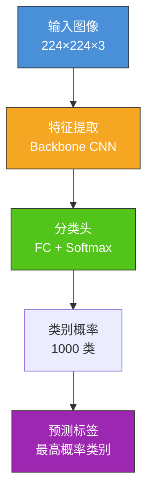
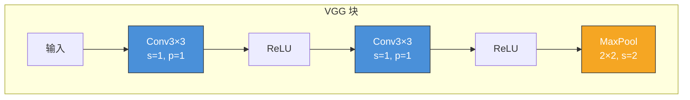
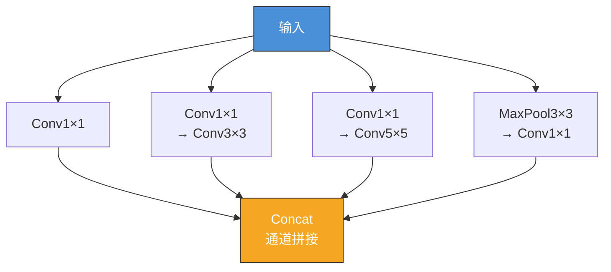
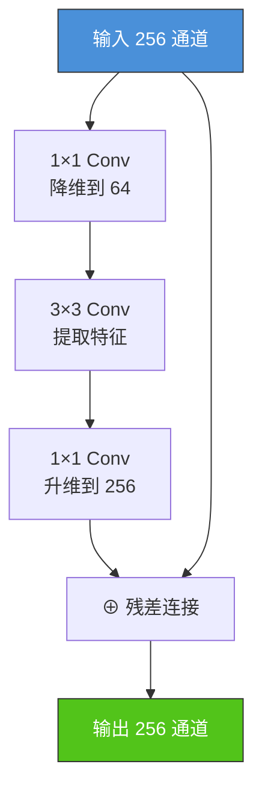
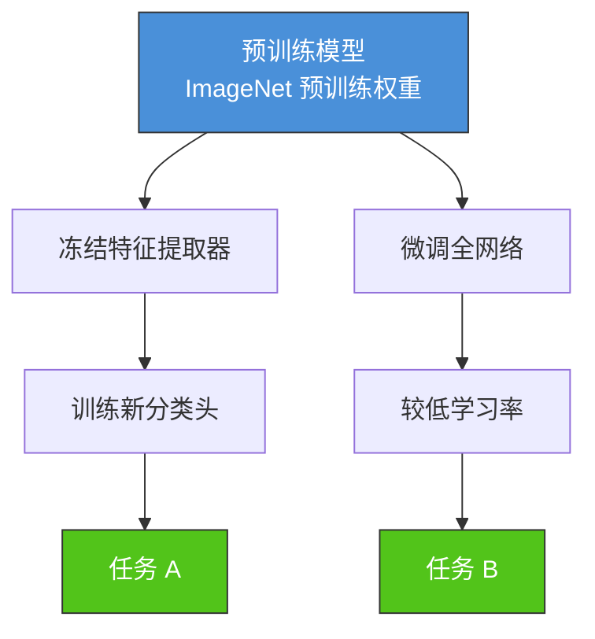
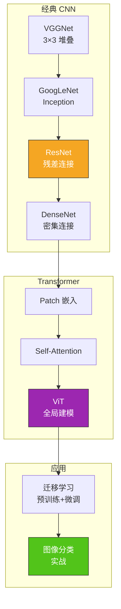

# 7.1 图像分类与经典网络

## 📌 基本概念

### 图像分类任务

图像分类（Image Classification）是计算机视觉中最基础的任务，目标是将输入图像分配到预定义的类别标签中。

$$f: \text{Image} \rightarrow \text{Label}$$



### 分类评价指标

| 指标 | 公式 | 含义 |
|------|------|------|
| **Top-1 Accuracy** | 预测概率最高的类别是否正确 | 最严格的分类标准 |
| **Top-5 Accuracy** | 预测概率前 5 中是否包含正确标签 | ImageNet 默认指标 |
| **Precision** | $\frac{TP}{TP+FP}$ | 精确率 |
| **Recall** | $\frac{TP}{TP+FN}$ | 召回率 |
| **F1-Score** | $2 \cdot \frac{P \cdot R}{P + R}$ | 精确率与召回率的调和平均 |

## 🏛️ 经典 CNN 架构进阶

### VGGNet（2014）

VGGNet 由牛津大学视觉几何组（VGG）提出，核心创新是使用**统一的 3×3 卷积核**堆叠构建深层网络。

#### 核心设计思想

**感受野等效**：
- 两个 3×3 卷积（步长 1）的感受野 = 5×5
- 三个 3×3 卷积（步长 1）的感受野 = 7×7

**优势**：
1. 参数量更少：3×3 堆叠 vs 大卷积核
2. 非线性更强：每层都有 ReLU 激活
3. 泛化更好：3×3 更接近图像基本局部特征



#### VGG-16 结构

| 层 | 配置 | 输出尺寸 |
|----|------|---------|
| 输入 | - | 224×224×3 |
| Conv1 | 64×3×3×3, ReLU × 2 | 224×224×64 |
| Pool1 | MaxPool 2×2 | 112×112×64 |
| Conv2 | 128×3×3×64, ReLU × 2 | 112×112×128 |
| Pool2 | MaxPool 2×2 | 56×56×128 |
| Conv3 | 256×3×3×128, ReLU × 3 | 56×56×256 |
| Pool3 | MaxPool 2×2 | 28×28×256 |
| Conv4 | 512×3×3×256, ReLU × 3 | 28×28×512 |
| Pool4 | MaxPool 2×2 | 14×14×512 |
| Conv5 | 512×3×3×512, ReLU × 3 | 14×14×512 |
| Pool5 | MaxPool 2×2 | 7×7×512 |
| FC1 | 4096 | 4096 |
| FC2 | 4096 | 4096 |
| FC3 | 1000 (Softmax) | 1000 |

**总参数量**：约 138M

### GoogLeNet（2014）

GoogLeNet 引入了 **Inception 模块**，在同一层中使用多种尺寸的卷积核，实现多尺度特征提取。

#### Inception 模块



**1×1 卷积的作用**：在昂贵的大卷积之前进行降维，减少计算量。

#### 辅助分类器

GoogLeNet 在中间层添加了两个辅助分类器，缓解深层网络的梯度消失问题。

**总参数量**：约 5M（远小于 VGGNet）

### ResNet（2015）

ResNet 是图像分类领域的里程碑，通过**残差连接**（跳跃连接）使训练超深网络成为可能。

#### 深层网络退化问题


#### 残差学习

$$\mathbf{y} = \mathcal{F}(\mathbf{x}, \{W_i\}) + \mathbf{x}$$

- 网络学习目标从 $H(\mathbf{x})$ 变为残差 $F(\mathbf{x}) = H(\mathbf{x}) - \mathbf{x}$
- 当 $F(\mathbf{x}) = 0$ 时，即为恒等映射 $H(\mathbf{x}) = \mathbf{x}$
- 恒等映射的学习远比非线性映射简单

#### Bottleneck 设计



### DenseNet（2017）

DenseNet 通过**密集连接**将每一层与前面所有层相连，实现特征重用。

#### 密集连接

$$\mathbf{x}_l = H\left([\mathbf{x}_0, \mathbf{x}_1, \ldots, \mathbf{x}_{l-1}]\right)$$

每个层的输入是前面所有层输出的拼接（Concatenation），有效梯度流动和特征复用。

**优点**：
- 特征重用：每层都能访问前面所有特征
- 梯度流动：密集连接改善梯度传播
- 参数高效：参数量更小
- 隐式深度监督：每层都有直接监督信号

### 架构对比

| 架构 | 年份 | 核心创新 | 参数量 | Top-5 Error |
|------|------|---------|--------|-------------|
| VGG-19 | 2014 | 3×3 卷积堆叠 | 143M | 7.3% |
| GoogLeNet | 2014 | Inception 多尺度 | 5M | 6.7% |
| ResNet-152 | 2015 | 残差连接 | 60M | 3.3% |
| DenseNet-169 | 2017 | 密集连接 | 14M | 3.3% |
| EfficientNet-B7 | 2019 | 复合缩放 | 66M | 2.5% |
| ViT-L | 2020 | Transformer | 304M | 0.1% (JFT) |

## 🐍 Vision Transformer (ViT)

### ViT 架构

ViT 将 Transformer 引入视觉领域，将图像分割为**视觉令牌**（Visual Tokens），通过 Self-Attention 进行全局特征建模。


### ViT 与 CNN 的对比

| 特性 | CNN | ViT |
|------|-----|-----|
| 感受野 | 局部（逐层扩大） | 全局（每层都是全局） |
| 参数效率 | 高（共享权重） | 较低 |
| 数据需求 | 中小数据集即可 | 需要大数据集（>100M） |
| 归纳偏置 | 平移不变、局部相关性 | 几乎无归纳偏置 |
| 训练速度 | 快 | 慢 |
| 迁移学习 | 成熟 | 预训练+微调效果好 |

### PyTorch 实现：简化 ViT

```python
import torch
import torch.nn as nn

class PatchEmbedding(nn.Module):
    def __init__(self, img_size=224, patch_size=16, in_channels=3, embed_dim=768):
        super(PatchEmbedding, self).__init__()
        self.num_patches = (img_size // patch_size) ** 2
        self.projection = nn.Conv2d(in_channels, embed_dim, kernel_size=patch_size, stride=patch_size)

    def forward(self, x):
        x = self.projection(x)
        x = x.flatten(2).transpose(1, 2)
        return x

class MultiHeadAttention(nn.Module):
    def __init__(self, embed_dim, num_heads):
        super(MultiHeadAttention, self).__init__()
        self.num_heads = num_heads
        self.head_dim = embed_dim // num_heads
        self.scale = self.head_dim ** -0.5
        self.qkv = nn.Linear(embed_dim, embed_dim * 3)
        self.proj = nn.Linear(embed_dim, embed_dim)

    def forward(self, x):
        B, N, C = x.shape
        qkv = self.qkv(x).reshape(B, N, 3, self.num_heads, self.head_dim).permute(2, 0, 3, 1, 4)
        q, k, v = qkv[0], qkv[1], qkv[2]
        attn = (q @ k.transpose(-2, -1)) * self.scale
        attn = attn.softmax(dim=-1)
        x = (attn @ v).transpose(1, 2).reshape(B, N, C)
        return self.proj(x)

class TransformerBlock(nn.Module):
    def __init__(self, embed_dim, num_heads, mlp_dim, dropout=0.1):
        super(TransformerBlock, self).__init__()
        self.norm1 = nn.LayerNorm(embed_dim)
        self.attn = MultiHeadAttention(embed_dim, num_heads)
        self.norm2 = nn.LayerNorm(embed_dim)
        self.mlp = nn.Sequential(
            nn.Linear(embed_dim, mlp_dim),
            nn.GELU(),
            nn.Dropout(dropout),
            nn.Linear(mlp_dim, embed_dim),
            nn.Dropout(dropout)
        )

    def forward(self, x):
        x = x + self.attn(self.norm1(x))
        x = x + self.mlp(self.norm2(x))
        return x

class SimpleViT(nn.Module):
    def __init__(self, img_size=224, patch_size=16, in_channels=3,
                 num_classes=1000, embed_dim=768, num_heads=12,
                 num_layers=12, mlp_dim=3072):
        super(SimpleViT, self).__init__()
        self.patch_embed = PatchEmbedding(img_size, patch_size, in_channels, embed_dim)
        self.cls_token = nn.Parameter(torch.zeros(1, 1, embed_dim))
        self.pos_embed = nn.Parameter(torch.zeros(1, self.patch_embed.num_patches + 1, embed_dim))
        self.transformer = nn.Sequential(*[
            TransformerBlock(embed_dim, num_heads, mlp_dim)
            for _ in range(num_layers)
        ])
        self.head = nn.Sequential(
            nn.LayerNorm(embed_dim),
            nn.Linear(embed_dim, num_classes)
        )

    def forward(self, x):
        B = x.shape[0]
        x = self.patch_embed(x)
        cls_tokens = self.cls_token.expand(B, -1, -1)
        x = torch.cat((cls_tokens, x), dim=1)
        x = x + self.pos_embed
        x = self.transformer(x)
        x = x[:, 0]
        x = self.head(x)
        return x

model = SimpleViT(img_size=224, patch_size=16, num_classes=10)
x = torch.randn(2, 3, 224, 224)
y = model(x)
print(f"ViT 输出形状: {y.shape}")
total_params = sum(p.numel() for p in model.parameters())
print(f"ViT 参数量: {total_params:,}")
```

## 🔄 迁移学习

### 迁移学习范式



### PyTorch 迁移学习实战

```python
import torch
import torch.nn as nn
import torch.optim as optim
from torchvision import models, datasets, transforms

transform_train = transforms.Compose([
    transforms.RandomResizedCrop(224),
    transforms.RandomHorizontalFlip(),
    transforms.ToTensor(),
    transforms.Normalize([0.485, 0.456, 0.406], [0.229, 0.224, 0.225])
])

transform_val = transforms.Compose([
    transforms.Resize(256),
    transforms.CenterCrop(224),
    transforms.ToTensor(),
    transforms.Normalize([0.485, 0.456, 0.406], [0.229, 0.224, 0.225])
])

trainset = datasets.CIFAR10(root='./data', train=True, download=True, transform=transform_train)
valset = datasets.CIFAR10(root='./data', train=False, download=True, transform=transform_val)
trainloader = torch.utils.data.DataLoader(trainset, batch_size=32, shuffle=True)
valloader = torch.utils.data.DataLoader(valset, batch_size=32, shuffle=False)

model = models.resnet18(pretrained=True)

for param in model.parameters():
    param.requires_grad = False

num_features = model.fc.in_features
model.fc = nn.Sequential(
    nn.Linear(num_features, 256),
    nn.ReLU(),
    nn.Dropout(0.3),
    nn.Linear(256, 10)
)

optimizer = optim.Adam(model.fc.parameters(), lr=0.001)
criterion = nn.CrossEntropyLoss()

for epoch in range(10):
    model.train()
    train_loss = 0.0
    for inputs, labels in trainloader:
        optimizer.zero_grad()
        outputs = model(inputs)
        loss = criterion(outputs, labels)
        loss.backward()
        optimizer.step()
        train_loss += loss.item()

    model.eval()
    correct = 0
    total = 0
    with torch.no_grad():
        for inputs, labels in valloader:
            outputs = model(inputs)
            _, predicted = torch.max(outputs, 1)
            total += labels.size(0)
            correct += (predicted == labels).sum().item()

    print(f"Epoch [{epoch+1}/10], Loss: {train_loss/len(trainloader):.4f}, Acc: {correct/total:.4f}")
```

## 📊 知识结构图



## 🌍 实际应用

### 图像搜索
基于预训练模型提取特征，实现以图搜图。

### 医学图像分类
利用迁移学习在有限医学数据上训练疾病检测模型。

### 移动端分类
使用 MobileNet、EfficientNet 等轻量模型在手机端实时分类。

### 多模态融合
结合 CNN/ViT 特征与文本特征进行跨模态检索。

## ⚠️ 注意事项

### 架构选择
1. **入门/轻量**：MobileNet、ShuffleNet
2. **通用视觉**：ResNet、EfficientNet
3. **高精度**：ViT、Swin Transformer
4. **迁移学习**：几乎总是使用预训练模型

### 训练技巧
1. **输入归一化**：使用 ImageNet 均值和标准差
2. **数据增强**：RandomResizedCrop、ColorJitter 等
3. **标签平滑**：Label Smoothing 提升泛化
4. **混合精度训练**：AMP 加速训练

## 💡 考点总结

1. **VGGNet 设计思想**：统一 3×3 卷积核堆叠，感受野等效推导
2. **Inception 模块**：多尺度卷积 + 1×1 降维
3. **ResNet 残差连接**：$F(\mathbf{x}) + \mathbf{x}$，解决退化问题
4. **DenseNet 密集连接**：特征重用和梯度流动
5. **ViT 架构**：Patch 嵌入 → Transformer → CLS 分类
6. **CNN vs ViT**：局部 vs 全局；数据需求差异
7. **迁移学习**：冻结 vs 微调；预训练权重的重要性
8. **PyTorch 实战**：`torchvision.models` 预训练模型使用