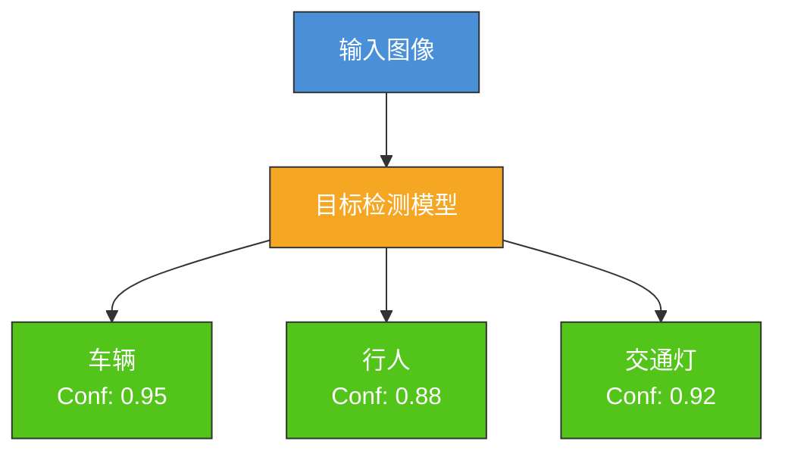
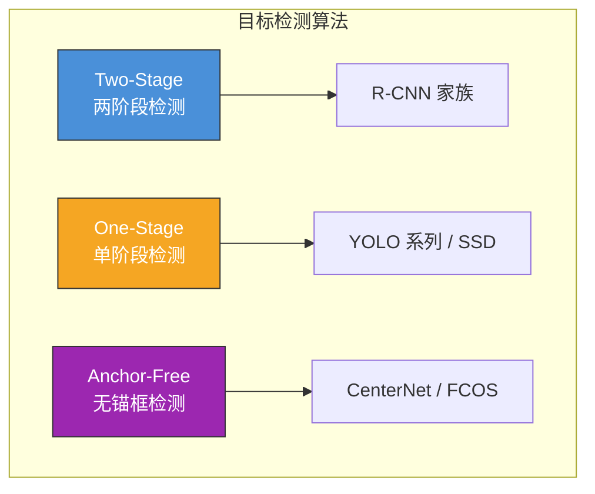
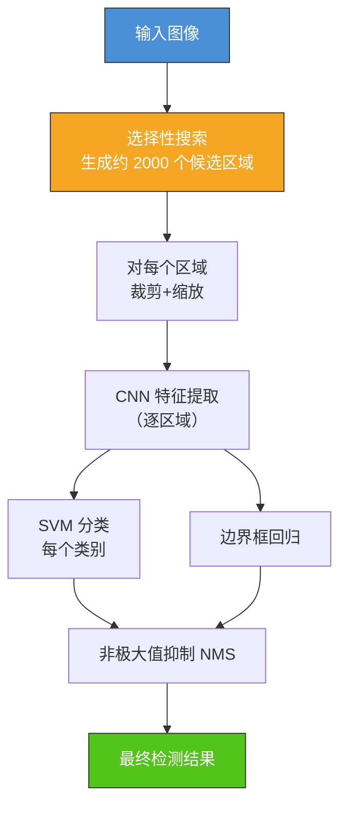
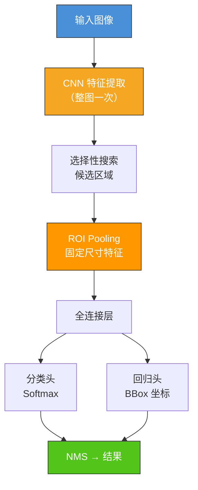
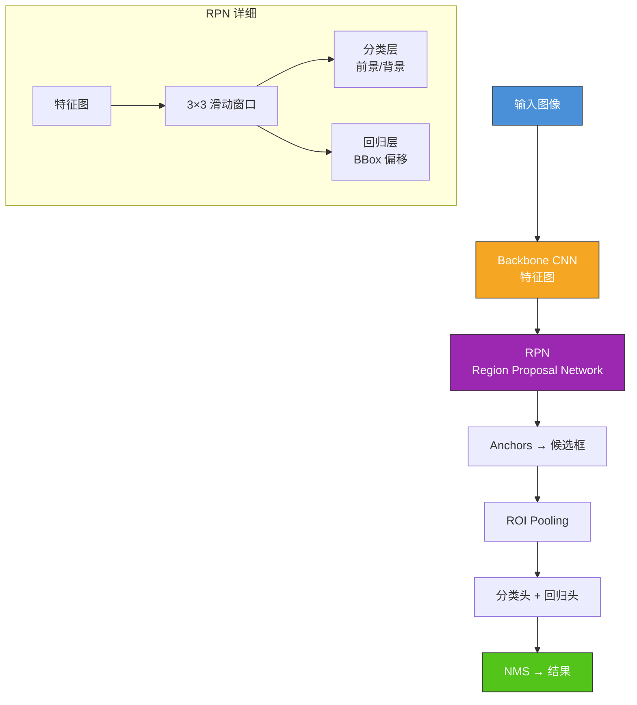
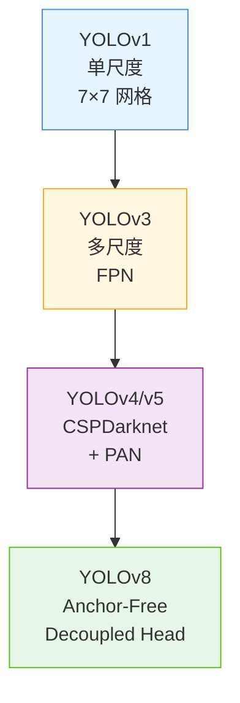
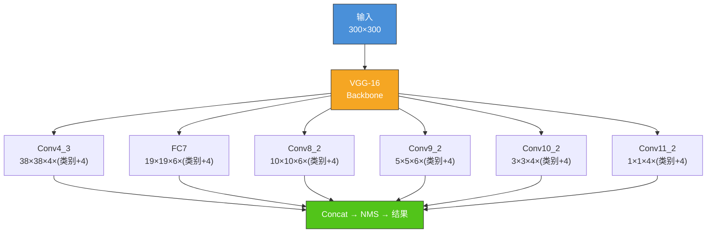
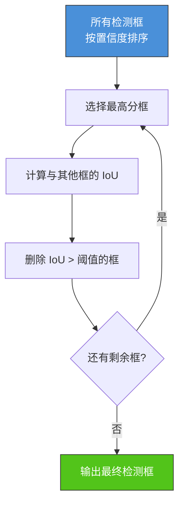
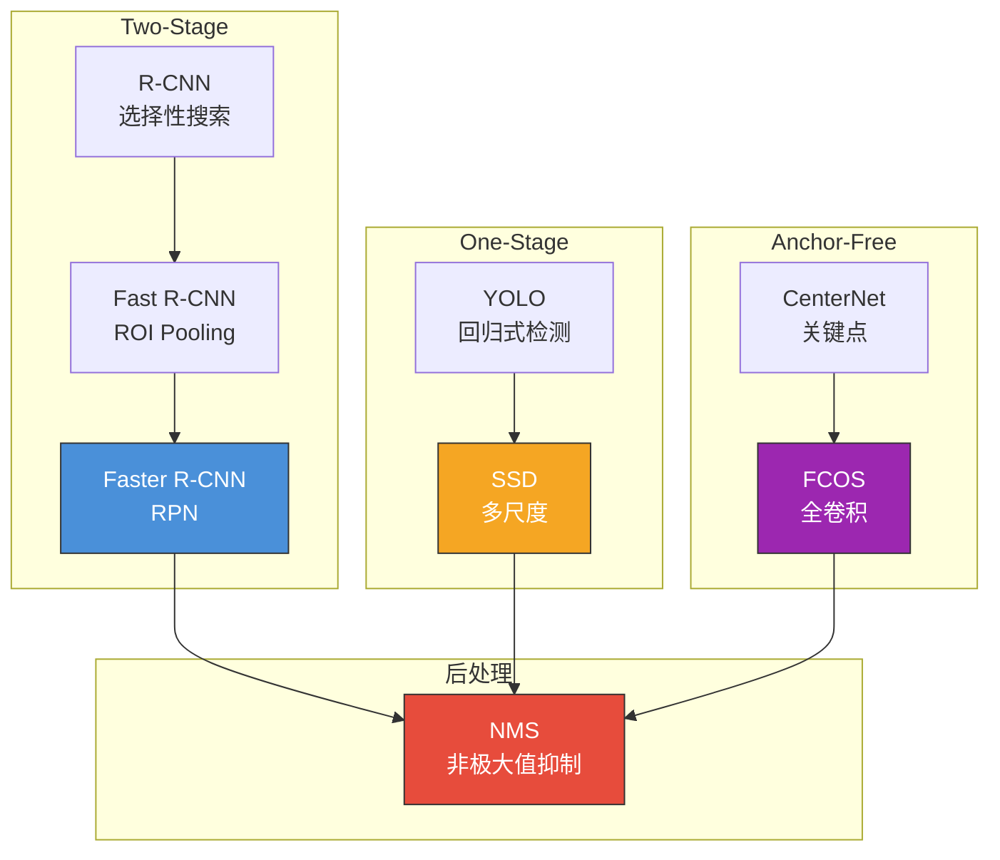

# 7.2 目标检测算法

## 📌 基本概念

### 目标检测任务

目标检测（Object Detection）不仅需要识别图像中的目标类别，还需要定位其位置（边界框）。

$$f: \text{Image} \rightarrow \{(BBox_1, \text{Label}_1, \text{Score}_1), \ldots, (BBox_N, \text{Label}_N, \text{Score}_N)\}$$



### 检测评价指标

#### IoU（交并比）

$$\text{IoU} = \frac{\text{Area of Overlap}}{\text{Area of Union}} = \frac{B_p \cap B_g}{B_p \cup B_g}$$

IoU 衡量预测框与真实框的重叠程度，阈值通常设为 0.5。

#### Precision-Recall 曲线

| 指标 | 公式 | 含义 |
|------|------|------|
| **Precision** | $\frac{TP}{TP + FP}$ | 预测为正的样本中实际为正的比例 |
| **Recall** | $\frac{TP}{TP + FN}$ | 所有正样本中被正确预测的比例 |
| **F1-Score** | $2PR / (P+R)$ | 精确率与召回率的调和平均 |

#### mAP（平均精度均值）

$$\text{mAP} = \frac{1}{N} \sum_{i=1}^{N} AP_i$$

$$AP_i = \int_0^1 P(R) \, dR$$

其中 $N$ 为类别数，$AP_i$ 为第 $i$ 类的平均精度（Precision-Recall 曲线下的面积）。

### 检测算法分类



## 🎯 Two-Stage 检测算法

### R-CNN（2014）

**R-CNN（Regions with CNN features）** 是最早的深度学习目标检测方法。

#### R-CNN 流程



**R-CNN 缺点**：
- 每个候选区域独立计算 CNN 特征 → 非常慢（~47 秒/张）
- 训练流程复杂（CNN + SVM + Bounding Box Regressor）

### Fast R-CNN（2015）

**核心改进**：使用 **ROI Pooling** 实现特征共享。

#### Fast R-CNN 流程



**Fast R-CNN 优势**：
- 特征共享 → 速度提升约 200×（~0.3 秒/张）
- 端到端训练（不再需要 SVM）

### Faster R-CNN（2015）

**核心改进**：引入 **区域建议网络（RPN）**，用神经网络替代选择性搜索。

#### Faster R-CNN 流程



#### RPN 工作原理

RPN 在特征图的每个位置生成 9 个 anchors（3 种尺度 × 3 种宽高比）：
- 尺度：$\{128, 256, 512\}$
- 宽高比：$\{1:1, 1:2, 2:1\}$

RPN 输出：
- 前景/背景分类分数（每个 anchor）
- 边界框偏移量（每个 anchor）

**Faster R-CNN 优势**：
- 完全端到端训练
- 速度进一步提升（~7 FPS on GPU）
- 精度在当时 SOTA

### R-CNN 家族对比

| 版本 | 候选区域 | 特征提取 | 训练方式 | 速度 |
|------|---------|---------|---------|------|
| R-CNN | 选择性搜索 | 每区域独立 CNN | CNN + SVM | ~0.02 FPS |
| Fast R-CNN | 选择性搜索 | 整图 CNN + ROI Pooling | 端到端 | ~7 FPS |
| Faster R-CNN | RPN | 整图 CNN + ROI Pooling | 端到端 | ~17 FPS |
| Faster R-CNN + FPN | RPN + FPN | 多尺度特征 | 端到端 | ~7 FPS |

## ⚡ One-Stage 检测算法

### YOLO 系列

YOLO（You Only Look Once）将检测问题转化为**回归问题**，单次前向传播同时输出所有检测结果。

#### YOLOv1（2015）

**核心思想**：将输入图像划分为 $S \times S$ 网格，每个网格预测 $B$ 个边界框。

$$\text{输出} = S \times S \times (B \times 5 + C)$$

- $S = 7$：网格数
- $B = 2$：每个网格预测的边界框数
- $C = 20$：类别数（VOC 数据集）

**优点**：极快（~45 FPS）
**缺点**：精度较低，小目标检测差

#### YOLOv3（2018）

**核心改进**：
1. 多尺度预测（3 个尺度：13×13、26×26、52×52）
2. 使用 Darknet-53 作为骨干网络（引入残差连接）
3. 多标签分类（Softmax → Logistic）

#### YOLOv4/v5（2020）

**核心改进**：
- CSPDarknet53 骨干网络
- SPP（Spatial Pyramid Pooling）
- PAN（Path Aggregation Network）多尺度特征融合
- 大量训练技巧（Mosaic、CutMix、Label Smoothing）

#### YOLO 架构演进



### SSD（Single Shot MultiBox Detector）

SSD 在不同尺度的特征图上进行检测，实现多尺度目标检测。

#### SSD 架构



**SSD 特点**：
- 多尺度特征检测（6 个尺度）
- 不同尺度使用不同数量的 anchors
- 速度快（~46 FPS on Titan X）

### One-Stage vs Two-Stage 对比

| 特性 | Two-Stage | One-Stage |
|------|-----------|-----------|
| 代表算法 | Faster R-CNN | YOLO/SSD |
| 检测流程 | 候选区域 + 分类回归 | 单次前向传播 |
| 速度 | 较慢（7-17 FPS） | 快（45+ FPS） |
| 精度 | 高（mAP 高） | 较低 |
| 小目标 | 好 | 较差 |
| 适用场景 | 高精度需求 | 实时检测 |

## 🔓 Anchor-Free 检测算法

### Anchor-Free vs Anchor-Based

| 特性 | Anchor-Based | Anchor-Free |
|------|-------------|-------------|
| 代表算法 | Faster R-CNN, YOLO, SSD | CenterNet, FCOS |
| 先验知识 | 需要设计 anchors | 无需 anchors |
| 超参数 | anchor 尺度/比例 | 无 |
| 检测方式 | 分类+回归 | 关键点检测 |
| 后处理 | 需要 NMS | 通常需要 NMS |

### CenterNet

将目标检测建模为**中心点检测**问题：
1. 检测目标中心点（热力图峰值）
2. 预测每个中心点的边界框尺寸

### FCOS（Fully Convolutional One-Stage Detection）

FCOS 是经典的 Anchor-Free 检测器，在每个特征层上预测：
- 分类分数
- 到边界框四条边的距离（$l, t, r, b$）
- 中心度分数

## 🛡️ 非极大值抑制（NMS）

### NMS 算法

NMS 去除同一目标的多个重叠检测框：



### NMS 伪代码

```python
def nms(boxes, scores, iou_threshold=0.5):
    indices = scores.argsort()[::-1]
    keep = []

    while indices.size > 0:
        i = indices[0]
        keep.append(i)
        if indices.size == 1:
            break

        rest = indices[1:]
        ious = compute_iou(boxes[i], boxes[rest])
        mask = ious <= iou_threshold
        indices = rest[mask]

    return keep

boxes = np.array([
    [10, 10, 50, 50],
    [12, 12, 48, 48],
    [100, 100, 150, 150],
    [105, 105, 148, 148],
    [200, 200, 250, 250],
])
scores = np.array([0.9, 0.8, 0.7, 0.6, 0.5])
keep_indices = nms(boxes, scores, iou_threshold=0.5)
print(f"NMS 保留的索引: {keep_indices}")
```

## 💻 PyTorch 目标检测实战

```python
import torch
import torch.nn as nn
import torch.nn.functional as F

class SimpleYOLO(nn.Module):
    def __init__(self, grid_size=7, num_classes=20):
        super(SimpleYOLO, self).__init__()
        self.grid_size = grid_size
        self.num_classes = num_classes

        self.features = nn.Sequential(
            nn.Conv2d(3, 64, 7, stride=2, padding=3),
            nn.BatchNorm2d(64),
            nn.LeakyReLU(0.1),
            nn.MaxPool2d(2),
            nn.Conv2d(64, 192, 3, padding=1),
            nn.BatchNorm2d(192),
            nn.LeakyReLU(0.1),
            nn.MaxPool2d(2),
            nn.Conv2d(192, 384, 3, padding=1),
            nn.BatchNorm2d(384),
            nn.LeakyReLU(0.1),
            nn.Conv2d(384, 256, 3, padding=1),
            nn.BatchNorm2d(256),
            nn.LeakyReLU(0.1),
            nn.MaxPool2d(2),
        )

        self.fc = nn.Sequential(
            nn.Flatten(),
            nn.Linear(256 * 7 * 7, 1024),
            nn.LeakyReLU(0.1),
            nn.Dropout(0.5),
            nn.Linear(1024, grid_size * grid_size * (5 + num_classes)),
        )

    def forward(self, x):
        x = self.features(x)
        x = self.fc(x)
        x = x.view(-1, self.grid_size, self.grid_size, 5 + self.num_classes)
        return x

model = SimpleYOLO(grid_size=7, num_classes=20)
x = torch.randn(2, 3, 448, 448)
y = model(x)
print(f"YOLO 输出形状: {y.shape}")

total_params = sum(p.numel() for p in model.parameters())
print(f"参数量: {total_params:,}")
```

## 📊 知识结构图



## 🌍 实际应用

### 自动驾驶
实时检测车辆、行人、交通标志等，通常使用 YOLO 系列。

### 安防监控
检测人员、物品遗留等，支持实时告警。

### 医学图像
检测肿瘤、病变区域，辅助医生诊断。

### 工业质检
检测产品表面缺陷、装配错误等。

## ⚠️ 注意事项

### 检测算法选择
1. **高精度需求**：Faster R-CNN + FPN，适合小目标检测
2. **实时需求**：YOLOv5/v8，速度快、精度高
3. **边缘设备**：SSD-MobileNet、YOLO-nano

### 训练技巧
1. **数据增强**：Mosaic、Mixup 等在检测中特别有效
2. **多尺度训练**：不同输入尺寸增强尺度鲁棒性
3. **预训练**：使用 COCO 预训练权重进行迁移学习

## 💡 考点总结

1. **Two-Stage vs One-Stage**：两阶段（候选+分类）vs 单阶段（直接回归）
2. **R-CNN 家族演进**：R-CNN → Fast R-CNN（ROI Pooling）→ Faster R-CNN（RPN）
3. **RPN 原理**：3×3 滑动窗口生成 anchors，前景/背景分类 + BBox 回归
4. **YOLO 核心思想**：网格划分、单次回归、多尺度检测
5. **SSD 多尺度检测**：不同特征层负责不同尺度的目标
6. **Anchor-Free 方法**：CenterNet（关键点）、FCOS（距离回归）
7. **NMS 算法**：排序 → 选最高分 → 删除重叠 → 循环
8. **评价指标**：IoU、Precision/Recall、mAP 计算
9. **PyTorch 实战**：YOLO 架构实现、NMS 实现