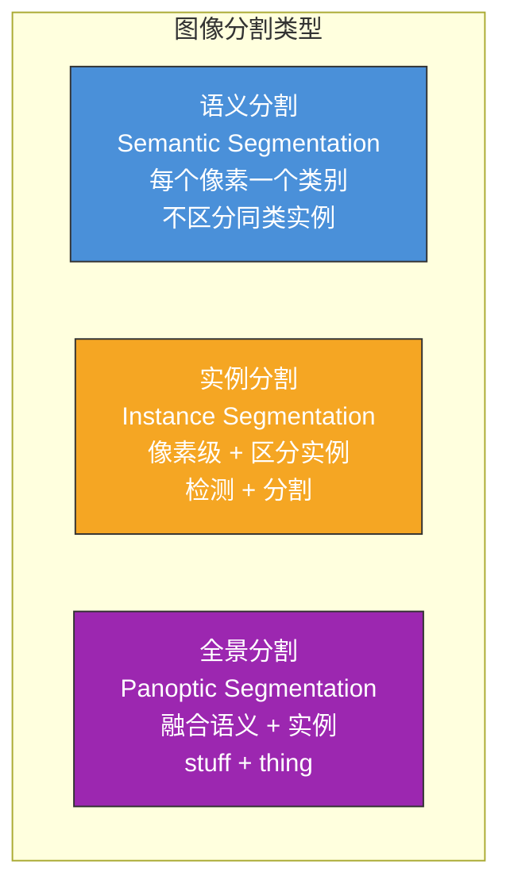
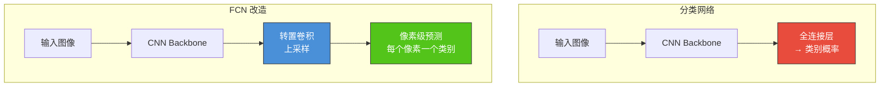
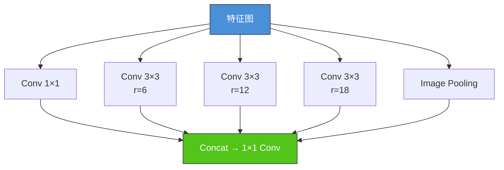
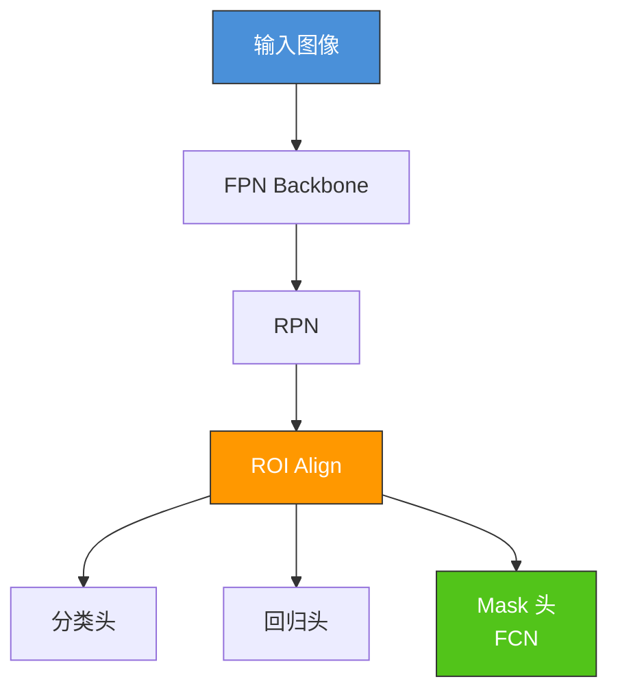
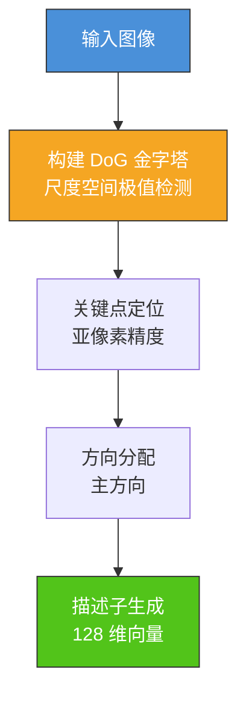
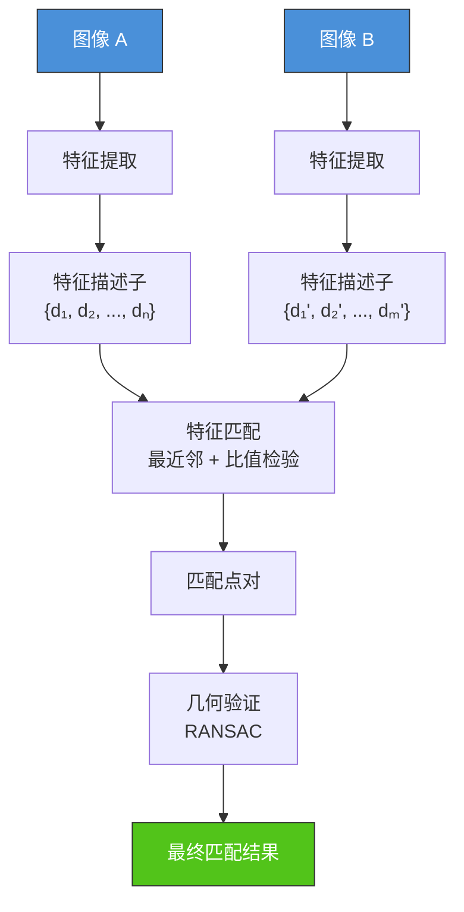
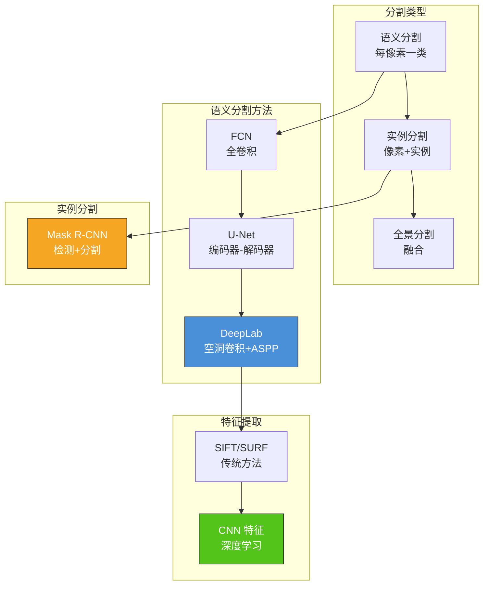

# 7.3 图像分割与特征提取

## 📌 基本概念

### 图像分割任务类型

图像分割将图像分为具有语义意义的区域，是计算机视觉中的核心任务之一。



### 三种分割对比

| 特性 | 语义分割 | 实例分割 | 全景分割 |
|------|---------|---------|---------|
| 输出 | 每像素一类 | 每像素一类+实例ID | 每像素一类+实例ID |
| 同类目标 | 不区分 | 区分每个实例 | 区分每个实例 |
| 背景 | 作为一类 | 不处理 | 作为一类 |
| 代表方法 | FCN、U-Net、DeepLab | Mask R-CNN | Panoptic FPN |
| 典型应用 | 自动驾驶场景理解 | 医学细胞分割 | 全场景理解 |

### 分割评价指标

#### 像素准确率（Pixel Accuracy）

$$\text{PA} = \frac{\sum_i n_{ii}}{\sum_i \sum_j n_{ij}}$$

其中 $n_{ij}$ 为实际类别 $i$ 被预测为类别 $j$ 的像素数（混淆矩阵元素）。

#### 平均像素准确率（MPA）

$$\text{MPA} = \frac{1}{N} \sum_{i=1}^{N} \frac{n_{ii}}{\sum_j n_{ij}}$$

#### 平均交并比（mIoU）

$$\text{mIoU} = \frac{1}{N} \sum_{i=1}^{N} \frac{n_{ii}}{\sum_j n_{ij} - n_{ii} + n_{ii}} = \frac{1}{N} \sum_{i=1}^{N} \frac{n_{ii}}{\sum_j n_{ij}}$$

#### Dice 系数

$$\text{Dice} = \frac{2|P \cap G|}{|P| + |G|} = \frac{2 \cdot \text{IoU}}{1 + \text{IoU}}$$

Dice 系数在医学图像分割中常用，对类别不平衡更鲁棒。

## 🎨 语义分割

### FCN（全卷积网络，2015）

FCN（Fully Convolutional Networks）首次将分类网络改造为像素级分割网络。

#### FCN 核心思想



#### FCN 关键技术

1. **卷积化**：将全连接层替换为 $1 \times 1$ 卷积
2. **转置卷积**（反卷积）：上采样恢复分辨率
3. **跳连接**：融合低层细节和高层语义

#### 转置卷积

转置卷积（Transposed Convolution）实现上采样：

$$\text{输入尺寸}: H_{\text{in}} \times W_{\text{in}}$$
$$\text{输出尺寸}: H_{\text{out}} = (H_{\text{in}} - 1) \times S - 2P + K$$

```python
import torch
import torch.nn as nn

x = torch.randn(1, 3, 7, 7)
conv_transpose = nn.ConvTranspose2d(3, 3, kernel_size=4, stride=2, padding=1)
y = conv_transpose(x)
print(f"输入: {x.shape}")
print(f"输出: {y.shape}")
```

### U-Net（2015）

U-Net 是医学图像分割的经典架构，采用**编码器-解码器**结构。

#### U-Net 架构

```mermaid
flowchart TD
    subgraph 编码器（下采样）
        A["输入<br/>256×256"] --> B["Conv+ReLU×2<br/>256×256×64"]
        B --> C["MaxPool<br/>128×128×64"]
        C --> D["Conv+ReLU×2<br/>128×128×128"]
        D --> E["MaxPool<br/>64×64×128"]
        E --> F["Conv+ReLU×2<br/>64×64×256"]
        F --> G["MaxPool<br/>32×32×256"]
        G --> H["Conv+ReLU×2<br/>32×32×512"]
        H --> I["MaxPool<br/>16×16×512"]
        I --> J["Bottleneck<br/>16×16×1024"]
    end

    subgraph 解码器（上采样）
        J --> K["UpConv<br/>32×32×512"]
        K --> L["Concat<br/>跳跃连接"]
        L --> M["Conv+ReLU×2<br/>32×32×512"]
        M --> N["UpConv<br/>64×64×256"]
        N --> O["Concat"]
        O --> P["Conv+ReLU×2<br/>64×64×256"]
        P --> Q["UpConv"]
        Q --> R["Concat"]
        R --> S["Conv+ReLU×2"]
        S --> T["UpConv"]
        T --> U["Concat"]
        U --> V["Conv+ReLU×2"]
        V --> W["输出<br/>256×256×N类"]
    end

    style A fill:#4a90d9,stroke:#333,color:#fff
    style J fill:#f5a623,stroke:#333,color:#fff
    style W fill:#52c41a,stroke:#333,color:#fff
```

#### U-Net 核心设计

- **编码器**：逐层下采样，提取高层语义特征
- **解码器**：逐层上采样，恢复空间分辨率
- **跳跃连接**：将编码器的低层特征传递到解码器，融合细节信息
- **优点**：数据需求少（医学图像常用）、结构清晰

#### PyTorch 实现：U-Net

```python
import torch
import torch.nn as nn

class DoubleConv(nn.Module):
    def __init__(self, in_channels, out_channels):
        super(DoubleConv, self).__init__()
        self.double_conv = nn.Sequential(
            nn.Conv2d(in_channels, out_channels, 3, padding=1),
            nn.BatchNorm2d(out_channels),
            nn.ReLU(inplace=True),
            nn.Conv2d(out_channels, out_channels, 3, padding=1),
            nn.BatchNorm2d(out_channels),
            nn.ReLU(inplace=True),
        )

    def forward(self, x):
        return self.double_conv(x)

class Down(nn.Module):
    def __init__(self, in_channels, out_channels):
        super(Down, self).__init__()
        self.maxpool_conv = nn.Sequential(
            nn.MaxPool2d(2),
            DoubleConv(in_channels, out_channels)
        )

    def forward(self, x):
        return self.maxpool_conv(x)

class Up(nn.Module):
    def __init__(self, in_channels, out_channels):
        super(Up, self).__init__()
        self.up = nn.ConvTranspose2d(in_channels, in_channels // 2, kernel_size=2, stride=2)
        self.conv = DoubleConv(in_channels, out_channels)

    def forward(self, x1, x2):
        x1 = self.up(x1)
        diffY = x2.size()[2] - x1.size()[2]
        diffX = x2.size()[3] - x1.size()[3]
        x1 = nn.functional.pad(x1, [diffX // 2, diffX - diffX // 2,
                                      diffY // 2, diffY - diffY // 2])
        x = torch.cat([x2, x1], dim=1)
        return self.conv(x)

class UNet(nn.Module):
    def __init__(self, n_channels=3, n_classes=2):
        super(UNet, self).__init__()
        self.n_channels = n_channels
        self.n_classes = n_classes

        self.inc = DoubleConv(n_channels, 64)
        self.down1 = Down(64, 128)
        self.down2 = Down(128, 256)
        self.down3 = Down(256, 512)
        self.down4 = Down(512, 1024)

        self.up1 = Up(1024, 512)
        self.up2 = Up(512, 256)
        self.up3 = Up(256, 128)
        self.up4 = Up(128, 64)
        self.outc = nn.Conv2d(64, n_classes, 1)

    def forward(self, x):
        x1 = self.inc(x)
        x2 = self.down1(x1)
        x3 = self.down2(x2)
        x4 = self.down3(x3)
        x5 = self.down4(x4)

        x = self.up1(x5, x4)
        x = self.up2(x, x3)
        x = self.up3(x, x2)
        x = self.up4(x, x1)
        logits = self.outc(x)
        return logits

model = UNet(n_channels=3, n_classes=2)
x = torch.randn(2, 3, 256, 256)
y = model(x)
print(f"U-Net 输出形状: {y.shape}")
total_params = sum(p.numel() for p in model.parameters())
print(f"参数量: {total_params:,}")
```

### DeepLab 系列

DeepLab 是谷歌提出的语义分割系列，以**空洞卷积（Atrous Convolution）**为核心。

#### 空洞卷积

空洞卷积（Atrous/Dilated Convolution）在不降低分辨率的情况下扩大感受野：

$$y[i] = \sum_{k} x[i + r \cdot k] \cdot w[k]$$

其中 $r$ 为膨胀率（dilation rate），控制采样间隔。

```mermaid
flowchart TD
    subgraph 普通卷积 r=1
        A1["x₁"] & A2["x₂"] & A3["x₃"] & A4["x₄"] & A5["x₅"]
        A1 & A2 & A3 --> B1["w₁ w₂ w₃"]
        A3 & A4 & A5 --> B2["w₁ w₂ w₃"]
    end

    subgraph 空洞卷积 r=2
        C1["x₁"] & C3["x₃"] & C5["x₅"] & C7["x₇"] & C9["x₉"]
        C1 & C3 & C5 --> D1["w₁ w₂ w₃"]
        C5 & C7 & C9 --> D2["w₁ w₂ w₃"]
    end

    style B1 fill:#ff9800,stroke:#333,color:#fff
    style D1 fill:#4a90d9,stroke:#333,color:#fff
```

#### DeepLab 关键组件

| 版本 | 核心创新 |
|------|---------|
| DeepLab v1 | 空洞卷积 + Dense CRF 后处理 |
| DeepLab v2 | ASPP（多尺度空洞卷积金字塔池化） |
| DeepLab v3 | 改进 ASPP + 解码器 |
| DeepLab v3+ | 改进编码器-解码器结构 |

#### ASPP（多尺度空洞卷积）



### 语义分割方法对比

| 方法 | 年份 | 核心创新 | 特点 |
|------|------|---------|------|
| FCN | 2015 | 卷积化 + 转置卷积 | 首次端到端分割 |
| U-Net | 2015 | 编码器-解码器 + 跳跃连接 | 医学图像首选 |
| DeepLab v1 | 2014 | 空洞卷积 + CRF | 大感受野 |
| DeepLab v3+ | 2018 | ASPP + 解码器 | 高精度 |
| PSPNet | 2017 | 金字塔池化 | 多尺度上下文 |
| SegFormer | 2021 | Transformer + MLP | 高效、高精度 |

## 🎭 实例分割

### Mask R-CNN

Mask R-CNN 在 Faster R-CNN 基础上添加**分割分支**，同时实现目标检测和实例分割。

#### Mask R-CNN 架构



#### ROI Align vs ROI Pooling

| 特性 | ROI Pooling | ROI Align |
|------|------------|-----------|
| 量化方式 | 整数量化（最近邻） | 双线性插值（精确） |
| 对齐精度 | 低（量化误差） | 高（无量化误差） |
| 实现 | 简单 | 稍复杂 |

ROI Align 消除了 ROI Pooling 的量化误差，提升了分割精度。

## 🔍 特征提取与匹配

### 传统特征提取

#### SIFT（尺度不变特征变换）

SIFT 是经典的局部特征描述子，具有尺度和旋转不变性。

**SIFT 流程**：



| 步骤 | 描述 |
|------|------|
| 尺度空间极值检测 | DoG（高斯差分）检测多尺度关键点 |
| 关键点定位 | 亚像素精度定位，去除低对比度点和边缘点 |
| 方向分配 | 计算关键点周围梯度方向直方图，分配主方向 |
| 描述子生成 | 将关键点周围区域划分为 4×4 子区域，每个子区域计算 8 方向梯度直方图 → 128 维 |

#### SURF（加速鲁棒特征）

SURF 是 SIFT 的加速版本，使用 Haar 小波近似，速度更快。

| 特性 | SIFT | SURF |
|------|------|------|
| 构建方式 | DoG | DoH（Hessian 近似） |
| 描述子维度 | 128 | 64/128 |
| 速度 | 慢 | 快 3× |
| 精度 | 高 | 略低 |

### 深度学习特征提取

#### CNN 特征提取

使用预训练 CNN（如 ResNet）提取图像特征：

```python
import torch
import torch.nn as nn
from torchvision import models, transforms
from PIL import Image

class FeatureExtractor(nn.Module):
    def __init__(self, model_name='resnet50'):
        super(FeatureExtractor, self).__init__()
        model = getattr(models, model_name)(pretrained=True)
        self.features = nn.Sequential(*list(model.children())[:-1])
        self.features.eval()

    def forward(self, x):
        with torch.no_grad():
            x = self.features(x)
            x = x.squeeze(-1).squeeze(-1)
        return x

transform = transforms.Compose([
    transforms.Resize(256),
    transforms.CenterCrop(224),
    transforms.ToTensor(),
    transforms.Normalize([0.485, 0.456, 0.406], [0.229, 0.224, 0.225])
])

extractors = {
    'resnet50': FeatureExtractor('resnet50'),
    'vgg16': FeatureExtractor('vgg16'),
}

x = torch.randn(1, 3, 224, 224)
for name, ext in extractors.items():
    feat = ext(x)
    print(f"{name} 特征维度: {feat.shape[1]}")
```

### 特征匹配

#### 特征匹配流程



#### 比值检验

为提高匹配质量，Lowe 提出比值检验：

$$\frac{d(p, q_1)}{d(p, q_2)} < 0.8$$

其中 $q_1$ 和 $q_2$ 分别是距离最近和次近的描述子。

#### RANSAC 几何验证

RANSAC（Random Sample Consensus）从匹配点集中拟合几何模型，剔除误匹配：

1. 随机采样 4 对点，计算单应性矩阵 $H$
2. 用 $H$ 变换所有点，计算内点（重投影误差 < 阈值）
3. 重复 $k$ 次，选择内点数最多的 $H$
4. 用所有内点重新估计 $H$

#### Python 实现：特征匹配

```python
import cv2
import numpy as np

def match_features_sift(img1, img2):
    sift = cv2.SIFT_create()
    gray1 = cv2.cvtColor(img1, cv2.COLOR_BGR2GRAY)
    gray2 = cv2.cvtColor(img2, cv2.COLOR_BGR2GRAY)

    kp1, des1 = sift.detectAndCompute(gray1, None)
    kp2, des2 = sift.detectAndCompute(gray2, None)

    bf = cv2.BFMatcher(cv2.NORM_L2)
    matches = bf.knnMatch(des1, des2, k=2)

    good_matches = []
    for m, n in matches:
        if m.distance < 0.75 * n.distance:
            good_matches.append(m)

    src_pts = np.float32([kp1[m.queryIdx].pt for m in good_matches]).reshape(-1, 1, 2)
    dst_pts = np.float32([kp2[m.trainIdx].pt for m in good_matches]).reshape(-1, 1, 2)

    if len(good_matches) >= 4:
        H, mask = cv2.findHomography(src_pts, dst_pts, cv2.RANSAC, 5.0)
        mask = mask.ravel().tolist()
        good_matches = [m for m, inlier in zip(good_matches, mask) if inlier]

    return good_matches, kp1, kp2

img1 = np.random.randint(0, 255, (480, 640, 3), dtype=np.uint8)
img2 = np.random.randint(0, 255, (480, 640, 3), dtype=np.uint8)
matches, kp1, kp2 = match_features_sift(img1, img2)
print(f"匹配点数: {len(matches)}")
```

## 📊 知识结构图



## 🌍 实际应用

### 自动驾驶
- 语义分割：理解道路场景（车道线、行人、车辆）
- 实例分割：区分每个行人/车辆实例
- 全景分割：全场景 360° 理解

### 医学图像
- 语义分割：器官/肿瘤区域分割
- 实例分割：细胞实例分割与计数
- Dice 系数作为主要评价指标

### 遥感图像
- 土地利用分类
- 建筑物/道路提取
- 变化检测

### 增强现实
- 语义分割实现场景理解
- 特征匹配实现姿态估计

## ⚠️ 注意事项

### 分割任务选择
1. **语义分割**：适合类别少、无需区分实例的场景（如道路、天空分割）
2. **实例分割**：需要区分同类不同个体（如细胞分割、行人检测）
3. **全景分割**：最完整的场景理解，计算开销最大

### 训练要点
1. **类别不平衡**：使用加权交叉熵、Dice Loss、Focal Loss
2. **数据增强**：随机裁剪、翻转、颜色抖动
3. **预训练权重**：使用 ImageNet 预训练的 Backbone
4. **多尺度训练**：适应不同尺度的目标

### 特征匹配注意
1. **图像质量**：模糊图像会严重影响特征点检测
2. **视角变化**：大视角变化需要更强的描述子（如 SIFT 旋转不变性）
3. **实时性**：SURF/ORB 比 SIFT 更快
4. **RANSAC 参数**：阈值和迭代次数影响匹配质量

## 💡 考点总结

1. **三种分割类型**：语义分割（每像素一类）、实例分割（像素+实例ID）、全景分割（融合）
2. **分割评价指标**：PA、MPA、mIoU、Dice 系数计算公式
3. **FCN 核心思想**：卷积化 + 转置卷积 + 跳连接
4. **U-Net 架构**：编码器-解码器 + 跳跃连接，医学图像首选
5. **空洞卷积**：$y[i] = \sum x[i+r\cdot k] \cdot w[k]$，扩大感受野
6. **ASPP**：多尺度空洞卷积 + 图像池化
7. **Mask R-CNN**：Faster R-CNN + Mask 分支，ROI Align
8. **ROI Align vs ROI Pooling**：双线性插值 vs 整数量化
9. **SIFT 流程**：DoG → 关键点 → 方向 → 描述子
10. **特征匹配流程**：特征提取 → 比值检验 → RANSAC
11. **RANSAC 原理**：随机采样 → 估计模型 → 计算内点 → 迭代选择最优
12. **PyTorch 实战**：U-Net 实现、特征提取器使用