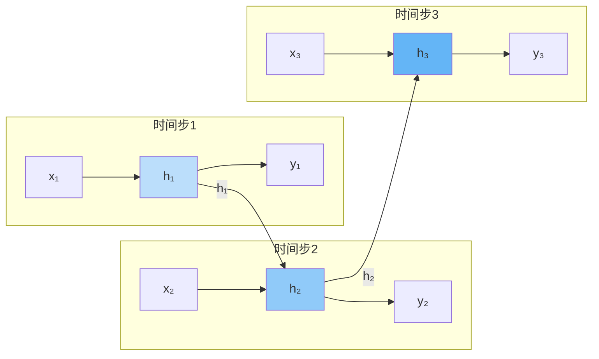
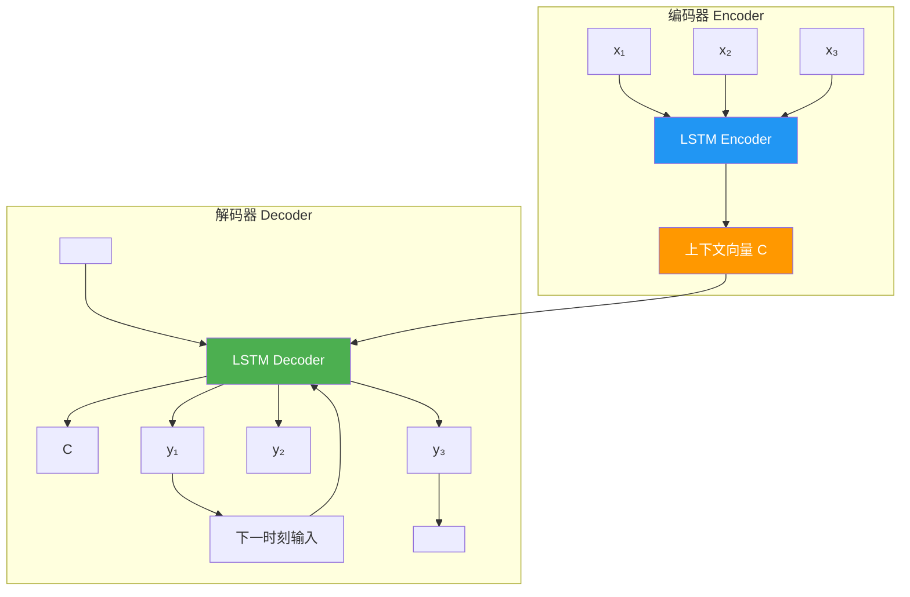
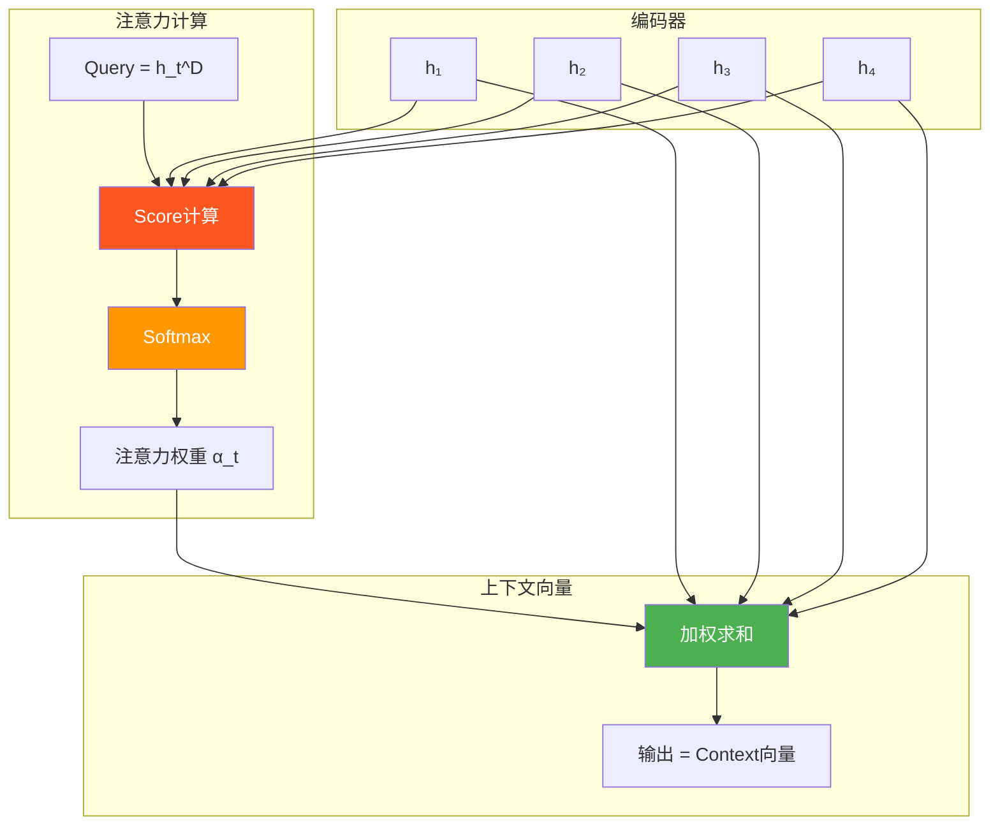

# 8.2 RNN与序列模型

## 一、循环神经网络基础

### 1.1 为什么需要RNN？

前馈神经网络（DNN）和CNN都无法有效处理序列数据，因为：
- 序列数据长度不固定
- 序列前后存在依赖关系
- 传统网络的输入是固定长度

### 1.2 朴素RNN（Vanilla RNN）

**定义：** 一种具有循环连接的神经网络，能够处理任意长度的序列数据。

#### 结构示意图

```mermaid
flowchart TD
    subgraph 展开结构
        X1[x₁] --> H1[RNN Cell]
        H1 --> Y1[y₁]
        H1 --> H2[RNN Cell]
        X2[x₂] --> H2
        H2 --> Y2[y₂]
        H2 --> H3[RNN Cell]
        X3[x₃] --> H3
        H3 --> Y3[y₃]
    end

    subgraph 折叠结构
        X[x_t] --> RNN[RNN Cell]
        RNN --> Y[y_t]
        RNN -->|h_{t-1}| RNN
    end

    style H1 fill:#4CAF50,color:white
    style H2 fill:#4CAF50,color:white
    style H3 fill:#4CAF50,color:white
    style RNN fill:#FF9800,color:white
```

#### 数学公式

$$h_t = \tanh(W_{hh} h_{t-1} + W_{xh} x_t + b_h)$$

$$y_t = W_{hy} h_t + b_y$$

$$\hat{y}_t = \text{softmax}(y_t)$$

其中：
- $x_t \in \mathbb{R}^{d}$：时刻 $t$ 的输入
- $h_t \in \mathbb{R}^{h}$：时刻 $t$ 的隐藏状态
- $y_t \in \mathbb{R}^{v}$：时刻 $t$ 的输出
- $W_{xh} \in \mathbb{R}^{h \times d}$：输入到隐藏层的权重
- $W_{hh} \in \mathbb{R}^{h \times h}$：隐藏层到隐藏层的权重（循环权重）
- $W_{hy} \in \mathbb{R}^{v \times h}$：隐藏层到输出的权重

#### RNN的信息流向



#### RNN的问题：梯度消失与梯度爆炸

**问题描述：** RNN在处理长序列时，由于循环权重的重复乘法，梯度会指数级缩小或增大。

$$\frac{\partial h_T}{\partial h_1} = \prod_{t=2}^{T} \frac{\partial h_t}{\partial h_{t-1}} = \prod_{t=2}^{T} W_{hh}^\top \cdot \text{diag}(1 - h_t^2)$$

**解决方案：** 梯度裁剪（Gradient Clipping）、更好的初始化、LSTM/GRU

#### PyTorch实现

```python
import torch
import torch.nn as nn

class VanillaRNN(nn.Module):
    def __init__(self, input_size, hidden_size, output_size):
        super().__init__()
        self.hidden_size = hidden_size
        self.input_to_hidden = nn.Linear(input_size, hidden_size)
        self.hidden_to_hidden = nn.Linear(hidden_size, hidden_size)
        self.hidden_to_output = nn.Linear(hidden_size, output_size)

    def forward(self, x, hidden=None):
        batch_size, seq_len, _ = x.shape
        if hidden is None:
            hidden = torch.zeros(batch_size, self.hidden_size, device=x.device)

        outputs = []
        for t in range(seq_len):
            h = torch.tanh(self.input_to_hidden(x[:, t, :]) + self.hidden_to_hidden(hidden))
            o = self.hidden_to_output(h)
            outputs.append(o)
            hidden = h

        outputs = torch.stack(outputs, dim=1)
        return outputs, hidden

input_size = 100
hidden_size = 128
output_size = 50
rnn = VanillaRNN(input_size, hidden_size, output_size)
x = torch.randn(32, 20, input_size)
outputs, hidden = rnn(x)
print("Output shape:", outputs.shape)
print("Hidden shape:", hidden.shape)
```

---

## 二、LSTM（长短期记忆网络）

### 2.1 LSTM设计理念

**核心思想：** 引入细胞状态（Cell State）和门控机制，控制信息的保留和遗忘，解决梯度消失问题。

### 2.2 LSTM架构

#### 整体结构

```mermaid
flowchart TD
    subgraph LSTM Cell
        X[x_t] --> G[输入门 i_t]
        H_prev[h_{t-1}] --> G
        G --> C_tilde[候选值 C̃_t]
        X --> F[遗忘门 f_t]
        H_prev --> F
        F --> C[细胞状态 C_t]
        C_prev[C_{t-1}] --> C
        C_tilde --> C
        C --> O[输出门 o_t]
        X --> O
        H_prev --> O
        O --> H[h_t = o_t ⊙ tanh(C_t)]
        C --> H
    end

    style G fill:#4CAF50,color:white
    style F fill:#FF5722,color:white
    style O fill:#2196F3,color:white
    style C fill:#9C27B0,color:white
    style H fill:#FF9800,color:white
```

#### 门控机制详解

**① 遗忘门（Forget Gate）**

决定从细胞状态中丢弃什么信息。

$$f_t = \sigma(W_f \cdot [h_{t-1}, x_t] + b_f)$$

**② 输入门（Input Gate）**

决定将多少新信息存入细胞状态。

$$i_t = \sigma(W_i \cdot [h_{t-1}, x_t] + b_i)$$

$$\tilde{C}_t = \tanh(W_C \cdot [h_{t-1}, x_t] + b_C)$$

**③ 细胞状态更新**

$$C_t = f_t \odot C_{t-1} + i_t \odot \tilde{C}_t$$

**④ 输出门（Output Gate）**

决定输出什么信息。

$$o_t = \sigma(W_o \cdot [h_{t-1}, x_t] + b_o)$$

$$h_t = o_t \odot \tanh(C_t)$$

### 2.3 LSTM的数据流

```mermaid
flowchart LR
    subgraph 输入
        X[x_t]
        H[h_{t-1}]
        CP[C_{t-1}]
    end

    subgraph 门控计算
        direction TB
        F1[f_t = σ(W_f·[h_{t-1},x_t] + b_f)]
        F2[i_t = σ(W_i·[h_{t-1},x_t] + b_i)]
        F3[C̃_t = tanh(W_C·[h_{t-1},x_t] + b_C)]
    end

    subgraph 状态更新
        S1[C_t = f_t⊙C_{t-1} + i_t⊙C̃_t]
        S2[o_t = σ(W_o·[h_{t-1},x_t] + b_o)]
        S3[h_t = o_t⊙tanh(C_t)]
    end

    X --> F1
    H --> F1
    X --> F2
    H --> F2
    X --> F3
    H --> F3
    F1 --> S1
    CP --> S1
    F2 --> S1
    F3 --> S1
    S1 --> S2
    X --> S2
    H --> S2
    S1 --> S3
    S2 --> S3

    style F1 fill:#FF5722,color:white
    style F2 fill:#4CAF50,color:white
    style F3 fill:#8BC34A,color:white
    style S1 fill:#9C27B0,color:white
    style S2 fill:#2196F3,color:white
    style S3 fill:#FF9800,color:white
```

### 2.4 LSTM PyTorch实现

```python
import torch
import torch.nn as nn

class CustomLSTM(nn.Module):
    def __init__(self, input_size, hidden_size):
        super().__init__()
        self.hidden_size = hidden_size
        self.forget_gate = nn.Linear(input_size + hidden_size, hidden_size)
        self.input_gate = nn.Linear(input_size + hidden_size, hidden_size)
        self.cell_gate = nn.Linear(input_size + hidden_size, hidden_size)
        self.output_gate = nn.Linear(input_size + hidden_size, hidden_size)

    def forward(self, x, state=None):
        batch_size, seq_len, _ = x.shape
        if state is None:
            h = torch.zeros(batch_size, self.hidden_size, device=x.device)
            c = torch.zeros(batch_size, self.hidden_size, device=x.device)
        else:
            h, c = state

        outputs = []
        for t in range(seq_len):
            combined = torch.cat([x[:, t, :], h], dim=1)

            f = torch.sigmoid(self.forget_gate(combined))
            i = torch.sigmoid(self.input_gate(combined))
            c_tilde = torch.tanh(self.cell_gate(combined))
            o = torch.sigmoid(self.output_gate(combined))

            c = f * c + i * c_tilde
            h = o * torch.tanh(c)
            outputs.append(h)

        outputs = torch.stack(outputs, dim=1)
        return outputs, (h, c)

input_size = 100
hidden_size = 128
lstm = CustomLSTM(input_size, hidden_size)
x = torch.randn(32, 20, input_size)
outputs, (h_n, c_n) = lstm(x)
print("LSTM output shape:", outputs.shape)
print("Final hidden shape:", h_n.shape)
```

---

## 三、GRU（门控循环单元）

### 3.1 GRU设计理念

**核心思想：** 简化LSTM的结构，将细胞状态和隐藏状态合并，减少门控数量。

### 3.2 GRU架构

```mermaid
flowchart TD
    subgraph GRU Cell
        X[x_t] --> Z[更新门 z_t]
        H_prev[h_{t-1}] --> Z
        Z --> H_new[新状态 h_t]
        X --> R[重置门 r_t]
        H_prev --> R
        R --> H_tilde[候选状态 h̃_t]
        H_prev --> H_new
        H_tilde --> H_new
    end

    style Z fill:#4CAF50,color:white
    style R fill:#FF5722,color:white
    style H_tilde fill:#8BC34A,color:white
    style H_new fill:#FF9800,color:white
```

### 3.3 GRU数学公式

**更新门（Update Gate）：**

$$z_t = \sigma(W_z \cdot [h_{t-1}, x_t])$$

**重置门（Reset Gate）：**

$$r_t = \sigma(W_r \cdot [h_{t-1}, x_t])$$

**候选隐藏状态：**

$$\tilde{h}_t = \tanh(W \cdot [r_t \odot h_{t-1}, x_t])$$

**最终隐藏状态：**

$$h_t = (1 - z_t) \odot h_{t-1} + z_t \odot \tilde{h}_t$$

### 3.4 GRU vs LSTM 对比

| 维度 | LSTM | GRU |
|------|------|-----|
| 门控数量 | 3个（遗忘/输入/输出） | 2个（更新/重置） |
| 参数数量 | 多（4个权重矩阵） | 少（3个权重矩阵） |
| 细胞状态 | 独立的细胞状态 | 无独立细胞状态 |
| 训练速度 | 较慢 | 快 |
| 长依赖 | 表现更好 | 表现略差 |
| 适用场景 | 需要长记忆的复杂任务 | 资源受限的场景 |

---

## 四、Seq2Seq模型

### 4.1 Seq2Seq概述

**定义：** 一种编码器-解码器架构，将一个序列映射为另一个序列，广泛用于机器翻译等任务。

### 4.2 基本Seq2Seq结构



### 4.3 Seq2Seq的问题

- **信息瓶颈：** 整个输入序列被压缩为一个固定长度的上下文向量，长序列信息丢失严重
- **无法对齐：** 编码器输出与解码器输入没有对齐关系

---

## 五、注意力机制（Attention Mechanism）

### 5.1 注意力机制核心思想

**核心思想：** 解码器在生成每个输出词时，动态关注输入序列中最相关的部分，而非依赖固定的上下文向量。

### 5.2 注意力架构



### 5.3 注意力计算流程

#### Step 1：计算注意力分数

$$e_{t,i} = v^\top \cdot \tanh(W [h_{t-1}^D; h_i^E])$$

或使用缩放点积注意力：

$$e_{t,i} = \frac{h_{t-1}^{D\top} \cdot h_i^E}{\sqrt{d_k}}$$

#### Step 2：Softmax归一化

$$\alpha_{t,i} = \frac{\exp(e_{t,i})}{\sum_{j=1}^{T} \exp(e_{t,j})}$$

#### Step 3：计算上下文向量

$$c_t = \sum_{i=1}^{T} \alpha_{t,i} \cdot h_i^E$$

#### Step 4：解码器输出

$$\hat{y}_t = \text{softmax}(W_o \cdot [c_t; h_{t-1}^D])$$

### 5.4 注意力机制分类

| 类型 | Query | Key/Value | 适用场景 |
|------|-------|-----------|----------|
| Encoder-Decoder注意力 | 解码器状态 | 编码器输出 | 机器翻译 |
| Self-Attention | 序列自身 | 序列自身 | 文本理解 |
| Cross-Attention | 解码器状态 | 编码器输出 | 多模态任务 |
| Multi-Head Attention | 多头并行 | 多头并行 | Transformer |

### 5.5 带注意力的Seq2Seq PyTorch实现

```python
import torch
import torch.nn as nn
import torch.nn.functional as F

class Attention(nn.Module):
    def __init__(self, enc_dim, dec_dim):
        super().__init__()
        self.enc_dim = enc_dim
        self.dec_dim = dec_dim
        self.W_enc = nn.Linear(enc_dim, dec_dim)
        self.W_dec = nn.Linear(dec_dim, dec_dim)
        self.v = nn.Linear(dec_dim, 1, bias=False)

    def forward(self, enc_outputs, dec_hidden):
        enc_proj = self.W_enc(enc_outputs)
        dec_proj = self.W_dec(dec_hidden).unsqueeze(1)
        scores = self.v(torch.tanh(enc_proj + dec_proj))
        attn_weights = F.softmax(scores, dim=1)
        context = torch.bmm(attn_weights.transpose(1, 2), enc_outputs)
        return context.squeeze(1), attn_weights.squeeze(-1)

class Seq2SeqAttention(nn.Module):
    def __init__(self, input_dim, output_dim, hidden_dim):
        super().__init__()
        self.encoder = nn.LSTM(input_dim, hidden_dim, batch_first=True)
        self.decoder = nn.LSTM(output_dim + hidden_dim, hidden_dim, batch_first=True)
        self.attention = Attention(hidden_dim, hidden_dim)
        self.output_layer = nn.Linear(hidden_dim, output_dim)

    def forward(self, src, tgt):
        enc_outputs, (enc_h, enc_c) = self.encoder(src)
        dec_hidden = enc_h[-1]
        context, _ = self.attention(enc_outputs, dec_hidden)
        dec_input = torch.cat([tgt[:, 0:1], context.unsqueeze(1)], dim=-1)
        dec_outputs = []
        for t in range(tgt.size(1)):
            dec_out, (dec_hidden, dec_c) = self.decoder(dec_input, (dec_hidden.unsqueeze(0), enc_c))
            context, _ = self.attention(enc_outputs, dec_hidden.squeeze(0))
            output = self.output_layer(dec_out.squeeze(1))
            dec_outputs.append(output)
            dec_input = torch.cat([output.unsqueeze(1), context.unsqueeze(1)], dim=-1)
        return torch.stack(dec_outputs, dim=1)

input_dim = 300
output_dim = 300
hidden_dim = 256
model = Seq2SeqAttention(input_dim, output_dim, hidden_dim)
src = torch.randn(32, 20, input_dim)
tgt = torch.randn(32, 15, output_dim)
output = model(src, tgt)
print("Seq2Seq output shape:", output.shape)
```

---

## 六、三种循环神经网络对比总结

### 6.1 架构对比

| 维度 | Vanilla RNN | LSTM | GRU |
|------|-------------|------|-----|
| 参数量 | 少 | 多 | 中等 |
| 门控机制 | 无 | 3门（遗忘/输入/输出） | 2门（更新/重置） |
| 长依赖能力 | 差 | 强 | 中 |
| 训练速度 | 快 | 慢 | 中 |
| 梯度消失 | 严重 | 缓解 | 缓解 |
| 实现复杂度 | 简单 | 复杂 | 中等 |

### 6.2 架构图示对比

```mermaid
flowchart TB
    subgraph Vanilla_RNN
        direction LR
        R1[x_t] --> R2[tanh]
        R2 --> R3[h_t]
        R3 -->|循环| R2
    end

    subgraph LSTM
        direction LR
        L1[x_t, h_{t-1}] --> L2[遗忘门 f_t]
        L1 --> L3[输入门 i_t]
        L1 --> L4[候选值 C̃_t]
        L2 --> L5[细胞状态 C_t]
        L3 --> L5
        L4 --> L5
        L5 --> L6[tanh]
        L1 --> L7[输出门 o_t]
        L7 --> L8[h_t]
        L6 --> L8
    end

    subgraph GRU
        direction LR
        G1[x_t, h_{t-1}] --> G2[更新门 z_t]
        G1 --> G3[重置门 r_t]
        G3 --> G4[h_{t-1} ⊙ r_t]
        G1 --> G5[tanh]
        G4 --> G5
        G5 --> G6[候选 h̃_t]
        G2 --> G7[h_t = (1-z_t)⊙h_{t-1} + z_t⊙h̃_t]
        G6 --> G7
    end

    style R2 fill:#FF9800
    style L2 fill:#FF5722
    style L3 fill:#4CAF50
    style L4 fill:#8BC34A
    style L5 fill:#9C27B0
    style L7 fill:#2196F3
    style L8 fill:#FF9800
    style G2 fill:#4CAF50
    style G3 fill:#FF5722
    style G5 fill:#8BC34A
    style G7 fill:#FF9800
```

### 6.3 选择建议

| 任务类型 | 推荐模型 | 原因 |
|----------|----------|------|
| 短序列、简单任务 | Vanilla RNN | 参数少、速度快 |
| 长文本、复杂依赖 | LSTM | 记忆能力强 |
| 中等长度、资源受限 | GRU | 平衡效果和效率 |
| 超长序列 | Transformer | 并行计算、全局注意力 |

---

## 七、考前速记卡

### LSTM核心公式

$$\boxed{f_t = \sigma(W_f \cdot [h_{t-1}, x_t] + b_f)}$$

$$\boxed{i_t = \sigma(W_i \cdot [h_{t-1}, x_t] + b_i)}$$

$$\boxed{\tilde{C}_t = \tanh(W_C \cdot [h_{t-1}, x_t] + b_C)}$$

$$\boxed{C_t = f_t \odot C_{t-1} + i_t \odot \tilde{C}_t}$$

$$\boxed{o_t = \sigma(W_o \cdot [h_{t-1}, x_t] + b_o)}$$

$$\boxed{h_t = o_t \odot \tanh(C_t)}$$

### GRU核心公式

$$\boxed{z_t = \sigma(W_z \cdot [h_{t-1}, x_t])}$$

$$\boxed{r_t = \sigma(W_r \cdot [h_{t-1}, x_t])}$$

$$\boxed{\tilde{h}_t = \tanh(W \cdot [r_t \odot h_{t-1}, x_t])}$$

$$\boxed{h_t = (1 - z_t) \odot h_{t-1} + z_t \odot \tilde{h}_t}$$

### 注意力核心公式

$$\boxed{e_{t,i} = \frac{h_{t-1}^{D\top} \cdot h_i^E}{\sqrt{d_k}}}$$

$$\boxed{\alpha_{t,i} = \text{softmax}(e_{t,i})}$$

$$\boxed{c_t = \sum_{i=1}^{T} \alpha_{t,i} \cdot h_i^E}$$