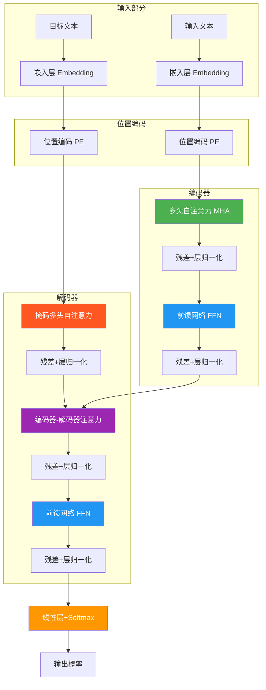
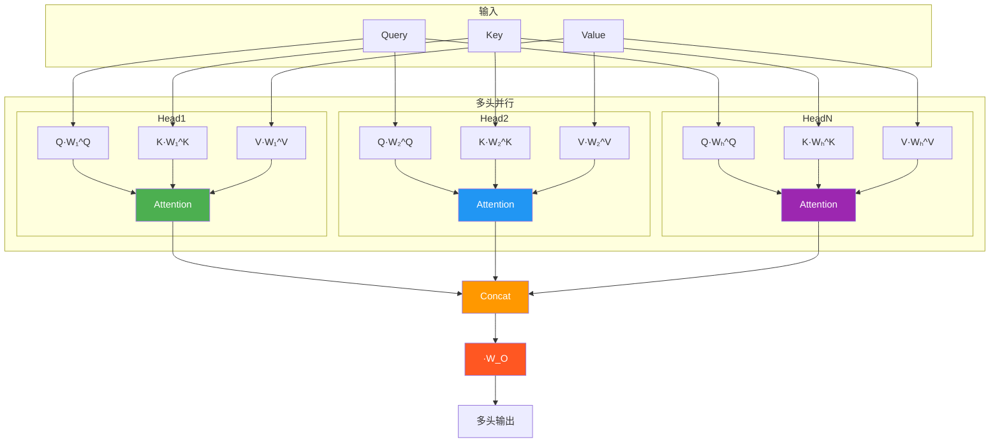
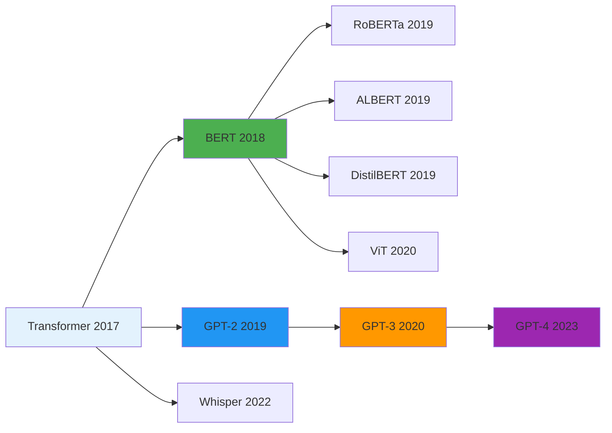

# 8.3 Transformer与BERT

## 一、Transformer架构总览

### 1.1 Transformer设计理念

**核心思想：** 完全基于注意力机制，抛弃循环和卷积，实现真正的并行计算，同时捕获全局依赖关系。

### 1.2 整体架构



### 1.3 Transformer的关键组件

| 组件 | 作用 | 位置 |
|------|------|------|
| 位置编码 | 注入位置信息 | 编码器/解码器输入 |
| 多头自注意力 | 捕获全局依赖 | 编码器、解码器第一层 |
| 编码器-解码器注意力 | 对齐输入输出 | 解码器第二层 |
| 前馈网络 | 非线性变换 | 每层注意力之后 |
| 残差连接 | 缓解梯度消失 | 每个子层之后 |
| 层归一化 | 稳定训练 | 每个子层之后 |

---

## 二、Self-Attention机制

### 2.1 Self-Attention计算流程

#### 步骤1：线性变换得到Q、K、V

$$Q = X \cdot W_Q, \quad K = X \cdot W_K, \quad V = X \cdot W_V$$

其中 $X \in \mathbb{R}^{n \times d}$ 是输入序列，$n$ 是序列长度，$d$ 是嵌入维度。

#### 步骤2：计算注意力分数

$$\text{Attention}(Q, K, V) = \text{softmax}\left(\frac{QK^\top}{\sqrt{d_k}}\right) V$$

$$\text{score}_{ij} = \frac{q_i \cdot k_j}{\sqrt{d_k}}$$

#### 步骤3：Softmax归一化

$$\alpha_{ij} = \frac{\exp(\text{score}_{ij})}{\sum_{k=1}^{n} \exp(\text{score}_{ik})}$$

#### 步骤4：加权求和得到输出

$$\text{output}_i = \sum_{j=1}^{n} \alpha_{ij} \cdot v_j$$

### 2.2 Self-Attention数据流

```mermaid
flowchart TD
    subgraph 输入
        X[输入序列 X]
    end

    subgraph 线性变换
        X --> Q[Q = X·W_Q]
        X --> K[K = X·W_K]
        X --> V[V = X·W_V]
    end

    subgraph 注意力计算
        Q --> S[QKᵀ / √d_k]
        K --> S
        S --> SM[Softmax]
        SM --> A[注意力权重]
    end

    subgraph 输出
        A --> O[output = softmax(QKᵀ/√d_k) · V]
        V --> O
    end

    style Q fill:#4CAF50,color:white
    style K fill:#2196F3,color:white
    style V fill:#FF9800,color:white
    style S fill:#9C27B0,color:white
    style SM fill:#FF5722,color:white
    style O fill:#8BC34A,color:white
```

### 2.3 为什么要除以√d_k？

**问题：** 当 $d_k$ 较大时，$QK^\top$ 的点积值很大，导致Softmax函数进入梯度饱和区，梯度消失。

**解决：** 除以 $\sqrt{d_k}$ 缩放点积，使Softmax的梯度更加稳定。

$$\text{Var}(q \cdot k) = d_k, \quad \text{Var}\left(\frac{q \cdot k}{\sqrt{d_k}}\right) = 1$$

### 2.4 Self-Attention PyTorch实现

```python
import torch
import torch.nn as nn
import torch.nn.functional as F
import math

class ScaledDotProductAttention(nn.Module):
    def __init__(self, d_k):
        super().__init__()
        self.d_k = d_k

    def forward(self, Q, K, V, mask=None):
        scores = torch.matmul(Q, K.transpose(-2, -1)) / math.sqrt(self.d_k)
        if mask is not None:
            scores = scores.masked_fill(mask == 0, float('-inf'))
        attn_weights = F.softmax(scores, dim=-1)
        output = torch.matmul(attn_weights, V)
        return output, attn_weights

d_k = 64
d_model = 512
seq_len = 10
batch_size = 4

Q = torch.randn(batch_size, 8, seq_len, d_k)
K = torch.randn(batch_size, 8, seq_len, d_k)
V = torch.randn(batch_size, 8, seq_len, d_k)

attention = ScaledDotProductAttention(d_k)
output, weights = attention(Q, K, V)
print("Attention output shape:", output.shape)
print("Attention weights shape:", weights.shape)
```

---

## 三、多头注意力（Multi-Head Attention）

### 3.1 多头注意力设计理念

**核心思想：** 将注意力分成多个头并行计算，每个头学习不同的表示子空间，最后拼接线性变换。

### 3.2 多头注意力计算流程

$$\text{MultiHead}(Q, K, V) = \text{Concat}(\text{head}_1, \ldots, \text{head}_h) W_O$$

$$\text{head}_i = \text{Attention}(QW_i^Q, KW_i^K, VW_i^V)$$

其中：
- $h$：头数
- $W_i^Q \in \mathbb{R}^{d \times d_k}$，$W_i^K \in \mathbb{R}^{d \times d_k}$，$W_i^V \in \mathbb{R}^{d \times d_v}$
- $d_k = d_v = d / h$

### 3.3 多头注意力架构



### 3.4 多头注意力的三种形式

| 类型 | Query | Key/Value | 应用场景 |
|------|-------|-----------|----------|
| Self-Attention | 编码器输出 | 编码器输出 | 编码器内部 |
| Masked Self-Attention | 解码器前一层输出 | 解码器前一层输出 | 解码器第一层 |
| Enc-Dec Attention | 解码器输出 | 编码器输出 | 解码器第二层 |

### 3.5 多头注意力PyTorch实现

```python
class MultiHeadAttention(nn.Module):
    def __init__(self, d_model, num_heads):
        super().__init__()
        assert d_model % num_heads == 0
        self.d_k = d_model // num_heads
        self.num_heads = num_heads

        self.W_Q = nn.Linear(d_model, d_model)
        self.W_K = nn.Linear(d_model, d_model)
        self.W_V = nn.Linear(d_model, d_model)
        self.W_O = nn.Linear(d_model, d_model)

        self.attention = ScaledDotProductAttention(self.d_k)

    def forward(self, Q, K, V, mask=None):
        batch_size = Q.size(0)
        seq_len = Q.size(1)

        Q = self.W_Q(Q).view(batch_size, -1, self.num_heads, self.d_k).transpose(1, 2)
        K = self.W_K(K).view(batch_size, -1, self.num_heads, self.d_k).transpose(1, 2)
        V = self.W_V(V).view(batch_size, -1, self.num_heads, self.d_k).transpose(1, 2)

        attn_mask = mask.unsqueeze(1).unsqueeze(2) if mask is not None else None
        output, attn_weights = self.attention(Q, K, V, attn_mask)

        output = output.transpose(1, 2).contiguous().view(batch_size, -1, self.d_k * self.num_heads)
        output = self.W_O(output)
        return output, attn_weights

d_model = 512
num_heads = 8
mha = MultiHeadAttention(d_model, num_heads)
x = torch.randn(4, 10, d_model)
output, attn = mha(x, x, x)
print("MHA output shape:", output.shape)
```

---

## 四、位置编码（Positional Encoding）

### 4.1 为什么需要位置编码？

Transformer本身不包含序列顺序信息，需要注入位置信息来区分词序。

### 4.2 正弦位置编码

$$PE_{(pos, 2i)} = \sin\left(\frac{pos}{10000^{2i/d_{model}}}\right)$$

$$PE_{(pos, 2i+1)} = \cos\left(\frac{pos}{10000^{2i/d_{model}}}\right)$$

其中：
- $pos$：词在序列中的位置
- $i$：维度索引
- $d_{model}$：模型维度

### 4.3 位置编码图示

```mermaid
flowchart LR
    subgraph 位置0
        P0[sin(0/10000⁰) = 0]
        P0C[cos(0/10000⁰) = 1]
    end
    subgraph 位置1
        P1[sin(1/10000⁰) = 0.84]
        P1C[cos(1/10000⁰) = 0.54]
    end
    subgraph 位置2
        P2[sin(2/10000⁰) = 0.91]
        P2C[cos(2/10000⁰) = -0.42]
    end
    subgraph ...
        PE[......]
    end

    P0 --> P1
    P1 --> P2
    P2 --> PE

    style P0 fill:#E3F2FD
    style P1 fill:#BBDEFB
    style P2 fill:#90CAF9
```

### 4.4 位置编码的特性

- **有界性：** 所有值在 $[-1, 1]$ 范围内
- **不同频率：** 不同维度使用不同频率的正弦/余弦函数
- **相对位置表示：** 可以通过线性变换表示相对位置

### 4.5 位置编码PyTorch实现

```python
class PositionalEncoding(nn.Module):
    def __init__(self, d_model, max_len=5000):
        super().__init__()
        pe = torch.zeros(max_len, d_model)
        position = torch.arange(0, max_len).unsqueeze(1)
        div_term = torch.exp(torch.arange(0, d_model, 2) * (-math.log(10000.0) / d_model))
        pe[:, 0::2] = torch.sin(position * div_term)
        pe[:, 1::2] = torch.cos(position * div_term)
        pe = pe.unsqueeze(0)
        self.register_buffer('pe', pe)

    def forward(self, x):
        return x + self.pe[:, :x.size(1), :]

pos_enc = PositionalEncoding(512, 100)
x = torch.randn(4, 10, 512)
x_pe = pos_enc(x)
print("Positional encoding output shape:", x_pe.shape)
```

---

## 五、BERT架构

### 5.1 BERT概述

**BERT（Bidirectional Encoder Representations from Transformers）** 是Google提出的预训练语言模型，通过掩码语言模型实现双向语义理解。

### 5.2 BERT架构

```mermaid
flowchart TD
    subgraph 输入表示
        E1[词嵌入 Token Embedding]
        E2[位置嵌入 Position Embedding]
        E3[句子嵌入 Segment Embedding]
    end

    E1 --> S[求和 + LayerNorm]
    E2 --> S
    E3 --> S

    subgraph BERT Layer ×N
        direction TB
        MHA1[多头自注意力] --> ADD1[残差 + LayerNorm]
        ADD1 --> FFN[前馈网络]
        FFN --> ADD2[残差 + LayerNorm]
    end

    S --> MHA1

    subgraph 预训练头
        ADD2 --> MLM[MLM预测头]
        ADD2 --> NSP[NSP预测头]
    end

    style MHA1 fill:#4CAF50,color:white
    style FFN fill:#2196F3,color:white
    style MLM fill:#FF5722,color:white
    style NSP fill:#FF9800,color:white
```

### 5.3 BERT的三大嵌入

| 嵌入类型 | 作用 | 可学习 |
|----------|------|--------|
| Token Embedding | 词的语义表示 | 是 |
| Position Embedding | 位置信息 | 是 |
| Segment/Token Type Embedding | 区分句子对（NSP任务） | 是 |

$$\text{Input} = \text{TokenEmb} + \text{PosEmb} + \text{SegmentEmb}$$

### 5.4 BERT预训练任务

#### 任务1：掩码语言模型（Masked Language Model, MLM）

**过程：** 随机选择15%的词进行掩码，让模型预测被掩码的词。

- 实际训练策略：
  - 80%：替换为 `[MASK]` token
  - 10%：替换为随机词
  - 10%：保持原词不变

**损失函数：**

$$\mathcal{L}_{MLM} = -\sum_{i \in \text{masked}} \log P(w_i \mid w_{i-1}, w_{i+1})$$

#### 任务2：下一句预测（Next Sentence Prediction, NSP）

**过程：** 判断两个句子是否是原文中连续的句子。

**损失函数：**

$$\mathcal{L}_{NSP} = -[y \log p + (1-y)\log(1-p)]$$

### 5.5 BERT与GPT对比

| 维度 | BERT | GPT |
|------|------|-----|
| 架构 | Transformer Encoder | Transformer Decoder |
| 注意力 | 双向（Bidirectional） | 单向（Causal） |
| 预训练 | MLM + NSP | 自回归语言建模 |
| 适用任务 | 理解类任务（分类、匹配） | 生成类任务（对话、翻译） |
| 上下文 | 左+右双向 | 仅左侧 |
| 代表模型 | BERT、RoBERTa、ERNIE | GPT-2、GPT-3、GPT-4 |

### 5.6 BERT PyTorch简化实现

```python
class TransformerEncoderLayer(nn.Module):
    def __init__(self, d_model, num_heads, d_ff, dropout=0.1):
        super().__init__()
        self.self_attn = MultiHeadAttention(d_model, num_heads)
        self.ffn = nn.Sequential(
            nn.Linear(d_model, d_ff),
            nn.GELU(),
            nn.Dropout(dropout),
            nn.Linear(d_ff, d_model),
        )
        self.norm1 = nn.LayerNorm(d_model)
        self.norm2 = nn.LayerNorm(d_model)
        self.dropout1 = nn.Dropout(dropout)
        self.dropout2 = nn.Dropout(dropout)

    def forward(self, x, mask=None):
        attn_out, _ = self.self_attn(x, x, x, mask)
        x = self.norm1(x + self.dropout1(attn_out))
        ffn_out = self.ffn(x)
        x = self.norm2(x + self.dropout2(ffn_out))
        return x

class SimpleBERT(nn.Module):
    def __init__(self, vocab_size, d_model=512, num_layers=6, num_heads=8, d_ff=2048):
        super().__init__()
        self.token_embedding = nn.Embedding(vocab_size, d_model)
        self.position_encoding = PositionalEncoding(d_model)
        self.segment_embedding = nn.Embedding(2, d_model)
        self.layers = nn.ModuleList([
            TransformerEncoderLayer(d_model, num_heads, d_ff)
            for _ in range(num_layers)
        ])
        self.mlm_head = nn.Linear(d_model, vocab_size)

    def forward(self, input_ids, segment_ids=None, mask=None):
        seq_len = input_ids.size(1)
        x = self.token_embedding(input_ids)
        x = self.position_encoding(x)
        if segment_ids is not None:
            x = x + self.segment_embedding(segment_ids)

        for layer in self.layers:
            x = layer(x, mask)

        logits = self.mlm_head(x)
        return logits

vocab_size = 30522
bert = SimpleBERT(vocab_size)
input_ids = torch.randint(0, vocab_size, (4, 128))
segment_ids = torch.zeros(4, 128, dtype=torch.long)
mask = torch.triu(torch.ones(128, 128), diagonal=1).unsqueeze(0).unsqueeze(0)
logits = bert(input_ids, segment_ids, mask)
print("BERT output shape:", logits.shape)
```

---

## 六、Transformer家族总结

### 6.1 各模型对比

| 模型 | 类型 | 核心创新 | 适用场景 |
|------|------|----------|----------|
| Transformer | Encoder-Decoder | 自注意力机制 | 机器翻译 |
| BERT | Encoder-only | MLM预训练、双向理解 | 文本理解、分类 |
| GPT | Decoder-only | 自回归预训练 | 文本生成、对话 |
| RoBERTa | Encoder-only | 去除NSP、动态掩码 | 通用理解任务 |
| ALBERT | Encoder-only | 因子化嵌入、跨层参数共享 | 轻量级BERT |
| DistilBERT | Encoder-only | 知识蒸馏 | 推理加速 |
| ViT | Encoder-only | Transformer用于图像 | 图像分类 |
| Whisper | Encoder-Decoder | 多任务预训练 | 语音识别 |

### 6.2 发展路线图



### 6.3 关键考点总结

| 考点 | 描述 | 重要程度 |
|------|------|----------|
| Self-Attention公式 | $\text{softmax}(QK^\top/\sqrt{d_k})V$ | ⭐⭐⭐⭐⭐ |
| 多头注意力 | 多头并行、拼接线性变换 | ⭐⭐⭐⭐⭐ |
| 位置编码 | 正弦/余弦位置编码公式 | ⭐⭐⭐⭐ |
| BERT预训练任务 | MLM + NSP | ⭐⭐⭐⭐⭐ |
| BERT vs GPT | 架构、注意力方向、适用场景 | ⭐⭐⭐⭐⭐ |
| Transformer架构 | 编码器、解码器详细结构 | ⭐⭐⭐⭐⭐ |
| 掩码自注意力 | 防止关注未来信息 | ⭐⭐⭐⭐ |

---

## 七、考前速记卡

### Self-Attention公式

$$\boxed{\text{Attention}(Q, K, V) = \text{softmax}\left(\frac{QK^\top}{\sqrt{d_k}}\right) V}$$

### 多头注意力公式

$$\boxed{\text{MultiHead}(Q, K, V) = \text{Concat}(\text{head}_1, \ldots, \text{head}_h) W_O}$$

$$\boxed{\text{head}_i = \text{Attention}(QW_i^Q, KW_i^K, VW_i^V)}$$

### 位置编码公式

$$\boxed{PE_{(pos, 2i)} = \sin\left(\frac{pos}{10000^{2i/d_{model}}}\right)}$$

$$\boxed{PE_{(pos, 2i+1)} = \cos\left(\frac{pos}{10000^{2i/d_{model}}}\right)}$$

### BERT核心要点

- **架构：** Transformer Encoder（双向）
- **预训练任务：** MLM（15%词掩码预测）+ NSP（句子对判断）
- **输入嵌入：** Token Embedding + Position Embedding + Segment Embedding
- **适用任务：** 文本分类、问答系统、命名实体识别等理解类任务