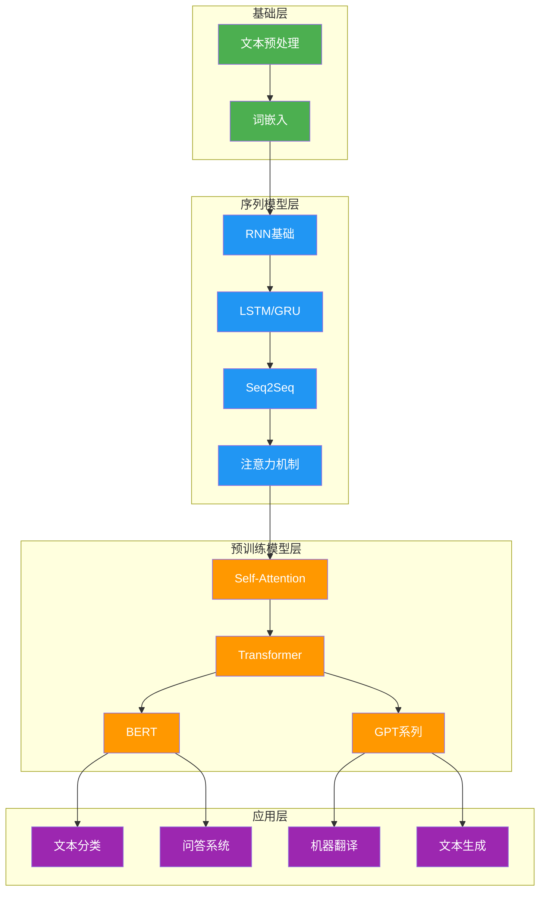

# 第8章 自然语言处理（NLP）

## 📚 学习路线图

## 📖 章节内容

### 8.1 文本预处理与词嵌入
- [[8.1-文本预处理与词嵌入|详细内容]]
- 分词（Tokenization）、词干提取（Stemming）
- TF-IDF、Word2Vec（CBOW & Skip-gram）、GloVe

### 8.2 RNN与序列模型
- [[8.2-RNN与序列模型|详细内容]]
- 朴素RNN、LSTM、GRU
- Seq2Seq模型、注意力机制

### 8.3 Transformer与BERT
- [[8.3-Transformer与BERT|详细内容]]
- Self-Attention、多头注意力
- 位置编码、BERT架构

## 🏆 核心考点

| 考点 | 重要程度 | 常考形式 |
|------|----------|----------|
| TF-IDF公式与计算 | ⭐⭐⭐⭐⭐ | 计算题、简答题 |
| Word2Vec两种模型对比 | ⭐⭐⭐⭐⭐ | 简答题、选择题 |
| LSTM门控机制 | ⭐⭐⭐⭐⭐ | 简答题、画图题 |
| 注意力机制公式推导 | ⭐⭐⭐⭐ | 计算题、简答题 |
| Self-Attention公式 | ⭐⭐⭐⭐⭐ | 计算题、简答题 |
| BERT与GPT的区别 | ⭐⭐⭐⭐ | 简答题、论述题 |
| Transformer架构 | ⭐⭐⭐⭐⭐ | 画图题、论述题 |

## 📝 自测题库

### 一、概念理解题

1. **什么是词嵌入？它与独热编码相比有什么优势？**
2. **Word2Vec中的CBOW和Skip-gram模型有什么区别？分别适用于什么场景？**
3. **LSTM的三个门控机制各自的作用是什么？请分别写出其计算公式。**

### 二、计算题

4. **给定文档集合，计算指定词的TF-IDF值：**
   - 文档集：$D_1, D_2, D_3$
   - 词 $w$ 在 $D_1$ 中出现 3 次，$D_1$ 总词数 100
   - 词 $w$ 在 $D_2$ 中出现 0 次
   - 词 $w$ 在 $D_3$ 中出现 2 次，$D_3$ 总词数 50
   - 计算词 $w$ 在 $D_1$ 和 $D_3$ 中的TF-IDF值

5. **已知注意力机制中Query、Key、Value矩阵，计算注意力权重：**
   - $Q = [1, 0]$, $K_1 = [1, 0]$, $K_2 = [0, 1]$
   - 计算 scaled dot-product attention 的输出

### 三、论述题

6. **请详细描述Transformer中Self-Attention的计算流程，并写出完整的数学公式。**
7. **BERT的预训练任务有哪些？它是如何体现双向语义理解的？**
8. **对比RNN、LSTM、Transformer三者在序列建模上的优缺点。**

## ✅ 学习检查清单

- [ ] 能够手写TF-IDF的计算公式并进行计算
- [ ] 理解Word2Vec的CBOW和Skip-gram模型架构
- [ ] 能够画出LSTM的结构并解释三个门的作用
- [ ] 掌握注意力机制的计算过程
- [ ] 能够推导Self-Attention的公式
- [ ] 理解BERT的Masked Language Model预训练方法
- [ ] 对比BERT和GPT在架构和预训练上的差异