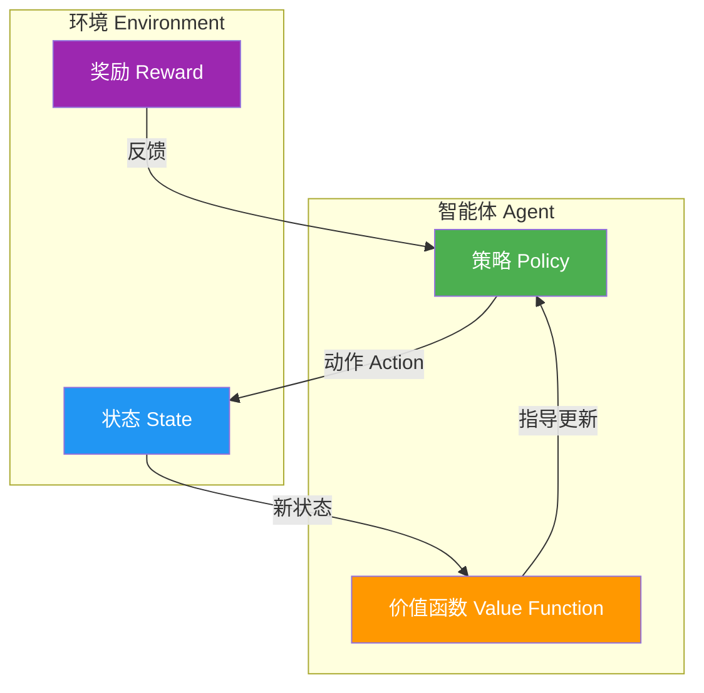
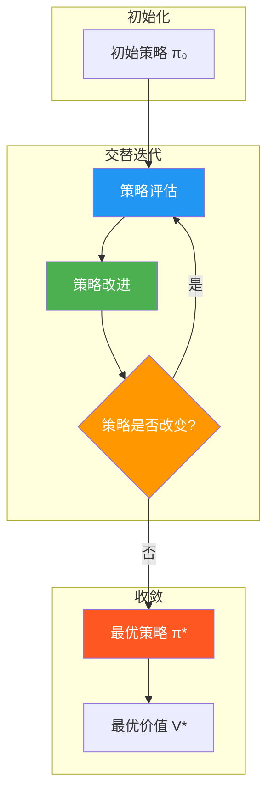

# 9.1 MDP与动态规划

## 一、强化学习基础概念

### 1.1 强化学习定义

**强化学习（Reinforcement Learning, RL）** 是研究智能体（Agent）与环境（Environment）交互，通过试错和奖励机制学习最优策略的机器学习方法。

### 1.2 强化学习基本框架



### 1.3 强化学习五要素

| 要素 | 符号 | 描述 |
|------|------|------|
| 智能体 | Agent | 执行动作的决策者 |
| 环境 | Environment | 智能体交互的外部世界 |
| 状态 | $s \in S$ | 环境在某一时刻的描述 |
| 动作 | $a \in A$ | 智能体可以执行的操作 |
| 奖励 | $r \in \mathbb{R}$ | 环境对动作的反馈信号 |

### 1.4 强化学习 vs 其他学习范式

| 维度 | 监督学习 | 无监督学习 | 强化学习 |
|------|----------|------------|----------|
| 训练信号 | 标签 | 无 | 奖励 |
| 反馈类型 | 即时、正确 | 无 | 延迟、可能稀疏 |
| 决策影响 | 静态数据 | 静态数据 | 影响未来状态 |
| 探索需求 | 无 | 无 | 需要探索 |
| 典型应用 | 分类/回归 | 聚类/降维 | 游戏/机器人 |

---

## 二、马尔可夫决策过程（MDP）

### 2.1 MDP定义

**马尔可夫决策过程（Markov Decision Process, MDP）** 是强化学习的数学框架，为序贯决策问题提供了形式化描述。

### 2.2 MDP五要素

MDP可以用五元组 $\langle S, A, P, R, \gamma \rangle$ 描述：

| 要素 | 符号 | 数学描述 | 说明 |
|------|------|----------|------|
| 状态集合 | $S$ | $S = \{s_1, s_2, \ldots, s_n\}$ | 所有可能状态的集合 |
| 动作集合 | $A$ | $A = \{a_1, a_2, \ldots, a_m\}$ | 所有可能动作的集合 |
| 转移概率 | $P$ | $P(s' \mid s, a) = \Pr(s_{t+1}=s' \mid s_t=s, a_t=a)$ | 状态转移的概率分布 |
| 奖励函数 | $R$ | $R(s, a, s') = \mathbb{E}[r_{t+1} \mid s_t=s, a_t=a, s_{t+1}=s']$ | 执行动作后获得的期望奖励 |
| 折扣因子 | $\gamma$ | $\gamma \in [0, 1]$ | 未来奖励的折扣率 |

### 2.3 MDP的交互过程

```mermaid
flowchart TD
    subgraph 时刻t
        S_t[状态 s_t] --> A_t[动作 a_t]
    end

    subgraph 环境转移
        A_t -->|P(s_{t+1}|s_t,a_t)| S_next[新状态 s_{t+1}]
        A_t -->|R(s_t,a_t,s_{t+1})| R_t[奖励 r_t]
    end

    subgraph 时刻t+1
        S_next --> S_t1[状态 s_{t+1}]
        R_t --> G[累计回报 G_t]
    end

    style A_t fill:#4CAF50,color:white
    style R_t fill:#FF9800,color:white
    style G fill:#9C27B0,color:white
```

### 2.4 马尔可夫性

**定义：** 状态转移只依赖于当前状态和动作，与历史无关。

$$\Pr(s_{t+1} \mid s_t, a_t, s_{t-1}, a_{t-1}, \ldots) = \Pr(s_{t+1} \mid s_t, a_t)$$

### 2.5 策略

**定义：** 策略 $\pi$ 定义了在每个状态下应该选择什么动作。

$$\pi(a \mid s) = \Pr(a_t = a \mid s_t = s)$$

| 策略类型 | 描述 | 示例 |
|----------|------|------|
| 确定性策略 | $\pi(s) = a$（唯一动作） | 贪心策略 |
| 随机性策略 | $\pi(a \mid s)$（概率分布） | $\epsilon$-贪心策略 |
| 平稳策略 | 不随时间变化 | $\pi(a \mid s, t) = \pi(a \mid s)$ |

### 2.6 回报与价值函数

#### 有限时域回报

$$G_t = R_{t+1} + \gamma R_{t+2} + \gamma^2 R_{t+3} + \cdots + \gamma^{T-t-1} R_T$$

#### 无限时域回报

$$G_t = \sum_{k=0}^{\infty} \gamma^k R_{t+k+1}$$

#### 状态价值函数

$$V^\pi(s) = \mathbb{E}_\pi[G_t \mid s_t = s]$$

即在策略 $\pi$ 下，从状态 $s$ 出发的期望回报。

#### 动作价值函数

$$Q^\pi(s, a) = \mathbb{E}_\pi[G_t \mid s_t = s, a_t = a]$$

即在策略 $\pi$ 下，从状态 $s$ 执行动作 $a$ 的期望回报。

### 2.7 MDP示例：网格世界

```mermaid
flowchart LR
    subgraph 4×4网格
        direction TB
        S0[0,0] --> S1[0,1] --> S2[0,2] --> S3[0,3]
        S4[1,0] --> S5[1,1] --> S6[1,2] --> S7[1,3]
        S8[2,0] --> S9[2,1] --> S10[2,2] --> S11[2,3]
        S12[3,0] --> S13[3,1] --> S14[3,2] --> S15[3,3]
    end

    S0 -->|奖励-1| S4
    S4 -->|奖励-1| S8
    S15[目标] -->|奖励+1| END[终止]

    style S0 fill:#8BC34A
    style S15 fill:#FFD54F
    style END fill:#F44336
```

**参数设置：**
- 动作：上、下、左、右
- 转移：确定移动（边界反弹）
- 奖励：每步-1，到达目标+1并终止
- 折扣因子：$\gamma = 0.9$

---

## 三、贝尔曼方程

### 3.1 贝尔曼期望方程（Bellman Expectation Equation）

**状态价值函数的贝尔曼方程：**

$$V^\pi(s) = \sum_{a \in A} \pi(a \mid s) \left[ R(s, a) + \gamma \sum_{s' \in S} P(s' \mid s, a) V^\pi(s') \right]$$

**动作价值函数的贝尔曼方程：**

$$Q^\pi(s, a) = R(s, a) + \gamma \sum_{s' \in S} P(s' \mid s, a) \sum_{a' \in A} \pi(a' \mid s') Q^\pi(s', a')$$

**$V^\pi$ 与 $Q^\pi$ 的关系：**

$$V^\pi(s) = \sum_{a \in A} \pi(a \mid s) Q^\pi(s, a)$$

### 3.2 贝尔曼最优方程（Bellman Optimality Equation）

**最优状态价值函数：**

$$V^*(s) = \max_{a} \left[ R(s, a) + \gamma \sum_{s' \in S} P(s' \mid s, a) V^*(s') \right]$$

**最优动作价值函数：**

$$Q^*(s, a) = R(s, a) + \gamma \sum_{s' \in S} P(s' \mid s, a) \max_{a'} Q^*(s', a')$$

**最优策略：**

$$\pi^*(s) = \arg\max_{a} Q^*(s, a)$$

### 3.3 贝尔曼方程图示

```mermaid
flowchart TD
    subgraph 贝尔曼期望方程
        BE[V^π(s)] --> EQ[= Σ_a π(a|s) ·]
        EQ --> BR[R(s,a) + γ ·]
        BR --> BP[Σ_s' P(s'|s,a) · V^π(s')]
    end

    subgraph 贝尔曼最优方程
        BO[V*(s)] --> MO[= max_a ·]
        MO --> BR2[R(s,a) + γ ·]
        BR2 --> BP2[Σ_s' P(s'|s,a) · V*(s')]
    end

    style BE fill:#4CAF50,color:white
    style BO fill:#FF5722,color:white
    style BR fill:#2196F3
    style BR2 fill:#FF9800
```

### 3.4 贝尔方程的矩阵形式

$$V^\pi = R^\pi + \gamma P^\pi V^\pi$$

$$V^\pi = (I - \gamma P^\pi)^{-1} R^\pi$$

其中：
- $V^\pi \in \mathbb{R}^{|S|}$：状态价值向量
- $R^\pi \in \mathbb{R}^{|S|}$：期望奖励向量
- $P^\pi \in \mathbb{R}^{|S| \times |S|}$：状态转移矩阵

---

## 四、动态规划算法

### 4.1 值迭代（Value Iteration）

**核心思想：** 直接迭代贝尔曼最优方程，直到价值函数收敛。

#### 算法流程

```
1. 初始化：V(s) = 0 for all s ∈ S
2. 循环直到收敛：
   For each s ∈ S:
       V_new(s) = max_a [R(s,a) + γ Σ_s' P(s'|s,a) V(s')]
   V(s) = V_new(s)
3. 提取最优策略：
   π*(s) = argmax_a [R(s,a) + γ Σ_s' P(s'|s,a) V(s)]
```

#### 值迭代图示

```mermaid
flowchart TD
    subgraph 初始化
        I1[V(s₀)=0]
        I2[V(s₁)=0]
        I3[V(s₂)=0]
    end

    subgraph 迭代过程
        direction TB
        T1[第1轮迭代] --> T2[第2轮迭代]
        T2 --> T3[第3轮迭代]
        T3 --> T4[...直到收敛]
    end

    subgraph 收敛结果
        C1[V*(s₀)=...]
        C2[V*(s₁)=...]
        C3[V*(s₂)=...]
    end

    I1 & I2 & I3 --> T1
    T4 --> C1 & C2 & C3

    style T1 fill:#E3F2FD
    style T2 fill:#BBDEFB
    style T3 fill:#90CAF9
    style C1 fill:#4CAF50,color:white
    style C2 fill:#4CAF50,color:white
    style C3 fill:#4CAF50,color:white
```

#### 值迭代PyTorch实现

```python
import torch

def value_iteration(transitions, rewards, gamma=0.9, theta=1e-6):
    num_states = len(transitions)
    num_actions = len(transitions[0])
    V = torch.zeros(num_states)

    while True:
        delta = 0
        for s in range(num_states):
            v = V[s].clone()
            max_q = float('-inf')
            for a in range(num_actions):
                q = rewards[s][a]
                for s_next in range(num_states):
                    q += gamma * transitions[s][a][s_next] * V[s_next]
                max_q = max(max_q, q)
            V[s] = max_q
            delta = max(delta, abs(v - V[s]).item())
        if delta < theta:
            break

    policy = torch.zeros(num_states, dtype=torch.long)
    for s in range(num_states):
        max_q = float('-inf')
        best_a = 0
        for a in range(num_actions):
            q = rewards[s][a]
            for s_next in range(num_states):
                q += gamma * transitions[s][a][s_next] * V[s_next]
            if q > max_q:
                max_q = q
                best_a = a
        policy[s] = best_a

    return V, policy

num_states = 4
num_actions = 2
transitions = torch.zeros(num_states, num_actions, num_states)
transitions[0][0][0] = 0.5; transitions[0][0][1] = 0.5
transitions[0][1][0] = 0.8; transitions[0][1][1] = 0.2
transitions[1][0][2] = 0.3; transitions[1][0][3] = 0.7
transitions[1][1][2] = 0.6; transitions[1][1][3] = 0.4
transitions[2][0][0] = 0.4; transitions[2][0][2] = 0.6
transitions[2][1][1] = 0.5; transitions[2][1][3] = 0.5
transitions[3][0][3] = 1.0
transitions[3][1][3] = 1.0

rewards = torch.zeros(num_states, num_actions)
rewards[0][0] = 1; rewards[0][1] = 0
rewards[1][0] = 2; rewards[1][1] = 3
rewards[2][0] = 0; rewards[2][1] = 1
rewards[3][0] = 5; rewards[3][1] = 5

V, policy = value_iteration(transitions, rewards, gamma=0.9)
print("Optimal Value Function:", V)
print("Optimal Policy:", policy)
```

### 4.2 策略迭代（Policy Iteration）

**核心思想：** 在策略评估和策略改进之间交替迭代，直到策略收敛。

#### 算法流程

```
1. 初始化：π(s) = random action for all s ∈ S
2. 循环直到策略不变：
   
   2a. 策略评估：
       求解 V^π(s) = Σ_a π(a|s) [R(s,a) + γ Σ_s' P(s'|s,a) V^π(s')]
   
   2b. 策略改进：
       For each s ∈ S:
           π_new(s) = argmax_a [R(s,a) + γ Σ_s' P(s'|s,a) V^π(s')]
       如果 π_new = π，停止
       否则 π = π_new
```

#### 策略迭代图示



#### 策略迭代PyTorch实现

```python
def policy_evaluation(policy, transitions, rewards, gamma=0.9, theta=1e-6):
    num_states = len(transitions)
    num_actions = len(transitions[0])
    V = torch.zeros(num_states)

    while True:
        delta = 0
        for s in range(num_states):
            v = V[s].clone()
            expected_q = 0
            for a in range(num_actions):
                prob = policy[s][a] if isinstance(policy[s], (list, torch.Tensor)) else 1.0 if policy[s] == a else 0.0
                q = rewards[s][a]
                for s_next in range(num_states):
                    q += gamma * transitions[s][a][s_next] * V[s_next]
                expected_q += prob * q
            V[s] = expected_q
            delta = max(delta, abs(v - V[s]).item())
        if delta < theta:
            break
    return V

def policy_iteration(transitions, rewards, gamma=0.9):
    num_states = len(transitions)
    num_actions = len(transitions[0])
    policy = torch.zeros(num_states, num_actions)
    for s in range(num_states):
        policy[s][torch.randint(0, num_actions, (1,)).item()] = 1.0

    while True:
        V = policy_evaluation(policy, transitions, rewards, gamma)
        policy_stable = True

        for s in range(num_states):
            old_action = torch.argmax(policy[s]).item()
            max_q = float('-inf')
            best_a = 0
            for a in range(num_actions):
                q = rewards[s][a]
                for s_next in range(num_states):
                    q += gamma * transitions[s][a][s_next] * V[s_next]
                if q > max_q:
                    max_q = q
                    best_a = a
            if old_action != best_a:
                policy_stable = False
            policy[s] = torch.zeros(num_actions)
            policy[s][best_a] = 1.0

        if policy_stable:
            break

    return V, policy

V_pi, pi_star = policy_iteration(transitions, rewards, gamma=0.9)
print("Policy Iteration V:", V_pi)
print("Policy Iteration Policy:", pi_star)
```

### 4.3 值迭代 vs 策略迭代

| 维度 | 值迭代 | 策略迭代 |
|------|--------|----------|
| 核心思想 | 直接迭代最优价值函数 | 交替进行策略评估和改进 |
| 收敛速度 | 通常更快 | 较慢（每步需求解线性方程组） |
| 空间复杂度 | O(|S|) | O(|S|²) |
| 适用场景 | 大规模MDP | 小规模MDP（需要精确解） |
| 中间结果 | 价值函数不对应任何策略 | 每步都有有效策略 |
| 最终结果 | 最优价值+策略 | 最优价值+策略 |

### 4.4 两种迭代算法对比图示

```mermaid
flowchart LR
    subgraph 值迭代
        direction TB
        VI1[V(s) = max_a Q(s,a)] --> VI2[V(s)收敛]
        VI2 --> VI3[提取π*]
    end

    subgraph 策略迭代
        direction TB
        PI1[评估π得到V^π] --> PI2[改进π得到π']
        PI2 --> PI3{π=π'?}
        PI3 -->|否| PI1
        PI3 -->|是| PI4[收敛]
    end

    style VI1 fill:#4CAF50,color:white
    style PI1 fill:#2196F3,color:white
    style PI2 fill:#FF9800,color:white
```

---

## 五、MDP计算示例

### 5.1 示例：两状态MDP

**给定：**
- 状态：$S = \{s_0, s_1\}$
- 动作：$A = \{a_0, a_1\}$
- 转移概率：
  - $P(s_0|s_0,a_0) = 0.5$, $P(s_1|s_0,a_0) = 0.5$
  - $P(s_0|s_0,a_1) = 0.8$, $P(s_1|s_0,a_1) = 0.2$
  - $P(s_0|s_1,a_0) = 0.3$, $P(s_1|s_1,a_0) = 0.7$
  - $P(s_0|s_1,a_1) = 0.6$, $P(s_1|s_1,a_1) = 0.4$
- 奖励：
  - $R(s_0,a_0) = 1$, $R(s_0,a_1) = 0$
  - $R(s_1,a_0) = 2$, $R(s_1,a_1) = 3$
- $\gamma = 0.9$

### 5.2 值迭代过程

**初始化：** $V(s_0) = 0$, $V(s_1) = 0$

**第1轮迭代：**

$$V(s_0) = \max\left\{1 + 0.9(0.5 \times 0 + 0.5 \times 0), \quad 0 + 0.9(0.8 \times 0 + 0.2 \times 0)\right\} = \max\{1, 0\} = 1$$

$$V(s_1) = \max\left\{2 + 0.9(0.3 \times 0 + 0.7 \times 0), \quad 3 + 0.9(0.6 \times 0 + 0.4 \times 0)\right\} = \max\{2, 3\} = 3$$

**第2轮迭代：**

$$V(s_0) = \max\left\{1 + 0.9(0.5 \times 1 + 0.5 \times 3), \quad 0 + 0.9(0.8 \times 1 + 0.2 \times 3)\right\}$$

$$= \max\{1 + 0.9 \times 2, \quad 0 + 0.9 \times 1.4\} = \max\{2.8, 1.26\} = 2.8$$

$$V(s_1) = \max\left\{2 + 0.9(0.3 \times 1 + 0.7 \times 3), \quad 3 + 0.9(0.6 \times 1 + 0.4 \times 3)\right\}$$

$$= \max\{2 + 0.9 \times 2.4, \quad 3 + 0.9 \times 1.8\} = \max\{4.16, 4.62\} = 4.62$$

**继续迭代直到收敛...**

### 5.3 收敛结果

$$V^*(s_0) \approx 7.58$$
$$V^*(s_1) \approx 8.65$$

**最优策略：**
- $\pi^*(s_0) = a_0$（因为 $Q(s_0, a_0) > Q(s_0, a_1)$）
- $\pi^*(s_1) = a_1$（因为 $Q(s_1, a_1) > Q(s_1, a_0)$）

---

## 六、考前速记卡

### MDP五要素

$$\boxed{\text{MDP} = \langle S, A, P, R, \gamma \rangle}$$

### 贝尔曼期望方程

$$\boxed{V^\pi(s) = \sum_{a} \pi(a \mid s) \left[ R(s,a) + \gamma \sum_{s'} P(s' \mid s,a) V^\pi(s') \right]}$$

### 贝尔曼最优方程

$$\boxed{V^*(s) = \max_{a} \left[ R(s,a) + \gamma \sum_{s'} P(s' \mid s,a) V^*(s') \right]}$$

### 值迭代更新公式

$$\boxed{V(s) \leftarrow \max_{a} \left[ R(s,a) + \gamma \sum_{s'} P(s' \mid s,a) V(s') \right]}$$

### 策略迭代步骤

$$\boxed{\text{评估} \rightarrow \text{改进} \rightarrow \text{检查稳定} \rightarrow \text{重复}}$$