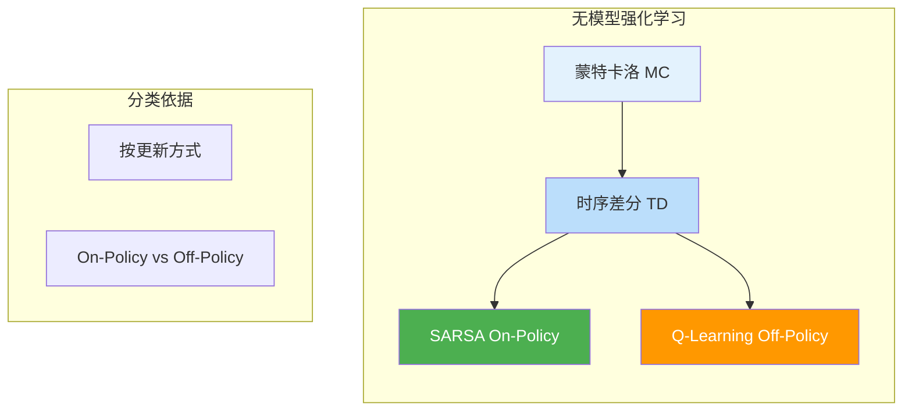
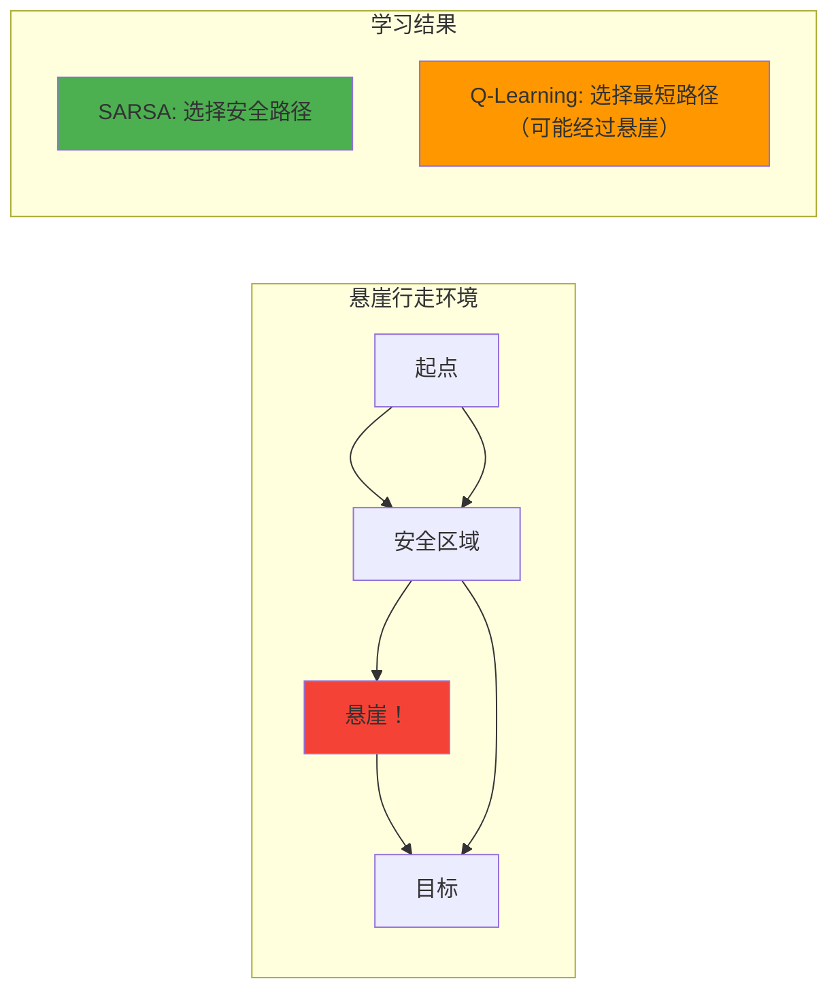

# 9.2 Q-Learning与SARSA

## 一、无模型强化学习概述

### 1.1 为什么需要无模型方法？

动态规划（值迭代、策略迭代）需要完全了解MDP的转移概率 $P(s'|s,a)$ 和奖励 $R(s,a)$，但在实际问题中这些信息往往未知。

### 1.2 无模型强化学习方法分类



### 1.3 无模型方法 vs 有模型方法

| 维度 | 有模型方法（DP） | 无模型方法（RL） |
|------|------------------|------------------|
| 环境模型 | 需要 $P(s'|s,a)$ 和 $R$ | 不需要 |
| 样本效率 | 高（可重复使用模型） | 低（需与环境交互） |
| 计算效率 | 低（维度灾难） | 高（增量更新） |
| 适用场景 | 小规模MDP | 大规模/未知MDP |

---

## 二、蒙特卡洛方法（Monte Carlo, MC）

### 2.1 MC方法概述

**核心思想：** 通过采样完整的回合（episode），使用实际回报的平均值估计价值函数。

### 2.2 MC策略评估

#### 首次访问MC（First-Visit MC）

对于每个状态 $s$：
1. 收集回合中第一次访问 $s$ 后的回报
2. 计算平均回报作为 $V(s)$ 的估计

#### 每次访问MC（Every-Visit MC）

收集回合中每次访问 $s$ 后的回报。

### 2.3 MC算法流程

```
1. 生成策略π的一个回合：s₀, a₀, r₁, s₁, a₁, r₂, ..., s_T
2. 对于回合中每个状态s：
   (a) 计算s的回报 G_t = R_{t+1} + γR_{t+2} + ... + γ^{T-t-1}R_T
   (b) 将G_t加入Returns(s)
   (c) V(s) = average(Returns(s))
3. 更新策略π
```

### 2.4 MC方法的优缺点

| 优点 | 缺点 |
|------|------|
| 简单直观 | 方差大（完整回合的回报波动大） |
| 适用于任意策略 | 学习延迟（需要完整回合后才更新） |
| 无偏估计 | 无法用于非回合环境 |

---

## 三、时序差分学习（Temporal Difference, TD）

### 3.1 TD学习概述

**核心思想：** 结合MC和DP的思想，通过自举（bootstrapping）使用当前估计更新当前估计，无需等待完整回合。

### 3.2 TD预测（TD Policy Evaluation）

#### TD(0) 更新公式

$$V(s_t) \leftarrow V(s_t) + \alpha \left[ R_{t+1} + \gamma V(s_{t+1}) - V(s_t) \right]$$

其中：
- $\alpha$：学习率
- $R_{t+1} + \gamma V(s_{t+1})$：TD目标（TD Target）
- $R_{t+1} + \gamma V(s_{t+1}) - V(s_t)$：TD误差（TD Error）

### 3.3 TD学习图示

```mermaid
flowchart TD
    subgraph TD学习过程
        S_t[s_t] --> A_t[a_t]
        A_t --> R_t[R_{t+1}]
        A_t --> S_t1[s_{t+1}]
        S_t1 --> V_t1[V(s_{t+1})]
    end

    subgraph 更新公式
        R_t --> TARGET[TD Target = R_{t+1} + γ·V(s_{t+1})]
        V_t1 --> TARGET
        TARGET --> ERROR[TD Error = Target - V(s_t)]
        ERROR --> UPDATE[V(s_t) ← V(s_t) + α·Error]
    end

    style TARGET fill:#4CAF50,color:white
    style ERROR fill:#FF5722,color:white
    style UPDATE fill:#2196F3,color:white
```

### 3.4 TD vs MC vs DP 对比

| 维度 | DP | MC | TD |
|------|----|----|-----|
| 需要模型 | 是 | 否 | 否 |
| 自举（Bootstrapping） | 是 | 否 | 是 |
| 样本效率 | 高 | 低 | 中 |
| 偏差 | 无 | 无 | 有（近似偏差） |
| 方差 | 低 | 高 | 中 |

### 3.5 TD学习PyTorch实现

```python
import torch
import numpy as np

class TDPredictor:
    def __init__(self, num_states, alpha=0.1, gamma=0.9):
        self.V = torch.zeros(num_states)
        self.alpha = alpha
        self.gamma = gamma

    def update(self, s, s_next, reward):
        td_target = reward + self.gamma * self.V[s_next]
        td_error = td_target - self.V[s]
        self.V[s] += self.alpha * td_error

    def predict(self, episodes):
        for episode in episodes:
            for s, a, r, s_next, done in episode:
                self.update(s, s_next, r)
                if done:
                    break

num_states = 5
td = TDPredictor(num_states, alpha=0.1, gamma=0.9)
episode = [(0, 'R', 1, 1, False), (1, 'R', -1, 2, False), (2, 'R', 2, 3, False), (3, 'R', 0, 4, True)]
td.predict([episode])
print("Value function after TD:", td.V)
```

---

## 四、On-Policy vs Off-Policy

### 4.1 基本概念

| 维度 | On-Policy | Off-Policy |
|------|-----------|------------|
| 定义 | 使用当前策略采样的数据学习当前策略 | 使用其他策略采样的数据学习目标策略 |
| 采样策略 | 与目标策略相同 | 与目标策略不同 |
| 样本利用 | 仅用当前策略的数据 | 可重用任意策略的数据 |
| 学习稳定性 | 较稳定 | 可能不稳定 |
| 代表算法 | SARSA | Q-Learning |

### 4.2 对比图示

```mermaid
flowchart TD
    subgraph On-Policy
        direction LR
        SA[采样策略 π] -->|采样数据| DATA[数据集]
        DATA -->|学习| TA[目标策略 π]
        SA -.-> TA
    end

    subgraph Off-Policy
        direction LR
        SB[采样策略 μ] -->|采样数据| DATA2[数据集]
        DATA2 -->|学习| TB[目标策略 π]
        SB ≠ TB
    end

    style SA fill:#4CAF50,color:white
    style TA fill:#4CAF50,color:white
    style SB fill:#FF9800,color:white
    style TB fill:#FF9800,color:white
```

### 4.3 On-Policy的优势与劣势

| 优势 | 劣势 |
|------|------|
| 学习更稳定 | 样本效率低 |
| 理论分析简单 | 无法从其他策略学习 |
| 实现简单 | 探索受限 |

---

## 五、SARSA算法（On-Policy TD控制）

### 5.1 SARSA概述

**SARSA** 是一种On-Policy的TD控制算法，名称来源于其更新公式中的五个元素：$S_t, A_t, R_{t+1}, S_{t+1}, A_{t+1}$。

### 5.2 SARSA更新公式

$$Q(s_t, a_t) \leftarrow Q(s_t, a_t) + \alpha \left[ R_{t+1} + \gamma Q(s_{t+1}, a_{t+1}) - Q(s_t, a_t) \right]$$

**TD目标：** $R_{t+1} + \gamma Q(s_{t+1}, a_{t+1})$（使用实际采取的动作 $a_{t+1}$）

### 5.3 SARSA算法流程

```
1. 初始化 Q(s,a) 为任意值
2. For each episode:
   (a) 初始化状态 s
   (b) 使用ε-贪心策略选择动作 a
   (c) For each step in episode:
       i. 执行动作 a，观察奖励 r 和新状态 s'
       ii. 使用ε-贪心策略在 s' 处选择动作 a'
       iii. Q(s,a) ← Q(s,a) + α[r + γ·Q(s',a') - Q(s,a)]
       iv. s ← s', a ← a'
       v. If s is terminal: break
3. 返回 Q
```

### 5.4 SARSA流程图

```mermaid
flowchart TD
    A[初始化Q表] --> B[选择初始状态s]
    B --> C[ε-贪心选择动作a]
    C --> D[执行a, 获得r, s']
    D --> E[ε-贪心在s'选择a']
    E --> F[更新Q(s,a) = Q(s,a) + α·r + γ·Q(s',a') - Q(s,a)]
    F --> G{s是终止状态?}
    G -->|否| H[s=s', a=a']
    H --> D
    G -->|是| B

    style F fill:#4CAF50,color:white
    style G fill:#FF5722,color:white
```

### 5.5 SARSA PyTorch实现

```python
import torch
import numpy as np

class SARSA:
    def __init__(self, num_states, num_actions, alpha=0.1, gamma=0.9, epsilon=0.1):
        self.Q = torch.zeros(num_states, num_actions)
        self.alpha = alpha
        self.gamma = gamma
        self.epsilon = epsilon
        self.num_actions = num_actions

    def select_action(self, state):
        if np.random.random() < self.epsilon:
            return np.random.randint(self.num_actions)
        else:
            return torch.argmax(self.Q[state]).item()

    def update(self, s, a, r, s_next, a_next, done):
        if done:
            td_target = r
        else:
            td_target = r + self.gamma * self.Q[s_next, a_next]
        td_error = td_target - self.Q[s, a]
        self.Q[s, a] += self.alpha * td_error

    def train(self, env, num_episodes):
        for episode in range(num_episodes):
            state = env.reset()
            action = self.select_action(state)
            total_reward = 0
            done = False

            while not done:
                next_state, reward, done = env.step(action)
                next_action = self.select_action(next_state)
                self.update(state, action, reward, next_state, next_action, done)
                state = next_state
                action = next_action
                total_reward += reward

            if (episode + 1) % 100 == 0:
                print(f"Episode {episode+1}, Total Reward: {total_reward}")

class SimpleGridEnv:
    def __init__(self, rows=5, cols=5):
        self.rows = rows
        self.cols = cols
        self.state = 0
        self.goal = rows * cols - 1

    def reset(self):
        self.state = 0
        return self.state

    def step(self, action):
        row, col = divmod(self.state, self.cols)
        if action == 0: row = max(0, row - 1)
        elif action == 1: row = min(self.rows - 1, row + 1)
        elif action == 2: col = max(0, col - 1)
        elif action == 3: col = min(self.cols - 1, col + 1)
        self.state = row * self.cols + col
        done = (self.state == self.goal)
        reward = 1 if done else -1
        return self.state, reward, done

env = SimpleGridEnv()
sarsa = SARSA(25, 4, alpha=0.5, gamma=0.9, epsilon=0.1)
sarsa.train(env, num_episodes=500)
print("Learned Q-table:\n", sarsa.Q)
```

---

## 六、Q-Learning算法（Off-Policy TD控制）

### 6.1 Q-Learning概述

**Q-Learning** 是一种Off-Policy的TD控制算法，学习最优动作价值函数，与所遵循的策略无关。

### 6.2 Q-Learning更新公式

$$Q(s_t, a_t) \leftarrow Q(s_t, a_t) + \alpha \left[ R_{t+1} + \gamma \max_{a'} Q(s_{t+1}, a') - Q(s_t, a_t) \right]$$

**TD目标：** $R_{t+1} + \gamma \max_{a'} Q(s_{t+1}, a')$（使用下一状态的最大Q值）

### 6.3 Q-Learning vs SARSA 更新公式对比

| 算法 | TD目标 | 特点 |
|------|--------|------|
| SARSA | $R_{t+1} + \gamma Q(s_{t+1}, a_{t+1})$ | On-Policy，学习实际策略 |
| Q-Learning | $R_{t+1} + \gamma \max_{a'} Q(s_{t+1}, a')$ | Off-Policy，学习最优策略 |

### 6.4 Q-Learning算法流程

```
1. 初始化 Q(s,a) 为任意值
2. For each episode:
   (a) 初始化状态 s
   (b) For each step in episode:
       i. 使用ε-贪心策略选择动作 a
       ii. 执行动作 a，观察奖励 r 和新状态 s'
       iii. Q(s,a) ← Q(s,a) + α[r + γ·max_a' Q(s',a') - Q(s,a)]
       iv. s ← s'
       v. If s is terminal: break
3. 返回 Q*
```

### 6.5 Q-Learning流程图

```mermaid
flowchart TD
    A[初始化Q表] --> B[选择初始状态s]
    B --> C[ε-贪心选择动作a]
    C --> D[执行a, 获得r, s']
    D --> E[Q(s,a) = Q(s,a) + α·r + γ·max_a' Q(s',a') - Q(s,a)]
    E --> F{s是终止状态?}
    F -->|否| G[s = s']
    G --> C
    F -->|是| B

    style E fill:#4CAF50,color:white
    style F fill:#FF5722,color:white
```

### 6.6 Q-Learning PyTorch实现

```python
class QLearning:
    def __init__(self, num_states, num_actions, alpha=0.1, gamma=0.9, epsilon=0.1):
        self.Q = torch.zeros(num_states, num_actions)
        self.alpha = alpha
        self.gamma = gamma
        self.epsilon = epsilon
        self.num_actions = num_actions

    def select_action(self, state):
        if np.random.random() < self.epsilon:
            return np.random.randint(self.num_actions)
        else:
            return torch.argmax(self.Q[state]).item()

    def update(self, s, a, r, s_next, done):
        if done:
            td_target = r
        else:
            td_target = r + self.gamma * torch.max(self.Q[s_next]).item()
        td_error = td_target - self.Q[s, a]
        self.Q[s, a] += self.alpha * td_error

    def train(self, env, num_episodes):
        for episode in range(num_episodes):
            state = env.reset()
            total_reward = 0
            done = False

            while not done:
                action = self.select_action(state)
                next_state, reward, done = env.step(action)
                self.update(state, action, reward, next_state, done)
                state = next_state
                total_reward += reward

            if (episode + 1) % 100 == 0:
                print(f"Episode {episode+1}, Total Reward: {total_reward}")

q_learning = QLearning(25, 4, alpha=0.5, gamma=0.9, epsilon=0.1)
q_learning.train(env, num_episodes=500)
print("Learned Q-table:\n", q_learning.Q)
```

---

## 七、SARSA vs Q-Learning 深度对比

### 7.1 核心区别

| 维度 | SARSA | Q-Learning |
|------|-------|------------|
| 类型 | On-Policy | Off-Policy |
| TD目标 | $r + \gamma Q(s', a')$ | $r + \gamma \max_{a'} Q(s', a')$ |
| 学习对象 | 当前策略的Q值 | 最优策略的Q值 |
| 收敛策略 | 所遵循的策略（含探索） | 最优策略（不含探索） |
| 学习效果 | 保守（考虑探索惩罚） | 激进（假设最优动作） |

### 7.2 轨迹差异图示

```mermaid
flowchart TD
    subgraph SARSA学习轨迹
        S0_1[s₀] --> A0_1[a₀]
        A0_1 --> R0_1[r₁]
        A0_1 --> S1_1[s₁]
        S1_1 --> A1_1[a₁]
        S1_1 --> A1_2[a₂]
        A1_1 --> U1[SARSA: Q(s₀,a₀) ← r₁ + γ·Q(s₁,a₁)]
    end

    subgraph Q-Learning学习轨迹
        S0_2[s₀] --> A0_2[a₀]
        A0_2 --> R0_2[r₁]
        A0_2 --> S1_2[s₁]
        S1_2 --> MAX[max Q(s₁,a')]
        MAX --> U2[Q-Learning: Q(s₀,a₀) ← r₁ + γ·max Q(s₁,a')]
    end

    style U1 fill:#4CAF50,color:white
    style U2 fill:#FF9800,color:white
```

### 7.3 悬崖行走问题

经典对比场景：在悬崖边缘，SARSA因考虑探索可能跌落的动作而更保守，Q-Learning因采用最大Q值而更激进。



### 7.4 ε-贪心策略与探索

**ε-贪心策略（ε-Greedy）：**

$$a = \begin{cases} \text{random action} & \text{with probability } \epsilon \\ \arg\max_{a'} Q(s, a') & \text{with probability } 1-\epsilon \end{cases}$$

| ε值 | 行为 | 适用场景 |
|------|------|----------|
| 较大（0.1~0.3） | 高探索 | 早期训练 |
| 较小（0.01~0.05） | 低探索 | 后期训练/部署 |
| 衰减 | 从大到小 | 整个训练过程 |

---

## 八、TD学习进阶

### 8.1 TD(λ)：资格迹（Eligibility Traces）

**核心思想：** 结合MC和TD的优点，通过资格迹分配信用。

#### 前向TD(λ)

$$\delta_t = R_{t+1} + \gamma V(s_{t+1}) - V(s_t)$$

$$V(s_t) \leftarrow V(s_t) + \alpha \delta_t$$

$$E(s_t) \leftarrow E(s_t) + 1$$

$$V(s) \leftarrow V(s) + \alpha \delta_t E(s) \quad \text{for all } s$$

$$E(s) \leftarrow \gamma \lambda E(s) \quad \text{for all } s$$

### 8.2 TD(λ) vs TD(0) vs MC

| 方法 | λ值 | 更新范围 | 偏差 | 方差 |
|------|-----|----------|------|------|
| TD(0) | 0 | 仅当前状态 | 有偏差 | 低 |
| TD(λ) | 0<λ<1 | 部分状态 | 小偏差 | 中 |
| TD(1)=MC | 1 | 所有状态 | 无偏差 | 高 |

### 8.3 资格迹图示

```mermaid
flowchart TD
    subgraph 资格迹更新
        direction LR
        S1[s₁: E=1] -->|γλ| S2[s₂: E=γλ]
        S2 -->|γλ| S3[s₃: E=(γλ)²]
        S3 -->|γλ| S4[s₄: E=(γλ)³]
    end

    subgraph 价值更新
        TD_Error[δ_t] --> UPDATE[V(s) += α·δ_t·E(s)]
    end

    S1 & S2 & S3 & S4 --> UPDATE

    style TD_Error fill:#FF5722,color:white
    style UPDATE fill:#4CAF50,color:white
```

---

## 九、算法选择指南

### 9.1 不同场景下的算法选择

| 场景 | 推荐算法 | 原因 |
|------|----------|------|
| 小状态空间、无模型 | Q-Learning | 简单高效，收敛到最优 |
| 需要稳定学习 | SARSA | On-Policy更稳定 |
| 中等状态空间 | Q-Learning + ε-贪心 | 平衡探索与利用 |
| 大状态空间 | DQN | 神经网络近似 |
| 连续动作空间 | Policy Gradient | 直接优化策略 |

### 9.2 各算法对比总结

| 算法 | 类型 | 样本效率 | 稳定性 | 最优性保证 |
|------|------|----------|--------|------------|
| MC | On-Policy | 低 | 低 | 是 |
| TD(0) | On-Policy | 中 | 中 | 是（有限步） |
| SARSA | On-Policy | 中 | 高 | 否（最优中策略） |
| Q-Learning | Off-Policy | 高 | 中 | 是 |
| TD(λ) | On-Policy | 中 | 中 | 是 |

---

## 十、考前速记卡

### SARSA更新公式

$$\boxed{Q(s_t, a_t) \leftarrow Q(s_t, a_t) + \alpha \left[ R_{t+1} + \gamma Q(s_{t+1}, a_{t+1}) - Q(s_t, a_t) \right]}$$

### Q-Learning更新公式

$$\boxed{Q(s_t, a_t) \leftarrow Q(s_t, a_t) + \alpha \left[ R_{t+1} + \gamma \max_{a'} Q(s_{t+1}, a') - Q(s_t, a_t) \right]}$$

### On-Policy vs Off-Policy

$$\boxed{\text{On-Policy: 用当前策略的数据学习当前策略（SARSA）}}$$

$$\boxed{\text{Off-Policy: 用其他策略的数据学习目标策略（Q-Learning）}}$$

### TD学习核心

$$\boxed{V(s_t) \leftarrow V(s_t) + \alpha \left[ R_{t+1} + \gamma V(s_{t+1}) - V(s_t) \right]}$$