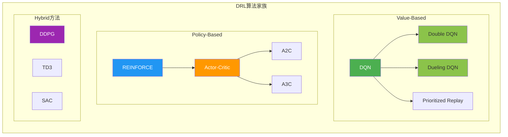
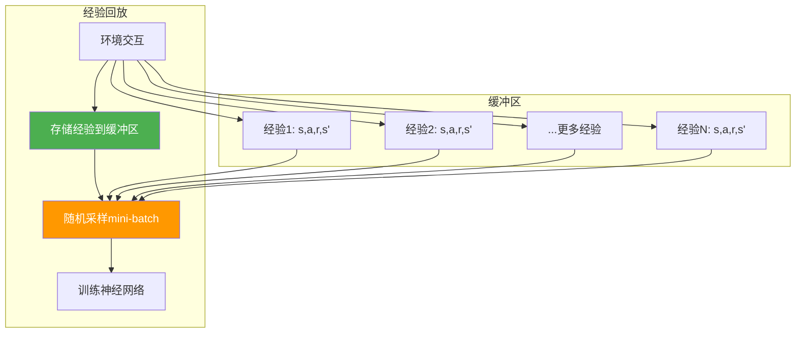
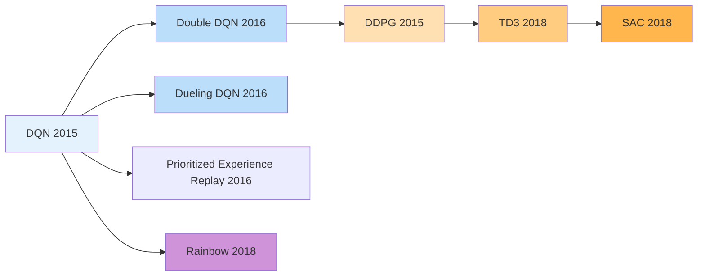
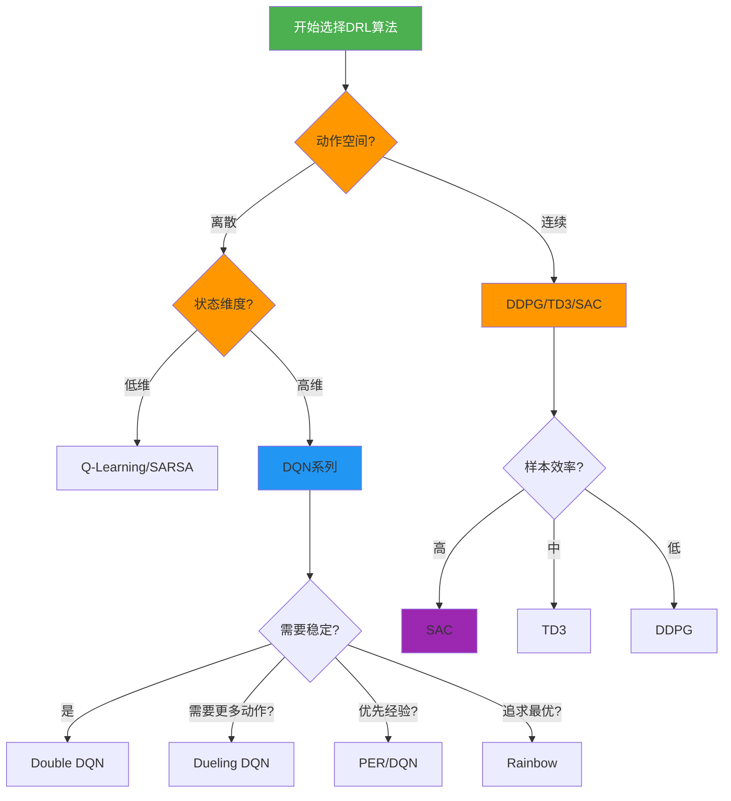

# 9.3 深度强化学习

## 一、深度强化学习概述

### 1.1 什么是深度强化学习？

**深度强化学习（Deep Reinforcement Learning, DRL）** 将深度学习的感知能力与强化学习的决策能力相结合，用于解决大规模、高维状态空间的序贯决策问题。

### 1.2 为什么需要DRL？

| 传统RL的局限 | DRL的解决方案 |
|-------------|--------------|
| 状态空间爆炸（维度灾难） | 神经网络近似价值函数 |
| 离散状态/动作 | 可处理连续状态/动作 |
| 需要手工特征提取 | 端到端学习 |

### 1.3 DRL主要算法家族



---

## 二、DQN（深度Q网络）

### 2.1 DQN设计理念

**核心思想：** 使用神经网络近似Q函数，将Q-Learning扩展到高维状态空间。

$$Q(s, a; \theta) \approx Q^*(s, a)$$

### 2.2 Q-Learning的问题

直接用神经网络拟合Q函数会导致：
1. **不稳定训练**：Q值更新是非平稳目标
2. **样本相关性**：连续样本高度相关
3. **灾难性遗忘**：网络会忘记旧知识

### 2.3 DQN两大创新

#### 创新1：经验回放（Experience Replay）

**核心思想：** 存储历史经验到回放缓冲区，训练时随机采样打破相关性。



#### 创新2：目标网络（Target Network）

**核心思想：** 使用两个网络——主网络（在线更新）和目标网络（定期同步），稳定训练目标。

```mermaid
flowchart TD
    subgraph 主网络 Online Network
        Q1[Q(s,a; θ)]
    end

    subgraph 目标网络 Target Network
        Q2[Q(s',a'; θ_target)]
    end

    subgraph 训练过程
        A[计算TD目标] --> B[R + γ·max_a' Q(s',a'; θ_target)]
        B --> C[计算TD误差]
        C --> D[更新主网络参数θ]
    end

    subgraph 定期同步
        E[每C步: θ_target ← θ]
    end

    Q1 --> C
    Q2 --> B
    D --> E

    style Q1 fill:#4CAF50,color:white
    style Q2 fill:#FF9800,color:white
    style E fill:#2196F3,color:white
```

### 2.4 DQN架构

```mermaid
flowchart TD
    subgraph 输入
        S[状态 s]
    end

    subgraph 卷积特征提取
        S --> C1[Conv2d 8×8×4]
        C1 --> C2[Conv2d 4×4×16]
        C2 --> C3[Conv2d 3×3×32]
    end

    subgraph 全连接层
        C3 --> FC1[FC 512]
        FC1 --> FC2[FC 256]
    end

    subgraph 输出
        FC2 --> Q[Q值 Q(s,a) for all a]
    end

    style C1 fill:#E3F2FD
    style C2 fill:#BBDEFB
    style C3 fill:#90CAF9
    style FC1 fill:#64B5F6
    style FC2 fill:#42A5F5
    style Q fill:#1E88E5,color:white
```

### 2.5 DQN算法流程

```
1. 初始化回放缓冲区 D（容量N）
2. 初始化Q网络 Q(s,a; θ)
3. 初始化目标网络 Q_target（θ_target = θ）
4. For each episode:
   (a) 初始化状态 s
   (b) For each step:
       i. 用ε-贪心选择动作a
       ii. 执行a,得到r, s', done
       iii. 存储经验(s,a,r,s',done)到D
       iv. 从D中随机采样mini-batch
       v. 计算TD目标：
           y = r + γ·max_a' Q(s',a'; θ_target)  (非终止)
           y = r  (终止)
       vi. L(θ) = E[(y - Q(s,a; θ))²]
       vii. θ ← θ - α·∇θ L(θ)
       viii. 每C步同步目标网络：θ_target ← θ
5. 返回训练好的Q网络
```

### 2.6 DQN PyTorch实现

```python
import torch
import torch.nn as nn
import torch.optim as optim
import numpy as np
from collections import deque
import random

class DQNNetwork(nn.Module):
    def __init__(self, state_dim, action_dim, hidden_dim=128):
        super().__init__()
        self.network = nn.Sequential(
            nn.Linear(state_dim, hidden_dim),
            nn.ReLU(),
            nn.Linear(hidden_dim, hidden_dim),
            nn.ReLU(),
            nn.Linear(hidden_dim, action_dim)
        )

    def forward(self, x):
        return self.network(x)

class ReplayBuffer:
    def __init__(self, capacity):
        self.buffer = deque(maxlen=capacity)

    def push(self, state, action, reward, next_state, done):
        self.buffer.append((state, action, reward, next_state, done))

    def sample(self, batch_size):
        batch = random.sample(self.buffer, batch_size)
        states, actions, rewards, next_states, dones = zip(*batch)
        return (np.array(states), np.array(actions), np.array(rewards),
                np.array(next_states), np.array(dones))

    def __len__(self):
        return len(self.buffer)

class DQNAgent:
    def __init__(self, state_dim, action_dim, hidden_dim=128,
                 lr=1e-3, gamma=0.99, epsilon=1.0, buffer_size=10000):
        self.q_network = DQNNetwork(state_dim, action_dim, hidden_dim)
        self.target_network = DQNNetwork(state_dim, action_dim, hidden_dim)
        self.target_network.load_state_dict(self.q_network.state_dict())
        self.optimizer = optim.Adam(self.q_network.parameters(), lr=lr)
        self.memory = ReplayBuffer(buffer_size)
        self.gamma = gamma
        self.epsilon = epsilon
        self.action_dim = action_dim

    def select_action(self, state):
        if np.random.random() < self.epsilon:
            return np.random.randint(self.action_dim)
        else:
            state_tensor = torch.FloatTensor(state).unsqueeze(0)
            with torch.no_grad():
                q_values = self.q_network(state_tensor)
            return torch.argmax(q_values).item()

    def update(self, batch_size):
        if len(self.memory) < batch_size:
            return

        states, actions, rewards, next_states, dones = self.memory.sample(batch_size)
        states = torch.FloatTensor(states)
        actions = torch.LongTensor(actions)
        rewards = torch.FloatTensor(rewards)
        next_states = torch.FloatTensor(next_states)
        dones = torch.FloatTensor(dones)

        q_values = self.q_network(states).gather(1, actions.unsqueeze(1)).squeeze(1)
        with torch.no_grad():
            next_q_values = self.target_network(next_states).max(1)[0]
            targets = rewards + self.gamma * next_q_values * (1 - dones)

        loss = nn.MSELoss()(q_values, targets)
        self.optimizer.zero_grad()
        loss.backward()
        self.optimizer.step()

        return loss.item()

    def update_target(self):
        self.target_network.load_state_dict(self.q_network.state_dict())

state_dim = 4
action_dim = 2
agent = DQNAgent(state_dim, action_dim)
print("DQN Agent initialized successfully")
```

---

## 三、Double DQN

### 3.1 Double DQN设计理念

**问题：** 标准DQN使用目标网络的最大Q值，导致Q值过高估计（maximization bias）。

**思想：** 将动作选择和动作评估解耦，使用主网络选动作，目标网络评估。

### 3.2 Double DQN更新公式

$$y = R_{t+1} + \gamma Q_{\text{target}}\left(s_{t+1}, \arg\max_{a'} Q_{\text{online}}(s_{t+1}, a')\right)$$

### 3.3 Double DQN vs DQN

| 维度 | DQN | Double DQN |
|------|-----|------------|
| TD目标 | $\max_{a'} Q_{\text{target}}(s', a')$ | $Q_{\text{target}}(s', \arg\max_{a'} Q_{\text{online}}(s', a'))$ |
| 过估计 | 有（max操作导致） | 减少 |
| 实现 | 简单 | 略复杂 |
| 性能 | 良好 | 更稳定、更优 |

### 3.4 Double DQN核心代码修改

```python
def compute_double_dqn_target(online_net, target_net, next_states, rewards, dones, gamma):
    with torch.no_grad():
        next_actions = online_net(next_states).argmax(dim=1, keepdim=True)
        next_q = target_net(next_states).gather(1, next_actions).squeeze(1)
        targets = rewards + gamma * next_q * (1 - dones)
    return targets
```

---

## 四、Dueling DQN

### 4.1 Dueling DQN设计理念

**核心思想：** 将Q网络分解为状态价值函数$V(s)$和优势函数$A(s,a)$的组合。

$$Q(s, a; \theta, \alpha, \beta) = V(s; \theta, \beta) + \left(A(s, a; \theta, \alpha) - \frac{1}{|\mathcal{A}|}\sum_{a'} A(s, a'; \theta, \alpha)\right)$$

### 4.2 Dueling DQN架构

```mermaid
flowchart TD
    subgraph 输入
        S[状态 s]
    end

    subgraph 共享网络
        S --> C1[特征提取网络]
    end

    subgraph 价值分支
        C1 --> V1[FC 256]
        V1 --> V[V(s) 标量]
    end

    subgraph 优势分支
        C1 --> A1[FC 256]
        A1 --> A[A(s,a) 每个动作的优势]
    end

    subgraph 组合
        V --> Q[Q(s,a) = V(s) + A(s,a) - mean(A)]
        A --> Q
    end

    style C1 fill:#E3F2FD
    style V fill:#4CAF50,color:white
    style A fill:#FF9800,color:white
    style Q fill:#9C27B0,color:white
```

### 4.3 Dueling DQN的优势

| 优势 | 说明 |
|------|------|
| 更快学习 | 价值估计不受动作选择影响 |
| 更稳定 | 价值和优势分离训练 |
| 泛化更好 | 对未见动作的状态也能评估价值 |
| 适合场景 | 动作多的环境 |

### 4.4 Dueling DQN PyTorch实现

```python
class DuelingDQNNetwork(nn.Module):
    def __init__(self, state_dim, action_dim, hidden_dim=128):
        super().__init__()
        self.feature = nn.Sequential(
            nn.Linear(state_dim, hidden_dim),
            nn.ReLU(),
            nn.Linear(hidden_dim, hidden_dim),
            nn.ReLU()
        )
        self.value_stream = nn.Sequential(
            nn.Linear(hidden_dim, hidden_dim),
            nn.ReLU(),
            nn.Linear(hidden_dim, 1)
        )
        self.advantage_stream = nn.Sequential(
            nn.Linear(hidden_dim, hidden_dim),
            nn.ReLU(),
            nn.Linear(hidden_dim, action_dim)
        )

    def forward(self, x):
        features = self.feature(x)
        value = self.value_stream(features)
        advantage = self.advantage_stream(features)
        q_values = value + advantage - advantage.mean(dim=1, keepdim=True)
        return q_values

dueling_dqn = DuelingDQNNetwork(4, 2)
state = torch.randn(1, 4)
q_values = dueling_dqn(state)
print("Dueling DQN output shape:", q_values.shape)
```

---

## 五、Policy Gradient（策略梯度）

### 5.1 Policy-Based方法概述

**核心思想：** 直接参数化策略 $\pi(a|s; \theta)$，通过梯度上升优化期望回报。

### 5.2 策略梯度定理

$$\nabla_\theta J(\theta) = \mathbb{E}_{\pi_\theta} \left[ \nabla_\theta \log \pi_\theta(a|s) Q^{\pi}(s, a) \right]$$

### 5.3 策略梯度推导

**目标函数：**

$$J(\theta) = \mathbb{E}_{\tau \sim \pi_\theta} [R(\tau)] = \sum_{\tau} P(\tau|\theta) R(\tau)$$

**梯度计算：**

$$\nabla_\theta J(\theta) = \sum_{\tau} \nabla_\theta P(\tau|\theta) R(\tau)$$

$$= \sum_{\tau} P(\tau|\theta) \nabla_\theta \log P(\tau|\theta) R(\tau)$$

$$= \mathbb{E}_{\tau \sim \pi_\theta} \left[ \nabla_\theta \log P(\tau|\theta) R(\tau) \right]$$

$$= \mathbb{E}_{\pi_\theta} \left[ \sum_{t} \nabla_\theta \log \pi_\theta(a_t|s_t) G_t \right]$$

### 5.4 REINFORCE算法

**最简单的策略梯度算法，使用蒙特卡洛回报。**

```
1. 初始化策略网络π(a|s; θ)
2. For each episode:
   (a) 生成轨迹 τ = s₀,a₀,r₁,...,s_T
   (b) 计算每个时刻的回报 G_t
   (c) 更新: θ ← θ + α·∇θ Σ_t G_t · ∇θ log π(a_t|s_t)
3. 返回训练好的策略
```

### 5.5 Policy Gradient PyTorch实现

```python
class PolicyNetwork(nn.Module):
    def __init__(self, state_dim, action_dim, hidden_dim=128):
        super().__init__()
        self.network = nn.Sequential(
            nn.Linear(state_dim, hidden_dim),
            nn.ReLU(),
            nn.Linear(hidden_dim, action_dim),
            nn.Softmax(dim=-1)
        )

    def forward(self, x):
        return self.network(x)

class REINFORCE:
    def __init__(self, state_dim, action_dim, hidden_dim=128, lr=1e-3, gamma=0.99):
        self.policy = PolicyNetwork(state_dim, action_dim, hidden_dim)
        self.optimizer = optim.Adam(self.policy.parameters(), lr=lr)
        self.gamma = gamma

    def select_action(self, state):
        state_tensor = torch.FloatTensor(state).unsqueeze(0)
        probs = self.policy(state_tensor)
        action_dist = torch.distributions.Categorical(probs)
        action = action_dist.sample()
        log_prob = action_dist.log_prob(action)
        return action.item(), log_prob

    def update(self, log_probs, rewards):
        discounted_rewards = []
        cumulative_reward = 0
        for reward in reversed(rewards):
            cumulative_reward = reward + self.gamma * cumulative_reward
            discounted_rewards.insert(0, cumulative_reward)

        discounted_rewards = torch.FloatTensor(discounted_rewards)
        log_probs = torch.stack(log_probs)
        loss = -(log_probs * discounted_rewards).mean()

        self.optimizer.zero_grad()
        loss.backward()
        self.optimizer.step()

state_dim = 4
action_dim = 2
reinforce = REINFORCE(state_dim, action_dim)
print("REINFORCE agent initialized")
```

---

## 六、Actor-Critic架构

### 6.1 Actor-Critic设计理念

**核心思想：** 结合Policy-Based（Actor）和Value-Based（Critic）的优势，Actor负责选择动作，Critic评估动作价值。

### 6.2 Actor-Critic架构图

```mermaid
flowchart TD
    subgraph 环境
        S[状态 s] --> A[动作 a]
        A --> R[奖励 r]
    end

    subgraph Actor
        S --> AN[策略网络 π(a|s; θ)]
        AN --> A
    end

    subgraph Critic
        S --> CN[价值网络 V(s; w)]
        A --> CN
        CN --> TD[计算TD误差]
    end

    subgraph 更新
        TD --> AU[更新Actor: θ ← θ + α·∇θ log π·δ]
        TD --> CU[更新Critic: w ← w + β·∇w δ²]
    end

    style AN fill:#4CAF50,color:white
    style CN fill:#FF9800,color:white
    style TD fill:#9C27B0,color:white
    style AU fill:#2196F3,color:white
    style CU fill:#8BC34A,color:white
```

### 6.3 Actor-Critic更新规则

#### Critic更新

$$\delta_t = R_{t+1} + \gamma V(s_{t+1}; w) - V(s_t; w)$$

$$w \leftarrow w + \beta \delta_t \nabla_w V(s_t; w)$$

#### Actor更新

$$\nabla_\theta J(\theta) = \mathbb{E}_{\pi_\theta} \left[ \nabla_\theta \log \pi_\theta(a_t|s_t) \delta_t \right]$$

$$\theta \leftarrow \theta + \alpha \delta_t \nabla_\theta \log \pi_\theta(a_t|s_t)$$

### 6.4 优势函数（Advantage Function）

**定义：** 衡量动作价值相对于状态平均价值的优势程度。

$$A^{\pi}(s, a) = Q^{\pi}(s, a) - V^{\pi}(s)$$

**TD误差作为优势估计：**

$$\hat{A}_t = R_{t+1} + \gamma V(s_{t+1}) - V(s_t) = \delta_t$$

### 6.5 Actor-Critic PyTorch实现

```python
class ActorCriticNetwork(nn.Module):
    def __init__(self, state_dim, action_dim, hidden_dim=128):
        super().__init__()
        self.shared = nn.Sequential(
            nn.Linear(state_dim, hidden_dim),
            nn.ReLU(),
            nn.Linear(hidden_dim, hidden_dim),
            nn.ReLU()
        )
        self.actor = nn.Sequential(
            nn.Linear(hidden_dim, action_dim),
            nn.Softmax(dim=-1)
        )
        self.critic = nn.Linear(hidden_dim, 1)

    def forward(self, x):
        features = self.shared(x)
        action_probs = self.actor(features)
        value = self.critic(features)
        return action_probs, value

class ActorCriticAgent:
    def __init__(self, state_dim, action_dim, hidden_dim=128, lr=1e-3, gamma=0.99):
        self.network = ActorCriticNetwork(state_dim, action_dim, hidden_dim)
        self.optimizer = optim.Adam(self.network.parameters(), lr=lr)
        self.gamma = gamma

    def select_action(self, state):
        state_tensor = torch.FloatTensor(state).unsqueeze(0)
        action_probs, value = self.network(state_tensor)
        action_dist = torch.distributions.Categorical(action_probs)
        action = action_dist.sample()
        log_prob = action_dist.log_prob(action)
        return action.item(), log_prob, value

    def update(self, log_probs, values, rewards):
        discounted_rewards = []
        cumulative_reward = 0
        for reward in reversed(rewards):
            cumulative_reward = reward + self.gamma * cumulative_reward
            discounted_rewards.insert(0, cumulative_reward)

        discounted_rewards = torch.FloatTensor(discounted_rewards)
        values = torch.stack(values).squeeze()
        log_probs = torch.stack(log_probs)

        advantages = discounted_rewards - values.detach()
        critic_loss = nn.MSELoss()(values, discounted_rewards)
        actor_loss = -(log_probs * advantages.detach()).mean()
        total_loss = actor_loss + critic_loss

        self.optimizer.zero_grad()
        total_loss.backward()
        self.optimizer.step()

state_dim = 4
action_dim = 2
ac_agent = ActorCriticAgent(state_dim, action_dim)
print("Actor-Critic agent initialized")
```

---

## 七、先进DRL算法

### 7.1 算法发展路线



### 7.2 关键算法对比

| 算法 | 类型 | 连续动作 | 核心创新 |
|------|------|----------|----------|
| DQN | Value-Based | 否 | 经验回放+目标网络 |
| Double DQN | Value-Based | 否 | 解耦选动作和评估 |
| Dueling DQN | Value-Based | 否 | 价值/优势分解 |
| PER | Value-Based | 否 | 优先经验回放 |
| DDPG | Actor-Critic | 是 | 确定性策略梯度 |
| TD3 | Actor-Critic | 是 | 双Critic+延迟更新 |
| SAC | Actor-Critic | 是 | 最大熵+自动温度调节 |

### 7.3 DDPG（深度确定性策略梯度）

**特点：** 处理连续动作空间的Off-Policy Actor-Critic算法。

$$\mu(s; \theta^\mu) = \arg\max_a Q(s, a; \theta^Q)$$

### 7.4 SAC（软演员-评论家）

**特点：** 最大熵强化学习，在最大化回报的同时最大化策略熵。

$$\pi^* = \arg\max_\pi \mathbb{E}_{\tau \sim \pi} \left[ \sum_t \gamma^t \left( R(s_t, a_t) + \alpha \mathcal{H}(\pi(\cdot|s_t)) \right) \right]$$

---

## 八、算法选择决策树



---

## 九、考前速记卡

### DQN两大创新

$$\boxed{\text{经验回放（Experience Replay）:打破样本相关性}}$$

$$\boxed{\text{目标网络（Target Network）:稳定训练目标}}$$

### Double DQN更新目标

$$\boxed{y = R + \gamma \cdot Q_{\text{target}}(s', \arg\max_{a'} Q_{\text{online}}(s', a'))}$$

### Dueling DQN分解

$$\boxed{Q(s, a) = V(s) + A(s, a) - \frac{1}{|\mathcal{A}|}\sum_{a'} A(s, a')}$$

### 策略梯度定理

$$\boxed{\nabla_\theta J(\theta) = \mathbb{E}_{\pi_\theta} \left[ \nabla_\theta \log \pi_\theta(a|s) Q^{\pi}(s, a) \right]}$$

### Actor-Critic更新

$$\boxed{\delta_t = R_{t+1} + \gamma V(s_{t+1}) - V(s_t)}$$

$$\boxed{\theta \leftarrow \theta + \alpha \cdot \delta_t \cdot \nabla_\theta \log \pi_\theta(a_t|s_t)}$$

### DR算法对比速记

| 算法 | 核心思想 | 适用场景 |
|------|----------|----------|
| DQN | 神经网络近似Q+经验回放+目标网络 | 离散动作、高维状态 |
| Double DQN | 解耦选动作和评估，减少过估计 | 需要更稳定的Q学习 |
| Dueling DQN | V+A分解，更快学习价值 | 多动作环境 |
| Policy Gradient | 直接优化策略梯度 | 连续动作、策略优化 |
| Actor-Critic | Actor选动作+Critic评估 | 平衡效率和稳定性 |