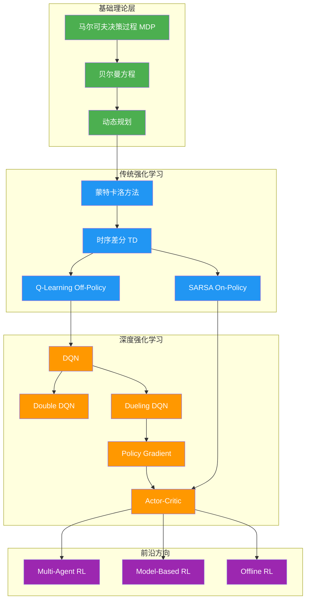

# 第9章 强化学习（Reinforcement Learning）

## 📚 学习路线图

## 📖 章节内容

### 9.1 MDP与动态规划
- [[9.1-MDP与动态规划|详细内容]]
- 马尔可夫决策过程、贝尔曼方程
- 值迭代、策略迭代

### 9.2 Q-Learning与SARSA
- [[9.2-Q-Learning与SARSA|详细内容]]
- On-Policy vs Off-Policy
- Q-Learning、SARSA、TD学习

### 9.3 深度强化学习
- [[9.3-深度强化学习|详细内容]]
- DQN、Double DQN、Dueling DQN
- Policy Gradient、Actor-Critic

## 🏆 核心考点

| 考点 | 重要程度 | 常考形式 |
|------|----------|----------|
| MDP的五要素 | ⭐⭐⭐⭐⭐ | 简答题、选择题 |
| 贝尔曼方程推导 | ⭐⭐⭐⭐⭐ | 计算题、简答题 |
| 值迭代与策略迭代 | ⭐⭐⭐⭐⭐ | 计算题、对比题 |
| On-Policy vs Off-Policy | ⭐⭐⭐⭐⭐ | 简答题、对比题 |
| Q-Learning算法 | ⭐⭐⭐⭐⭐ | 计算题、算法题 |
| SARSA算法 | ⭐⭐⭐⭐ | 计算题、算法题 |
| DQN innovations | ⭐⭐⭐⭐⭐ | 简答题、论述题 |
| Policy Gradient公式 | ⭐⭐⭐⭐ | 计算题、简答题 |
| Actor-Critic架构 | ⭐⭐⭐⭐ | 简答题、画图题 |

## 📝 自测题库

### 一、概念理解题

1. **什么是马尔可夫决策过程？它的五个组成要素是什么？**
2. **解释贝尔曼方程的含义，为什么它是强化学习的核心？**
3. **On-Policy和Off-Policy强化学习方法的本质区别是什么？**

### 二、计算题

4. **给定MDP：状态$S={s_0, s_1}$，动作$A={a_0, a_1}$，转移概率和奖励如下：**
   - $P(s_0|s_0,a_0)=0.5, P(s_1|s_0,a_0)=0.5, R(s_0,a_0,s_0)=1, R(s_0,a_0,s_1)=2$
   - $P(s_0|s_0,a_1)=0.8, P(s_1|s_0,a_1)=0.2, R(s_0,a_1,s_0)=0, R(s_0,a_1,s_1)=3$
   - 折扣因子$\gamma=0.9$
   - 计算$V(s_0)$和$V(s_1)$的值（使用值迭代）

5. **给定Q-Learning的学习过程：**
   - 初始$Q(s_0,a_0)=0, Q(s_0,a_1)=0, Q(s_1,a_0)=0, Q(s_1,a_1)=0$
   - 经历：$s_0 \xrightarrow{a_0} s_1, R=1$，学习率$\alpha=0.1$，$\gamma=0.9$
   - 计算更新后的$Q(s_0,a_0)$

### 三、论述题

6. **请详细描述DQN的两大创新点（经验回放和目标网络），并说明它们解决了什么问题。**
7. **对比Value-Based和Policy-Based强化学习方法的优缺点。**
8. **请推导Policy Gradient定理，并解释其在强化学习中的作用。**

## ✅ 学习检查清单

- [ ] 能够写出MDP的五个组成要素
- [ ] 熟练推导贝尔曼期望方程和最优方程
- [ ] 掌握值迭代和策略迭代的算法步骤
- [ ] 理解On-Policy和Off-Policy的区别
- [ ] 能手写Q-Learning和SARSA的更新公式
- [ ] 理解DQN的两大创新点及其作用
- [ ] 掌握Policy Gradient的推导过程
- [ ] 理解Actor-Critic的架构和工作原理