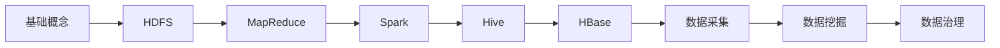
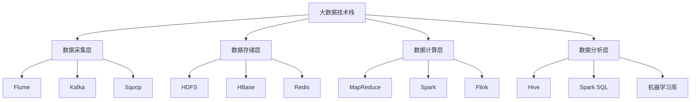

# 大数据分析技术

> [!abstract] 课程定位
> 大数据分析技术是计算机科学与技术专业的核心课程，系统介绍大数据的基本概念、技术栈和分析方法。

## 学习主线

## 章节导航

| 章节 | 名称 | 核心内容 |
|-----|------|---------|
| 第1章 | [[知识点/第1章-大数据基础概念与技术栈/MOC - 第1章|大数据基础概念与技术栈]] | 4V特征、技术架构、应用场景 |
| 第2章 | [[知识点/第2章-分布式文件存储HDFS/MOC - 第2章|分布式文件存储HDFS]] | HDFS架构、读写流程、NameNode |
| 第3章 | [[知识点/第3章-分布式计算框架MapReduce/MOC - 第3章|分布式计算框架MapReduce]] | MapReduce原理、编程模型、Shuffle |
| 第4章 | [[知识点/第4章-Spark分布式计算引擎/MOC - 第4章|Spark分布式计算引擎]] | Spark架构、RDD、Spark SQL |
| 第5章 | [[知识点/第5章-分布式数据仓库Hive/MOC - 第5章|分布式数据仓库Hive]] | Hive架构、HQL、分区与分桶 |
| 第6章 | [[知识点/第6章-NoSQL数据库与HBase/MOC - 第6章|NoSQL数据库与HBase]] | NoSQL分类、HBase架构、读写流程 |
| 第7章 | [[知识点/第7章-大数据采集与数据预处理/MOC - 第7章|大数据采集与数据预处理]] | Flume、Kafka、ETL流程 |
| 第8章 | [[知识点/第8章-数据挖掘与大数据分析算法/MOC - 第8章|数据挖掘与大数据分析算法]] | 聚类、分类、关联规则、推荐系统 |
| 第9章 | [[知识点/第9章-大数据治理与数据安全/MOC - 第9章|大数据治理与数据安全]] | 数据质量、元数据管理、安全策略 |

## 考点汇总

> [!important] 考研/面试高频考点
> 1. 大数据4V特征及技术挑战
> 2. HDFS架构设计与NameNode原理
> 3. MapReduce工作流程与Shuffle机制
> 4. Spark与MapReduce的对比
> 5. RDD特性与Transformation/Action操作
> 6. Hive与传统数据库的区别
> 7. HBase架构与读写流程
> 8. Flume与Kafka的区别与应用场景
> 9. 数据挖掘算法原理与应用

## 技术栈地图

## 学习路线建议

| 阶段 | 内容 | 时间建议 |
|-----|------|---------|
| 基础阶段 | 第1-2章：概念与HDFS | 2周 |
| 核心阶段 | 第3-5章：MapReduce、Spark、Hive | 4周 |
| 进阶阶段 | 第6-8章：HBase、数据采集、数据挖掘 | 3周 |
| 综合阶段 | 第9章：数据治理 + 综合实践 | 1周 |

## 复习自测

> [!question] 自测题
> 1. 什么是大数据的4V特征？各有什么含义？
> 2. HDFS的架构是什么？NameNode和DataNode的作用分别是什么？
> 3. MapReduce的工作流程是怎样的？Shuffle阶段做了什么？
> 4. Spark相比MapReduce有什么优势？RDD是什么？
> 5. Hive是什么？HQL和SQL有什么区别？
> 6. HBase是什么类型的数据库？有什么特点？
> 7. Flume和Kafka分别用于什么场景？
> 8. 常用的数据挖掘算法有哪些？各有什么应用？
> 9. 大数据治理包含哪些方面？