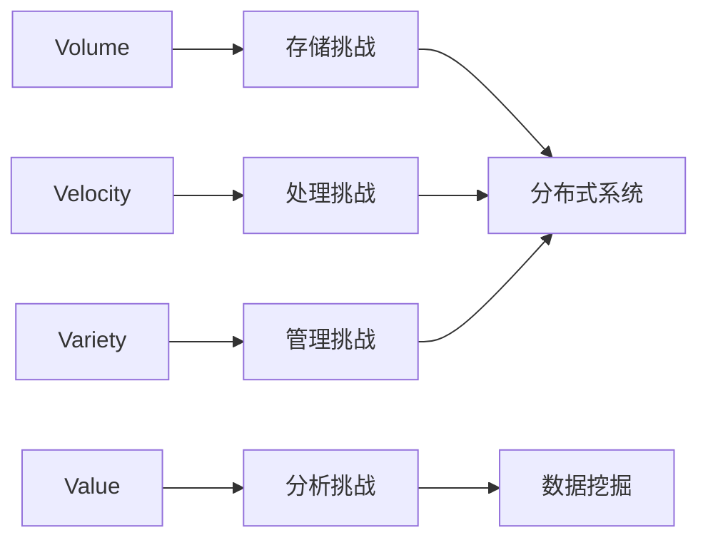

# 1.1 大数据4V特征

> [!abstract] 核心问题
> 大数据的4V特征是什么？每个特征带来了哪些技术挑战？

## 一、大数据的定义

### 1. 大数据的概念

**定义**：大数据是指无法在一定时间内用传统数据库工具对其内容进行采集、存储、管理和分析的数据集合。

**特点**：

| 特点 | 说明 |
|-----|------|
| **海量数据** | 数据规模巨大，远超传统数据库处理能力 |
| **多样数据** | 数据类型多样，包括结构化、半结构化和非结构化 |
| **快速处理** | 数据产生和处理速度快，需要实时或准实时处理 |
| **价值密度低** | 数据价值密度低，需要从海量数据中提取有用信息 |

### 2. 大数据与传统数据的区别

**对比表**：

| 对比项 | 传统数据 | 大数据 |
|-------|---------|--------|
| **数据规模** | GB级别 | PB级别以上 |
| **数据类型** | 结构化 | 结构化、半结构化、非结构化 |
| **处理方式** | 批处理 | 批处理+流处理 |
| **存储方式** | 集中式存储 | 分布式存储 |
| **分析方式** | 联机分析处理(OLAP) | 数据挖掘、机器学习 |

## 二、大数据4V特征详解

### 1. Volume（大量）

**定义**：数据规模巨大，达到PB级别以上。

**示例**：

| 场景 | 数据规模 |
|-----|---------|
| 社交网络 | 每天产生TB级数据 |
| 电商平台 | 交易日志每天PB级 |
| 物联网 | 传感器数据海量增长 |

**技术挑战**：

| 挑战 | 说明 |
|-----|------|
| **存储** | 需要分布式存储系统 |
| **计算** | 需要分布式计算框架 |
| **传输** | 网络带宽成为瓶颈 |

**技术解决方案**：

| 技术 | 说明 |
|-----|------|
| **HDFS** | 分布式文件系统 |
| **MapReduce** | 分布式计算框架 |
| **Spark** | 内存计算框架 |

### 2. Velocity（高速）

**定义**：数据产生和处理速度快。

**示例**：

| 场景 | 数据速度 |
|-----|---------|
| 股票交易 | 每秒百万级交易 |
| 社交媒体 | 每秒数万条消息 |
| 实时监控 | 连续产生数据流 |

**技术挑战**：

| 挑战 | 说明 |
|-----|------|
| **实时处理** | 需要实时或准实时处理 |
| **低延迟** | 要求低延迟响应 |
| **高吞吐** | 需要高吞吐量 |

**技术解决方案**：

| 技术 | 说明 |
|-----|------|
| **Storm** | 实时流处理框架 |
| **Flink** | 流式计算框架 |
| **Kafka** | 分布式消息队列 |

### 3. Variety（多样）

**定义**：数据类型多样，包括结构化、半结构化和非结构化。

**数据类型分类**：

| 类型 | 说明 | 示例 |
|-----|------|------|
| **结构化数据** | 有固定格式和结构 | 数据库表、Excel |
| **半结构化数据** | 有一定结构但不严格 | JSON、XML、CSV |
| **非结构化数据** | 无固定结构 | 文本、图片、视频、音频 |

**技术挑战**：

| 挑战 | 说明 |
|-----|------|
| **存储** | 不同类型数据需要不同存储方式 |
| **处理** | 需要统一处理框架 |
| **分析** | 需要多种分析工具 |

**技术解决方案**：

| 技术 | 说明 |
|-----|------|
| **HBase** | 列式数据库，适合半结构化数据 |
| **MongoDB** | 文档数据库，适合JSON数据 |
| **Elasticsearch** | 全文搜索引擎 |

### 4. Value（价值）

**定义**：数据价值密度低，但蕴含巨大价值。

**示例**：

| 场景 | 价值密度 | 价值体现 |
|-----|---------|---------|
| 监控视频 | 低（大量无用画面） | 异常事件检测 |
| 用户行为日志 | 低（大量重复行为） | 用户画像、推荐 |
| 传感器数据 | 低（大量正常数据） | 故障预测、优化 |

**技术挑战**：

| 挑战 | 说明 |
|-----|------|
| **价值提取** | 从海量数据中提取有价值信息 |
| **知识发现** | 发现隐藏模式和规律 |
| **决策支持** | 基于数据做出决策 |

**技术解决方案**：

| 技术 | 说明 |
|-----|------|
| **数据挖掘** | 发现数据中的模式 |
| **机器学习** | 构建预测模型 |
| **深度学习** | 处理复杂数据 |

## 三、4V特征的关系

### 1. 相互关系

**关系图**：



**总结**：

| 特征 | 带来的挑战 | 技术方向 |
|-----|-----------|---------|
| Volume | 存储和计算 | 分布式存储和计算 |
| Velocity | 实时处理 | 流处理框架 |
| Variety | 数据管理 | 多模型数据库 |
| Value | 价值提取 | 数据挖掘和机器学习 |

### 2. 大数据技术栈的演进

**演进历程**：

```
阶段1：Hadoop时代（2006-2012）
- 核心技术：HDFS + MapReduce
- 特点：批处理、离线分析

阶段2：Spark时代（2012-2015）
- 核心技术：Spark
- 特点：内存计算、迭代计算

阶段3：实时时代（2015-至今）
- 核心技术：Flink、Kafka
- 特点：实时流处理、事件驱动
```

## 四、大数据与相关技术的关系

### 1. 大数据与云计算

**关系**：

| 关系 | 说明 |
|-----|------|
| **基础设施** | 云计算为大数据提供基础设施 |
| **弹性资源** | 云计算提供弹性计算和存储资源 |
| **服务模式** | IaaS、PaaS、SaaS |

**示例**：

```
AWS：提供S3存储、EC2计算
Azure：提供Blob存储、VM计算
阿里云：提供OSS存储、ECS计算
```

### 2. 大数据与人工智能

**关系**：

| 关系 | 说明 |
|-----|------|
| **数据驱动** | 大数据为AI提供训练数据 |
| **算法支撑** | AI算法从大数据中提取知识 |
| **相互促进** | 大数据需要AI挖掘价值，AI需要大数据训练模型 |

**示例**：

```
推荐系统：基于用户行为大数据训练推荐模型
图像识别：基于海量图像数据训练深度学习模型
自然语言处理：基于海量文本数据训练语言模型
```

### 3. 大数据与物联网

**关系**：

| 关系 | 说明 |
|-----|------|
| **数据来源** | 物联网设备产生海量数据 |
| **实时处理** | 物联网数据需要实时处理 |
| **智能决策** | 基于物联网数据做出智能决策 |

**示例**：

```
智能家居：传感器数据实时分析
智能交通：车辆数据实时监控
工业互联网：设备数据预测维护
```

> [!warning] 易错点
> 大数据4V特征是Volume、Velocity、Variety、Value！不要遗漏任何一个，也不要混淆它们的含义。

---

**导航**：[[MOC - 第1章.md|返回章节导航]] · 下一节 [[1.2-大数据技术分层架构.md]]