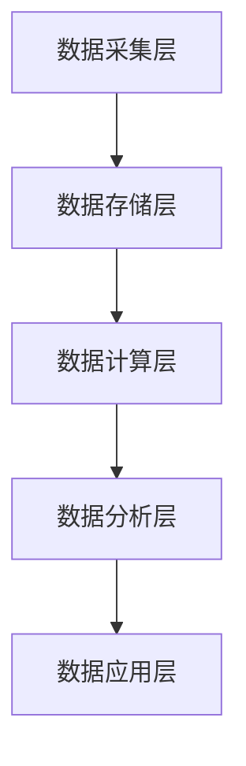
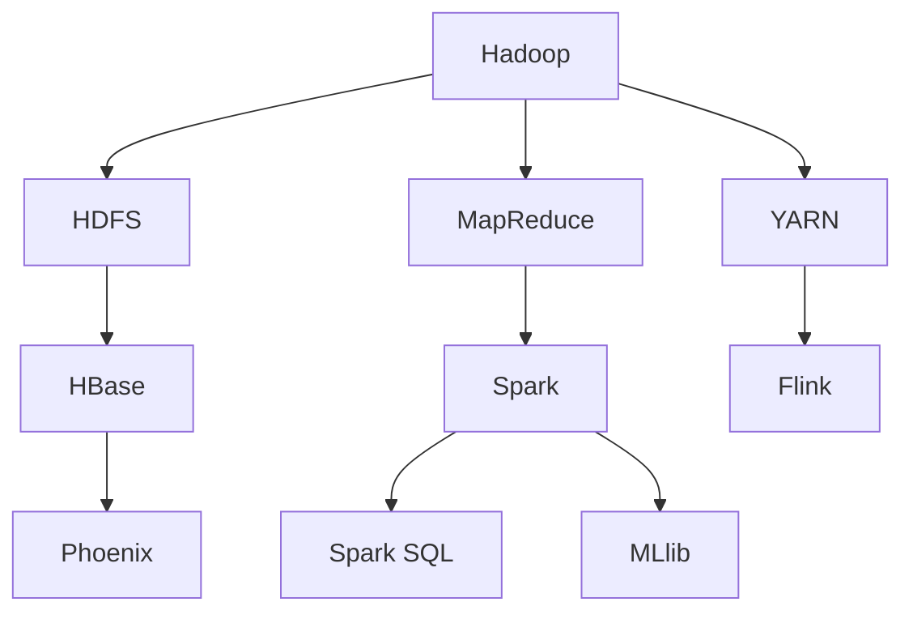
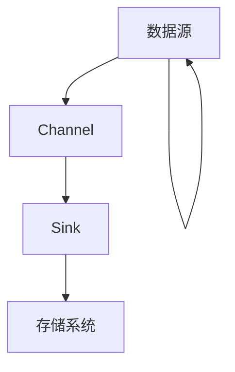
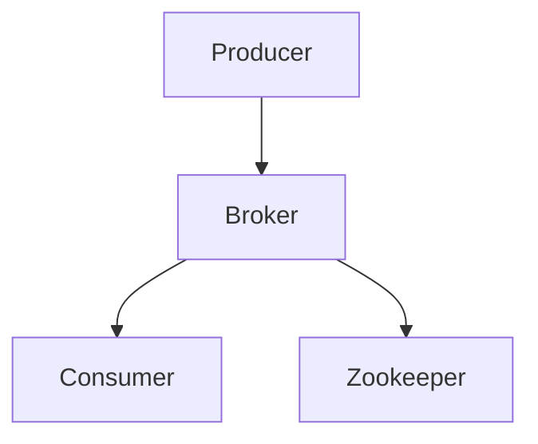
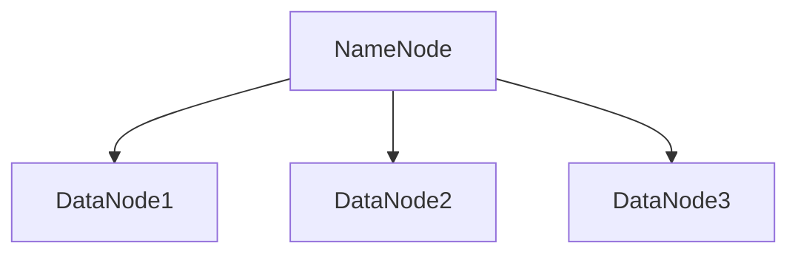
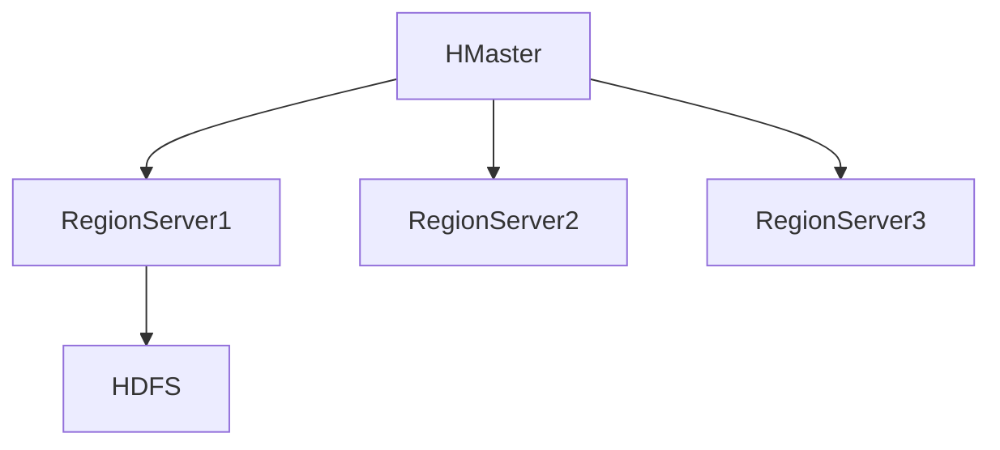
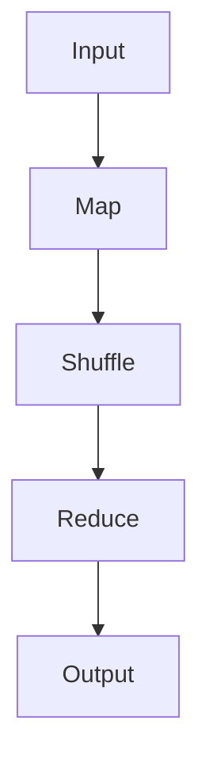
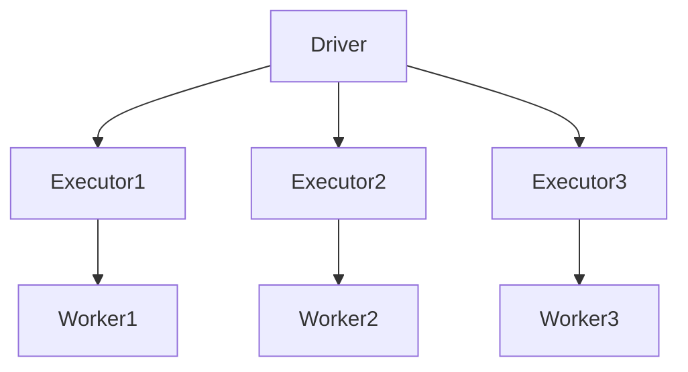
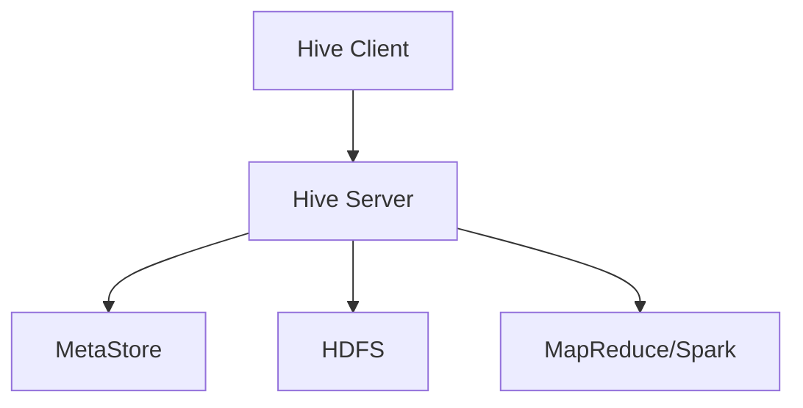

# 1.2 大数据技术分层架构

> [!abstract] 核心问题
> 大数据技术分层架构包含哪些层次？各层次有哪些核心技术？

## 一、大数据技术架构概述

### 1. 架构层次

**定义**：大数据技术架构是指处理大数据所需的技术组件及其相互关系。

**层次结构**：

**各层职责**：

| 层次 | 职责 | 核心技术 |
|-----|------|---------|
| **数据采集层** | 采集和传输数据 | Flume、Kafka、Sqoop |
| **数据存储层** | 存储和管理数据 | HDFS、HBase、Redis |
| **数据计算层** | 处理和分析数据 | MapReduce、Spark、Flink |
| **数据分析层** | 数据挖掘和查询 | Hive、Spark SQL、机器学习 |
| **数据应用层** | 数据可视化和应用 | BI工具、可视化平台 |

### 2. Hadoop生态系统

**定义**：Hadoop是一个开源的分布式计算平台，是大数据技术的核心。

**生态系统组成**：

**核心组件**：

| 组件 | 功能 | 说明 |
|-----|------|------|
| **HDFS** | 分布式文件系统 | 存储海量数据 |
| **MapReduce** | 分布式计算框架 | 批处理计算 |
| **YARN** | 资源管理系统 | 管理集群资源 |
| **HBase** | 列式数据库 | 实时读写 |
| **Spark** | 内存计算框架 | 高速计算 |

## 二、数据采集层

### 1. 数据采集的概念

**定义**：数据采集是指从各种数据源收集数据并传输到数据存储系统的过程。

**数据源类型**：

| 类型 | 说明 | 示例 |
|-----|------|------|
| **日志数据** | 系统和应用日志 | Web日志、服务器日志 |
| **业务数据** | 业务系统数据 | 交易数据、用户数据 |
| **传感器数据** | 物联网设备数据 | 温度、湿度、位置 |
| **社交媒体数据** | 社交平台数据 | 微博、微信、Twitter |

### 2. Flume

**定义**：Flume是一个分布式的日志收集系统。

**架构**：

**组件**：

| 组件 | 功能 | 说明 |
|-----|------|------|
| **Source** | 数据源 | 收集数据 |
| **Channel** | 通道 | 缓冲数据 |
| **Sink** | 接收器 | 输出数据 |

**应用场景**：

| 场景 | 说明 |
|-----|------|
| **日志收集** | 收集Web服务器日志 |
| **数据传输** | 从多个数据源收集数据 |
| **实时监控** | 实时监控系统状态 |

### 3. Kafka

**定义**：Kafka是一个分布式的消息队列系统。

**架构**：

**组件**：

| 组件 | 功能 | 说明 |
|-----|------|------|
| **Producer** | 生产者 | 发送消息 |
| **Broker** | 代理 | 存储消息 |
| **Consumer** | 消费者 | 消费消息 |
| **Zookeeper** | 协调器 | 管理集群 |

**应用场景**：

| 场景 | 说明 |
|-----|------|
| **实时流处理** | 实时处理数据流 |
| **消息队列** | 解耦生产者和消费者 |
| **日志聚合** | 聚合多个服务日志 |

### 4. Sqoop

**定义**：Sqoop是一个用于在Hadoop和关系数据库之间传输数据的工具。

**功能**：

| 功能 | 说明 |
|-----|------|
| **导入** | 从关系数据库导入数据到Hadoop |
| **导出** | 从Hadoop导出数据到关系数据库 |
| **增量导入** | 支持增量数据导入 |

**应用场景**：

| 场景 | 说明 |
|-----|------|
| **数据迁移** | 将传统数据库数据迁移到Hadoop |
| **数据同步** | 同步关系数据库和Hadoop数据 |

## 三、数据存储层

### 1. HDFS

**定义**：HDFS是Hadoop分布式文件系统。

**架构**：

**组件**：

| 组件 | 功能 | 说明 |
|-----|------|------|
| **NameNode** | 名称节点 | 管理文件系统元数据 |
| **DataNode** | 数据节点 | 存储实际数据 |
| **SecondaryNameNode** | 辅助名称节点 | 备份NameNode |

**特点**：

| 特点 | 说明 |
|-----|------|
| **高容错** | 数据多副本存储 |
| **高吞吐** | 适合大规模数据访问 |
| **适合批量处理** | 不适合随机读写 |

### 2. HBase

**定义**：HBase是一个分布式的列式数据库。

**架构**：

**组件**：

| 组件 | 功能 | 说明 |
|-----|------|------|
| **HMaster** | 主节点 | 管理集群 |
| **RegionServer** | 区域服务器 | 存储和管理数据 |
| **Zookeeper** | 协调器 | 管理分布式状态 |

**特点**：

| 特点 | 说明 |
|-----|------|
| **列式存储** | 按列存储数据 |
| **实时读写** | 支持随机读写 |
| **强一致性** | 数据一致性保证 |

### 3. Redis

**定义**：Redis是一个内存键值存储系统。

**特点**：

| 特点 | 说明 |
|-----|------|
| **内存存储** | 数据存储在内存中 |
| **高性能** | 读写速度快 |
| **丰富数据结构** | 支持多种数据结构 |

**应用场景**：

| 场景 | 说明 |
|-----|------|
| **缓存** | 缓存热点数据 |
| **会话管理** | 管理用户会话 |
| **实时计数器** | 实时统计计数 |

## 四、数据计算层

### 1. MapReduce

**定义**：MapReduce是一个分布式计算框架。

**编程模型**：

**阶段**：

| 阶段 | 功能 | 说明 |
|-----|------|------|
| **Map** | 映射 | 将输入数据转换为键值对 |
| **Shuffle** | 洗牌 | 对键值对进行排序和分组 |
| **Reduce** | 归约 | 对分组后的数据进行聚合 |

**特点**：

| 特点 | 说明 |
|-----|------|
| **批处理** | 适合批量数据处理 |
| **容错性** | 自动处理节点故障 |
| **可扩展性** | 可以扩展到大规模集群 |

### 2. Spark

**定义**：Spark是一个内存计算框架。

**架构**：

**组件**：

| 组件 | 功能 | 说明 |
|-----|------|------|
| **Driver** | 驱动程序 | 协调任务执行 |
| **Executor** | 执行器 | 执行计算任务 |
| **Worker** | 工作节点 | 提供计算资源 |

**特点**：

| 特点 | 说明 |
|-----|------|
| **内存计算** | 数据存储在内存中 |
| **高速计算** | 比MapReduce快100倍 |
| **通用计算** | 支持多种计算模式 |

### 3. Flink

**定义**：Flink是一个流式计算框架。

**特点**：

| 特点 | 说明 |
|-----|------|
| **流式计算** | 支持实时流处理 |
| **事件时间** | 支持事件时间处理 |
| **状态管理** | 内置状态管理 |

**应用场景**：

| 场景 | 说明 |
|-----|------|
| **实时监控** | 实时监控系统状态 |
| **实时分析** | 实时分析业务数据 |
| **流式ETL** | 实时数据转换 |

## 五、数据分析层

### 1. Hive

**定义**：Hive是一个分布式数据仓库。

**架构**：

**组件**：

| 组件 | 功能 | 说明 |
|-----|------|------|
| **Hive Client** | 客户端 | 提交HQL查询 |
| **Hive Server** | 服务器 | 处理查询请求 |
| **MetaStore** | 元数据存储 | 存储表结构信息 |

**特点**：

| 特点 | 说明 |
|-----|------|
| **HQL** | 类SQL查询语言 |
| **批处理** | 适合批量数据查询 |
| **可扩展** | 可以扩展到大规模数据 |

### 2. Spark SQL

**定义**：Spark SQL是Spark的SQL查询模块。

**特点**：

| 特点 | 说明 |
|-----|------|
| **SQL支持** | 支持SQL查询 |
| **DataFrame** | 支持DataFrame API |
| **高性能** | 基于Spark引擎 |

**应用场景**：

| 场景 | 说明 |
|-----|------|
| **交互式查询** | 交互式数据分析 |
| **数据探索** | 数据探索和分析 |
| **报表生成** | 生成数据报表 |

### 3. 机器学习库

**定义**：机器学习库是用于构建和训练机器学习模型的工具。

**常用库**：

| 库 | 说明 |
|-----|------|
| **MLlib** | Spark机器学习库 |
| **TensorFlow** | Google深度学习框架 |
| **PyTorch** | Facebook深度学习框架 |
| **Scikit-learn** | Python机器学习库 |

**应用场景**：

| 场景 | 说明 |
|-----|------|
| **预测分析** | 预测未来趋势 |
| **推荐系统** | 个性化推荐 |
| **图像识别** | 图像分类和识别 |

> [!warning] 易错点
> 大数据技术架构分为五层：数据采集层、数据存储层、数据计算层、数据分析层和数据应用层！不要遗漏任何一层。

---

**导航**：上一节 [[1.1-大数据4V特征.md]] · [[MOC - 第1章.md|返回章节导航]] · 下一节 [[1.3-大数据应用场景.md]]