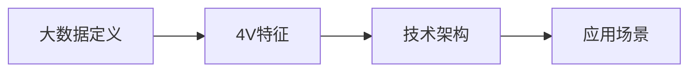

# 第1章-大数据基础概念与技术栈

> [!abstract] 本章定位
> 本章介绍大数据的基本概念、4V特征、技术分层架构和典型应用场景，是学习后续技术的基础。

## 学习主线

## 章节内容

- [[1.1-大数据4V特征.md]]：Volume、Velocity、Variety、Value
- [[1.2-大数据技术分层架构.md]]：采集层、存储层、计算层、分析层
- [[1.3-大数据应用场景.md]]：互联网、金融、医疗、政务等

## 考点汇总

> [!important] 核心考点
> 1. 大数据的定义和4V特征
> 2. 大数据技术分层架构及各层技术
> 3. 大数据与云计算、人工智能的关系
> 4. 典型大数据应用场景
> 5. 大数据面临的技术挑战

## 前后章节依赖

| 方向 | 章节 | 依赖关系 |
|-----|------|---------|
| 先修 | 无 | 第一章，无先修 |
| 后续 | 第2章 | 理解技术架构后学习具体技术 |

## 复习自测

> [!question] 自测题
> 1. 什么是大数据？大数据的4V特征是什么？
> 2. 大数据技术分层架构包含哪些层次？各层次有哪些技术？
> 3. 大数据与云计算、人工智能的关系是什么？
> 4. 大数据有哪些典型应用场景？
> 5. 大数据处理面临哪些技术挑战？