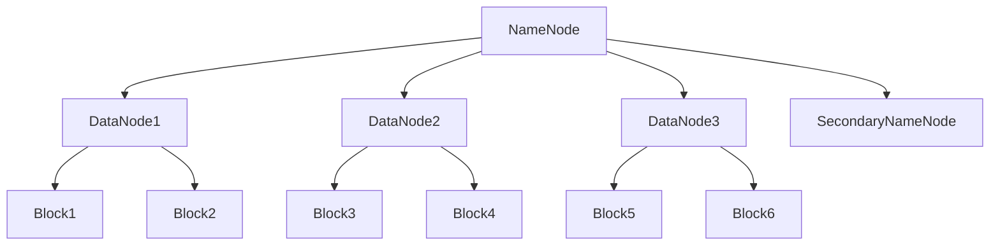
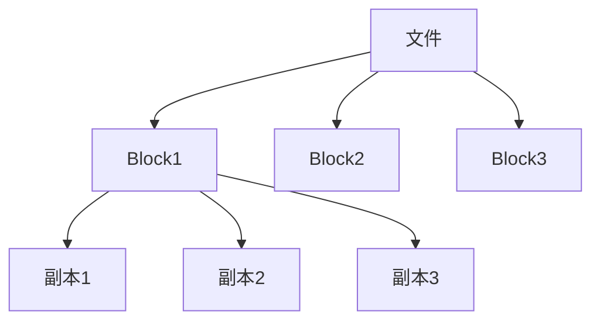

# 2.1 HDFS架构设计

> [!abstract] 核心问题
> HDFS的架构是什么？NameNode和DataNode的作用分别是什么？

## 一、HDFS概述

### 1. HDFS的定义

**定义**：HDFS（Hadoop Distributed File System）是Hadoop的分布式文件系统。

**设计目标**：

| 目标 | 说明 |
|-----|------|
| **高容错** | 数据多副本存储，自动故障恢复 |
| **高吞吐** | 适合大规模数据访问 |
| **可扩展** | 可以扩展到大规模集群 |
| **适合批量处理** | 不适合随机读写 |

**适用场景**：

| 场景 | 说明 |
|-----|------|
| **大数据存储** | 存储海量数据 |
| **批量数据处理** | 批处理计算 |
| **日志存储** | 存储日志文件 |

### 2. HDFS与传统文件系统的区别

**对比表**：

| 对比项 | 传统文件系统 | HDFS |
|-------|-------------|------|
| **存储方式** | 集中式存储 | 分布式存储 |
| **数据规模** | GB级别 | PB级别以上 |
| **容错性** | 依赖硬件 | 软件实现容错 |
| **读写方式** | 随机读写 | 顺序读写 |
| **访问模式** | 低延迟 | 高吞吐 |

## 二、HDFS架构

### 1. 架构组成

**架构图**：



**组件说明**：

| 组件 | 功能 | 说明 |
|-----|------|------|
| **NameNode** | 名称节点 | 管理文件系统元数据 |
| **DataNode** | 数据节点 | 存储实际数据块 |
| **SecondaryNameNode** | 辅助名称节点 | 备份NameNode元数据 |

### 2. NameNode

**定义**：NameNode是HDFS的主节点，管理文件系统的元数据。

**职责**：

| 职责 | 说明 |
|-----|------|
| **管理文件系统命名空间** | 维护文件和目录的树状结构 |
| **记录文件到数据块的映射** | 记录每个文件由哪些数据块组成 |
| **管理数据块副本** | 管理数据块的副本位置 |
| **处理客户端请求** | 处理文件的创建、删除、重命名等请求 |

**元数据存储**：

| 存储方式 | 说明 |
|-----|------|
| **内存** | 元数据存储在内存中，提高访问速度 |
| **磁盘** | 元数据持久化到磁盘，防止数据丢失 |

**重要文件**：

| 文件 | 说明 |
|-----|------|
| **fsimage** | 文件系统元数据的快照 |
| **editlog** | 文件系统的操作日志 |

### 3. DataNode

**定义**：DataNode是HDFS的从节点，存储实际的数据块。

**职责**：

| 职责 | 说明 |
|-----|------|
| **存储数据块** | 存储实际的数据块 |
| **执行数据块的读写操作** | 响应客户端的数据读写请求 |
| **向NameNode汇报状态** | 定期向NameNode汇报节点状态和数据块信息 |
| **数据块复制** | 根据NameNode的指令复制数据块 |

**数据块存储**：

| 存储方式 | 说明 |
|-----|------|
| **磁盘** | 数据块存储在磁盘上 |
| **副本** | 每个数据块有多个副本 |

**数据块大小**：

| 默认大小 | 说明 |
|---------|------|
| **128MB** | Hadoop 2.x默认数据块大小 |
| **64MB** | Hadoop 1.x默认数据块大小 |

**选择数据块大小的考虑因素**：

| 因素 | 说明 |
|-----|------|
| **磁盘I/O** | 数据块越大，磁盘I/O次数越少 |
| **网络传输** | 数据块越大，网络传输效率越高 |
| **MapReduce任务数** | 数据块数量决定Map任务数量 |

### 4. SecondaryNameNode

**定义**：SecondaryNameNode是NameNode的辅助节点，负责备份元数据。

**职责**：

| 职责 | 说明 |
|-----|------|
| **合并fsimage和editlog** | 定期合并fsimage和editlog |
| **创建新的fsimage** | 创建新的文件系统元数据快照 |
| **辅助NameNode恢复** | 在NameNode故障时提供备份 |

**工作流程**：

```
1. SecondaryNameNode向NameNode请求editlog
2. NameNode停止写入editlog，创建临时editlog
3. NameNode发送fsimage和editlog到SecondaryNameNode
4. SecondaryNameNode合并fsimage和editlog
5. SecondaryNameNode发送新的fsimage到NameNode
6. NameNode用新的fsimage替换旧的fsimage
```

**注意**：

| 注意事项 | 说明 |
|---------|------|
| **不是NameNode的热备** | SecondaryNameNode不能替代NameNode |
| **定期合并** | 合并操作会定期执行 |

## 三、HDFS文件系统命名空间

### 1. 命名空间结构

**定义**：HDFS的命名空间是一个层次化的文件系统结构。

**结构**：

```mermaid
graph TD
    A[/] --> B[user]
    A --> C[data]
    B --> D[alice]
    B --> E[bob]
    C --> F[logs]
    C --> G[datasets]
```

**特点**：

| 特点 | 说明 |
|-----|------|
| **层次化** | 文件和目录组织成树状结构 |
| **统一命名** | 全局统一的命名空间 |
| **权限控制** | 支持文件和目录的权限控制 |

### 2. 文件和目录操作

**支持的操作**：

| 操作 | 说明 |
|-----|------|
| **创建文件** | 创建新文件 |
| **删除文件** | 删除文件 |
| **重命名文件** | 重命名文件 |
| **创建目录** | 创建目录 |
| **删除目录** | 删除目录 |
| **列出目录** | 列出目录内容 |

**权限控制**：

| 权限 | 说明 |
|-----|------|
| **读权限** | 读取文件内容或列出目录 |
| **写权限** | 修改文件内容或创建文件 |
| **执行权限** | 执行文件或访问目录 |

## 四、HDFS的数据块管理

### 1. 数据块概念

**定义**：数据块是HDFS存储数据的基本单位。

**特点**：

| 特点 | 说明 |
|-----|------|
| **固定大小** | 默认128MB |
| **分布式存储** | 数据块分散存储在多个DataNode上 |
| **多副本** | 每个数据块有多个副本 |

**文件与数据块的关系**：



### 2. 数据块的分配

**分配策略**：

| 策略 | 说明 |
|-----|------|
| **就近原则** | 优先分配到靠近客户端的DataNode |
| **负载均衡** | 考虑DataNode的负载情况 |
| **机架感知** | 考虑数据块的机架位置 |

**机架感知**：

| 原则 | 说明 |
|-----|------|
| **副本放置** | 第一个副本在客户端所在机架，第二个副本在不同机架，第三个副本在第二个副本所在机架的不同节点 |
| **故障隔离** | 不同机架的副本可以防止单点故障 |

### 3. 数据块的管理

**NameNode的管理**：

| 管理内容 | 说明 |
|---------|------|
| **数据块位置** | 记录每个数据块的位置 |
| **数据块副本** | 管理数据块的副本数量和位置 |
| **数据块状态** | 监控数据块的状态 |

**DataNode的管理**：

| 管理内容 | 说明 |
|---------|------|
| **数据块存储** | 存储数据块 |
| **数据块校验** | 定期校验数据块完整性 |
| **数据块复制** | 根据NameNode指令复制数据块 |

> [!warning] 易错点
> NameNode管理元数据，DataNode存储数据块！不要混淆两者的职责。

---

**导航**：[[MOC - 第2章.md|返回章节导航]] · 下一节 [[2.2-HDFS读写流程.md]]