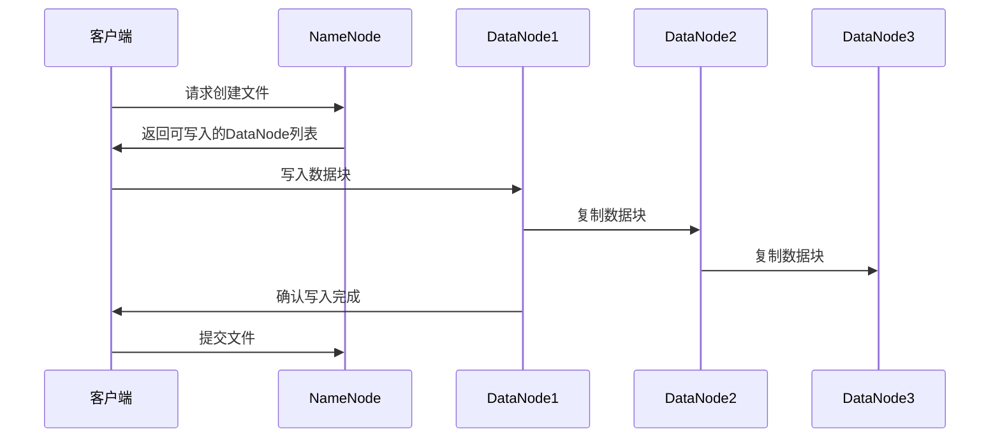
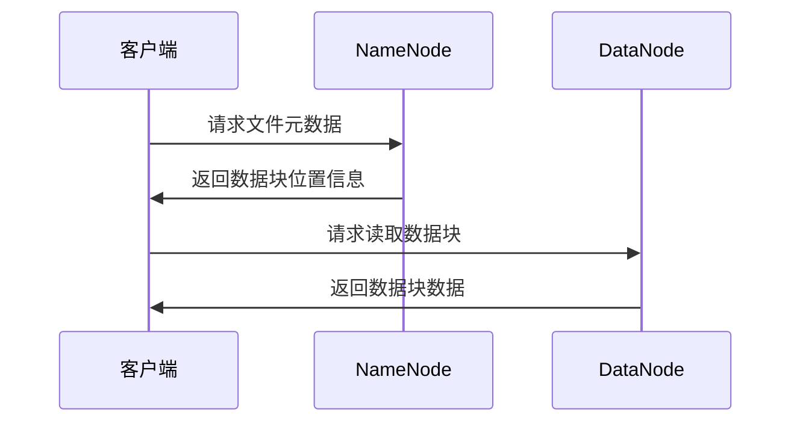

# 2.2 HDFS读写流程

> [!abstract] 核心问题
> HDFS的文件写入流程是怎样的？文件读取流程是怎样的？

## 一、HDFS文件写入流程

### 1. 写入流程概述

**定义**：HDFS文件写入流程是指客户端将文件写入HDFS的过程。

**流程图**：



### 2. 写入步骤详解

**步骤1：客户端请求创建文件**

```
客户端向NameNode发送创建文件请求
NameNode检查文件是否已存在、客户端是否有创建权限
如果检查通过，NameNode记录文件创建日志
```

**步骤2：NameNode返回DataNode列表**

```
NameNode根据副本策略，选择合适的DataNode
返回DataNode列表给客户端
DataNode列表包含数据块的存储位置
```

**步骤3：客户端写入数据块**

```
客户端将文件分成数据块
客户端向第一个DataNode写入数据块
数据块写入采用管道方式
```

**步骤4：数据块复制**

```
第一个DataNode接收数据块后，同时向第二个DataNode复制
第二个DataNode接收数据块后，同时向第三个DataNode复制
每个DataNode接收数据块后，返回确认给上一个节点
```

**步骤5：确认写入完成**

```
第三个DataNode返回确认给第二个DataNode
第二个DataNode返回确认给第一个DataNode
第一个DataNode返回确认给客户端
```

**步骤6：提交文件**

```
客户端向NameNode发送文件提交请求
NameNode将文件信息持久化到磁盘
文件创建完成
```

### 3. 写入流程特点

**特点**：

| 特点 | 说明 |
|-----|------|
| **管道写入** | 数据块通过管道方式写入多个DataNode |
| **异步复制** | 数据块复制是异步的 |
| **确认机制** | 每个DataNode都需要返回确认 |
| **容错处理** | 如果某个DataNode失败，选择其他DataNode |

**容错处理**：

| 情况 | 处理方式 |
|-----|---------|
| **DataNode失败** | 客户端选择其他DataNode继续写入 |
| **网络故障** | 客户端重试写入 |
| **副本不足** | NameNode安排额外的副本 |

## 二、HDFS文件读取流程

### 1. 读取流程概述

**定义**：HDFS文件读取流程是指客户端从HDFS读取文件的过程。

**流程图**：



### 2. 读取步骤详解

**步骤1：客户端请求文件元数据**

```
客户端向NameNode发送文件读取请求
请求包含文件路径
```

**步骤2：NameNode返回数据块位置信息**

```
NameNode查找文件的元数据
返回文件包含的数据块列表
每个数据块包含所在DataNode的位置信息
```

**步骤3：客户端读取数据块**

```
客户端根据数据块位置信息，选择最近的DataNode
客户端向DataNode发送数据块读取请求
```

**步骤4：DataNode返回数据块数据**

```
DataNode读取本地存储的数据块
将数据块返回给客户端
```

**步骤5：客户端组装文件**

```
客户端接收所有数据块
按照顺序组装成完整文件
```

### 3. 读取流程特点

**特点**：

| 特点 | 说明 |
|-----|------|
| **就近读取** | 客户端选择最近的DataNode |
| **并行读取** | 客户端可以并行读取多个数据块 |
| **数据本地化** | 优先从本地DataNode读取数据 |
| **容错处理** | 如果某个DataNode失败，选择其他副本 |

**容错处理**：

| 情况 | 处理方式 |
|-----|---------|
| **DataNode失败** | 客户端选择其他副本所在的DataNode |
| **网络故障** | 客户端重试读取 |
| **数据损坏** | 客户端检查数据块校验和，选择其他副本 |

## 三、HDFS数据块校验

### 1. 校验和概念

**定义**：校验和是用于检测数据块完整性的机制。

**原理**：

| 原理 | 说明 |
|-----|------|
| **计算校验和** | 在写入数据块时计算校验和 |
| **存储校验和** | 将校验和存储在单独的文件中 |
| **验证校验和** | 在读取数据块时验证校验和 |

**校验和算法**：

| 算法 | 说明 |
|-----|------|
| **MD5** | 常用的校验和算法 |
| **SHA-1** | 安全哈希算法 |

### 2. 校验和的使用

**写入时**：

```
客户端写入数据块时，计算校验和
将校验和与数据块一起存储
```

**读取时**：

```
客户端读取数据块时，计算校验和
将计算结果与存储的校验和比较
如果不一致，说明数据块损坏
```

**数据块损坏处理**：

| 处理方式 | 说明 |
|---------|------|
| **选择其他副本** | 客户端选择其他副本所在的DataNode |
| **报告NameNode** | 客户端向NameNode报告数据块损坏 |
| **修复数据块** | NameNode安排修复数据块 |

## 四、HDFS客户端API

### 1. Java API

**核心类**：

| 类 | 说明 |
|-----|------|
| **FileSystem** | 文件系统抽象类 |
| **Path** | 文件路径类 |
| **FSDataInputStream** | 文件输入流 |
| **FSDataOutputStream** | 文件输出流 |

**示例代码**：

```java
// 创建文件系统实例
Configuration conf = new Configuration();
FileSystem fs = FileSystem.get(conf);

// 创建文件路径
Path path = new Path("/user/hadoop/test.txt");

// 写入文件
FSDataOutputStream out = fs.create(path);
out.write("Hello HDFS".getBytes());
out.close();

// 读取文件
FSDataInputStream in = fs.open(path);
byte[] buffer = new byte[1024];
in.read(buffer);
System.out.println(new String(buffer));
in.close();

// 关闭文件系统
fs.close();
```

### 2. HDFS命令行工具

**常用命令**：

| 命令 | 说明 |
|-----|------|
| **hdfs dfs -ls** | 列出目录内容 |
| **hdfs dfs -mkdir** | 创建目录 |
| **hdfs dfs -put** | 上传文件 |
| **hdfs dfs -get** | 下载文件 |
| **hdfs dfs -cat** | 查看文件内容 |
| **hdfs dfs -rm** | 删除文件 |

**示例**：

```bash
# 列出根目录内容
hdfs dfs -ls /

# 创建目录
hdfs dfs -mkdir /user/hadoop

# 上传文件
hdfs dfs -put local.txt /user/hadoop/

# 下载文件
hdfs dfs -get /user/hadoop/local.txt

# 查看文件内容
hdfs dfs -cat /user/hadoop/local.txt

# 删除文件
hdfs dfs -rm /user/hadoop/local.txt
```

> [!warning] 易错点
> HDFS写入流程采用管道方式，读取流程采用就近原则！不要混淆写入和读取的流程。

---

**导航**：上一节 [[2.1-HDFS架构设计.md]] · [[MOC - 第2章.md|返回章节导航]] · 下一节 [[2.3-HDFS副本策略与容错.md]]