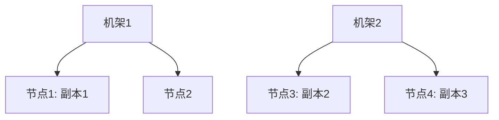
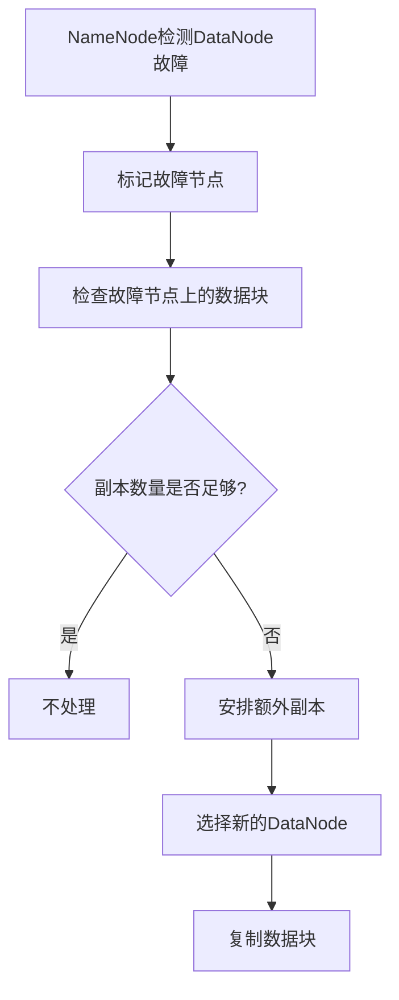
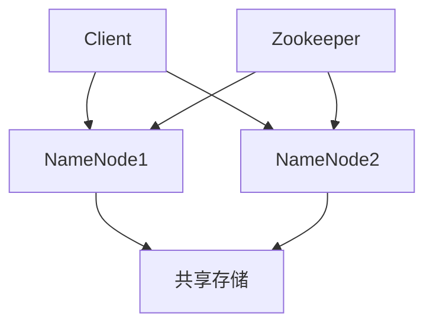
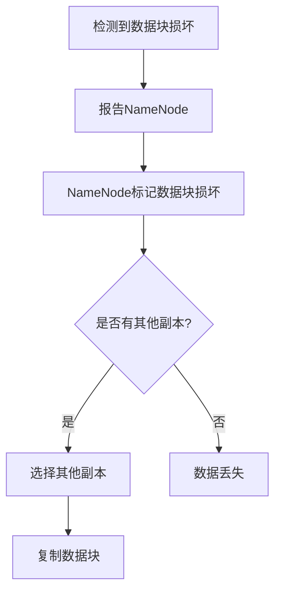
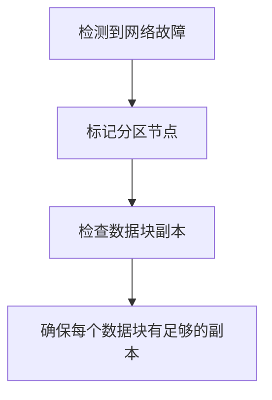
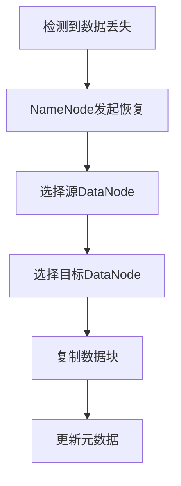

# 2.3 HDFS副本策略与容错

> [!abstract] 核心问题
> HDFS的三副本策略是什么？副本如何放置？HDFS如何实现容错？

## 一、HDFS副本策略

### 1. 副本策略概述

**定义**：HDFS副本策略是指数据块副本的数量和放置规则。

**默认策略**：

| 策略 | 说明 |
|-----|------|
| **三副本** | 默认每个数据块有3个副本 |
| **机架感知** | 考虑数据块的机架位置 |

**副本数量的选择**：

| 因素 | 说明 |
|-----|------|
| **容错性** | 副本数量越多，容错性越好 |
| **存储空间** | 副本数量越多，存储空间占用越大 |
| **读写性能** | 副本数量越多，读取性能越好，但写入性能越差 |

### 2. 三副本放置策略

**策略说明**：



**放置规则**：

| 规则 | 说明 |
|-----|------|
| **第一个副本** | 放置在客户端所在节点（如果客户端在集群外，则随机选择一个节点） |
| **第二个副本** | 放置在与第一个副本不同机架的节点 |
| **第三个副本** | 放置在与第二个副本同一机架但不同节点 |

**优势**：

| 优势 | 说明 |
|-----|------|
| **容错性** | 不同机架的副本可以防止机架故障 |
| **读取性能** | 客户端可以选择最近的副本 |
| **网络带宽** | 写入时只需要跨机架传输一次 |

### 3. 副本策略的调整

**调整副本数量**：

| 命令 | 说明 |
|-----|------|
| **hdfs dfs -setrep** | 设置文件的副本数量 |
| **hdfs dfs -setrep -R** | 递归设置目录下所有文件的副本数量 |

**示例**：

```bash
# 设置文件的副本数量为5
hdfs dfs -setrep 5 /user/hadoop/test.txt

# 递归设置目录下所有文件的副本数量为5
hdfs dfs -setrep -R 5 /user/hadoop/
```

**调整放置策略**：

| 方式 | 说明 |
|-----|------|
| **修改配置文件** | 修改hdfs-site.xml中的副本策略配置 |
| **自定义策略** | 实现自定义的副本放置策略 |

## 二、HDFS容错机制

### 1. 容错概述

**定义**：HDFS容错机制是指HDFS在节点故障时保证数据完整性和可用性的机制。

**故障类型**：

| 类型 | 说明 |
|-----|------|
| **DataNode故障** | DataNode节点宕机 |
| **NameNode故障** | NameNode节点宕机 |
| **数据块损坏** | 数据块存储损坏 |
| **网络故障** | 节点之间网络不通 |

### 2. DataNode故障处理

**检测机制**：

| 机制 | 说明 |
|-----|------|
| **心跳检测** | NameNode定期接收DataNode的心跳 |
| **超时处理** | 如果DataNode长时间没有发送心跳，NameNode认为该节点故障 |

**处理流程**：



**处理步骤**：

| 步骤 | 说明 |
|-----|------|
| **标记故障节点** | NameNode将故障DataNode标记为不可用 |
| **检查数据块** | NameNode检查故障节点上的数据块 |
| **判断副本数量** | 如果数据块副本数量不足，安排额外副本 |
| **复制数据块** | NameNode选择新的DataNode，复制数据块 |

### 3. NameNode故障处理

**单点故障问题**：

| 问题 | 说明 |
|-----|------|
| **NameNode是单点** | HDFS只有一个NameNode |
| **故障影响** | NameNode故障会导致整个HDFS不可用 |

**解决方案**：

| 方案 | 说明 |
|-----|------|
| **SecondaryNameNode** | 定期备份NameNode元数据 |
| **NameNode HA** | 高可用NameNode |
| **元数据备份** | 将元数据备份到多个位置 |

**NameNode HA**：



**组件说明**：

| 组件 | 功能 |
|-----|------|
| **Active NameNode** | 活跃的NameNode，处理客户端请求 |
| **Standby NameNode** | 备用的NameNode，同步元数据 |
| **共享存储** | 存储editlog，保证元数据同步 |
| **Zookeeper** | 管理NameNode的状态转换 |

**故障切换**：

| 步骤 | 说明 |
|-----|------|
| **检测故障** | Zookeeper检测到Active NameNode故障 |
| **选举新的Active** | Zookeeper选举Standby NameNode为Active |
| **同步元数据** | 新的Active NameNode从共享存储同步元数据 |
| **恢复服务** | 新的Active NameNode开始处理客户端请求 |

### 4. 数据块损坏处理

**检测机制**：

| 机制 | 说明 |
|-----|------|
| **校验和验证** | 在读取数据块时验证校验和 |
| **定期扫描** | DataNode定期扫描数据块，验证完整性 |

**处理流程**：



**处理步骤**：

| 步骤 | 说明 |
|-----|------|
| **检测损坏** | 客户端或DataNode检测到数据块损坏 |
| **报告NameNode** | 向NameNode报告数据块损坏 |
| **标记损坏** | NameNode标记数据块为损坏 |
| **复制数据块** | NameNode选择其他副本，复制数据块 |

### 5. 网络故障处理

**检测机制**：

| 机制 | 说明 |
|-----|------|
| **心跳超时** | NameNode检测到DataNode心跳超时 |
| **网络分区** | 集群被分成多个部分 |

**处理流程**：



**处理步骤**：

| 步骤 | 说明 |
|-----|------|
| **标记分区节点** | NameNode将网络分区的节点标记为不可用 |
| **检查数据块** | NameNode检查数据块的副本分布 |
| **确保副本数量** | 如果数据块副本数量不足，安排额外副本 |

## 三、HDFS数据恢复

### 1. 数据恢复概述

**定义**：HDFS数据恢复是指在数据丢失或损坏时恢复数据的过程。

**恢复类型**：

| 类型 | 说明 |
|-----|------|
| **自动恢复** | HDFS自动恢复故障节点上的数据 |
| **手动恢复** | 管理员手动恢复数据 |

### 2. 自动数据恢复

**恢复流程**：



**恢复步骤**：

| 步骤 | 说明 |
|-----|------|
| **检测数据丢失** | NameNode检测到数据块副本数量不足 |
| **发起恢复** | NameNode发起数据块恢复 |
| **选择源节点** | 选择有完整副本的DataNode |
| **选择目标节点** | 选择空闲的DataNode |
| **复制数据块** | 从源DataNode复制数据块到目标DataNode |
| **更新元数据** | NameNode更新数据块位置信息 |

### 3. 手动数据恢复

**恢复场景**：

| 场景 | 说明 |
|-----|------|
| **NameNode故障** | NameNode元数据丢失 |
| **数据块丢失** | 所有副本都丢失 |
| **误删除** | 文件被误删除 |

**恢复方法**：

| 方法 | 说明 |
|-----|------|
| **从备份恢复** | 从SecondaryNameNode或其他备份恢复元数据 |
| **从回收站恢复** | 从HDFS回收站恢复误删除的文件 |
| **手动复制** | 手动复制数据块 |

**示例**：

```bash
# 查看回收站内容
hdfs dfs -ls /user/hadoop/.Trash/

# 恢复文件
hdfs dfs -mv /user/hadoop/.Trash/test.txt /user/hadoop/
```

## 四、HDFS局限性

### 1. 局限性概述

**局限性**：

| 局限性 | 说明 |
|-----|------|
| **小文件问题** | 大量小文件会占用大量NameNode内存 |
| **随机读写** | 不适合随机读写操作 |
| **低延迟** | 不适合低延迟应用 |
| **元数据单点** | NameNode是单点故障 |

### 2. 小文件问题

**问题描述**：

| 问题 | 说明 |
|-----|------|
| **内存占用** | 每个文件的元数据占用NameNode内存 |
| **查询效率** | 大量小文件会降低查询效率 |
| **Map任务数** | 每个小文件会产生一个Map任务 |

**解决方案**：

| 方案 | 说明 |
|-----|------|
| **合并小文件** | 将多个小文件合并成一个大文件 |
| **SequenceFile** | 使用SequenceFile存储小文件 |
| **HAR文件** | 使用HAR文件系统 |

**示例**：

```bash
# 合并小文件
hdfs dfs -cat /user/hadoop/small/*.txt | hdfs dfs -put - /user/hadoop/large/combined.txt
```

### 3. 随机读写问题

**问题描述**：

| 问题 | 说明 |
|-----|------|
| **顺序读写** | HDFS设计为顺序读写 |
| **随机写性能差** | 随机写入会覆盖其他数据块 |
| **随机读性能差** | 需要读取整个数据块 |

**解决方案**：

| 方案 | 说明 |
|-----|------|
| **使用HBase** | HBase适合随机读写 |
| **使用其他存储系统** | 使用适合随机读写的存储系统 |

> [!warning] 易错点
> HDFS三副本策略中，第一个副本在客户端所在节点，第二个副本在不同机架，第三个副本在同一机架的不同节点！不要混淆副本的放置规则。

---

**导航**：上一节 [[2.2-HDFS读写流程.md]] · [[MOC - 第2章.md|返回章节导航]]