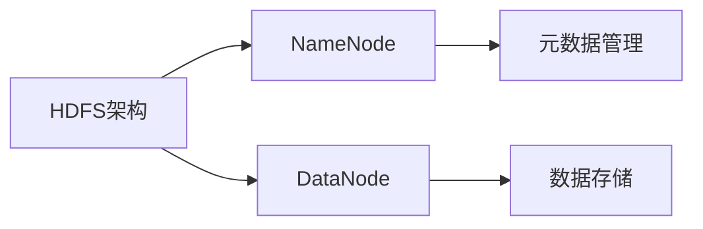

# 第2章-分布式文件存储HDFS

> [!abstract] 本章定位
> 本章介绍HDFS的架构设计、读写流程和核心组件，是大数据存储的基础。

## 学习主线

## 章节内容

- [[2.1-HDFS架构设计.md]]：HDFS架构、NameNode、DataNode
- [[2.2-HDFS读写流程.md]]：文件写入流程、文件读取流程
- [[2.3-HDFS副本策略与容错.md]]：副本策略、容错机制、数据恢复

## 考点汇总

> [!important] 核心考点
> 1. HDFS的架构设计：NameNode、DataNode、SecondaryNameNode
> 2. HDFS的文件写入流程
> 3. HDFS的文件读取流程
> 4. HDFS的副本策略：三副本策略及放置原则
> 5. HDFS的容错机制：数据备份、故障恢复
> 6. HDFS的局限性：小文件问题、随机读写

## 前后章节依赖

| 方向 | 章节 | 依赖关系 |
|-----|------|---------|
| 先修 | 第1章 | 理解大数据技术架构 |
| 后续 | 第3章 | HDFS是MapReduce的存储基础 |

## 复习自测

> [!question] 自测题
> 1. HDFS的架构是什么？NameNode和DataNode的作用分别是什么？
> 2. HDFS的文件写入流程是怎样的？
> 3. HDFS的文件读取流程是怎样的？
> 4. HDFS的三副本策略是什么？副本如何放置？
> 5. HDFS如何实现容错？
> 6. HDFS有什么局限性？