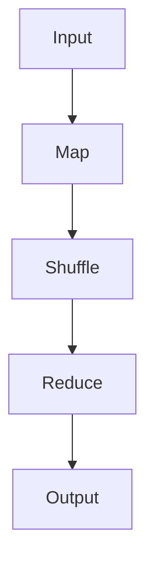

# 3.1 MapReduce编程模型

> [!abstract] 核心问题
> MapReduce的编程模型是什么？Map函数和Reduce函数分别做什么？

## 一、MapReduce概述

### 1. MapReduce的定义

**定义**：MapReduce是一个分布式计算框架，用于处理大规模数据集。

**设计思想**：

| 思想 | 说明 |
|-----|------|
| **分而治之** | 将大问题分解成小问题，并行处理 |
| **映射-归约** | 通过Map和Reduce两个阶段处理数据 |
| **容错性** | 自动处理节点故障 |

**适用场景**：

| 场景 | 说明 |
|-----|------|
| **批量数据处理** | 处理大规模数据 |
| **日志分析** | 分析日志数据 |
| **数据挖掘** | 进行数据挖掘 |
| **排序** | 大规模数据排序 |

### 2. MapReduce与传统计算的区别

**对比表**：

| 对比项 | 传统计算 | MapReduce |
|-------|---------|-----------|
| **处理方式** | 单节点处理 | 多节点并行处理 |
| **数据规模** | GB级别 | PB级别以上 |
| **容错性** | 依赖硬件 | 软件实现容错 |
| **编程复杂度** | 高 | 低（简单的API） |

## 二、MapReduce编程模型

### 1. 编程模型概述

**定义**：MapReduce编程模型是指用户通过实现Map和Reduce两个函数来处理数据。

**流程图**：



**数据处理流程**：

| 阶段 | 输入 | 输出 | 说明 |
|-----|------|------|------|
| **Map** | `<k1, v1>` | `<k2, v2>` | 将输入数据转换为键值对 |
| **Shuffle** | `<k2, v2>` | `<k2, list(v2)>` | 对键值对进行排序和分组 |
| **Reduce** | `<k2, list(v2)>` | `<k3, v3>` | 对分组后的数据进行聚合 |

### 2. Map函数

**定义**：Map函数是用户实现的第一个函数，用于将输入数据转换为键值对。

**函数签名**：

```java
public void map(K1 key, V1 value, Context context)
```

**参数说明**：

| 参数 | 说明 |
|-----|------|
| **key** | 输入键 |
| **value** | 输入值 |
| **context** | 上下文对象，用于输出键值对 |

**功能**：

| 功能 | 说明 |
|-----|------|
| **解析输入** | 解析输入数据 |
| **生成键值对** | 生成中间键值对 |
| **输出结果** | 将结果写入上下文 |

**示例**：WordCount的Map函数

```java
public void map(LongWritable key, Text value, Context context) {
    // 解析输入行
    String line = value.toString();
    
    // 分割单词
    String[] words = line.split(" ");
    
    // 生成键值对 <单词, 1>
    for (String word : words) {
        context.write(new Text(word), new IntWritable(1));
    }
}
```

### 3. Reduce函数

**定义**：Reduce函数是用户实现的第二个函数，用于对分组后的数据进行聚合。

**函数签名**：

```java
public void reduce(K2 key, Iterable<V2> values, Context context)
```

**参数说明**：

| 参数 | 说明 |
|-----|------|
| **key** | 中间键 |
| **values** | 中间值的迭代器 |
| **context** | 上下文对象，用于输出最终结果 |

**功能**：

| 功能 | 说明 |
|-----|------|
| **处理分组数据** | 处理同一键的所有值 |
| **聚合数据** | 对数据进行聚合操作 |
| **输出结果** | 将结果写入上下文 |

**示例**：WordCount的Reduce函数

```java
public void reduce(Text key, Iterable<IntWritable> values, Context context) {
    // 统计单词出现次数
    int sum = 0;
    for (IntWritable value : values) {
        sum += value.get();
    }
    
    // 输出结果 <单词, 次数>
    context.write(key, new IntWritable(sum));
}
```

### 4. 完整示例：WordCount

**输入数据**：

```
hello world
hello hadoop
hello mapreduce
```

**Map阶段输出**：

```
<hello, 1>
<world, 1>
<hello, 1>
<hadoop, 1>
<hello, 1>
<mapreduce, 1>
```

**Shuffle阶段输出**：

```
<hello, [1, 1, 1]>
<world, [1]>
<hadoop, [1]>
<mapreduce, [1]>
```

**Reduce阶段输出**：

```
hello 3
world 1
hadoop 1
mapreduce 1
```

## 三、MapReduce的数据类型

### 1. 内置数据类型

**基本数据类型**：

| 类型 | Java类型 | 说明 |
|-----|---------|------|
| **Text** | String | 文本类型 |
| **IntWritable** | int | 整型 |
| **LongWritable** | long | 长整型 |
| **FloatWritable** | float | 浮点型 |
| **DoubleWritable** | double | 双精度浮点型 |
| **BooleanWritable** | boolean | 布尔型 |

**复杂数据类型**：

| 类型 | 说明 |
|-----|------|
| **ArrayWritable** | 数组类型 |
| **MapWritable** | 映射类型 |
| **BytesWritable** | 字节数组类型 |

### 2. 自定义数据类型

**实现要求**：

| 要求 | 说明 |
|-----|------|
| **实现Writable接口** | 实现write和readFields方法 |
| **实现Comparable接口** | 实现compareTo方法 |

**示例**：

```java
public class PersonWritable implements Writable, Comparable<PersonWritable> {
    private Text name;
    private IntWritable age;
    
    public void write(DataOutput out) throws IOException {
        name.write(out);
        age.write(out);
    }
    
    public void readFields(DataInput in) throws IOException {
        name.readFields(in);
        age.readFields(in);
    }
    
    public int compareTo(PersonWritable other) {
        return this.age.compareTo(other.age);
    }
}
```

## 四、MapReduce的核心组件

### 1. JobTracker

**定义**：JobTracker是MapReduce的主节点，负责管理和调度任务。

**职责**：

| 职责 | 说明 |
|-----|------|
| **接收任务** | 接收客户端提交的MapReduce任务 |
| **任务划分** | 将任务划分为Map任务和Reduce任务 |
| **任务调度** | 将任务分配给TaskTracker |
| **监控任务** | 监控任务的执行状态 |
| **容错处理** | 处理任务失败 |

### 2. TaskTracker

**定义**：TaskTracker是MapReduce的从节点，负责执行任务。

**职责**：

| 职责 | 说明 |
|-----|------|
| **接收任务** | 接收JobTracker分配的任务 |
| **执行任务** | 执行Map任务或Reduce任务 |
| **汇报状态** | 向JobTracker汇报任务状态 |
| **处理数据** | 读取和写入数据 |

### 3. Job

**定义**：Job是MapReduce任务的抽象表示。

**组成**：

| 组成 | 说明 |
|-----|------|
| **JobConf** | 任务配置信息 |
| **Mapper** | Map函数实现 |
| **Reducer** | Reduce函数实现 |
| **InputFormat** | 输入格式 |
| **OutputFormat** | 输出格式 |

**配置示例**：

```java
JobConf conf = new JobConf(WordCount.class);
conf.setJobName("wordcount");

conf.setOutputKeyClass(Text.class);
conf.setOutputValueClass(IntWritable.class);

conf.setMapperClass(WordCountMapper.class);
conf.setReducerClass(WordCountReducer.class);

conf.setInputFormat(TextInputFormat.class);
conf.setOutputFormat(TextOutputFormat.class);

FileInputFormat.setInputPaths(conf, new Path(args[0]));
FileOutputFormat.setOutputPath(conf, new Path(args[1]));

JobClient.runJob(conf);
```

> [!warning] 易错点
> MapReduce的编程模型只有两个函数：Map和Reduce！不要忘记Shuffle阶段是自动完成的。

---

**导航**：[[MOC - 第3章.md|返回章节导航]] · 下一节 [[3.2-MapReduce工作流程.md]]