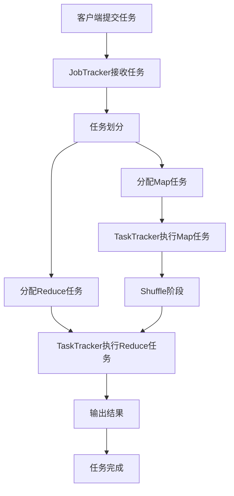
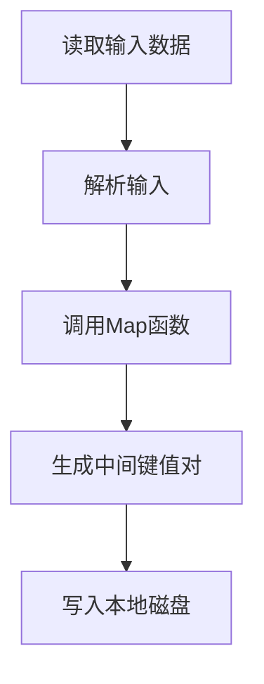
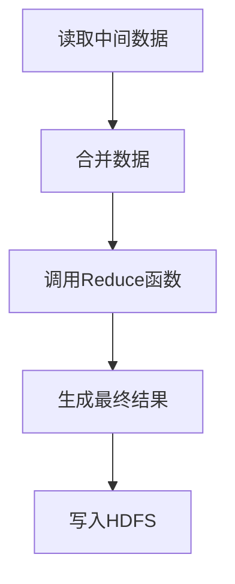
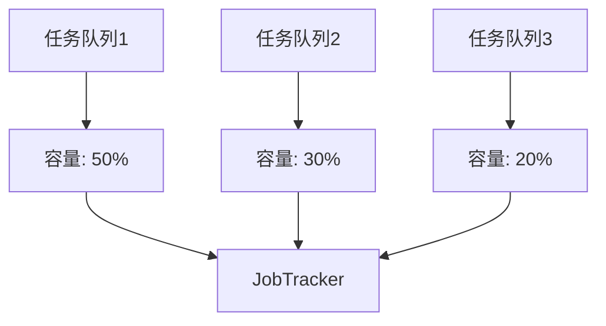
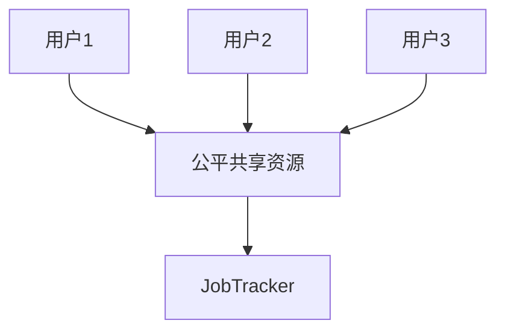
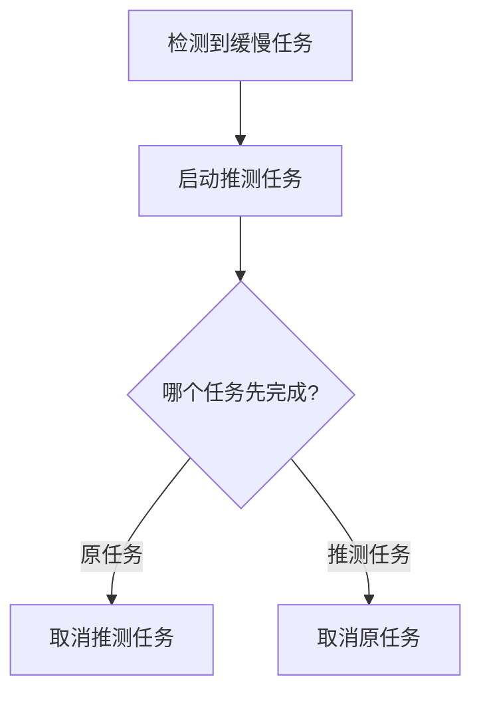

# 3.2 MapReduce工作流程

> [!abstract] 核心问题
> MapReduce的工作流程是怎样的？任务如何划分和执行？

## 一、工作流程概述

### 1. 工作流程定义

**定义**：MapReduce工作流程是指MapReduce任务从提交到完成的全过程。

**流程图**：



### 2. 工作流程步骤

**步骤1：客户端提交任务**

```
客户端将MapReduce任务提交给JobTracker
任务包含：Mapper类、Reducer类、输入路径、输出路径等
```

**步骤2：JobTracker接收任务**

```
JobTracker接收任务后，将任务加入任务队列
JobTracker开始调度任务
```

**步骤3：任务划分**

```
JobTracker将输入数据划分为多个数据块
每个数据块对应一个Map任务
Reduce任务数量由用户指定
```

**步骤4：分配任务**

```
JobTracker将Map任务分配给TaskTracker
TaskTracker选择空闲的节点执行任务
```

**步骤5：执行Map任务**

```
TaskTracker执行Map任务
读取输入数据，调用Map函数
生成中间键值对
```

**步骤6：Shuffle阶段**

```
对Map任务的输出进行处理
包括：分区、排序、合并、归约
```

**步骤7：执行Reduce任务**

```
TaskTracker执行Reduce任务
读取Shuffle后的中间数据
调用Reduce函数
生成最终结果
```

**步骤8：输出结果**

```
将Reduce任务的输出写入HDFS
任务完成
```

## 二、任务划分

### 1. Map任务划分

**划分原则**：

| 原则 | 说明 |
|-----|------|
| **数据块大小** | 每个Map任务处理一个数据块 |
| **数据本地化** | Map任务优先分配到数据所在的节点 |
| **负载均衡** | 考虑TaskTracker的负载情况 |

**划分示例**：

```
输入数据：10个数据块（每个128MB）
Map任务数量：10个
每个Map任务处理一个数据块
```

### 2. Reduce任务划分

**划分原则**：

| 原则 | 说明 |
|-----|------|
| **用户指定** | Reduce任务数量由用户指定 |
| **默认值** | 默认值为1 |
| **合理范围** | 通常设置为集群节点数量的倍数 |

**划分示例**：

```
输入数据：10个数据块
Map任务数量：10个
Reduce任务数量：5个（由用户指定）
```

### 3. 任务数量的影响

**Map任务数量**：

| 影响 | 说明 |
|-----|------|
| **太少** | 并行度不够，处理速度慢 |
| **太多** | 任务调度开销大，资源浪费 |

**Reduce任务数量**：

| 影响 | 说明 |
|-----|------|
| **太少** | 并行度不够，处理速度慢 |
| **太多** | 输出文件过多，合并开销大 |

## 三、任务执行流程

### 1. Map任务执行

**执行步骤**：



**详细步骤**：

| 步骤 | 说明 |
|-----|------|
| **读取输入数据** | 从HDFS读取输入数据块 |
| **解析输入** | 使用InputFormat解析输入数据 |
| **调用Map函数** | 对每个输入键值对调用Map函数 |
| **生成中间键值对** | Map函数生成中间键值对 |
| **写入本地磁盘** | 将中间键值对写入本地磁盘 |

**数据本地化**：

| 本地化类型 | 说明 |
|-----------|------|
| **数据本地** | Map任务和数据在同一节点 |
| **机架本地** | Map任务和数据在同一机架 |
| **非本地** | Map任务和数据不在同一机架 |

**优先级**：

```
数据本地 > 机架本地 > 非本地
```

### 2. Reduce任务执行

**执行步骤**：



**详细步骤**：

| 步骤 | 说明 |
|-----|------|
| **读取中间数据** | 从各个Map任务读取中间数据 |
| **合并数据** | 合并同一键的所有值 |
| **调用Reduce函数** | 对每个键调用Reduce函数 |
| **生成最终结果** | Reduce函数生成最终结果 |
| **写入HDFS** | 将最终结果写入HDFS |

**数据读取方式**：

| 方式 | 说明 |
|-----|------|
| **拉取方式** | Reduce任务主动拉取Map任务的输出 |
| **网络传输** | 需要跨节点传输数据 |

## 四、任务调度

### 1. 调度策略

**调度策略**：

| 策略 | 说明 |
|-----|------|
| **FIFO调度** | 先进先出调度 |
| **Capacity调度** | 容量调度，支持多队列 |
| **Fair调度** | 公平调度，共享资源 |

**Capacity调度**：



**Fair调度**：



### 2. 任务优先级

**优先级设置**：

| 优先级 | 说明 |
|-------|------|
| **VERY_HIGH** | 最高优先级 |
| **HIGH** | 高优先级 |
| **NORMAL** | 正常优先级 |
| **LOW** | 低优先级 |
| **VERY_LOW** | 最低优先级 |

**优先级影响**：

| 影响 | 说明 |
|-----|------|
| **调度顺序** | 高优先级任务先被调度 |
| **资源分配** | 高优先级任务优先分配资源 |

## 五、任务容错

### 1. 任务失败处理

**失败类型**：

| 类型 | 说明 |
|-----|------|
| **Map任务失败** | Map任务执行失败 |
| **Reduce任务失败** | Reduce任务执行失败 |
| **TaskTracker失败** | TaskTracker节点宕机 |

**处理方式**：

| 失败类型 | 处理方式 |
|---------|---------|
| **Map任务失败** | 重新执行Map任务 |
| **Reduce任务失败** | 重新执行Reduce任务 |
| **TaskTracker失败** | 将任务重新分配给其他TaskTracker |

**重试次数**：

| 参数 | 说明 | 默认值 |
|-----|------|-------|
| **mapred.map.max.attempts** | Map任务最大重试次数 | 4 |
| **mapred.reduce.max.attempts** | Reduce任务最大重试次数 | 4 |

### 2. 推测执行

**定义**：推测执行是指当一个任务执行缓慢时，启动一个相同的任务进行竞争。

**触发条件**：

| 条件 | 说明 |
|-----|------|
| **任务执行缓慢** | 任务执行时间超过平均时间的一定比例 |
| **资源充足** | 集群有空闲资源 |

**执行流程**：



**优势**：

| 优势 | 说明 |
|-----|------|
| **缩短作业时间** | 可以缩短作业的总体执行时间 |
| **利用空闲资源** | 充分利用集群的空闲资源 |

**劣势**：

| 劣势 | 说明 |
|-----|------|
| **资源浪费** | 可能浪费资源执行重复任务 |
| **数据不一致** | 如果任务有副作用，可能导致数据不一致 |

> [!warning] 易错点
> MapReduce的工作流程分为四个阶段：任务提交、任务划分、任务执行和结果输出！不要遗漏任何一个阶段。

---

**导航**：上一节 [[3.1-MapReduce编程模型.md]] · [[MOC - 第3章.md|返回章节导航]] · 下一节 [[3.3-Shuffle机制.md]]