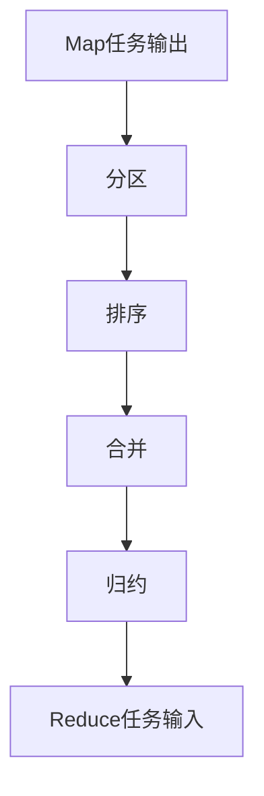
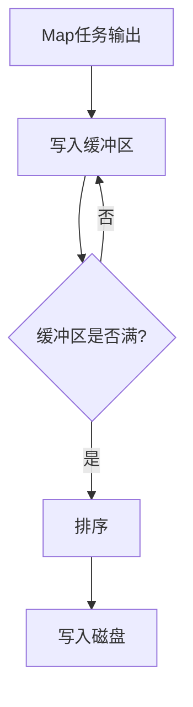
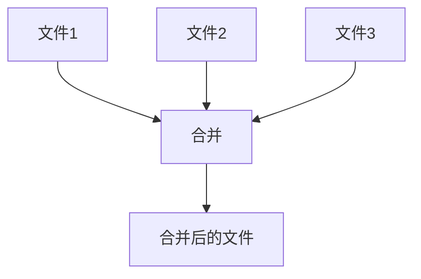
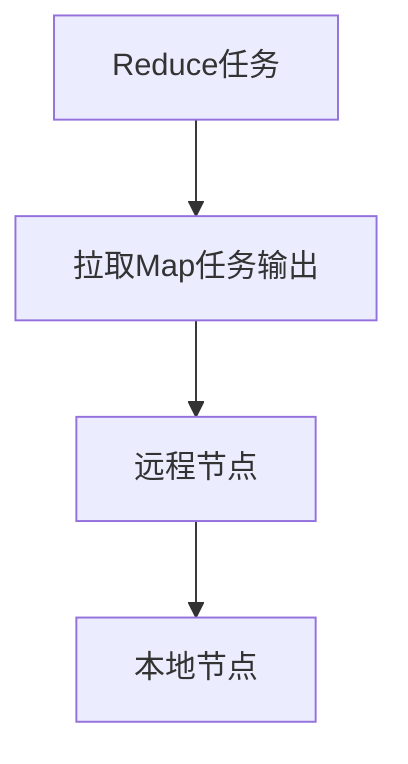
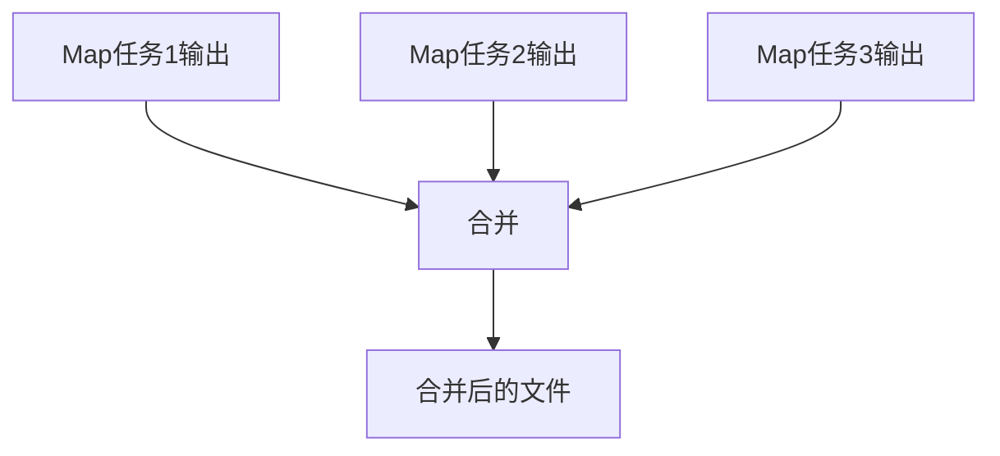
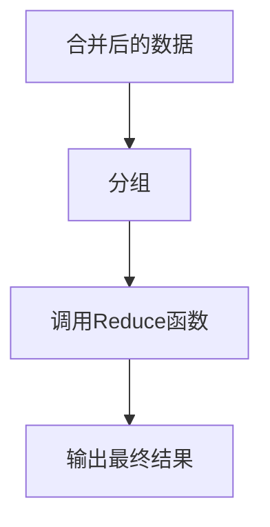
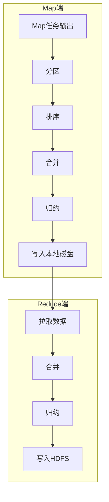

# 3.3 Shuffle机制

> [!abstract] 核心问题
> Shuffle阶段包含哪些步骤？分区、排序、合并、归约分别做什么？

## 一、Shuffle概述

### 1. Shuffle的定义

**定义**：Shuffle是MapReduce中连接Map和Reduce阶段的中间过程。

**作用**：

| 作用 | 说明 |
|-----|------|
| **数据传递** | 将Map任务的输出传递给Reduce任务 |
| **数据排序** | 对中间键值对进行排序 |
| **数据分组** | 将同一键的值分组 |
| **数据合并** | 合并多个Map任务的输出 |

**流程图**：



### 2. Shuffle的重要性

**重要性**：

| 重要性 | 说明 |
|-------|------|
| **性能瓶颈** | Shuffle是MapReduce的性能瓶颈 |
| **网络传输** | 需要跨节点传输大量数据 |
| **磁盘I/O** | 需要读写大量数据到磁盘 |

## 二、Map端Shuffle

### 1. 分区

**定义**：分区是指将Map任务的输出按照键分发到不同的Reduce任务。

**分区函数**：

```java
public int getPartition(K2 key, V2 value, int numPartitions) {
    return key.hashCode() % numPartitions;
}
```

**默认分区策略**：

| 策略 | 说明 |
|-----|------|
| **哈希分区** | 根据键的哈希值分配到不同的分区 |
| **范围分区** | 根据键的范围分配到不同的分区 |

**自定义分区**：

```java
public class CustomPartitioner extends Partitioner<Text, IntWritable> {
    public int getPartition(Text key, IntWritable value, int numPartitions) {
        // 自定义分区逻辑
        if (key.toString().startsWith("a")) {
            return 0;
        } else if (key.toString().startsWith("b")) {
            return 1;
        } else {
            return 2;
        }
    }
}
```

### 2. 排序

**定义**：排序是指对Map任务的输出按照键进行排序。

**排序方式**：

| 方式 | 说明 |
|-----|------|
| **内存排序** | 在内存中进行排序 |
| **外部排序** | 当数据量超过内存时，使用外部排序 |

**排序流程**：



**缓冲区大小**：

| 参数 | 说明 | 默认值 |
|-----|------|-------|
| **io.sort.mb** | 缓冲区大小 | 100MB |
| **io.sort.spill.percent** | 缓冲区溢出比例 | 0.8 |

### 3. 合并

**定义**：合并是指将多个Map任务的输出合并成一个文件。

**合并流程**：



**合并类型**：

| 类型 | 说明 |
|-----|------|
| **本地合并** | 在同一节点合并多个文件 |
| **远程合并** | 在不同节点合并多个文件 |

**合并因子**：

| 参数 | 说明 | 默认值 |
|-----|------|-------|
| **io.sort.factor** | 合并因子 | 10 |

### 4. 归约（可选）

**定义**：归约是指在Map端对同一键的值进行部分聚合。

**归约函数**：

```java
public void combine(K2 key, Iterable<V2> values, Context context) {
    // 部分聚合逻辑
    int sum = 0;
    for (V2 value : values) {
        sum += value.get();
    }
    context.write(key, new IntWritable(sum));
}
```

**作用**：

| 作用 | 说明 |
|-----|------|
| **减少数据量** | 减少需要传输的数据量 |
| **提高性能** | 减少网络传输和磁盘I/O |

**注意**：

| 注意事项 | 说明 |
|---------|------|
| **可选** | 归约是可选的 |
| **幂等性** | 归约函数必须是幂等的 |
| **顺序无关** | 归约函数的结果不应依赖于值的顺序 |

## 三、Reduce端Shuffle

### 1. 数据拉取

**定义**：数据拉取是指Reduce任务从Map任务拉取中间数据。

**拉取流程**：



**拉取方式**：

| 方式 | 说明 |
|-----|------|
| **拉取方式** | Reduce任务主动拉取Map任务的输出 |
| **网络传输** | 需要跨节点传输数据 |

**拉取顺序**：

| 顺序 | 说明 |
|-----|------|
| **按分区拉取** | 只拉取属于自己分区的数据 |
| **按完成顺序拉取** | 优先拉取已完成的Map任务的输出 |

### 2. 合并

**定义**：合并是指将从多个Map任务拉取的数据合并成一个文件。

**合并流程**：



**合并类型**：

| 类型 | 说明 |
|-----|------|
| **内存合并** | 在内存中合并数据 |
| **磁盘合并** | 当数据量超过内存时，使用磁盘合并 |

**合并因子**：

| 参数 | 说明 | 默认值 |
|-----|------|-------|
| **io.sort.factor** | 合并因子 | 10 |

### 3. 归约

**定义**：归约是指对合并后的数据进行最终聚合。

**归约流程**：



**分组方式**：

| 方式 | 说明 |
|-----|------|
| **按键分组** | 将同一键的所有值分组 |
| **有序分组** | 按键的顺序分组 |

## 四、Shuffle优化

### 1. 优化策略

**优化策略**：

| 策略 | 说明 |
|-----|------|
| **减少数据量** | 使用归约函数减少数据量 |
| **压缩数据** | 压缩中间数据 |
| **调整缓冲区大小** | 调整排序缓冲区大小 |
| **调整合并因子** | 调整合并因子 |

**压缩配置**：

| 参数 | 说明 | 默认值 |
|-----|------|-------|
| **mapred.compress.map.output** | 是否压缩Map输出 | false |
| **mapred.output.compression.codec** | 压缩编码器 | DefaultCodec |
| **mapred.output.compression.type** | 压缩类型 | RECORD |

### 2. 优化效果

**优化效果**：

| 优化策略 | 效果 |
|---------|------|
| **归约函数** | 减少50%-90%的数据量 |
| **压缩数据** | 减少50%-70%的数据量 |
| **调整缓冲区** | 减少磁盘I/O次数 |
| **调整合并因子** | 减少合并次数 |

## 五、Shuffle流程图

### 1. 完整流程图

**流程图**：



### 2. 数据流图

**数据流图**：


**数据量变化**：

| 阶段 | 数据量 | 说明 |
|-----|-------|------|
| **输入** | 100GB | 原始数据 |
| **Map输出** | 80GB | Map函数处理后 |
| **归约后** | 20GB | 归约函数处理后 |
| **Reduce输出** | 1GB | 最终结果 |

> [!warning] 易错点
> Shuffle阶段分为Map端和Reduce端！Map端包括分区、排序、合并和归约，Reduce端包括数据拉取、合并和归约。

---

**导航**：上一节 [[3.2-MapReduce工作流程.md]] · [[MOC - 第3章.md|返回章节导航]]