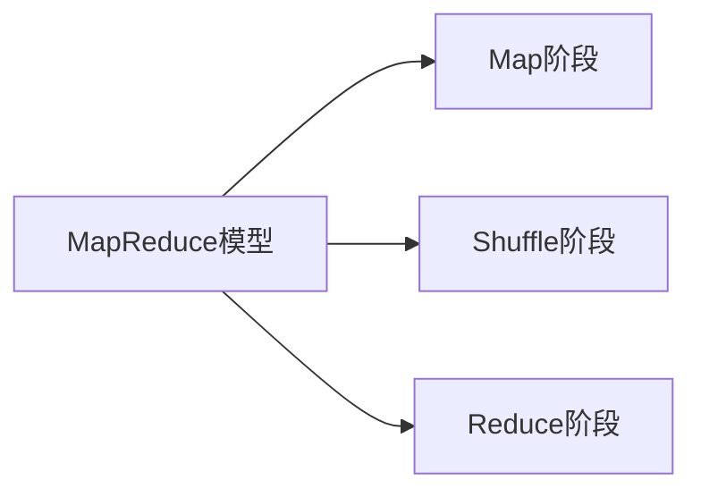

# 第3章-分布式计算框架MapReduce

> [!abstract] 本章定位
> 本章介绍MapReduce的编程模型、工作流程和Shuffle机制，是分布式计算的基础。

## 学习主线

## 章节内容

- [[3.1-MapReduce编程模型.md]]：Map函数、Reduce函数、键值对处理
- [[3.2-MapReduce工作流程.md]]：任务划分、执行流程、数据流动
- [[3.3-Shuffle机制.md]]：分区、排序、合并、归约

## 考点汇总

> [!important] 核心考点
> 1. MapReduce的编程模型：Map函数和Reduce函数的作用
> 2. MapReduce的工作流程：任务划分、执行流程
> 3. Shuffle机制：分区、排序、合并、归约
> 4. MapReduce的优缺点：优点和局限性
> 5. MapReduce与Spark的对比

## 前后章节依赖

| 方向 | 章节 | 依赖关系 |
|-----|------|---------|
| 先修 | 第2章 | HDFS是MapReduce的存储基础 |
| 后续 | 第4章 | Spark是MapReduce的改进 |

## 复习自测

> [!question] 自测题
> 1. MapReduce的编程模型是什么？Map函数和Reduce函数分别做什么？
> 2. MapReduce的工作流程是怎样的？
> 3. Shuffle阶段包含哪些步骤？
> 4. MapReduce有什么优缺点？
> 5. MapReduce与Spark有什么区别？