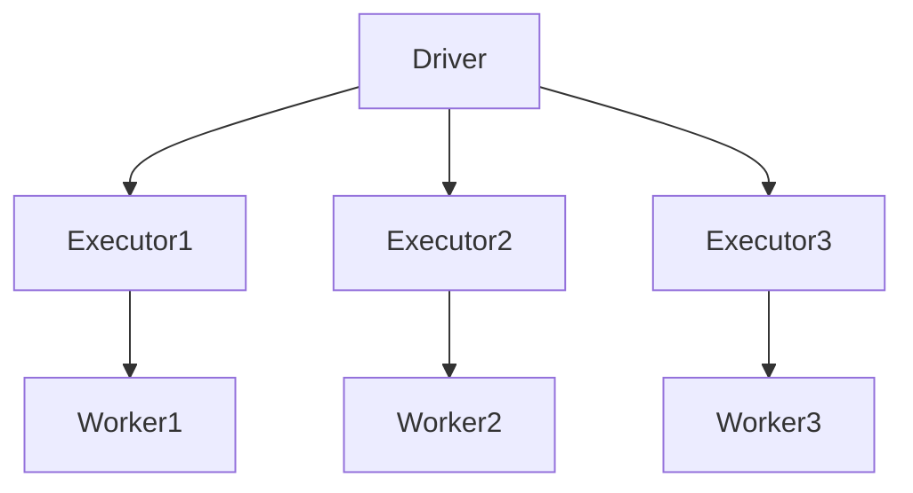
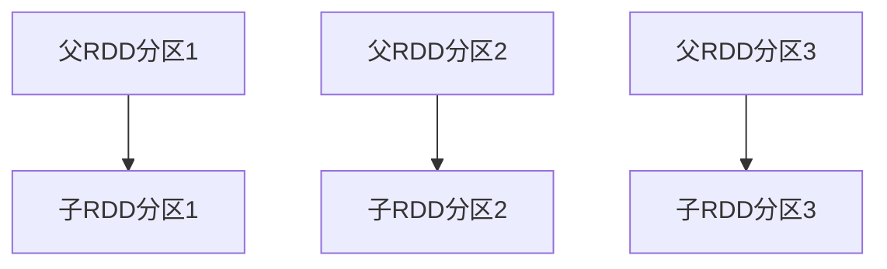
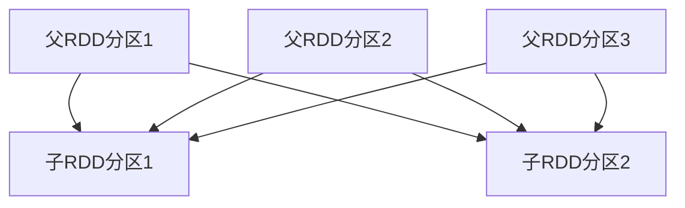
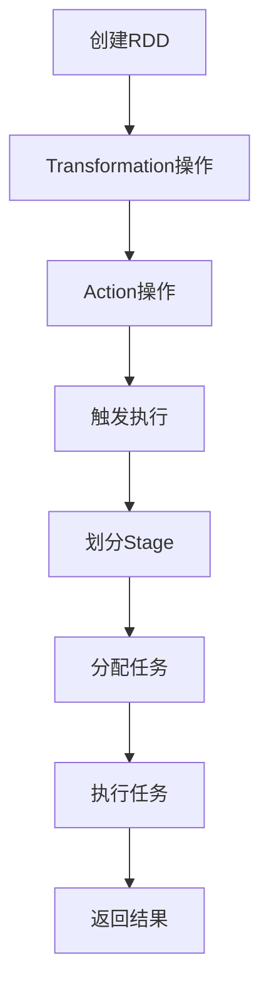

# 4.1 Spark架构与核心概念

> [!abstract] 核心问题
> Spark的架构是什么？Driver和Executor的作用分别是什么？

## 一、Spark概述

### 1. Spark的定义

**定义**：Spark是一个快速、通用的分布式计算引擎。

**设计目标**：

| 目标 | 说明 |
|-----|------|
| **高速计算** | 比MapReduce快100倍 |
| **通用计算** | 支持多种计算模式 |
| **易用性** | 提供丰富的API |
| **容错性** | 自动处理节点故障 |

**适用场景**：

| 场景 | 说明 |
|-----|------|
| **批量数据处理** | 处理大规模数据 |
| **实时流处理** | 处理实时数据流 |
| **机器学习** | 构建机器学习模型 |
| **图计算** | 处理图数据 |

### 2. Spark与MapReduce的对比

**对比表**：

| 对比项 | MapReduce | Spark |
|-------|-----------|-------|
| **计算方式** | 磁盘计算 | 内存计算 |
| **速度** | 慢 | 快（100倍） |
| **中间结果** | 写入磁盘 | 存储在内存 |
| **迭代计算** | 不擅长 | 擅长 |
| **编程模型** | Map+Reduce | RDD |
| **API** | Java | Java/Scala/Python/R |

## 二、Spark架构

### 1. 架构组成

**架构图**：



**组件说明**：

| 组件 | 功能 | 说明 |
|-----|------|------|
| **Driver** | 驱动程序 | 协调任务执行 |
| **Executor** | 执行器 | 执行计算任务 |
| **Worker** | 工作节点 | 提供计算资源 |

### 2. Driver

**定义**：Driver是Spark应用的主进程，负责协调任务执行。

**职责**：

| 职责 | 说明 |
|-----|------|
| **解析应用** | 解析用户提交的Spark应用 |
| **创建DAG** | 创建有向无环图（DAG） |
| **划分阶段** | 将DAG划分为多个阶段（Stage） |
| **分配任务** | 将任务分配给Executor |
| **监控执行** | 监控任务的执行状态 |

**Driver程序示例**：

```python
from pyspark import SparkContext, SparkConf

# 创建Spark配置
conf = SparkConf().setAppName("WordCount").setMaster("local")

# 创建Spark上下文
sc = SparkContext(conf=conf)

# 执行Spark应用
lines = sc.textFile("input.txt")
words = lines.flatMap(lambda line: line.split(" "))
wordCounts = words.map(lambda word: (word, 1)).reduceByKey(lambda a, b: a + b)
wordCounts.saveAsTextFile("output")

# 关闭Spark上下文
sc.stop()
```

### 3. Executor

**定义**：Executor是Spark应用的工作进程，负责执行计算任务。

**职责**：

| 职责 | 说明 |
|-----|------|
| **执行任务** | 执行Driver分配的任务 |
| **存储数据** | 存储RDD的数据分区 |
| **缓存数据** | 缓存需要重复使用的数据 |
| **汇报状态** | 向Driver汇报任务状态 |

**Executor配置**：

| 参数 | 说明 | 默认值 |
|-----|------|-------|
| **spark.executor.cores** | 每个Executor的CPU核数 | 1 |
| **spark.executor.memory** | 每个Executor的内存 | 1GB |
| **spark.executor.instances** | Executor的数量 | 2 |

### 4. Worker

**定义**：Worker是Spark集群的工作节点，提供计算资源。

**职责**：

| 职责 | 说明 |
|-----|------|
| **管理资源** | 管理节点的CPU和内存资源 |
| **启动Executor** | 根据Driver的请求启动Executor |
| **监控状态** | 监控Executor的状态 |

## 三、RDD概念

### 1. RDD的定义

**定义**：RDD（Resilient Distributed Dataset）是弹性分布式数据集。

**特点**：

| 特点 | 说明 |
|-----|------|
| **弹性** | 可以动态调整分区数量 |
| **分布式** | 数据分散存储在多个节点 |
| **数据集** | 不可变的数据集合 |
| **容错性** | 自动恢复丢失的数据分区 |

**RDD的五大特性**：

| 特性 | 说明 |
|-----|------|
| **分区** | RDD被划分为多个分区 |
| **计算函数** | 每个分区有一个计算函数 |
| **依赖关系** | RDD之间有依赖关系 |
| **分区器** | 可选的分区器 |
| **首选位置** | 每个分区的首选存储位置 |

### 2. RDD的分区

**定义**：RDD的分区是指将数据划分为多个部分，每个部分存储在不同的节点。

**分区数量**：

| 因素 | 说明 |
|-----|------|
| **数据大小** | 数据越大，分区数量越多 |
| **集群规模** | 集群节点越多，分区数量越多 |
| **默认值** | 默认分区数量等于集群的CPU核数 |

**分区方式**：

| 方式 | 说明 |
|-----|------|
| **哈希分区** | 根据键的哈希值分配分区 |
| **范围分区** | 根据键的范围分配分区 |
| **自定义分区** | 用户自定义分区逻辑 |

**示例**：

```python
# 创建RDD，指定分区数量
rdd = sc.parallelize([1, 2, 3, 4, 5], numSlices=3)

# 获取分区数量
print(rdd.getNumPartitions())  # 输出: 3
```

### 3. RDD的依赖关系

**定义**：RDD的依赖关系是指RDD之间的转换关系。

**依赖类型**：

| 类型 | 说明 |
|-----|------|
| **窄依赖** | 一个父RDD的分区对应一个子RDD的分区 |
| **宽依赖** | 一个父RDD的分区对应多个子RDD的分区 |

**窄依赖示例**：



**宽依赖示例**：



**依赖关系的作用**：

| 作用 | 说明 |
|-----|------|
| **容错** | 根据依赖关系恢复丢失的数据 |
| **优化** | 根据依赖关系优化执行计划 |
| **调度** | 根据依赖关系划分执行阶段 |

### 4. RDD的执行流程

**执行流程**：



**详细步骤**：

| 步骤 | 说明 |
|-----|------|
| **创建RDD** | 创建初始RDD |
| **Transformation** | 执行Transformation操作（懒执行） |
| **Action** | 执行Action操作（触发执行） |
| **划分Stage** | 根据依赖关系划分Stage |
| **分配任务** | 将任务分配给Executor |
| **执行任务** | Executor执行任务 |
| **返回结果** | 将结果返回给Driver |

> [!warning] 易错点
> Spark的架构包含Driver、Executor和Worker！Driver是主进程，Executor是工作进程，Worker是工作节点。

---

**导航**：[[MOC - 第4章.md|返回章节导航]] · 下一节 [[4.2-RDD编程模型.md]]