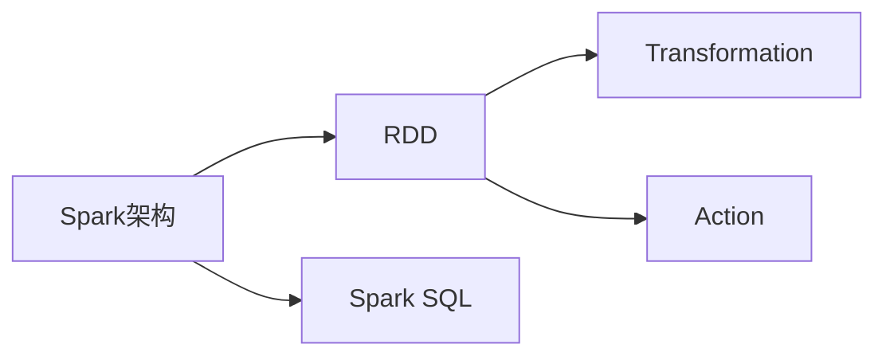

# 第4章-Spark分布式计算引擎

> [!abstract] 本章定位
> 本章介绍Spark的架构设计、RDD编程模型和Spark SQL，是大数据处理的核心技术。

## 学习主线

## 章节内容

- [[4.1-Spark架构与核心概念.md]]：Spark架构、Driver、Executor、RDD概念
- [[4.2-RDD编程模型.md]]：Transformation操作、Action操作、持久化机制
- [[4.3-Spark SQL与DataFrame.md]]：Spark SQL、DataFrame、Dataset

## 考点汇总

> [!important] 核心考点
> 1. Spark的架构设计：Driver、Executor、Worker
> 2. RDD的概念：弹性分布式数据集、分区、依赖关系
> 3. RDD的操作：Transformation（懒执行）和Action（触发执行）
> 4. RDD的持久化：cache和persist
> 5. Spark SQL与DataFrame：SQL查询、DataFrame API
> 6. Spark与MapReduce的对比

## 前后章节依赖

| 方向 | 章节 | 依赖关系 |
|-----|------|---------|
| 先修 | 第3章 | MapReduce是Spark的基础 |
| 后续 | 第5章 | Spark SQL是Hive的替代 |

## 复习自测

> [!question] 自测题
> 1. Spark的架构是什么？Driver和Executor的作用分别是什么？
> 2. RDD是什么？有什么特点？
> 3. RDD的Transformation和Action操作有什么区别？
> 4. RDD如何持久化？cache和persist有什么区别？
> 5. Spark SQL是什么？DataFrame和Dataset有什么区别？
> 6. Spark相比MapReduce有什么优势？