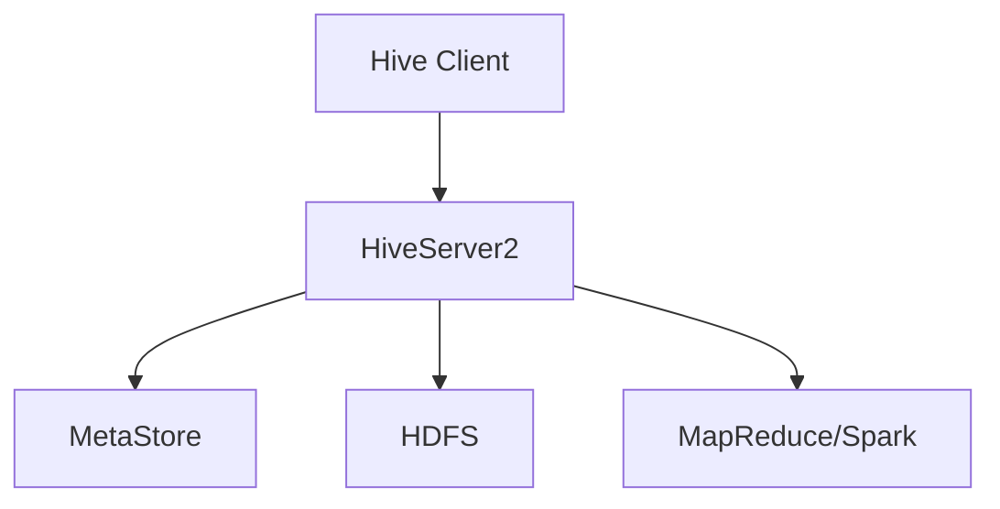

# 5.1 Hive架构与核心组件

> [!abstract] 核心问题
> Hive的架构是什么？HiveServer和MetaStore的作用分别是什么？

## 一、Hive概述

### 1. Hive的定义

**定义**：Hive是一个基于Hadoop的数据仓库工具，提供类SQL查询语言。

**设计目标**：

| 目标 | 说明 |
|-----|------|
| **SQL支持** | 提供类SQL查询语言（HQL） |
| **数据仓库** | 支持数据仓库的功能 |
| **批处理** | 基于MapReduce/Spark执行查询 |
| **可扩展** | 可以扩展到大规模数据 |

**适用场景**：

| 场景 | 说明 |
|-----|------|
| **数据仓库** | 构建企业级数据仓库 |
| **批量数据处理** | 处理大规模数据 |
| **报表生成** | 生成数据报表 |
| **数据探索** | 数据探索和分析 |

### 2. Hive与传统数据库的对比

**对比表**：

| 对比项 | 传统数据库 | Hive |
|-------|-----------|------|
| **数据存储** | 本地存储 | HDFS |
| **计算引擎** | 自身引擎 | MapReduce/Spark |
| **查询语言** | SQL | HQL（类SQL） |
| **数据规模** | GB级别 | PB级别以上 |
| **处理方式** | 实时处理 | 批处理 |
| **事务支持** | 支持 | 有限支持 |

## 二、Hive架构

### 1. 架构组成

**架构图**：



**组件说明**：

| 组件 | 功能 | 说明 |
|-----|------|------|
| **Hive Client** | 客户端 | 提交HQL查询 |
| **HiveServer2** | 服务器 | 处理查询请求 |
| **MetaStore** | 元数据存储 | 存储表结构信息 |
| **HDFS** | 分布式文件系统 | 存储实际数据 |
| **执行引擎** | 计算引擎 | MapReduce/Spark/Tez |

### 2. Hive Client

**定义**：Hive Client是Hive的客户端工具，用于提交HQL查询。

**类型**：

| 类型 | 说明 |
|-----|------|
| **CLI** | 命令行接口 |
| **Beeline** | JDBC客户端 |
| **Hive Web UI** | Web界面 |

**示例**：

```bash
# 使用CLI提交查询
hive -e "SELECT * FROM users LIMIT 10;"

# 使用Beeline连接HiveServer2
beeline -u jdbc:hive2://localhost:10000 -n hive
```

### 3. HiveServer2

**定义**：HiveServer2是Hive的服务端组件，处理客户端的查询请求。

**职责**：

| 职责 | 说明 |
|-----|------|
| **接收请求** | 接收客户端的HQL查询请求 |
| **解析查询** | 解析HQL语句 |
| **生成执行计划** | 生成执行计划 |
| **执行查询** | 提交执行计划到计算引擎 |
| **返回结果** | 返回查询结果给客户端 |

**服务配置**：

| 参数 | 说明 | 默认值 |
|-----|------|-------|
| **hive.server2.thrift.port** | Thrift端口 | 10000 |
| **hive.server2.thrift.bind.host** | 绑定地址 | 0.0.0.0 |

### 4. MetaStore

**定义**：MetaStore是Hive的元数据存储组件，存储表结构信息。

**职责**：

| 职责 | 说明 |
|-----|------|
| **存储元数据** | 存储数据库、表、列、分区等信息 |
| **提供元数据服务** | 提供元数据的增删改查服务 |
| **管理元数据** | 管理元数据的生命周期 |

**存储方式**：

| 方式 | 说明 |
|-----|------|
| **内嵌模式** | 元数据存储在本地Derby数据库 |
| **本地模式** | 元数据存储在本地MySQL数据库 |
| **远程模式** | 元数据存储在远程MySQL数据库 |

**元数据表**：

| 表名 | 说明 |
|-----|------|
| **DBS** | 数据库信息 |
| **TBLS** | 表信息 |
| **COLUMNS_V2** | 列信息 |
| **PARTITIONS** | 分区信息 |

### 5. 执行引擎

**定义**：执行引擎是Hive的计算组件，执行HQL查询。

**支持的引擎**：

| 引擎 | 说明 |
|-----|------|
| **MapReduce** | 默认引擎（Hive 1.x） |
| **Spark** | 高性能引擎（Hive 2.x+） |
| **Tez** | 有向无环图引擎 |

**配置执行引擎**：

```bash
# 使用Spark作为执行引擎
set hive.execution.engine=spark;

# 使用MapReduce作为执行引擎
set hive.execution.engine=mr;

# 使用Tez作为执行引擎
set hive.execution.engine=tez;
```

## 三、Hive数据模型

### 1. 数据库

**定义**：数据库是表的集合，用于组织和管理表。

**创建数据库**：

```sql
CREATE DATABASE IF NOT EXISTS mydb;

-- 使用数据库
USE mydb;

-- 删除数据库
DROP DATABASE IF EXISTS mydb;
```

### 2. 表

**定义**：表是数据的集合，类似于关系型数据库的表。

**表类型**：

| 类型 | 说明 |
|-----|------|
| **管理表** | Hive管理表的生命周期 |
| **外部表** | 用户管理表的生命周期 |

**创建表**：

```sql
-- 创建管理表
CREATE TABLE IF NOT EXISTS users (
    id INT,
    name STRING,
    age INT
)
ROW FORMAT DELIMITED
FIELDS TERMINATED BY ',';

-- 创建外部表
CREATE EXTERNAL TABLE IF NOT EXISTS users_ext (
    id INT,
    name STRING,
    age INT
)
ROW FORMAT DELIMITED
FIELDS TERMINATED BY ','
LOCATION '/user/hive/external/users';
```

**管理表vs外部表**：

| 对比项 | 管理表 | 外部表 |
|-------|-------|-------|
| **数据管理** | Hive管理 | 用户管理 |
| **删除表** | 删除数据和元数据 | 只删除元数据 |
| **数据位置** | 默认位置 | 用户指定 |
| **适用场景** | 临时表 | 共享表 |

### 3. 分区

**定义**：分区是将表数据按照某个列的值进行划分。

**分区类型**：

| 类型 | 说明 |
|-----|------|
| **静态分区** | 用户手动指定分区值 |
| **动态分区** | 根据数据自动推断分区值 |

**创建分区表**：

```sql
-- 创建分区表
CREATE TABLE IF NOT EXISTS users_part (
    id INT,
    name STRING,
    age INT
)
PARTITIONED BY (country STRING)
ROW FORMAT DELIMITED
FIELDS TERMINATED BY ',';

-- 加载数据到静态分区
LOAD DATA LOCAL INPATH '/data/users_us.txt' INTO TABLE users_part PARTITION (country='US');

-- 启用动态分区
SET hive.exec.dynamic.partition=true;
SET hive.exec.dynamic.partition.mode=nonstrict;

-- 插入数据到动态分区
INSERT INTO TABLE users_part PARTITION (country)
SELECT id, name, age, country FROM users;
```

### 4. 分桶

**定义**：分桶是将表数据按照某个列的哈希值进行划分。

**创建分桶表**：

```sql
-- 创建分桶表
CREATE TABLE IF NOT EXISTS users_bucket (
    id INT,
    name STRING,
    age INT
)
CLUSTERED BY (id) INTO 4 BUCKETS
ROW FORMAT DELIMITED
FIELDS TERMINATED BY ',';

-- 插入数据到分桶表
INSERT INTO TABLE users_bucket
SELECT id, name, age FROM users;
```

**分桶的优势**：

| 优势 | 说明 |
|-----|------|
| **查询优化** | 可以进行Map端Join |
| **数据采样** | 可以进行数据采样 |
| **并行处理** | 可以并行处理数据 |

## 四、Hive存储格式

### 1. 存储格式概述

**定义**：存储格式是指Hive表数据的存储方式。

**支持的格式**：

| 格式 | 说明 |
|-----|------|
| **TextFile** | 文本文件（默认） |
| **SequenceFile** | 二进制文件 |
| **Parquet** | 列式存储文件 |
| **ORC** | 列式存储文件 |

### 2. TextFile

**定义**：TextFile是Hive的默认存储格式，数据以文本形式存储。

**特点**：

| 特点 | 说明 |
|-----|------|
| **可读性好** | 可以直接查看数据 |
| **压缩支持** | 支持压缩 |
| **性能一般** | 读写性能一般 |

**示例**：

```sql
CREATE TABLE IF NOT EXISTS users_text (
    id INT,
    name STRING,
    age INT
)
ROW FORMAT DELIMITED
FIELDS TERMINATED BY ','
STORED AS TEXTFILE;
```

### 3. Parquet

**定义**：Parquet是一种列式存储格式，适合数据分析。

**特点**：

| 特点 | 说明 |
|-----|------|
| **列式存储** | 按列存储数据 |
| **压缩率高** | 压缩率高 |
| **查询性能好** | 查询性能好 |
| **支持谓词下推** | 支持谓词下推 |

**示例**：

```sql
CREATE TABLE IF NOT EXISTS users_parquet (
    id INT,
    name STRING,
    age INT
)
STORED AS PARQUET;
```

### 4. ORC

**定义**：ORC是一种列式存储格式，是Hive的优化存储格式。

**特点**：

| 特点 | 说明 |
|-----|------|
| **列式存储** | 按列存储数据 |
| **压缩率高** | 压缩率高 |
| **查询性能好** | 查询性能最好 |
| **支持索引** | 支持行索引和列索引 |

**示例**：

```sql
CREATE TABLE IF NOT EXISTS users_orc (
    id INT,
    name STRING,
    age INT
)
STORED AS ORC;
```

### 5. 存储格式对比

**对比表**：

| 对比项 | TextFile | SequenceFile | Parquet | ORC |
|-------|----------|--------------|---------|-----|
| **存储方式** | 行式 | 行式 | 列式 | 列式 |
| **压缩率** | 低 | 中等 | 高 | 很高 |
| **查询性能** | 一般 | 中等 | 好 | 很好 |
| **可读性** | 好 | 差 | 差 | 差 |
| **适用场景** | 数据导入 | 中间数据 | 数据分析 | 数据分析 |

> [!warning] 易错点
> Hive的MetaStore存储元数据，HDFS存储实际数据！不要混淆元数据和实际数据的存储位置。

---

**导航**：[[MOC - 第5章.md|返回章节导航]] · 下一节 [[5.2-HQL查询语言.md]]