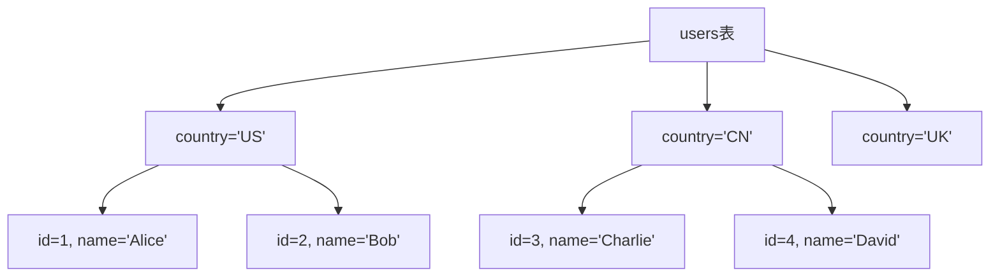
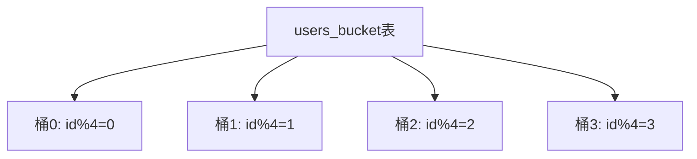

# 5.3 Hive分区与分桶

> [!abstract] 核心问题
> Hive分区表和分桶表有什么区别？如何创建和使用分区表和分桶表？

## 一、分区表

### 1. 分区表概述

**定义**：分区表是将表数据按照某个列的值进行划分。

**目的**：

| 目的 | 说明 |
|-----|------|
| **查询优化** | 减少扫描的数据量 |
| **数据管理** | 方便数据的管理和维护 |
| **数据隔离** | 不同分区的数据可以隔离 |

**分区原理**：



### 2. 创建分区表

**创建分区表**：

```sql
-- 创建单分区表
CREATE TABLE IF NOT EXISTS users_part (
    id INT,
    name STRING,
    age INT
)
PARTITIONED BY (country STRING)
ROW FORMAT DELIMITED
FIELDS TERMINATED BY ',';

-- 创建多分区表
CREATE TABLE IF NOT EXISTS users_part_multi (
    id INT,
    name STRING,
    age INT
)
PARTITIONED BY (country STRING, year INT)
ROW FORMAT DELIMITED
FIELDS TERMINATED BY ',';
```

**分区表目录结构**：

```
users_part/
├── country=US/
│   ├── part-m-00000
│   └── part-m-00001
├── country=CN/
│   ├── part-m-00000
│   └── part-m-00001
└── country=UK/
    ├── part-m-00000
    └── part-m-00001
```

### 3. 静态分区

**定义**：静态分区是用户手动指定分区值。

**加载数据到静态分区**：

```sql
-- 加载数据到静态分区
LOAD DATA LOCAL INPATH '/data/users_us.txt' INTO TABLE users_part PARTITION (country='US');

-- 插入数据到静态分区
INSERT INTO TABLE users_part PARTITION (country='CN')
SELECT id, name, age FROM users WHERE country='CN';
```

**特点**：

| 特点 | 说明 |
|-----|------|
| **手动指定** | 用户手动指定分区值 |
| **适合小批量** | 适合小批量数据加载 |
| **灵活性低** | 灵活性较低 |

### 4. 动态分区

**定义**：动态分区是根据数据自动推断分区值。

**启用动态分区**：

```sql
-- 启用动态分区
SET hive.exec.dynamic.partition=true;
SET hive.exec.dynamic.partition.mode=nonstrict;

-- 设置最大动态分区数
SET hive.exec.max.dynamic.partitions=1000;
SET hive.exec.max.dynamic.partitions.pernode=100;
```

**插入数据到动态分区**：

```sql
-- 插入数据到动态分区
INSERT INTO TABLE users_part PARTITION (country)
SELECT id, name, age, country FROM users;

-- 插入数据到多动态分区
INSERT INTO TABLE users_part_multi PARTITION (country, year)
SELECT id, name, age, country, year FROM users;
```

**特点**：

| 特点 | 说明 |
|-----|------|
| **自动推断** | 根据数据自动推断分区值 |
| **适合大批量** | 适合大批量数据加载 |
| **灵活性高** | 灵活性较高 |

### 5. 分区裁剪

**定义**：分区裁剪是指在查询时只扫描必要的分区。

**示例**：

```sql
-- 查询指定分区
SELECT * FROM users_part WHERE country='US';

-- 查询多个分区
SELECT * FROM users_part WHERE country IN ('US', 'CN');

-- 查询范围分区
SELECT * FROM users_part_multi WHERE country='US' AND year=2023;
```

**分区裁剪的重要性**：

| 重要性 | 说明 |
|-------|------|
| **性能优化** | 减少扫描的数据量 |
| **节省时间** | 缩短查询时间 |
| **降低资源消耗** | 降低CPU和内存消耗 |

## 二、分桶表

### 1. 分桶表概述

**定义**：分桶表是将表数据按照某个列的哈希值进行划分。

**目的**：

| 目的 | 说明 |
|-----|------|
| **查询优化** | 可以进行Map端Join |
| **数据采样** | 可以进行数据采样 |
| **并行处理** | 可以并行处理数据 |

**分桶原理**：



### 2. 创建分桶表

**创建分桶表**：

```sql
-- 创建分桶表
CREATE TABLE IF NOT EXISTS users_bucket (
    id INT,
    name STRING,
    age INT
)
CLUSTERED BY (id) INTO 4 BUCKETS
ROW FORMAT DELIMITED
FIELDS TERMINATED BY ',';

-- 创建分桶并排序表
CREATE TABLE IF NOT EXISTS users_bucket_sort (
    id INT,
    name STRING,
    age INT
)
CLUSTERED BY (id) SORTED BY (age) INTO 4 BUCKETS
ROW FORMAT DELIMITED
FIELDS TERMINATED BY ',';
```

**分桶表目录结构**：

```
users_bucket/
├── part-m-00000
├── part-m-00001
├── part-m-00002
└── part-m-00003
```

### 3. 插入数据到分桶表

**插入数据**：

```sql
-- 插入数据到分桶表
INSERT INTO TABLE users_bucket
SELECT id, name, age FROM users;
```

**注意事项**：

| 注意事项 | 说明 |
|---------|------|
| **不能使用LOAD DATA** | LOAD DATA不会自动分桶 |
| **必须使用INSERT** | 必须使用INSERT语句 |
| **数据会自动分桶** | Hive会根据哈希值自动分桶 |

### 4. 分桶的优势

**优势**：

| 优势 | 说明 |
|-----|------|
| **Map端Join** | 可以进行Map端Join，避免Shuffle |
| **数据采样** | 可以进行数据采样，加速数据探索 |
| **并行处理** | 可以并行处理数据，提高查询速度 |

**Map端Join示例**：

```sql
-- 两个分桶表进行Map端Join
SELECT u.id, u.name, o.order_id
FROM users_bucket u
JOIN orders_bucket o ON u.id = o.user_id;
```

**数据采样示例**：

```sql
-- 采样查询
SELECT * FROM users_bucket TABLESAMPLE(BUCKET 1 OUT OF 4);
```

### 5. 分桶vs分区

**对比表**：

| 对比项 | 分区 | 分桶 |
|-------|------|------|
| **划分方式** | 按列值 | 按哈希值 |
| **数量** | 可以很多 | 固定数量 |
| **数据管理** | 方便数据管理 | 方便数据查询 |
| **查询优化** | 分区裁剪 | Map端Join |
| **适用场景** | 时间、地域等 | 等值Join |

## 三、存储格式

### 1. 存储格式概述

**定义**：存储格式是指Hive表数据的存储方式。

**支持的格式**：

| 格式 | 说明 |
|-----|------|
| **TextFile** | 文本文件（默认） |
| **SequenceFile** | 二进制文件 |
| **Parquet** | 列式存储文件 |
| **ORC** | 列式存储文件 |

### 2. TextFile

**定义**：TextFile是Hive的默认存储格式，数据以文本形式存储。

**特点**：

| 特点 | 说明 |
|-----|------|
| **可读性好** | 可以直接查看数据 |
| **压缩支持** | 支持压缩 |
| **性能一般** | 读写性能一般 |

**示例**：

```sql
CREATE TABLE IF NOT EXISTS users_text (
    id INT,
    name STRING,
    age INT
)
ROW FORMAT DELIMITED
FIELDS TERMINATED BY ','
STORED AS TEXTFILE;
```

### 3. Parquet

**定义**：Parquet是一种列式存储格式，适合数据分析。

**特点**：

| 特点 | 说明 |
|-----|------|
| **列式存储** | 按列存储数据 |
| **压缩率高** | 压缩率高 |
| **查询性能好** | 查询性能好 |
| **支持谓词下推** | 支持谓词下推 |

**示例**：

```sql
CREATE TABLE IF NOT EXISTS users_parquet (
    id INT,
    name STRING,
    age INT
)
STORED AS PARQUET;
```

### 4. ORC

**定义**：ORC是一种列式存储格式，是Hive的优化存储格式。

**特点**：

| 特点 | 说明 |
|-----|------|
| **列式存储** | 按列存储数据 |
| **压缩率高** | 压缩率高 |
| **查询性能好** | 查询性能最好 |
| **支持索引** | 支持行索引和列索引 |

**示例**：

```sql
CREATE TABLE IF NOT EXISTS users_orc (
    id INT,
    name STRING,
    age INT
)
STORED AS ORC;
```

### 5. 存储格式对比

**对比表**：

| 对比项 | TextFile | SequenceFile | Parquet | ORC |
|-------|----------|--------------|---------|-----|
| **存储方式** | 行式 | 行式 | 列式 | 列式 |
| **压缩率** | 低 | 中等 | 高 | 很高 |
| **查询性能** | 一般 | 中等 | 好 | 很好 |
| **可读性** | 好 | 差 | 差 | 差 |
| **适用场景** | 数据导入 | 中间数据 | 数据分析 | 数据分析 |

## 四、查询优化

### 1. 查询优化概述

**定义**：查询优化是指通过各种手段提高Hive查询的性能。

**优化策略**：

| 策略 | 说明 |
|-----|------|
| **分区裁剪** | 只扫描必要的分区 |
| **谓词下推** | 将过滤条件下推到数据源 |
| **Join优化** | 使用Map端Join |
| **聚合优化** | 使用Combine减少数据量 |
| **数据压缩** | 压缩数据减少I/O |

### 2. 分区裁剪

**示例**：

```sql
-- 好：使用分区裁剪
SELECT * FROM users_part WHERE country='US';

-- 不好：不使用分区裁剪
SELECT * FROM users_part WHERE name='Alice';
```

### 3. 谓词下推

**示例**：

```sql
-- 启用谓词下推
SET hive.optimize.ppd=true;

-- 查询
SELECT * FROM users_parquet WHERE age > 30;
```

### 4. Join优化

**示例**：

```sql
-- 启用Map端Join
SET hive.auto.convert.join=true;

-- 查询
SELECT u.id, u.name, o.order_id
FROM users u
JOIN orders o ON u.id = o.user_id;
```

### 5. 聚合优化

**示例**：

```sql
-- 启用Combine
SET hive.map.aggr=true;

-- 查询
SELECT country, COUNT(*) as count FROM users GROUP BY country;
```

> [!warning] 易错点
> 分区是按列值划分，分桶是按哈希值划分！分区适合数据管理，分桶适合查询优化。

---

**导航**：上一节 [[5.2-HQL查询语言.md]] · [[MOC - 第5章.md|返回章节导航]]