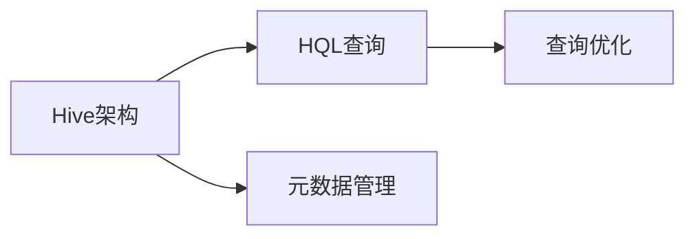

# 第5章-分布式数据仓库Hive

> [!abstract] 本章定位
> 本章介绍Hive的架构设计、HQL查询语言和优化策略，是大数据分析的核心技术。

## 学习主线

## 章节内容

- [[5.1-Hive架构与核心组件.md]]：Hive架构、HiveServer、MetaStore
- [[5.2-HQL查询语言.md]]：HQL语法、DDL、DML、查询优化
- [[5.3-Hive分区与分桶.md]]：分区表、分桶表、存储格式

## 考点汇总

> [!important] 核心考点
> 1. Hive的架构设计：HiveServer、MetaStore、执行引擎
> 2. HQL语法：DDL、DML、查询语句
> 3. Hive分区表：静态分区、动态分区
> 4. Hive分桶表：分桶的作用、分桶的优势
> 5. Hive存储格式：TextFile、SequenceFile、Parquet、ORC
> 6. Hive查询优化：分区裁剪、谓词下推、Join优化

## 前后章节依赖

| 方向 | 章节 | 依赖关系 |
|-----|------|---------|
| 先修 | 第4章 | Spark SQL是Hive的替代 |
| 后续 | 第6章 | Hive与HBase可以集成 |

## 复习自测

> [!question] 自测题
> 1. Hive的架构是什么？HiveServer和MetaStore的作用分别是什么？
> 2. HQL和SQL有什么区别？
> 3. Hive分区表是什么？静态分区和动态分区有什么区别？
> 4. Hive分桶表是什么？分桶有什么优势？
> 5. Hive支持哪些存储格式？各有什么特点？
> 6. Hive查询优化有哪些策略？