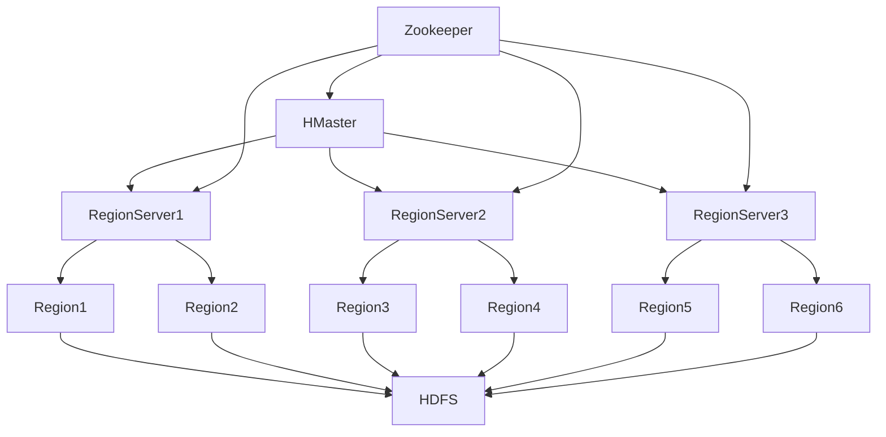
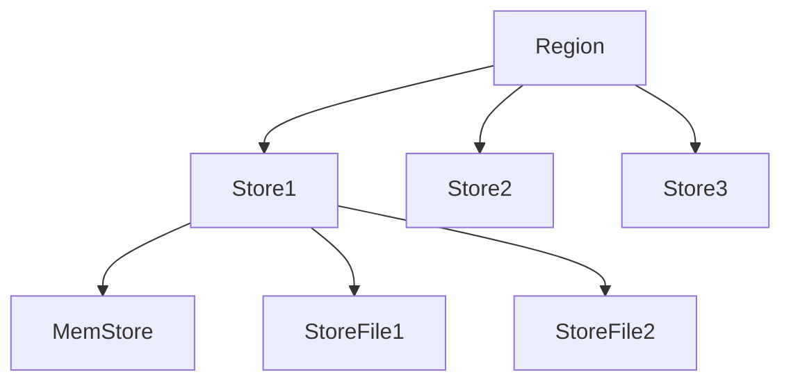
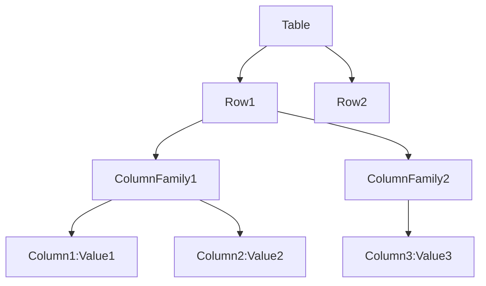
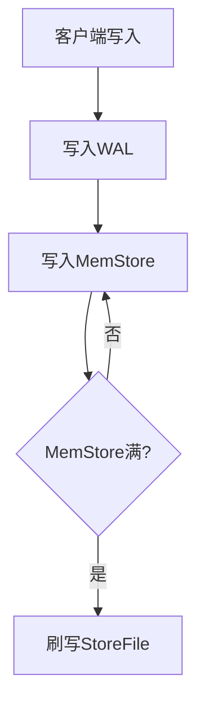

# 6.2 HBase架构设计

> [!abstract] 核心问题
> HBase的架构是什么？HMaster和RegionServer的作用分别是什么？

## 一、HBase概述

### 1. HBase的定义

**定义**：HBase是一个分布式的列式数据库，基于HDFS存储数据。

**设计目标**：

| 目标 | 说明 |
|-----|------|
| **高扩展性** | 支持水平扩展 |
| **高性能** | 高性能读写 |
| **实时读写** | 支持实时读写 |
| **容错性** | 自动故障恢复 |

**适用场景**：

| 场景 | 说明 |
|-----|------|
| **海量数据存储** | 存储海量数据 |
| **实时读写** | 实时数据读写 |
| **日志存储** | 存储日志数据 |
| **时序数据** | 存储时序数据 |

### 2. HBase与传统数据库的对比

**对比表**：

| 对比项 | 传统数据库 | HBase |
|-------|-----------|-------|
| **存储方式** | 行式存储 | 列式存储 |
| **扩展性** | 垂直扩展 | 水平扩展 |
| **事务支持** | ACID | 单行事务 |
| **查询语言** | SQL | HBase Shell/API |
| **数据一致性** | 强一致性 | 最终一致性 |

## 二、HBase架构

### 1. 架构组成

**架构图**：



**组件说明**：

| 组件 | 功能 | 说明 |
|-----|------|------|
| **HMaster** | 主节点 | 管理集群 |
| **RegionServer** | 区域服务器 | 存储和管理数据 |
| **Region** | 区域 | 数据分区 |
| **HDFS** | 分布式文件系统 | 存储实际数据 |
| **Zookeeper** | 协调器 | 管理分布式状态 |

### 2. HMaster

**定义**：HMaster是HBase的主节点，负责管理集群。

**职责**：

| 职责 | 说明 |
|-----|------|
| **管理RegionServer** | 管理RegionServer的状态 |
| **分配Region** | 将Region分配给RegionServer |
| **负载均衡** | 平衡RegionServer的负载 |
| **元数据管理** | 管理表的元数据 |
| **故障恢复** | 处理RegionServer故障 |

**元数据表**：

| 表名 | 说明 |
|-----|------|
| **-ROOT-** | 根表（已废弃） |
| **.META.** | 元数据表 |
| **hbase:meta** | 元数据表（新版） |

### 3. RegionServer

**定义**：RegionServer是HBase的区域服务器，负责存储和管理数据。

**职责**：

| 职责 | 说明 |
|-----|------|
| **存储Region** | 存储Region数据 |
| **处理读写请求** | 处理客户端的读写请求 |
| **数据缓存** | 缓存数据到内存 |
| **数据刷新** | 将内存数据刷新到磁盘 |
| **数据合并** | 合并HFile文件 |

**组成**：

| 组成 | 说明 |
|-----|------|
| **MemStore** | 内存存储 |
| **StoreFile** | 磁盘存储（HFile） |
| **WAL** | 预写日志 |

### 4. Region

**定义**：Region是HBase的数据分区，是数据管理的基本单位。

**划分方式**：

| 方式 | 说明 |
|-----|------|
| **按RowKey划分** | 按RowKey的范围划分 |
| **自动拆分** | Region达到一定大小后自动拆分 |

**结构**：



### 5. Zookeeper

**定义**：Zookeeper是HBase的协调器，负责管理分布式状态。

**职责**：

| 职责 | 说明 |
|-----|------|
| **管理HMaster** | 管理HMaster的状态 |
| **管理RegionServer** | 管理RegionServer的状态 |
| **存储元数据** | 存储表的元数据位置 |
| **分布式锁** | 提供分布式锁服务 |

**Zookeeper节点**：

| 节点 | 说明 |
|-----|------|
| **/hbase/master** | 当前活跃的HMaster |
| **/hbase/rs** | RegionServer列表 |
| **/hbase/table** | 表的元数据 |

## 三、HBase数据模型

### 1. 数据模型概述

**定义**：HBase的数据模型是一个多维映射表。

**结构**：



**组成**：

| 组成 | 说明 |
|-----|------|
| **Table** | 表 |
| **Row** | 行，由RowKey标识 |
| **ColumnFamily** | 列族 |
| **Column** | 列 |
| **Cell** | 单元格，由RowKey、ColumnFamily、Column和Timestamp标识 |
| **Timestamp** | 时间戳 |

### 2. RowKey

**定义**：RowKey是HBase表的主键，唯一标识一行数据。

**特点**：

| 特点 | 说明 |
|-----|------|
| **唯一性** | 唯一标识一行数据 |
| **有序性** | RowKey按字典序排序 |
| **不可修改** | RowKey一旦确定不可修改 |

**设计原则**：

| 原则 | 说明 |
|-----|------|
| **唯一性** | RowKey必须唯一 |
| **散列性** | RowKey应该具有良好的散列性 |
| **有序性** | 相关数据的RowKey应该相邻 |
| **长度适中** | RowKey长度应该适中（10-100字节） |

### 3. ColumnFamily

**定义**：ColumnFamily是列的集合，列族内的列共享相同的存储属性。

**特点**：

| 特点 | 说明 |
|-----|------|
| **预定义** | 列族必须预定义 |
| **动态添加列** | 列可以动态添加 |
| **存储属性** | 列族内的列共享存储属性 |

**示例**：

```
表: users
列族: info, address

info列族: name, age, email
address列族: city, street, zipcode
```

### 4. Cell

**定义**：Cell是HBase的最小数据单元，由RowKey、ColumnFamily、Column和Timestamp标识。

**特点**：

| 特点 | 说明 |
|-----|------|
| **版本** | 支持多版本 |
| **时间戳** | 每个Cell有一个时间戳 |
| **自动过期** | 可以设置数据过期时间 |

**示例**：

```
RowKey: user1
ColumnFamily: info
Column: name
Timestamp: 1609459200000
Value: Alice

RowKey: user1
ColumnFamily: info
Column: name
Timestamp: 1609459201000
Value: Alice Smith
```

## 四、HBase存储结构

### 1. MemStore

**定义**：MemStore是RegionServer的内存存储。

**作用**：

| 作用 | 说明 |
|-----|------|
| **缓存数据** | 缓存写入的数据 |
| **排序数据** | 对数据进行排序 |
| **刷写数据** | 将数据刷写到磁盘 |

**刷写条件**：

| 条件 | 说明 |
|-----|------|
| **内存满** | MemStore达到一定大小 |
| **时间触发** | 定期刷写 |
| **手动触发** | 用户手动触发 |

### 2. StoreFile

**定义**：StoreFile是RegionServer的磁盘存储，格式为HFile。

**作用**：

| 作用 | 说明 |
|-----|------|
| **存储数据** | 存储刷写的数据 |
| **支持压缩** | 支持多种压缩算法 |
| **支持索引** | 支持布隆过滤器和索引 |

**HFile结构**：

```
HFile结构：
- FileInfo：文件信息
- Data Block Index：数据块索引
- Data Blocks：数据块
- Meta Block Index：元数据块索引
- Meta Blocks：元数据块
- Trailer：文件尾部信息
```

### 3. WAL

**定义**：WAL（Write-Ahead Log）是预写日志，用于保证数据可靠性。

**作用**：

| 作用 | 说明 |
|-----|------|
| **记录写入** | 记录所有写入操作 |
| **故障恢复** | 在RegionServer故障时恢复数据 |
| **数据持久化** | 保证数据不丢失 |

**WAL流程**：



> [!warning] 易错点
> HBase的RegionServer存储数据，HMaster管理集群！不要混淆两者的职责。

---

**导航**：上一节 [[6.1-NoSQL数据库概述.md]] · [[MOC - 第6章.md|返回章节导航]] · 下一节 [[6.3-HBase读写流程与RowKey设计.md]]