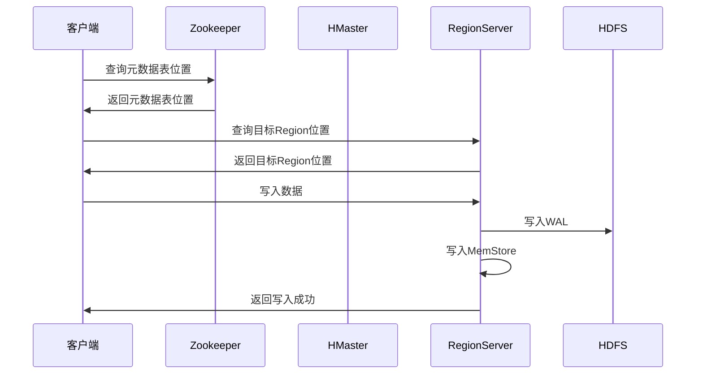
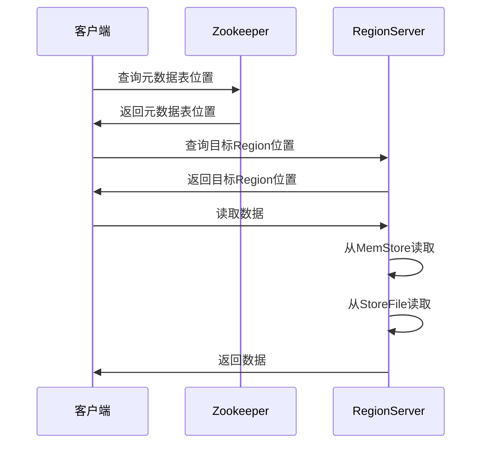

# 6.3 HBase读写流程与RowKey设计

> [!abstract] 核心问题
> HBase的写入流程和读取流程是怎样的？RowKey设计有哪些原则？

## 一、HBase写入流程

### 1. 写入流程概述

**定义**：HBase写入流程是指客户端将数据写入HBase的过程。

**流程图**：



### 2. 写入步骤详解

**步骤1：查询元数据表位置**

```
客户端向Zookeeper查询元数据表（hbase:meta）的位置
Zookeeper返回元数据表所在的RegionServer
```

**步骤2：查询目标Region位置**

```
客户端向元数据表所在的RegionServer查询目标Region的位置
RegionServer返回目标Region所在的RegionServer
```

**步骤3：写入数据**

```
客户端向目标RegionServer发送写入请求
RegionServer执行写入操作
```

**步骤4：写入WAL**

```
RegionServer将写入操作记录到WAL
WAL写入HDFS，保证数据不丢失
```

**步骤5：写入MemStore**

```
RegionServer将数据写入MemStore
MemStore对数据进行排序
```

**步骤6：返回写入成功**

```
RegionServer返回写入成功给客户端
```

### 3. 写入流程特点

**特点**：

| 特点 | 说明 |
|-----|------|
| **WAL优先** | 先写入WAL，再写入MemStore |
| **内存写入** | 数据先写入内存 |
| **异步刷写** | 数据异步刷写到磁盘 |
| **批量写入** | 支持批量写入 |

**批量写入示例**：

```java
// 创建批量写入
Put put1 = new Put(Bytes.toBytes("row1"));
put1.addColumn(Bytes.toBytes("info"), Bytes.toBytes("name"), Bytes.toBytes("Alice"));

Put put2 = new Put(Bytes.toBytes("row2"));
put2.addColumn(Bytes.toBytes("info"), Bytes.toBytes("name"), Bytes.toBytes("Bob"));

// 批量写入
table.put(Arrays.asList(put1, put2));
```

## 二、HBase读取流程

### 1. 读取流程概述

**定义**：HBase读取流程是指客户端从HBase读取数据的过程。

**流程图**：



### 2. 读取步骤详解

**步骤1：查询元数据表位置**

```
客户端向Zookeeper查询元数据表（hbase:meta）的位置
Zookeeper返回元数据表所在的RegionServer
```

**步骤2：查询目标Region位置**

```
客户端向元数据表所在的RegionServer查询目标Region的位置
RegionServer返回目标Region所在的RegionServer
```

**步骤3：读取数据**

```
客户端向目标RegionServer发送读取请求
RegionServer执行读取操作
```

**步骤4：从MemStore读取**

```
RegionServer首先从MemStore读取数据
如果数据在MemStore中，直接返回
```

**步骤5：从StoreFile读取**

```
如果数据不在MemStore中，从StoreFile读取
可能需要读取多个StoreFile
```

**步骤6：合并数据**

```
RegionServer合并MemStore和StoreFile中的数据
按时间戳排序，返回最新版本的数据
```

**步骤7：返回数据**

```
RegionServer返回数据给客户端
```

### 3. 读取流程特点

**特点**：

| 特点 | 说明 |
|-----|------|
| **先内存后磁盘** | 先从MemStore读取，再从StoreFile读取 |
| **数据合并** | 需要合并多个StoreFile中的数据 |
| **版本控制** | 返回最新版本的数据 |
| **缓存机制** | 支持缓存机制 |

**读取示例**：

```java
// 创建Get对象
Get get = new Get(Bytes.toBytes("row1"));
get.addColumn(Bytes.toBytes("info"), Bytes.toBytes("name"));

// 读取数据
Result result = table.get(get);

// 获取数据
byte[] value = result.getValue(Bytes.toBytes("info"), Bytes.toBytes("name"));
System.out.println(Bytes.toString(value));
```

## 三、RowKey设计原则

### 1. RowKey设计概述

**定义**：RowKey设计是指设计HBase表的主键。

**重要性**：

| 重要性 | 说明 |
|-------|------|
| **性能** | RowKey设计影响查询性能 |
| **扩展性** | RowKey设计影响集群扩展性 |
| **数据分布** | RowKey设计影响数据分布 |

### 2. 唯一性原则

**原则**：RowKey必须唯一标识一行数据。

**示例**：

```
好：user_id + timestamp
坏：user_id（可能重复）
```

**实现方式**：

| 方式 | 说明 |
|-----|------|
| **UUID** | 使用UUID作为RowKey |
| **时间戳** | 使用时间戳作为RowKey |
| **组合键** | 使用组合键作为RowKey |

### 3. 散列性原则

**原则**：RowKey应该具有良好的散列性，避免热点。

**问题**：

| 问题 | 说明 |
|-----|------|
| **热点Region** | 大量请求集中在一个Region |
| **负载不均** | RegionServer负载不均衡 |
| **性能下降** | 查询性能下降 |

**解决方案**：

| 方案 | 说明 |
|-----|------|
| **加盐** | 在RowKey前添加随机前缀 |
| **哈希** | 使用哈希函数处理RowKey |
| **反转** | 反转RowKey的部分内容 |

**示例**：

```
原始RowKey: user123
加盐后: a_user123, b_user123, c_user123

哈希后: md5(user123)_user123

反转后: 321resu
```

### 4. 有序性原则

**原则**：相关数据的RowKey应该相邻，便于范围查询。

**示例**：

```
好：user123_20230101, user123_20230102
坏：20230101_user123, user123_20230102
```

**范围查询示例**：

```java
// 查询用户123在2023年1月的数据
Scan scan = new Scan();
scan.setStartRow(Bytes.toBytes("user123_20230101"));
scan.setStopRow(Bytes.toBytes("user123_20230201"));

ResultScanner scanner = table.getScanner(scan);
for (Result result : scanner) {
    System.out.println(result);
}
```

### 5. 长度适中原则

**原则**：RowKey长度应该适中（10-100字节）。

**影响**：

| 长度 | 影响 |
|-----|------|
| **太短** | 可能导致热点 |
| **太长** | 占用大量内存和存储 |

**建议**：

| 建议 | 说明 |
|-----|------|
| **10-100字节** | RowKey长度在10-100字节之间 |
| **避免过长** | 避免使用过长的字符串作为RowKey |
| **使用编码** | 使用高效的编码方式 |

### 6. RowKey设计模式

**时间序列模式**：

```
RowKey: timestamp_reverse
例如: 9999999999_user123
```

**用户行为模式**：

```
RowKey: user_id_timestamp
例如: user123_20230101120000
```

**多维查询模式**：

```
RowKey: dimension1_dimension2_dimension3
例如: country_city_user_id
```

**复合主键模式**：

```
RowKey: hash(column1)_column1_column2
例如: md5(user_id)_user_id_timestamp
```

## 四、HBase优化策略

### 1. 读写优化

**优化策略**：

| 策略 | 说明 |
|-----|------|
| **批量操作** | 使用批量读写 |
| **预分区** | 预创建Region |
| **缓存数据** | 使用缓存 |
| **压缩数据** | 压缩StoreFile |

**批量操作示例**：

```java
// 批量读取
Get get1 = new Get(Bytes.toBytes("row1"));
Get get2 = new Get(Bytes.toBytes("row2"));

List<Result> results = table.get(Arrays.asList(get1, get2));
```

### 2. 预分区

**定义**：预分区是指在创建表时预先创建多个Region。

**优点**：

| 优点 | 说明 |
|-----|------|
| **负载均衡** | 数据均匀分布 |
| **避免热点** | 避免热点Region |
| **提高性能** | 提高查询性能 |

**示例**：

```java
// 创建预分区表
HTableDescriptor tableDesc = new HTableDescriptor(TableName.valueOf("users"));
HColumnDescriptor columnDesc = new HColumnDescriptor("info");
tableDesc.addFamily(columnDesc);

// 预分区
byte[][] splitKeys = {
    Bytes.toBytes("user100"),
    Bytes.toBytes("user200"),
    Bytes.toBytes("user300")
};

admin.createTable(tableDesc, splitKeys);
```

### 3. 缓存优化

**缓存类型**：

| 类型 | 说明 |
|-----|------|
| **BlockCache** | 读取缓存 |
| **MemStore** | 写入缓存 |

**配置参数**：

| 参数 | 说明 | 默认值 |
|-----|------|-------|
| **hbase.regionserver.global.memstore.upperLimit** | MemStore上限 | 0.4 |
| **hbase.regionserver.global.memstore.lowerLimit** | MemStore下限 | 0.35 |
| **hfile.block.cache.size** | BlockCache大小 | 0.25 |

### 4. 压缩优化

**压缩算法**：

| 算法 | 说明 |
|-----|------|
| **GZIP** | 压缩率高，速度慢 |
| **Snappy** | 压缩率适中，速度快 |
| **LZO** | 压缩率适中，速度快 |

**配置示例**：

```java
// 设置压缩算法
HColumnDescriptor columnDesc = new HColumnDescriptor("info");
columnDesc.setCompressionType(Compression.Algorithm.SNAPPY);
```

> [!warning] 易错点
> RowKey设计的三大原则：唯一性、散列性、有序性！不要遗漏任何一个原则。

---

**导航**：上一节 [[6.2-HBase架构设计.md]] · [[MOC - 第6章.md|返回章节导航]]