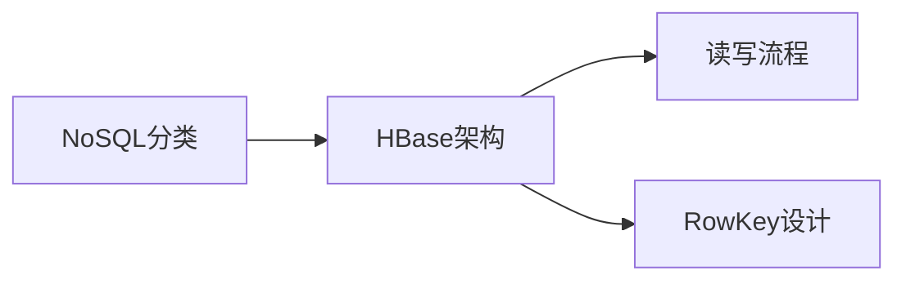

# 第6章-NoSQL数据库与HBase

> [!abstract] 本章定位
> 本章介绍NoSQL数据库的分类和HBase的架构设计，是大数据存储的重要技术。

## 学习主线

## 章节内容

- [[6.1-NoSQL数据库概述.md]]：NoSQL分类、特点、适用场景
- [[6.2-HBase架构设计.md]]：HBase架构、HMaster、RegionServer、Zookeeper
- [[6.3-HBase读写流程与RowKey设计.md]]：写入流程、读取流程、RowKey设计原则

## 考点汇总

> [!important] 核心考点
> 1. NoSQL数据库的分类：键值存储、文档存储、列存储、图存储
> 2. HBase的架构设计：HMaster、RegionServer、Zookeeper
> 3. HBase的读写流程：写入流程、读取流程
> 4. RowKey设计原则：唯一性、散列性、有序性
> 5. HBase与传统数据库的区别：列式存储vs行式存储
> 6. HBase的应用场景：实时读写、海量数据存储

## 前后章节依赖

| 方向 | 章节 | 依赖关系 |
|-----|------|---------|
| 先修 | 第5章 | Hive与HBase可以集成 |
| 后续 | 第7章 | HBase是数据采集的目标存储 |

## 复习自测

> [!question] 自测题
> 1. NoSQL数据库有哪些分类？各有什么特点？
> 2. HBase的架构是什么？HMaster和RegionServer的作用分别是什么？
> 3. HBase的写入流程是怎样的？
> 4. HBase的读取流程是怎样的？
> 5. RowKey设计有哪些原则？
> 6. HBase与传统数据库有什么区别？