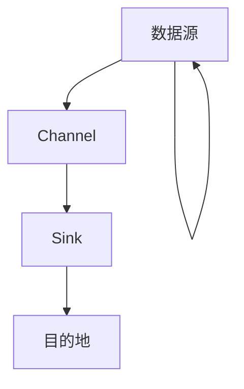

# 7.1 大数据采集工具Flume

> [!abstract] 核心问题
> Flume的架构是什么？Source、Channel、Sink分别做什么？

## 一、Flume概述

### 1. Flume的定义

**定义**：Flume是一个分布式的日志收集系统，用于收集、聚合和传输大量日志数据。

**设计目标**：

| 目标 | 说明 |
|-----|------|
| **高可靠** | 数据不丢失 |
| **高可用** | 支持故障恢复 |
| **可扩展** | 可以水平扩展 |
| **灵活** | 支持多种数据源和目的地 |

**适用场景**：

| 场景 | 说明 |
|-----|------|
| **日志收集** | 收集服务器日志 |
| **数据采集** | 采集各种数据源 |
| **实时监控** | 实时监控系统状态 |

### 2. Flume与其他工具的对比

**对比表**：

| 对比项 | Flume | Logstash | Kafka |
|-------|-------|----------|-------|
| **定位** | 日志收集 | 日志收集与处理 | 消息队列 |
| **数据源** | 多种 | 多种 | 生产者 |
| **目的地** | 多种 | 多种 | 消费者 |
| **可靠性** | 高 | 中 | 高 |
| **吞吐量** | 中 | 中 | 高 |

## 二、Flume架构

### 1. 架构组成

**架构图**：



**组件说明**：

| 组件 | 功能 | 说明 |
|-----|------|------|
| **Source** | 数据源 | 收集数据 |
| **Channel** | 通道 | 缓冲数据 |
| **Sink** | 接收器 | 输出数据 |

### 2. Source

**定义**：Source是Flume的数据源，负责收集数据。

**类型**：

| 类型 | 说明 |
|-----|------|
| **Avro Source** | 接收Avro格式的数据 |
| **Thrift Source** | 接收Thrift格式的数据 |
| **Exec Source** | 执行命令并收集输出 |
| **Spooling Directory Source** | 监控目录并收集新文件 |
| **Kafka Source** | 从Kafka消费数据 |

**示例配置**：

```properties
# Avro Source
agent.sources.source1.type = avro
agent.sources.source1.bind = localhost
agent.sources.source1.port = 41414
```

### 3. Channel

**定义**：Channel是Flume的通道，负责缓冲数据。

**类型**：

| 类型 | 说明 |
|-----|------|
| **Memory Channel** | 内存通道（速度快，不可靠） |
| **File Channel** | 文件通道（可靠，速度较慢） |
| **JDBC Channel** | JDBC通道（可靠，需要数据库） |

**示例配置**：

```properties
# Memory Channel
agent.channels.channel1.type = memory
agent.channels.channel1.capacity = 10000
agent.channels.channel1.transactionCapacity = 100

# File Channel
agent.channels.channel2.type = file
agent.channels.channel2.checkpointDir = /data/flume/checkpoint
agent.channels.channel2.dataDirs = /data/flume/data
```

### 4. Sink

**定义**：Sink是Flume的接收器，负责输出数据。

**类型**：

| 类型 | 说明 |
|-----|------|
| **HDFS Sink** | 输出到HDFS |
| **HBase Sink** | 输出到HBase |
| **Kafka Sink** | 输出到Kafka |
| **Avro Sink** | 输出到Avro |
| **Logger Sink** | 输出到日志 |

**示例配置**：

```properties
# HDFS Sink
agent.sinks.sink1.type = hdfs
agent.sinks.sink1.hdfs.path = hdfs://localhost:9000/flume/events
agent.sinks.sink1.hdfs.filePrefix = events
agent.sinks.sink1.hdfs.fileSuffix = .log
agent.sinks.sink1.hdfs.rollInterval = 30
```

## 三、Flume配置

### 1. 配置文件结构

**配置文件**：

```properties
# 定义Agent
agent.sources = source1
agent.channels = channel1
agent.sinks = sink1

# 配置Source
agent.sources.source1.type = avro
agent.sources.source1.bind = localhost
agent.sources.source1.port = 41414

# 配置Channel
agent.channels.channel1.type = memory
agent.channels.channel1.capacity = 10000

# 配置Sink
agent.sinks.sink1.type = hdfs
agent.sinks.sink1.hdfs.path = hdfs://localhost:9000/flume/events

# 连接Source、Channel、Sink
agent.sources.source1.channels = channel1
agent.sinks.sink1.channel = channel1
```

### 2. 配置参数

**Source参数**：

| 参数 | 说明 | 默认值 |
|-----|------|-------|
| **type** | Source类型 | - |
| **bind** | 绑定地址 | localhost |
| **port** | 端口 | - |

**Channel参数**：

| 参数 | 说明 | 默认值 |
|-----|------|-------|
| **type** | Channel类型 | - |
| **capacity** | 容量 | 100 |
| **transactionCapacity** | 事务容量 | 100 |

**Sink参数**：

| 参数 | 说明 | 默认值 |
|-----|------|-------|
| **type** | Sink类型 | - |
| **hdfs.path** | HDFS路径 | - |
| **hdfs.filePrefix** | 文件前缀 | FlumeData |
| **hdfs.fileSuffix** | 文件后缀 | .tmp |

### 3. 启动Flume

**启动命令**：

```bash
# 启动Flume Agent
flume-ng agent --name agent --conf-file conf/flume.conf

# 指定配置目录
flume-ng agent --name agent --conf conf --conf-file conf/flume.conf
```

## 四、Flume高级特性

### 1. 拦截器

**定义**：拦截器是用于修改或过滤Event的组件。

**类型**：

| 类型 | 说明 |
|-----|------|
| **Timestamp Interceptor** | 添加时间戳 |
| **Host Interceptor** | 添加主机名 |
| **UUID Interceptor** | 添加UUID |
| **Regex Filtering Interceptor** | 正则过滤 |

**示例配置**：

```properties
# 添加拦截器
agent.sources.source1.interceptors = i1 i2

# 时间戳拦截器
agent.sources.source1.interceptors.i1.type = timestamp

# 主机名拦截器
agent.sources.source1.interceptors.i2.type = host
agent.sources.source1.interceptors.i2.preserveExisting = false
agent.sources.source1.interceptors.i2.hostHeader = host
```

### 2. 选择器

**定义**：选择器是用于将Event路由到不同Channel的组件。

**类型**：

| 类型 | 说明 |
|-----|------|
| **Replicating Channel Selector** | 复制到所有Channel |
| **Multiplexing Channel Selector** | 根据头信息路由 |

**示例配置**：

```properties
# 多路复用选择器
agent.sources.source1.selector.type = multiplexing
agent.sources.source1.selector.header = type
agent.sources.source1.selector.mapping.event1 = channel1
agent.sources.source1.selector.mapping.event2 = channel2
agent.sources.source1.selector.default = channel1
```

### 3. 多路Sink

**定义**：多路Sink是指一个Channel可以连接多个Sink。

**示例配置**：

```properties
# 定义多个Sink
agent.sinks = sink1 sink2

# 配置Sink1
agent.sinks.sink1.type = hdfs
agent.sinks.sink1.hdfs.path = hdfs://localhost:9000/flume/events1

# 配置Sink2
agent.sinks.sink2.type = kafka
agent.sinks.sink2.kafka.producer.acks = 1

# 连接Channel和Sink
agent.sinks.sink1.channel = channel1
agent.sinks.sink2.channel = channel1
```

## 五、Flume应用场景

### 1. 日志收集

**场景**：收集服务器日志到HDFS。

**配置示例**：

```properties
# 配置Source为Exec Source
agent.sources.source1.type = exec
agent.sources.source1.command = tail -F /var/log/messages

# 配置Sink为HDFS Sink
agent.sinks.sink1.type = hdfs
agent.sinks.sink1.hdfs.path = hdfs://localhost:9000/logs/messages
```

### 2. 数据采集

**场景**：采集各种数据源到HBase。

**配置示例**：

```properties
# 配置Source为Spooling Directory Source
agent.sources.source1.type = spooldir
agent.sources.source1.spoolDir = /data/logs

# 配置Sink为HBase Sink
agent.sinks.sink1.type = hbase
agent.sinks.sink1.hbase.table = logs
agent.sinks.sink1.hbase.columnFamily = info
```

### 3. 实时监控

**场景**：实时监控系统状态。

**配置示例**：

```properties
# 配置Source为Avro Source
agent.sources.source1.type = avro
agent.sources.source1.bind = localhost
agent.sources.source1.port = 41414

# 配置Sink为Logger Sink
agent.sinks.sink1.type = logger
```

> [!warning] 易错点
> Flume的Channel有三种类型：Memory、File和JDBC！Memory速度快但不可靠，File可靠但速度较慢。

---

**导航**：[[MOC - 第7章.md|返回章节导航]] · 下一节 [[7.2-消息队列Kafka.md]]